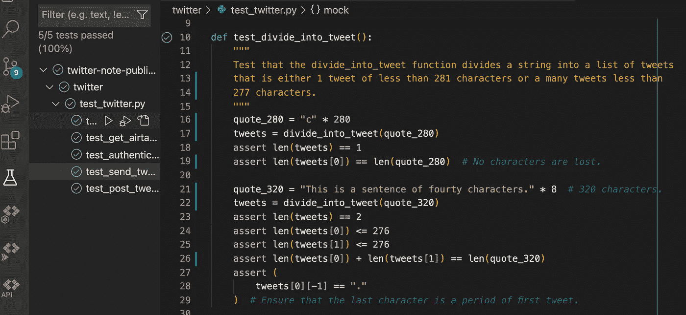

# 使用开发运营原则创建一个 Twitter 机器人，第 2 部分

> 原文：<https://blog.devgenius.io/create-a-twitter-bot-using-dev-ops-principles-part-2-bd2b9d51157d?source=collection_archive---------9----------------------->

创建测试和持续集成。

在本系列文章的第 1 部分中，我们创建了 python 代码，该代码可以从 Airtable 部署报价并将其发布到 Twitter。

 [## 使用开发-操作原则创建机器人。

### 在本系列文章中，我将介绍如何为一个 bot 创建 CI/CD 管道和代码的步骤

medium.com](https://medium.com/@emilseverin93/create-atwitter-bot-using-dev-ops-principles-70df5a9ea760) 

在本文中，我们将通过为代码创建单元测试来对代码进行彻底的检查，还将为林挺创建一个框架，检查安全问题并为代码创建一个持续的集成周期。

# 使用 Pytest 测试代码。

为了确保代码按照我们期望的方式执行，并且我们对代码所做的更改不会导致任何破坏性的更改。为此，我们应该创建检查每个功能的单元测试。

首先，我们有 divide_into_tweet 函数，它接收一个文本字符串并将其分成一个 tweet 列表。

我们希望确定该函数返回一个包含文本字符串的列表，该字符串被划分为单个 tweet 中允许的长度。我们还应该检查该函数是否在适当的位置分割文本(即，不是在单词的中间)。

为了将这个函数标识为一个测试，我们在其余的函数名之前设置了一个 *test_* 。Python 会将该函数识别为一个测试。我们从 python 文件导入函数，定义一个用例，在第一个用例中，它是一个正好 280 个字符长的文本字符串。然后，我们用期望的输入运行函数，并检查它是否返回我们期望的输出。对于 divide_into_tweet 函数，我们想测试两种情况。280 个字符的边缘情况和函数需要返回多个 tweets 的列表的情况。在后一种情况下，我们希望检查文本是否以逻辑方式划分(在这种情况下，tweet 以句号结尾)。

在 VS 代码中，我们可以使用内置的测试套件来有效地运行测试，并在必要时进行调试。

很少有事情像单元测试上的绿色对勾一样令人满意。

## 嘲弄的

单元测试的一个定义特性是它们运行起来简单快捷，这样您就可以快速评估代码的状态。此外，我们不希望运行其他 API 调用，无论是由于系统负载还是出于安全原因。为了做到这些，我们“模仿”模块的功能。模拟模块取代了原始模块，当代码运行时，它调用模拟函数而不是预期的函数。然后，我们还可以更改模块的返回值，以便它返回我们希望它返回的值。

模仿 tweepy API 模块的验证 twitter 模块的测试函数。

在这个测试用例中，我们使用模拟功能来模拟 tweepy API 模块。为了模拟模块，我们使用 unittest mock.patch 模块来模拟 authenticate twitter 方法中的 tweepy.api 模块。在测试函数中，我们告诉 pytest，post_tweet.py 中对 tweepy.api 模块的所有引用都应该调用 mock_tweepy 模块。然后，我们将 mock_tweepy 模块的返回值应用为“ok”。

模仿的一个优点是我们可以检查使用情况，比较函数调用的次数，输入值和期望值。在身份验证功能的测试用例中，我们期望 tweepy。API 模块只被调用一次(authenticate_twitter.py 代码片段中的第 14 行)

经过测试的身份验证功能

## 模仿多个模块

有时我们需要调用不止一个应该被嘲笑的模块或 API。

在 test_post_tweet 函数中，我们利用了这样一个事实，即我们已经预先测试了各个函数，因此可以确定它们正在按预期工作。然后我们可以模拟函数本身，然后测试 post_tweet 函数本身，而不是已经在其他测试中测试过的底层函数。

在测试中，我们定义了 3 个需要测试的案例。测试用例被拆分成 3 个引号，长度不同，需要分成多个 tweets。测试函数循环遍历一列引号，并启动模拟模块，调用 post_tweet 函数。我们在每个循环的开始使用 tweepy 定义了用于更新状态的模拟模块。如果我们在 call_count 之前定义了 mock，那么它将是测试期间所有计数的总和，而不是针对每个测试用例。在修补 get_airtable_data 时，我们用在 for 循环开始时定义的引号模拟返回值。

当我们为每个场景运行测试时，我们断言所有相关的模块和函数都被调用了正确的次数，在 mock_api_update 函数的情况下，我们断言它发布了与报价大小相关的正确数量的 tweets，从而评估报价的拆分是否正确。

# 连续累计

持续集成意味着代码不断地从本地分支合并回源代码，为了以正确的方式执行持续集成，最重要的是拥有适当的系统，能够断言代码符合标准并且在部署时不会中断。自动测试、林挺检查和静态代码分析是支持持续集成的过程，有助于确保部署的代码正常运行。

## 代码的林挺

林挺是检查代码、寻找错误和代码气味并按照格式化标准格式化代码的过程。为此，我们将使用 GitHub actions 和 black 来检查代码，确保格式化是正确的方式。Black 是一个自封为“不妥协的代码格式化程序”的代码格式化程序，这意味着它不允许太多的定制，让您专注于代码质量。

 [## GitHub - psf/black:不妥协的 Python 代码格式化程序

### “任何你喜欢的颜色。”Black 是不折不扣的 Python 代码格式化程序。使用它，您同意放弃对…的控制权

github.com](https://github.com/psf/black) 

要在 GitHub action 中启用工作流，我们需要在。资源库中的 github/workflows 目录。

中的 Yaml 工作流文件。github/工作流

在 YAML 文件中，我们首先声明将出现在 GitHub actions 页面上的工作流的名称。该工作流应该在每次向回购提交推送时运行，这意味着分支会一直更新。然后我们构建工作流，检查我们正在推进的分支，然后设置 python。要运行 black，我们需要使用 pip install 命令安装它。然后我们运行 black —检查代码的格式是否正确。如果黑检查失败，我们运行黑来格式化整个分支，然后提交修复并将其推送到分支。

## 自动测试

我们在计算机上手动完成的测试也应该在每次我们想要将代码合并回主分支时进行。这与对拉请求的审查一起确保了我们不会引入任何突破性的变更，并且代码能够按预期工作。

上面的 YAML 工作流在所有推送时触发。为了确保我们不会遇到任何错误，我们用正确的环境变量创建了一个虚拟环境。当我们模仿大多数依赖于环境变量的功能时，我们可以给它们一些虚拟值。如果需要，我们可以使用${{ secrets 从 GitHub secrets 导入变量。VARIABLE_NAME }}而不是虚拟变量。在作业流中，我们定义操作系统，检查代码库并设置 python。然后，我们安装必要的依赖项并运行 pytest。

# 摘要

在本节中，我们已经讨论了如何正确地确保我们正在运行的代码按照我们的预期工作。为此，我们创建了单元测试和工作流，当我们将提交的代码推送到代码存储库时，它们会自动运行林挺和测试。