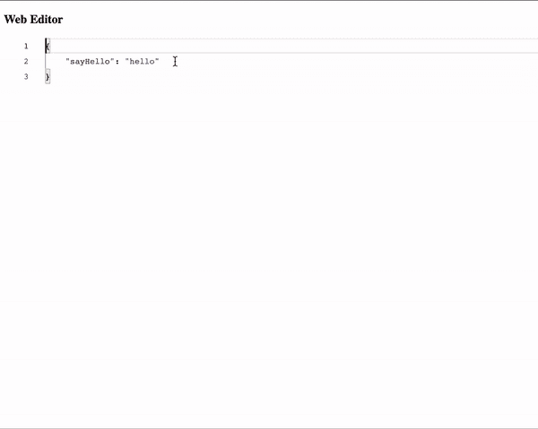
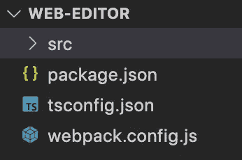
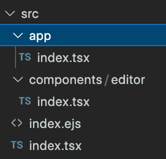

# 用 Monaco editor，React 和 Node + Webpack 和 Typescript 创建一个 web 编辑器……能有多难？

> 原文：<https://blog.devgenius.io/create-a-web-editor-using-monaco-editor-react-and-node-webpack-and-typescript-how-hard-can-it-597332454a24?source=collection_archive---------4----------------------->

网络编辑器

嗯，这是有点棘手，但没有那么难。你只需要克隆这个回购😛。开玩笑的。

到目前为止，世界上几乎所有的服务都在向云迁移，并且正在数字化。由于疫情的原因，即使是在这种数字化转型背后的国家现在也在加速进行数字化(我认为这在我的国家斯里兰卡是一种趋势，因为人们现在正在寻求在线服务，而不是去商店或商业服务中心)。这和我要讨论的主题不太相关，但是..良好的..至少我们正在尝试将我们本地机器上的代码编辑工具转变成一个在线服务，在这里可以很容易地集成许多功能，如团队协作、轻松审查。

# **准备环境**

在深入主题之前，让我们准备好您的环境，以便您可以实现它。

**先决条件**:

[节点](https://nodejs.org/en/) : v16.9.0
NPM: 7.21.1

另外，如果你不是 VSCode 的粉丝，请准备好带有 [Typescript](https://www.typescriptlang.org/) 插件的编辑器。

# **创建节点应用**

首先，让我们设置节点应用程序来集成 Monaco 编辑器。我将要创建的应用程序的文件夹结构如下。你们可以复制同样的结构。您也可以使用 cmd `[npm init](https://docs.npmjs.com/cli/v8/commands/npm-init)`来启动项目。这将为模块创建 package.json。你也可以在这里检查你能用这个工具[做什么。无论如何，我要保持简单，手动创建应用程序。](https://docs.npmjs.com/cli/v8/commands/npm-init#examples)

初始结构

以上结构将是我们该项目的第一个文件和文件夹结构。下一步，让我们添加应用程序实现所需的依赖项。

**Package.json**

如果你检查*依赖关系*，我增加了`monaco-editor`、`monaco-editor-core`、`monaco-languageclient`和`react`，我还增加了一个叫做`react-monaco-editor`的东西。

`[react-monaco-editor](https://www.npmjs.com/package/react-monaco-editor)`是一个包装了 Monaco 编辑器库的库，支持 react。但是在我们使用的打包工具内部几乎没有什么工作要做，在这个例子中是`webpack`来运行它。还有像 [@monaco-editor/react](https://www.npmjs.com/package/@monaco-editor/react) 这样的新库，我还没有深入研究，但我会在本系列的未来部分尝试用这些新库更新这个应用程序。

**tsconfig.json**

下一步，让我们添加[*ts config . JSON*](https://www.typescriptlang.org/docs/handbook/tsconfig-json.html)文件，该文件配置与 typescript 相关的编译选项。

安装完 typescript 后，您可以使用命令`tsc — -init`轻松地创建这个文件，它将使用 Typescript 编译器的默认选项生成这个文件。你可以看到我已经添加了`./build`作为输出目录，包括了`src`目录，并且排除了测试和`node_modules`被编译器编译。这只是使用 typescript 编写的 node react 应用程序的常见配置。

**webpack.config.ts**

让我们编辑 Webpack 配置文件来配置我们的打包。

正如你在`webpack.config.js`顶部看到的，这些是打包我们的应用程序所需的插件。其中`MonacoWebpackPlugin`和`WebpackRequireFrom`是我们需要处理 Monaco 编辑器集成的两个插件。

*   `MonacoWebpackPlugin`将帮助我们加载带有 webpack 的 Monaco 编辑器。
*   `WebpackRequireFrom`将帮助我们处理加载动态内容，这些内容在运行时被延迟加载到我们想要的位置。这将有助于当我们在 URI 有路径，并需要在一个路径下加载应用程序，并从该路径解析资源。

你也可以在`resolve`下看到我为节点级库添加了几个别名。所以这些别名帮助`monaco`和`vscode-languageclient`在浏览器上工作。此外，如果你检查我已经注册了一个过程节点库提供程序插件，并使其在浏览器中可用，以帮助运行摩纳哥编辑器。

# **实施应用**

好了，既然我们配置了节点应用程序，那么让我们来看看应用程序的实现。

源文件夹结构

以上是源文件夹的文件夹结构。其中大部分只是普通的 react 应用程序实现，你可以在我为这个示例应用程序创建的 GitHub repo 中查看。在这里，我将重点关注集成了 Monaco 编辑器的组件`editor`。

编辑器组件

如果您检查组件函数，您可以看到它返回了`<MonacoEditor />`组件。因此，您需要向 MonacoEditor 组件传递一些道具来使其工作，其中有一些非常基本的道具，即`width` `height` `language` `theme` `options` `onChange`和`editorDidMount`。

`width`和`height`将设置编辑器的高度和宽度。这些是接受 css 的单位。

使用`language`道具你可以设置 Monaco 编辑器应该支持的语言。这将决定摩纳哥方面将添加哪些语法突出显示和语言功能配置。您也可以在这里注册您自己的语言，并为该语言添加语法突出显示和语言功能。但是在这里我将添加一个已经在 Monaco 编辑器中[支持的语言](https://microsoft.github.io/monaco-editor/)，JSON。

对于`theme`你可以使用内置主题或[你可以定义一个主题](https://microsoft.github.io/monaco-editor/api/modules/monaco.editor.html#defineTheme)然后定制你的编辑器的外观。现在我使用默认的主题。即使你没有添加这个属性编辑器也会将它设置为默认主题。

在`options`属性中，您可以根据您要使用该编辑器(Diff 编辑器或编辑器)创建的功能，为编辑器提供[选项](https://microsoft.github.io/monaco-editor/api/interfaces/monaco.editor.IEditorOptions.html)。在这里，我创建了一个编辑器，它只有一个能够打开一个文件的编辑器，因此我传递了与该用例相关的[选项](https://microsoft.github.io/monaco-editor/api/interfaces/monaco.editor.IEditorConstructionOptions.html)。我不会解释我们可以通过的每一个选项，因为那些选项已经在摩纳哥的网站上解释过了。

接下来我们来看看`editorDidMount`属性。这个属性期望一个回调被绑定，一旦编辑器被装载到 DOM，这个回调就会被调用。这是一个与`componentDidMount`事件相似的案例。当执行这个函数时会把当前的 Monaco 编辑器传给你。此外，在这个函数中，您可以启动 monaco-langclient 来绑定您的编辑器，这将帮助您将语言特性绑定到您的编辑器。这将帮助您将编辑器与语言服务器绑定，以提供丰富的语言编辑体验。

接下来是`onChange`属性，我们可以注册 onChange 回调以在编辑时(每次按键输入)获得代码编辑器上的最新内容。所以这个函数将有两个参数，它们将给出`newContent`和触发`onChange`事件的事件或文本变化。所以第二个参数将帮助您识别新添加的文本。

好吧！因此，我认为这是我所知道的将 Monaco 编辑器集成到 react 应用程序中的最简单的方法。正如我提到的，我们可以使用其他库，但我没有尝试过，因为我成功地使用了这个库。因此，如果有其他简单易用的库，您可以尝试使用其他库，也可以帮助其他人。

实现可在此处找到:

 [## GitHub-NipunaMarcus/web-编辑器

### 这是一个与本文相关的示例应用程序。这是一个示例实现，它将…

github.com](https://github.com/NipunaMarcus/web-editor) 

# **总结**

*   准备您的环境以安装节点 v16.9.0 和 NPM 7.21.1
*   准备您的 IDE 以支持类型脚本编辑。
*   用`package.json`、`webpack.config.js`、`tsconfig.json`文件和`src`目录创建一个节点模块。
*   创建`src`目录结构，根据您的喜好选择`index.tsx`、`index.ejs`或`index.html`。此外，还添加了两个组件来保存应用程序组件，该组件将是编辑器组件的父组件，编辑器组件将保存 Monaco 编辑器集成的实现。
*   针对[这个 git repo](https://github.com/NipunaMarcus/web-editor) 实现应用。

# 接下来…

这个系列将继续下去，直到我们有一个聪明的编辑在我们的手中。在下一篇文章中，我们将探讨如何将语言服务器集成到我们的 web 编辑器中。

# 上一个…

 [## 实现一个语言服务器…能有多难？—第三部分

### 重述…

medium.com](https://medium.com/ballerina-techblog/implementing-a-language-server-how-hard-can-it-be-part-3-7269962498ac)  [## 实现一个语言服务器…能有多难？？—第二部分

### 唷…终于，在一年后，我找到时间写这个系列的第 2 部分。

medium.com](https://medium.com/ballerina-techblog/implementing-a-language-server-how-hard-can-it-be-part-2-fa65a741aa23)  [## 实现一个语言服务器…能有多难？？—第一部分(引言)

### 嗯，这真的没有那么难… :D

medium.com](https://medium.com/ballerina-techblog/implementing-a-language-server-how-hard-can-it-be-part-1-introduction-c915d2437076)