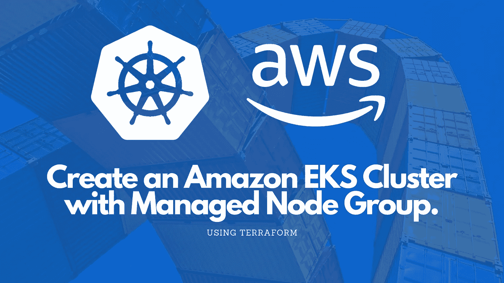
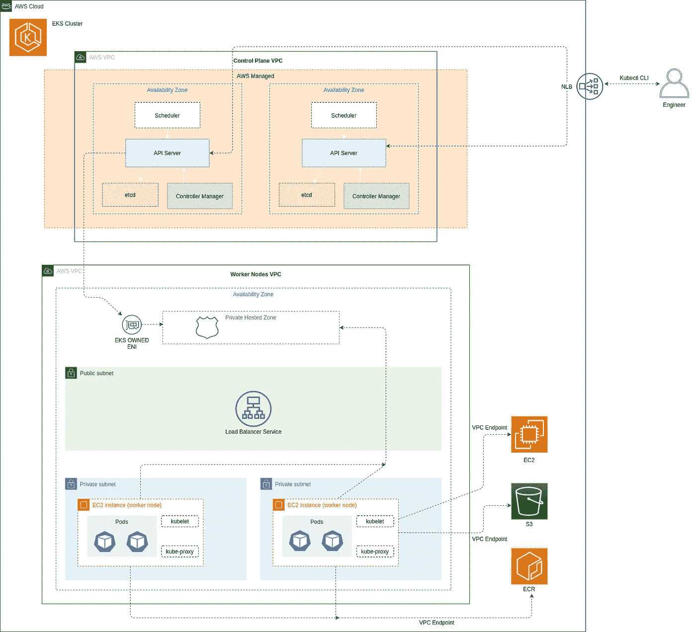
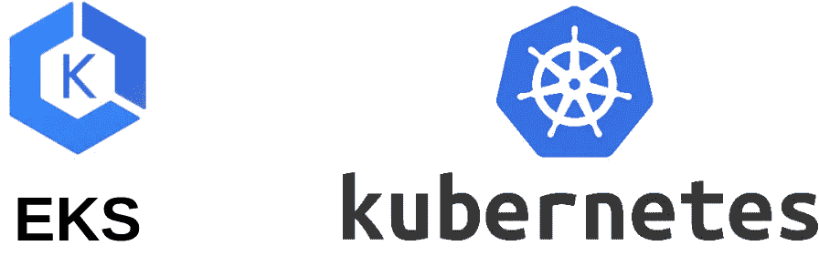

# 使用 Terraform 创建一个包含受管节点组的亚马逊 EKS 集群

> 原文：<https://blog.devgenius.io/create-an-amazon-eks-cluster-with-managed-node-group-using-terraform-a3b50d276b13?source=collection_archive---------0----------------------->

## 在 AWS VPC 中设置 Kubernetes 集群，将应用服务器部署到专用子网中的节点组，并通过 LB 服务访问它



在我最近的文章中，我展示了如何在 VPC 的私有子网中的 ECS Fargate 上部署一个容器化的应用程序，以及如何通过 API Gateway 安全地公开部署的应用程序。这一次，我想探索 AWS 必须提供的另一个 COE(容器编排引擎),亚马逊 EKS。两者都是可管理的、高度可用和高度可扩展的容器平台。然而，EKS 本质上是 Kubernetes 即服务，因此需要了解强大的引擎及其组件，以便充分利用它。尽管有一些相似之处，但它比具有更复杂体系结构的 ECS 具有更陡峭的学习曲线。ECS 的可扩展性有限，而 EKS 有各种各样的第三方和社区附加组件。

在这篇文章中，我将使用 Terraform 创建一个具有公共和私有网络模式的集群，一直到在集群中部署一个应用程序，并通过一个负载均衡器公开访问它。

这篇文章中的代码片段将只包含主要的资源。为了更好地理解所有东西是如何组合在一起的，请从[这里](https://github.com/LukeMwila/aws-eks-platform)克隆源代码库。

如果你喜欢这篇文章，请在这里给我买杯咖啡[☕️](https://www.buymeacoffee.com/lukemwila)😃。

下面是我在 AWS 比勒陀利亚会议上关于同一主题的演讲的视频记录。

# 鸟瞰图



我们的 EKS 集群设置

# 先决条件

我认为，如果你采取亲身实践的方法，这篇文章将对你最有益。为此，请确保您具备以下条件:

*   Kubernetes 和 [Kubernetes 集群架构](https://kubernetes.io/docs/concepts/overview/components/)的基础知识
*   [AWS 账户](https://aws.amazon.com/premiumsupport/knowledge-center/create-and-activate-aws-account/)
*   安装了 AWS CLI 工具( [Linux](https://docs.aws.amazon.com/cli/latest/userguide/install-linux.html) 、 [macOS](https://docs.aws.amazon.com/cli/latest/userguide/install-macos.html) 、 [Windows](https://docs.aws.amazon.com/cli/latest/userguide/install-windows.html) )
*   [使用 CLI 配置 AWS 配置文件](https://docs.aws.amazon.com/cli/latest/userguide/cli-chap-configure.html)
*   安装了 Docker CLI (如果您在 ECR 中已经有了一个容器映像，则不相关)
*   [安装地形](https://www.terraform.io/downloads.html)和[地形](https://terragrunt.gruntwork.io/docs/getting-started/install/)
*   Kubernetes 命令行工具( [kubectl](https://kubernetes.io/docs/tasks/tools/install-kubectl/) )

# 亚马逊 EKS 和集群设置概述



亚马逊 EKS(用于 Kubernetes 的亚马逊弹性容器服务)是一项托管服务，使您可以轻松地在 AWS 上运行 Kubernetes，而无需设置、供应或维护您自己的控制平面。它符合 Kubernetes 标准，并有一个受管理的控制平面。

AWS 负责跨多个 AWS AZs(可用性区域)供应、运行、管理和自动扩展 K8s 主节点和 etcd 节点，以实现高可用性。
客户负责添加和管理 EC2 工作节点。
亚马逊 EKS 集群在亚马逊 VPCs 内运行。为了与群集通信，您必须将其配置为具有公共端点访问控制和/或私有端点访问控制。我们稍后将更详细地讨论这个问题。

# 定价

在开始创建 EKS 集群之前，您应该了解 AWS 提供的一个免费层没有涵盖的价格。在我写这篇文章的时候，亚马逊 EKS 集群的价格是每小时 0.10 美元。此外，您还负责其他资源成本，如 EC2、EBS 等。请务必[查看本页](https://aws.amazon.com/eks/pricing/)了解该服务的最新价格。

# 将容器图像推送到 ECR

我不打算详细介绍这一步，因为我已经在另一篇文章中介绍过了，你可以参考同一副标题下的[这里的](https://medium.com/swlh/deploy-container-in-ecs-fargate-behind-api-gateway-nlb-for-secure-optimal-accessibility-with-95542d5867c3)。这仍然是重要的一步，因为它详细描述了我将从私有子网节点组中的 pod 中提取的映像。

我所做的只是为 NodeJS 应用服务器创建一个 Docker 映像，它只有一条路由`/test`，返回一个带有文本*的响应“正在工作！”*。

如果您在 ECR 中已经有一个图像，那么您可以跳过这一步。

# 设置我们的 VPC 网络配置

当您创建一个 Amazon EKS 集群时，您必须为您的集群指定要使用的 VPC 和子网。亚马逊 EKS 需要至少两个 az 中的子网。在此设置中，我们将同时拥有公共子网和私有子网。公共子网将用于创建公共负载平衡器，将流量导向运行在私有子网中工作节点上的 pod。根据子网内的流量是否通过[互联网网关](https://docs.aws.amazon.com/vpc/latest/userguide/VPC_Internet_Gateway.html)路由，子网是公共的还是私有的。如果子网的流量没有通过互联网网关的默认路由，则该子网被视为专用子网。

在配置有互联网网关的子网内，具有公共或弹性 IP 地址的节点允许来自 VPC 外部的进入。您的 VPC 必须支持 DNS 主机名和 DNS 解析。否则，您的工作节点将无法向您的群集注册。

创建亚马逊 EKS 集群(1.15 版之前)时，亚马逊 EKS 会标记包含您指定的子网的 VPC，以便 Kubernetes 可以发现它。我们将在我们的 Terraform 代码中添加这个标签，并使用以下键和值:

*   key——其中 *cluster-name* 值与您的亚马逊 EKS 集群的名称相匹配的`kubernetes.io/<cluster-name>`。
*   value—`shared`值允许多个集群使用该 VPC。

此外，VPC 子网也有标记要求。您的群集用于资源的所有子网(公共和专用)也应该具有上述标记。此外，公共和私有子网都应该有特定的标签，告诉 Kubernetes 在哪里部署内部(私有)和外部负载平衡器(公共)。

公共子网标签:

*   关键— `kubernetes.io/role/elb`
*   值— `1`

专用子网标记:

*   关键— `kubernetes.io/role/internal-elb`
*   值— `1`

```
resource "aws_vpc" "custom_vpc" {
  cidr_block       = var.vpc_cidr_block
  # Your VPC must have DNS hostname and DNS resolution support. 
  # Otherwise, your worker nodes cannot register with your cluster. 
  enable_dns_support = true
  enable_dns_hostnames = truetags = {
    Name = "${var.vpc_tag_name}-${var.environment}"
    **"kubernetes.io/cluster/${var.eks_cluster_name}" = "shared"**
  }
}### VPC Network Setup# Create the private subnet
resource "aws_subnet" "private_subnet" {
  vpc_id            = "${aws_vpc.custom_vpc.id}"
  cidr_block = var.private_subnet_cidr_blocktags = {
    **"kubernetes.io/cluster/${var.eks_cluster_name}" = "shared"
    "kubernetes.io/role/internal-elb" = 1**
  }
}# Create the public subnet
resource "aws_subnet" "public_subnet" {
  count = length(var.availability_zones)
  vpc_id            = "${aws_vpc.custom_vpc.id}"
  cidr_block = "${element(var.public_subnet_cidr_blocks, count.index)}"
  availability_zone = "${element(var.availability_zones, count.index)}" tags = {
    **"kubernetes.io/cluster/${var.eks_cluster_name}" = "shared"
    "kubernetes.io/role/elb" = 1**
  } map_public_ip_on_launch = true
}# Create IGW for the public subnets
resource "aws_internet_gateway" "igw" {
  vpc_id = "${aws_vpc.custom_vpc.id}"
}# Route the public subnet traffic through the IGW
resource "aws_route_table" "main" {
  vpc_id = "${aws_vpc.custom_vpc.id}"route {
    cidr_block = "0.0.0.0/0"
    gateway_id = "${aws_internet_gateway.igw.id}"
  }tags = {
    Name = "${var.route_table_tag_name}-${var.environment}"
  }
}# Route table and subnet associations
resource "aws_route_table_association" "internet_access" {
  count = length(var.availability_zones)
  subnet_id      = "${aws_subnet.public_subnet[count.index].id}"
  route_table_id = "${aws_route_table.main.id}"
}
```

# 网络模式配置

在创建集群之前，我们必须考虑的另一个重要的初步步骤是决定网络模式或端点访问控制。您可以配置端点访问控制，以确定是否可以通过互联网(公共访问)、VPC(私有访问)或两者(公共和私有访问)访问您的群集。工作节点和被管理的 Kubernetes 控制平面之间的通信由网络模式配置决定。阅读[这篇文章](https://aws.amazon.com/blogs/containers/de-mystifying-cluster-networking-for-amazon-eks-worker-nodes/)了解更多细节。在我们的例子中，我们将配置我们的集群网络，使其具有公共和私有端点访问控制。

亚马逊 EKS 代表您创建了一个亚马逊 Route 53 [私有托管区域](https://docs.aws.amazon.com/Route53/latest/DeveloperGuide/hosted-zones-private.html)，然后仅将该私有托管区域与您集群的 VPC 相关联。私人托管区域由亚马逊 EKS 管理，该区域不会出现在您帐户的 Route 53 资源中。因此，该配置将实现以下功能:

*   集群的 VPC 中的 Kubernetes API 请求(比如 worker 节点到控制平面的通信)使用私有的 VPC 端点。
*   集群 API 服务器可以通过互联网访问。

# VPC 端点

由于我们选择了公共和私有网络模式，我们的工作节点不需要出站互联网访问来进行集群自检或节点注册。通信通过托管 EKS VPC 接口端点进行。一个[接口端点](https://docs.aws.amazon.com/vpc/latest/userguide/vpce-interface.html)是一个弹性网络接口，具有来自您的子网 IP 地址范围的私有 IP 地址，作为去往受支持服务的流量的入口点。

VPC 端点允许您的 VPC 和 AWS 服务中的实例之间的通信，而不会对您的网络流量带来可用性风险或带宽限制。在这种设置下，运行在私有子网中的工作节点还需要访问除受管 EKS 控制平面之外的其他 AWS 服务。我们将使用 VPC 端点将我们的 VPC 私下连接到其他 AWS 服务，即 ECR、EC2 和 S3。

我们将为以下服务设置 VPC 端点:

*   AWS PrivateLink endpoint for ECR —这允许 VPC 中的实例进行身份验证并与 ECR 通信，以下载映像清单
*   亚马逊 S3 的网关 VPC 端点-这允许实例从托管它们的底层私有[亚马逊 S3](https://aws.amazon.com/s3/) 桶下载图像层。
*   EC2 的 AWS 专用链接端点

```
# ECR
resource "aws_vpc_endpoint" "ecr_dkr" {
  vpc_id       = "${aws_vpc.custom_vpc.id}"
  service_name = "com.amazonaws.${var.region}.ecr.dkr"
  vpc_endpoint_type = "Interface"
  private_dns_enabled = true
  subnet_ids          = flatten([["${aws_subnet.private_subnet.id}"], aws_subnet.public_subnet.*.id])security_group_ids = [aws_security_group.endpoint_ecr.id]tags = {
    Name = "ECR Docker VPC Endpoint Interface - ${var.environment}"
    Environment = var.environment
  }
}resource "aws_vpc_endpoint" "ecr_api" {
  vpc_id       = "${aws_vpc.custom_vpc.id}"
  service_name = "com.amazonaws.${var.region}.ecr.api"
  vpc_endpoint_type = "Interface"
  private_dns_enabled = true
  subnet_ids          = flatten([["${aws_subnet.private_subnet.id}"], aws_subnet.public_subnet.*.id])security_group_ids = [aws_security_group.endpoint_ecr.id]tags = {
    Name = "ECR API VPC Endpoint Interface - ${var.environment}"
    Environment = var.environment
  }
}# EC2
resource "aws_vpc_endpoint" "ec2" {
  vpc_id       = "${aws_vpc.custom_vpc.id}"
  service_name = "com.amazonaws.${var.region}.ec2"
  vpc_endpoint_type = "Interface"
  private_dns_enabled = true
  subnet_ids          = flatten([["${aws_subnet.private_subnet.id}"], aws_subnet.public_subnet.*.id])security_group_ids = [aws_security_group.endpoint_ec2.id]tags = {
    Name = "EC2 VPC Endpoint Interface - ${var.environment}"
    Environment = var.environment
  }
}# S3
resource "aws_vpc_endpoint" "s3" {
  vpc_id       = "${aws_vpc.custom_vpc.id}"
  service_name = "com.amazonaws.${var.region}.s3"
  vpc_endpoint_type = "Gateway"
  route_table_ids = [var.main_pvt_route_table_id]tags = {
    Name = "S3 VPC Endpoint Gateway - ${var.environment}"
    Environment = var.environment
  }
}
```

# VPC 端点安全组

我们还想创建安全组，并将它们附加到我们的 VPC 端点接口组件。我们希望允许 VPC 端点网络接口和 VPC 中与其他 AWS 服务通信的资源之间的通信。

```
# EC2 VPC Endpoint security groups
resource "aws_security_group" "endpoint_ec2" {
  name   = "endpoint-ec2-sg"
  vpc_id = aws_vpc.custom_vpc.id
}resource "aws_security_group_rule" "endpoint_ec2_443" {
  security_group_id = aws_security_group.endpoint_ec2.id
  type              = "ingress"
  from_port         = 443
  to_port           = 443
  protocol          = "tcp"
  cidr_blocks = flatten([[var.private_subnet_cidr_block], var.public_subnet_cidr_blocks])
}# ECR VPC Endpoint security groups
resource "aws_security_group" "endpoint_ecr" {
  name   = "endpoint-ecr-sg"
  vpc_id = aws_vpc.custom_vpc.id
}resource "aws_security_group_rule" "endpoint_ecr_443" {
  security_group_id = aws_security_group.endpoint_ecr.id
  type              = "ingress"
  from_port         = 443
  to_port           = 443
  protocol          = "tcp"
  cidr_blocks = flatten([[var.private_subnet_cidr_block], var.public_subnet_cidr_blocks])
}
```

# 创建 EKS 集群

我们正进入我们计划要做的核心阶段。在创建集群之前，我们需要创建一个具有特定 IAM 策略的 IAM 角色，因为由 Amazon EKS 管理的 Kubernetes 集群代表我们调用其他 AWS 服务来管理服务使用的资源。因此它需要正确的权限来成功执行这些调用。

之后，一旦创建了角色，我们就可以继续创建集群。之后，我们需要为控制平面和工作节点组创建安全组，以允许集群的 Kubernetes 控制平面和工作节点组之间的通信。

亚马逊 EKS [托管节点组](https://docs.aws.amazon.com/eks/latest/userguide/managed-node-groups.html)自动配置为使用集群安全组，但您可以限制集群流量，并限制控制平面和工作节点之间的开放端口，这就是我们将要做的。

因此，在这一部分，我们将创建以下内容:

*   EKS 集群 IAM 角色
*   EKS 集群
*   EKS 集群和工作节点安全组

## EKS 集群 IAM 角色

```
resource "aws_iam_role" "eks_cluster" {
  name = "${var.eks_cluster_name}-cluster-${var.environment}"assume_role_policy = <<POLICY
{
  "Version": "2012-10-17",
  "Statement": [
    {
      "Effect": "Allow",
      "Principal": {
        "Service": "eks.amazonaws.com"
      },
      "Action": "sts:AssumeRole"
    }
  ]
}
POLICY
}resource "aws_iam_role_policy_attachment" "aws_eks_cluster_policy" {
  policy_arn = "arn:aws:iam::aws:policy/AmazonEKSClusterPolicy"
  role       = "${aws_iam_role.eks_cluster.name}"
}resource "aws_iam_role_policy_attachment" "aws_eks_service_policy" {
  policy_arn = "arn:aws:iam::aws:policy/AmazonEKSServicePolicy"
  role       = "${aws_iam_role.eks_cluster.name}"
}
```

## EKS 集群

```
resource "aws_eks_cluster" "main" {
  name     = var.eks_cluster_name
  role_arn = "${aws_iam_role.eks_cluster.arn}"vpc_config {
    security_group_ids      = [aws_security_group.eks_cluster.id, aws_security_group.eks_nodes.id]
    endpoint_private_access = var.endpoint_private_access
    endpoint_public_access  = var.endpoint_public_access
    subnet_ids = var.eks_cluster_subnet_ids
  }# Ensure that IAM Role permissions are created before and deleted after EKS Cluster handling.
  # Otherwise, EKS will not be able to properly delete EKS managed EC2 infrastructure such as Security Groups.
  depends_on = [
    "aws_iam_role_policy_attachment.aws_eks_cluster_policy",
    "aws_iam_role_policy_attachment.aws_eks_service_policy"
  ]
}
```

## EKS 集群安全组

```
resource "aws_security_group" "eks_cluster" {
  name        = var.cluster_sg_name
  description = "Cluster communication with worker nodes"
  vpc_id      = var.vpc_idtags = {
    Name = var.cluster_sg_name
  }
}resource "aws_security_group_rule" "cluster_inbound" {
  description              = "Allow worker nodes to communicate with the cluster API Server"
  from_port                = 443
  protocol                 = "tcp"
  security_group_id        = aws_security_group.eks_cluster.id
  source_security_group_id = aws_security_group.eks_nodes.id
  to_port                  = 443
  type                     = "ingress"
}resource "aws_security_group_rule" "cluster_outbound" {
  description              = "Allow cluster API Server to communicate with the worker nodes"
  from_port                = 1024
  protocol                 = "tcp"
  security_group_id        = aws_security_group.eks_cluster.id
  source_security_group_id = aws_security_group.eks_nodes.id
  to_port                  = 65535
  type                     = "egress"
}
```

## EKS 工作节点组安全组

```
resource "aws_security_group" "eks_nodes" {
  name        = var.nodes_sg_name
  description = "Security group for all nodes in the cluster"
  vpc_id      = var.vpc_idegress {
    from_port   = 0
    to_port     = 0
    protocol    = "-1"
    cidr_blocks = ["0.0.0.0/0"]
  }tags = {
    Name                                        = var.nodes_sg_name
    "kubernetes.io/cluster/${var.eks_cluster_name}" = "owned"
  }
}resource "aws_security_group_rule" "nodes" {
  description              = "Allow nodes to communicate with each other"
  from_port                = 0
  protocol                 = "-1"
  security_group_id        = aws_security_group.eks_nodes.id
  source_security_group_id = aws_security_group.eks_nodes.id
  to_port                  = 65535
  type                     = "ingress"
}resource "aws_security_group_rule" "nodes_inbound" {
  description              = "Allow worker Kubelets and pods to receive communication from the cluster control plane"
  from_port                = 1025
  protocol                 = "tcp"
  security_group_id        = aws_security_group.eks_nodes.id
  source_security_group_id = aws_security_group.eks_cluster.id
  to_port                  = 65535
  type                     = "ingress"
}
```

# 创建工作节点组

与创建集群类似，我们首先需要为附加了特定 IAM 策略的工作节点创建一个 IAM 角色，然后才能启动使用它们。这种特殊情况下的原因是什么？worker 节点上的守护进程 kubelet 代表我们调用 AWS APIs，节点需要这个角色和必要的策略来拥有这些 API 调用的正确权限。

在本节中，我们将创建以下内容:

*   工作节点组 IAM 角色
*   公共和私有子网的工作节点组

## 工作节点组 IAM 角色

```
resource "aws_iam_role" "eks_nodes" {
  name                 = "${var.eks_cluster_name}-worker-${var.environment}"assume_role_policy = data.aws_iam_policy_document.assume_workers.json
}data "aws_iam_policy_document" "assume_workers" {
  statement {
    effect = "Allow"actions = ["sts:AssumeRole"]principals {
      type        = "Service"
      identifiers = ["ec2.amazonaws.com"]
    }
  }
}resource "aws_iam_role_policy_attachment" "aws_eks_worker_node_policy" {
  policy_arn = "arn:aws:iam::aws:policy/AmazonEKSWorkerNodePolicy"
  role       = aws_iam_role.eks_nodes.name
}resource "aws_iam_role_policy_attachment" "aws_eks_cni_policy" {
  policy_arn = "arn:aws:iam::aws:policy/AmazonEKS_CNI_Policy"
  role       = aws_iam_role.eks_nodes.name
}resource "aws_iam_role_policy_attachment" "ec2_read_only" {
  policy_arn = "arn:aws:iam::aws:policy/AmazonEC2ContainerRegistryReadOnly"
  role       = aws_iam_role.eks_nodes.name
}resource "aws_iam_role_policy_attachment" "cluster_autoscaler" {
  policy_arn = aws_iam_policy.cluster_autoscaler_policy.arn
  role = aws_iam_role.eks_nodes.name
}resource "aws_iam_policy" "cluster_autoscaler_policy" {
  name        = "ClusterAutoScaler"
  description = "Give the worker node running the Cluster Autoscaler access to required resources and actions"policy = <<EOF
{
    "Version": "2012-10-17",
    "Statement": [
        {
            "Effect": "Allow",
            "Action": [
                "autoscaling:DescribeAutoScalingGroups",
                "autoscaling:DescribeAutoScalingInstances",
                "autoscaling:DescribeLaunchConfigurations",
                "autoscaling:DescribeTags",
                "autoscaling:SetDesiredCapacity",
                "autoscaling:TerminateInstanceInAutoScalingGroup"
            ],
            "Resource": "*"
        }
    ]
}
EOF
}
```

## 公共和私有子网的工作节点组

```
# Nodes in private subnets
resource "aws_eks_node_group" "main" {
  cluster_name    = aws_eks_cluster.main.name
  node_group_name = var.node_group_name
  node_role_arn   = aws_iam_role.eks_nodes.arn
  subnet_ids      = var.private_subnet_idsami_type       = var.ami_type
  disk_size      = var.disk_size
  instance_types = var.instance_typesscaling_config {
    desired_size = var.pvt_desired_size
    max_size     = var.pvt_max_size
    min_size     = var.pvt_min_size
  }tags = {
    Name = var.node_group_name
  }# Ensure that IAM Role permissions are created before and deleted after EKS Node Group handling.
  # Otherwise, EKS will not be able to properly delete EC2 Instances and Elastic Network Interfaces.
  depends_on = [
    aws_iam_role_policy_attachment.aws_eks_worker_node_policy,
    aws_iam_role_policy_attachment.aws_eks_cni_policy,
    aws_iam_role_policy_attachment.ec2_read_only,
  ]
}# Nodes in public subnet
resource "aws_eks_node_group" "public" {
  cluster_name    = aws_eks_cluster.main.name
  node_group_name = "${var.node_group_name}-public"
  node_role_arn   = aws_iam_role.eks_nodes.arn
  subnet_ids      = var.public_subnet_idsami_type       = var.ami_type
  disk_size      = var.disk_size
  instance_types = var.instance_typesscaling_config {
    desired_size = var.pblc_desired_size
    max_size     = var.pblc_max_size
    min_size     = var.pblc_min_size
  }tags = {
    Name = "${var.node_group_name}-public"
  }# Ensure that IAM Role permissions are created before and deleted after EKS Node Group handling.
  # Otherwise, EKS will not be able to properly delete EC2 Instances and Elastic Network Interfaces.
  depends_on = [
    aws_iam_role_policy_attachment.aws_eks_worker_node_policy,
    aws_iam_role_policy_attachment.aws_eks_cni_policy,
    aws_iam_role_policy_attachment.ec2_read_only,
  ]
}
```

# 部署和展示 Pod

假设您已经运行了`terragrunt apply`或`terraform apply`,并且您的集群已成功创建，节点组也已注册到集群，那么我们现在可以进入下一步，在集群上测试应用程序。为了与我的集群通信，我将使用 kubectl。第一步是为我们的容器创建一个 Pod 来运行，然后使用一个服务来公开(让公众可以访问)这个容器化的应用程序。

吊舱——部署的基本单位；它代表一个计划单元的运行进程，是一个或多个组合在一起的容器的包装。每个 pod 都分配有一个唯一的 IP 地址，并且可以公开端口。标签用于从逻辑上识别符合标准的 pod

服务——服务是一组 pod 之上的抽象对象，就像负载平衡器一样。它们以循环方式将流量路由到 pod。有三种类型的服务:

*   ClusterIP —只能从集群内部访问。
*   负载平衡器—将 pod 暴露给外部客户端流量。暴露在外部负载平衡器上。
*   节点端口—可从公开的节点端口访问。

## 连接到 EKS 集群

确保您已经安装了正确版本的 AWS CLI。您可以通过运行以下命令进行检查:

```
aws --version
```

假设您已经安装了 AWS CLI 和 kubectl，那么您可以通过运行以下命令来确保您已经获得了正确的 AWS 概要文件，并配置了必要的权限:

```
 aws sts get-caller-identity
```

要为集群创建或更新 kubeconfig 文件，请运行以下命令:

```
aws eks --region region update-kubeconfig --name **your-cluster-name**
```

您应该已经准备好调用集群的公共 API 端点了。如果你愿意，你可以在这里阅读更多关于管理集群认证[的信息。运行以下命令检查当前正在运行的工作节点:](https://docs.aws.amazon.com/eks/latest/userguide/managing-auth.html)

```
kubectl get nodes
```

## 标签节点

我想将我的 Pod 专门分配给在专用子网中运行的节点。标签只是一个键/值对。为此，我使用以下命令标记节点:

```
kubectl label nodes **<your-node-name>** nodeType=privateNode
```

为确保成功标记节点，您可以运行以下命令来检查每个节点的标签:

```
kubectl get nodes --show-labels
```

或者，您可以查看您标记的特定节点的详细信息:

```
kubectl describe node **<your-node-name>**
```

为了绑定到这些节点，我们将利用`nodeSelector`，这是推荐的最简单的节点选择约束形式。`nodeSelector`是 PodSpec 的一个字段。

## 创建 Pod 和服务

接下来，我将使用从 ECR 存储库中的映像构建的容器创建一个 pod。下面是正在创建的 pod 的清单文件，以及将公开它的服务。

**吊舱**

```
apiVersion: v1
kind: Pod
metadata:
  name: nodejs-express-pod
  labels:
    app: nodejs-express
spec:
  containers:
  - name: nodejs-express-container
    image: **<image>**
    ports:
      - containerPort: 8080
  nodeSelector:
    nodeType: privateNode # specify the node constraint which the pod should run on
```

**服务**

```
apiVersion: v1
kind: Service
metadata:
  name: nodejs-service
spec:
  selector:
    app: nodejs-express
  type: LoadBalancer
  ports:
  - protocol: TCP
    port: 8080
    targetPort: 8080
```

一旦保存了清单文件，就可以使用以下命令一次创建一个文件:

```
kubectl apply -f **<manifest-file-name>.yml**
```

要测试 pod 和服务是否都正常运行，您可以运行以下命令:

```
kubectl get pods
kubectl get services
```

由于我们将服务创建为 LoadBalancer 类型，因此将在您的 AWS 帐户中创建一个经典负载平衡器，它将具有一个外部或公共 IP 地址和一个 DNS 名称，您可以使用它在指定的服务端口上访问您的应用程序。在我的例子中，API 请求将被发送到以下地址:

```
<prefix-characters-for-domain-name>.<aws-region>.elb.amazonaws.com:8080/test
```

正如我在开始提到的，这篇文章的所有源代码都可以在这里找到。我希望这篇文章已经为你提供了足够的知识，当你寻找一个引擎来满足一个特定的用例时，与这里的[相比](https://github.com/LukeMwila/aws-eks-platform)。

像往常一样，快乐编码💻！