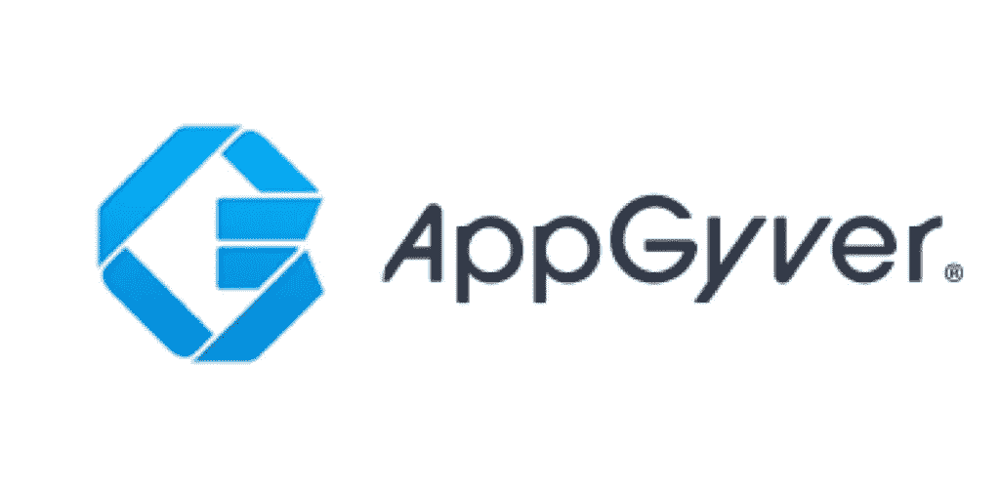

# 创建一个无需编码的应用程序

> 原文：<https://blog.devgenius.io/create-an-app-without-coding-60b5556e0b68?source=collection_archive---------7----------------------->

所以我现在已经专业地做了一段时间的后端程序员，从头开始创建一个应用程序或网站是我为应用程序的后端做的很多事情，还会有其他人在前端工作。我经常尝试使用 Angular、React、Ionic 等框架来学习前端，但从来没有机会完成这个项目，甚至没有机会掌握它。

然后我对自己说“应该有一个服务可以让你仅仅通过拖拽来创建一个应用程序，至少对 UI 来说是这样的”，这时候我发现了**低代码**和**无代码**平台

# **低码对无码**

所以我才知道，创建一个没有编码的 app 有一个术语叫“低代码”或者“无代码”。所以这两个词是有区别的，尽管它们是相似的。

**低代码**是一个术语，在这个术语中，某个部分仍然会有编码，但大多数情况下是拖放式的。这个编码部分可能是一个自定义逻辑，如果你想优化应用程序的某些部分，你可以创建它。所以在这里，用户必须知道一些基本的编程技能，以最大限度地应用程序。

另一方面，**没有代码**严格得多，如果你想扩展，你也不能扩展太多。你的应用程序的逻辑和特性将取决于你使用的平台的组件，例如，你想使用你自己的 REST API，但是平台只允许你使用 firebase 或者任何其他预定义的服务。

照片由[妮可·沃尔夫](https://unsplash.com/@joeel56?utm_source=medium&utm_medium=referral)在 [Unsplash](https://unsplash.com?utm_source=medium&utm_medium=referral) 上拍摄

所以有很多低代码和无代码平台，从免费的到昂贵的。还有[**appgyver**](https://appgyver.com/)**[**bubble . io**](https://bubble.io/)**[**wavemaker**](https://wavemaker.com)**等等。我使用 appgyver，因为首先它是免费的，我想先试用一下，对于一个免费版本来说，它还不错，它有我开始制作应用程序所需的许多组件。******

************

******所以 appgyver 是基于 react 的，对我个人来说，它很容易使用。基本组件都在那里，你可以非常自由地定制组件，而不是静态的。我所说的“非静态”是指你可以根据变量或公式自定义边框等组件。例如，当变量“无效等于真”时，你想把边框变成红色，但是当它变成假时，你可以把它改成任何你想要的。******

# ******我为什么喜欢它？******

******对我来说，这是一个令人兴奋的发现。“为什么？”你可能会问。正如我之前提到的，我试图使用前端框架，但还没有完成我开始的工作，因为我很难编码 UI。给定填充/边距，将组件居中，确定是否使用 px、em 等等。而且边编码边设计是一件非常令人沮丧的事情。******

************

******照片由[伯爵克里斯](https://unsplash.com/@countchris?utm_source=medium&utm_medium=referral)在 [Unsplash](https://unsplash.com?utm_source=medium&utm_medium=referral) 上拍摄******

******知道有低代码平台，在那里您可以轻松地拖放组件，只需输入您想要的组件属性。作为一个想尝试创建一个应用程序的后端程序员，我可以设计 UI 并同时实现它，这对我来说是非常强大的。对于那些已经使用前端框架多年的人来说，这可能有点可惜，但对我来说，这是一件好事，因为我可以自己创建一个功能强大的应用程序，而没有以前的麻烦。******

# ********弊端********

******这似乎是一件大事，可以让一个团队或某人更有效率，但对我个人来说，我认为它应该用于一个应用程序的原型或最早的版本。我不太清楚这个平台的安全性，但我认为当你的应用变得更大时，它应该迁移到标准的成熟框架。******

******首先，你把你的项目保存在云服务上，如果服务出了问题，你的整个应用程序就不能再开发了。即使他们可能有出口的方法，但最好不要冒险。******

******第二，你可能希望在你的应用程序上有更多定制的证券或事件跟踪，我认为这很难实现，因为即使是低代码也是让你开始使用应用程序的基本工具。灵活性有限，很难扩展。******

************

******照片由[你好我是 Nik](https://unsplash.com/@helloimnik?utm_source=medium&utm_medium=referral) 上 [Unsplash](https://unsplash.com?utm_source=medium&utm_medium=referral)******

# ******结论******

******因此，对于不熟悉编码但想创建简单应用或原型应用的人来说，无代码和低代码平台是一个好地方。简单易懂。即使只使用这个平台来扩展你的应用程序可能很诱人，但在我看来这不是一个好主意，因为以后很难定制。对于用有限的资源创建原型来说，这是一个很好的方法。******

******感谢阅读，干杯！******

************

******[Zan](https://unsplash.com/@zanilic?utm_source=medium&utm_medium=referral) 在 [Unsplash](https://unsplash.com?utm_source=medium&utm_medium=referral) 上的照片******