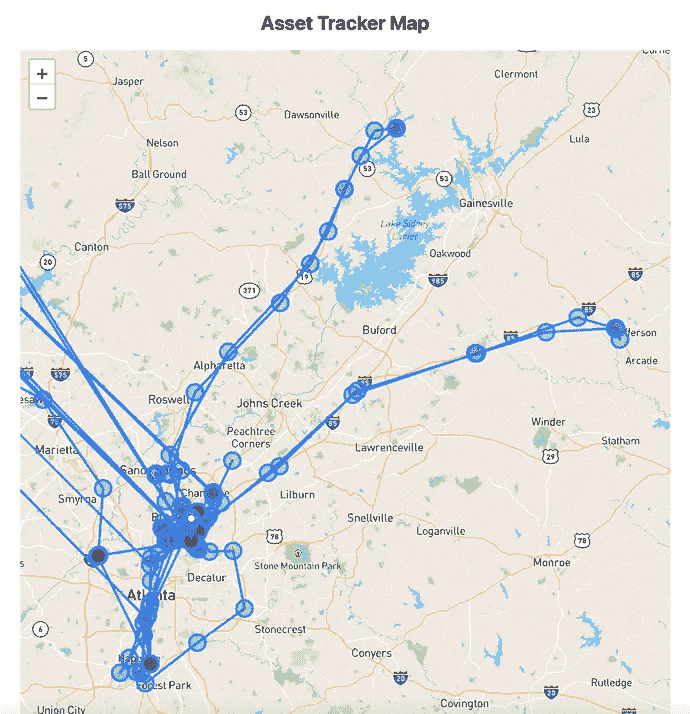
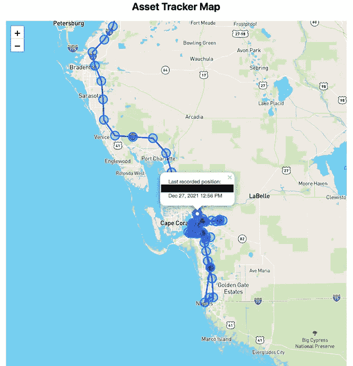
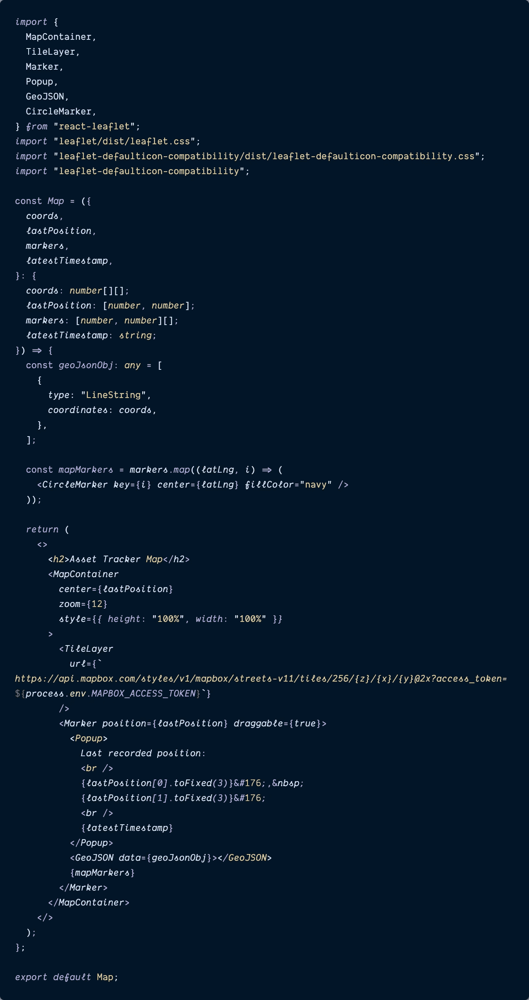
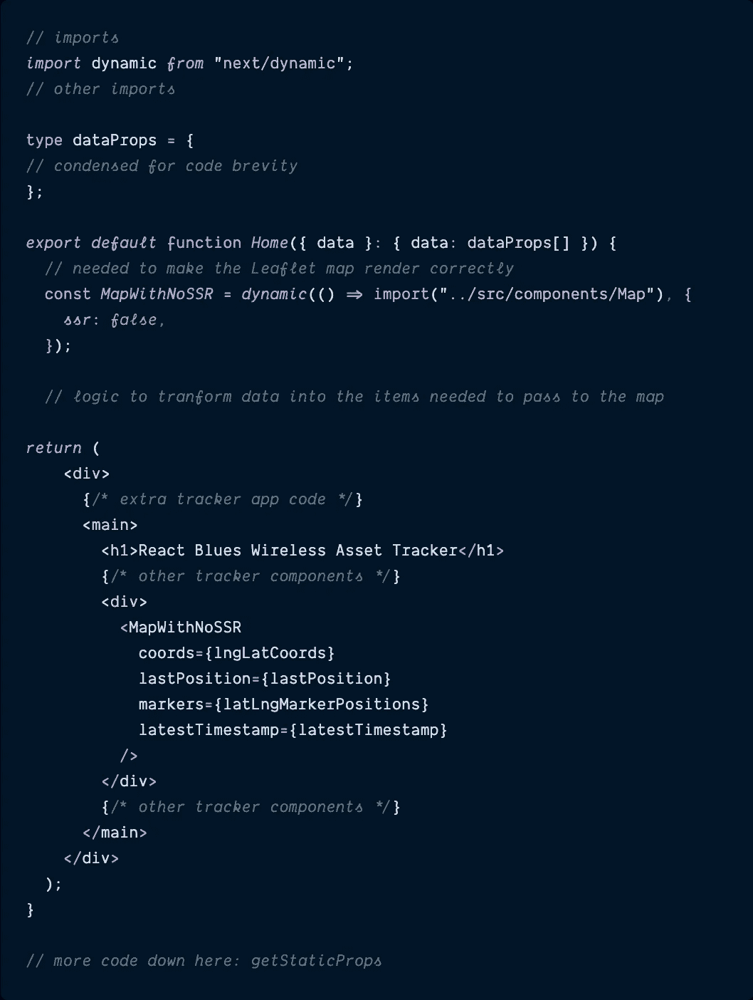
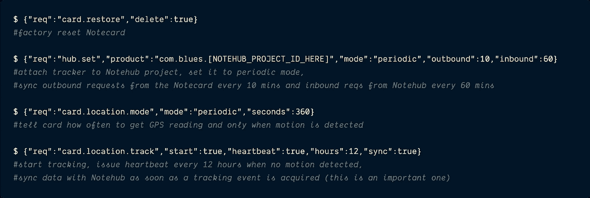
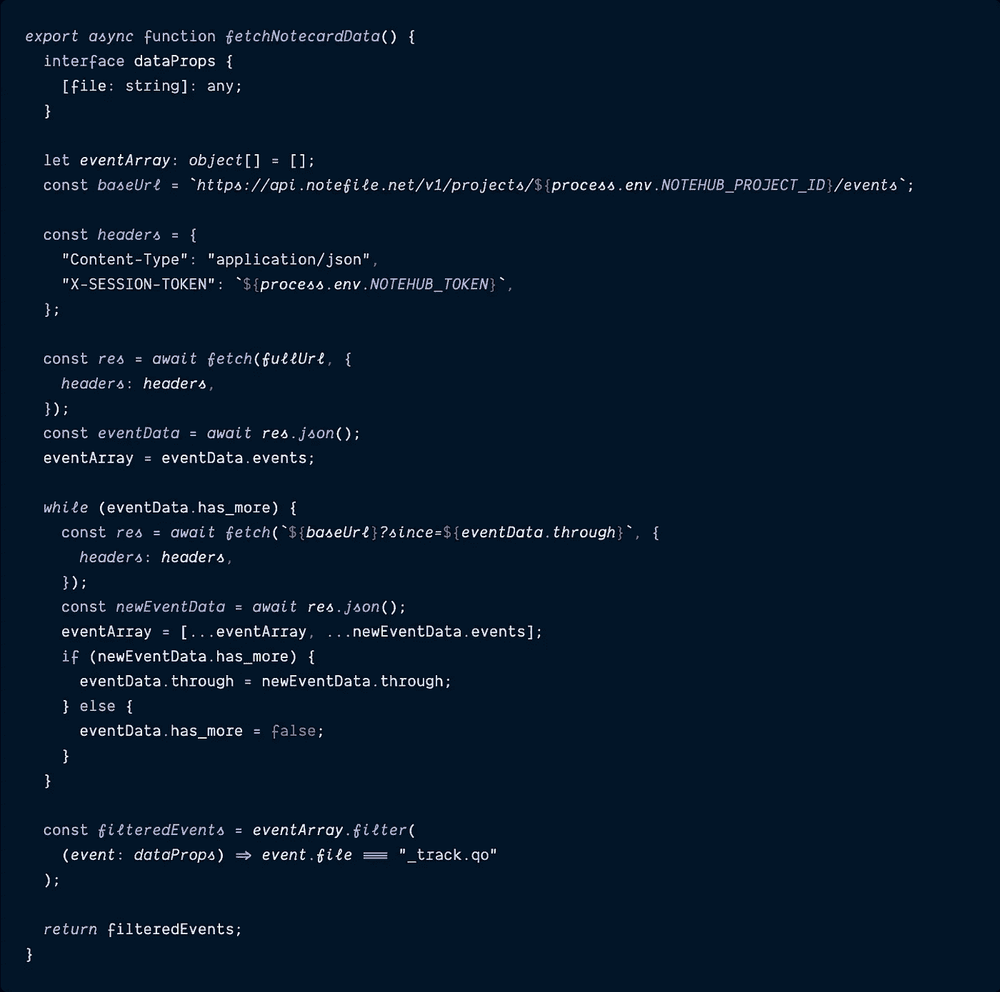
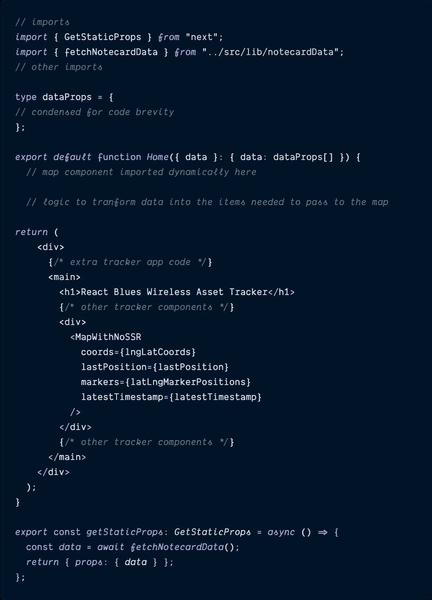
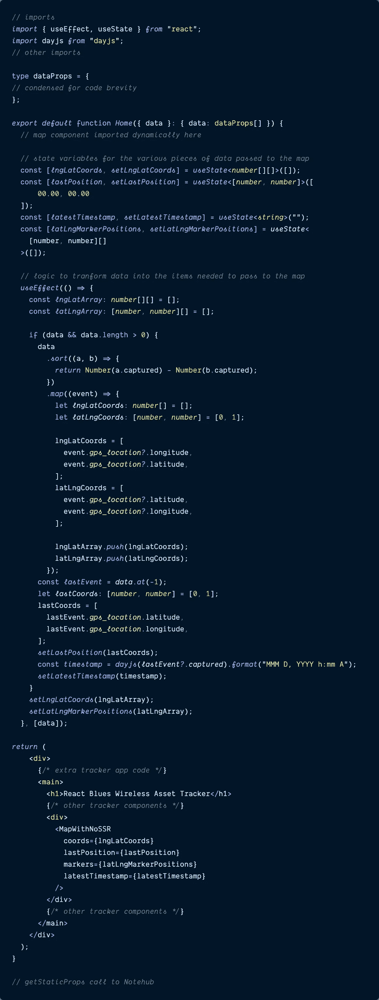
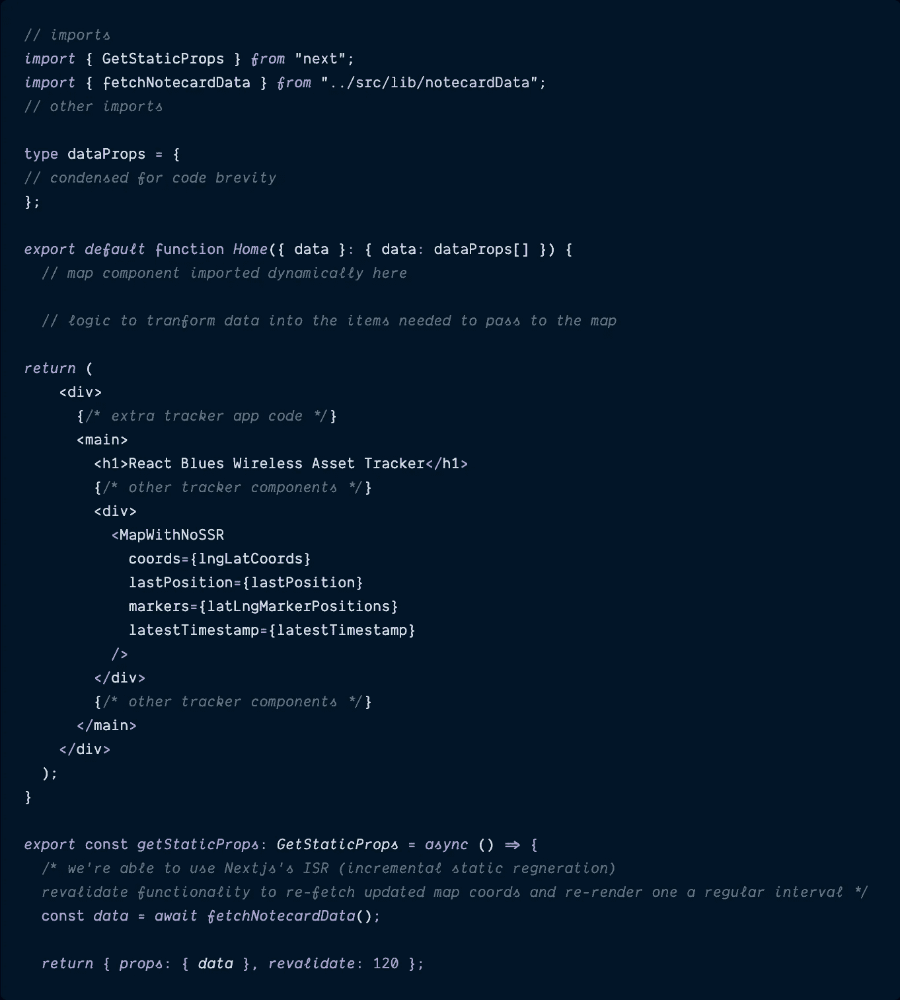

# 使用 Next.js 和 React 传单创建资产跟踪地图

> 原文：<https://blog.devgenius.io/create-an-asset-tracker-map-with-next-js-and-react-leaflet-7e9e6170f532?source=collection_archive---------5----------------------->

## 增量静态再生使用新数据更新静态页面变得轻而易举。



最近，我开始为一家物联网初创公司工作， [**Blues Wireless**](https://blues.io/?&utm_source=paigeniedringhaus.com&utm_medium=web&utm_campaign=niedringhaus-effect&utm_content=ep-2) ，该公司旨在让物联网开发变得更容易——即使在可靠的互联网连接不可用的情况下。Blues 通过 [**Notecards**](https://blues.io/products/notecard/?&utm_source=paigeniedringhaus.com&utm_medium=web&utm_campaign=niedringhaus-effect&utm_content=ep-2) 来实现这一点——可以嵌入任何“边缘”物联网设备的预付费蜂窝设备，以 JSON 的形式将传感器数据传输到安全的云: [**Notehub**](https://notehub.io/?&utm_source=paigeniedringhaus.com&utm_medium=web&utm_campaign=niedringhaus-effect&utm_content=ep-2) 。

由于 web 开发是我的主要专业领域(不是物联网开发)，我开始构建一个更简单的物联网项目:一个 [**资产追踪器**](https://www.hackster.io/paige-niedringhaus/low-code-gps-asset-tracker-and-map-display-b10419) ，只使用一个 Blues [**记事本**](https://shop.blues.io/products/note-nbgl-500/?&utm_source=paigeniedringhaus.com&utm_medium=web&utm_campaign=niedringhaus-effect&utm_content=ep-2) ，Blues [**记事本，一个内置 GPS 天线的 AL**](https://shop.blues.io/products/carr-al/?&utm_source=paigeniedringhaus.com&utm_medium=web&utm_campaign=niedringhaus-effect&utm_content=ep-2) ，以及一个小型的 [**锂离子聚合物(LiPo)电池**](https://www.adafruit.com/product/328) 。

在 Blues [**开发者体验文档**](https://dev.blues.io/guides-and-tutorials/notecard-guides/asset-tracking/?&utm_source=paigeniedringhaus.com&utm_medium=web&utm_campaign=niedringhaus-effect&utm_content=ep-2) 的帮助下，我很快就将 GPS 位置数据传送到了 Notehub cloud。这很酷，但来自传感器的数据真正变得有用的方式是在某种 UI 中显示给用户，对吗？它可以是图表，表格，或者对我来说，是一张地图。

所以我想把我的数据从 Notehub 云中取出，放入一个定制的仪表板中，以跟踪和显示 Notecard 在现实世界中的位置。因为 React 是我目前选择的 JavaScript 框架，所以我决定构建一个 Next.js- Typescript 驱动的仪表板，在这个过程中我学到了很多东西，我打算在接下来的几个月里通过一系列博客文章与您分享。

**在本文中，我将向您展示如何向 Next.js 应用程序添加地图，从第三方 API 源获取位置数据，并定期重新验证数据，以便在出现新的位置数据时更新地图。**

这是最终仪表板的样子——地图是这篇文章的重点:

成品资产跟踪仪表板—地图是我们这个项目的重点。

# 在 Next.js 应用程序中设置地图组件

**请注意:**本文不会介绍一个全新的 Next.js 应用程序的初始设置——那不在本文的讨论范围之内。如果你是从零开始，我建议你使用带有类型脚本文档的 [Next.js starter 应用程序](https://nextjs.org/docs/basic-features/typescript)。

> *如果你愿意，你也可以从 GitHub repo* [***这里***](https://github.com/paigen11/react-gps-asset-tracker-dashboard) *分叉并下载我的整个工作代码。*

## 安装地图项目依赖项

这篇文章要做的第一件事，是给下一个项目添加一个地图。这将需要一些新的 npm 包添加到我们的项目中: [**传单**](https://leafletjs.com/) 、[**react-传单**](https://react-leaflet.js.org/) 和 [**传单-默认-兼容性**](https://github.com/ghybs/leaflet-defaulticon-compatibility) 。

```
$ npm install leaflet react-leaflet leaflet-defaulticon-compatibility
```

> ***注意:*** *如果* `*react*` *和* `*react-dom*` *不在您的项目中，您还需要它们作为对等依赖项。*

*   传单是我们的基础，交互式地图的 JavaScript 库——它提供了我们其他包所依赖的基础。
*   **react-传单**为传单地图提供了更易于使用的 React 组件。它提供 React 和小叶之间的绑定，而不是替换小叶，而是利用它将小叶层抽象为 React 组件。如果你想了解更多关于 React 传单的信息，我建议你仔细阅读[文档](https://react-leaflet.js.org/docs/start-introduction/)。
*   **传单-默认图标-兼容性**从 CSS 中检索所有传单默认图标选项，尤其是所有图标图像 URL，以提高与修改 CSS 中 URL 的捆绑器和框架的兼容性。

> *构建引擎和框架修改 CSS 中的 URL，经常会和传单内置默认图标图片自动管理冲突，这个包帮助处理。*

**打字稿备注:**

如果您在项目中使用 Typescript，您还会希望安装以下 dev 依赖项以避免 Typescript 错误:

```
$ npm install @types/leaflet --save-dev
```

安装了新的地图库后，是时候继续配置项目以使用这些新资源了。

## 为地图的显示样式生成地图框标记，并将其添加到工程中

对于资产跟踪器将要打开的地图显示，我选择使用 [**地图框**](https://www.mapbox.com/) 样式。它有许多漂亮的 [**地图显示样式**](https://docs.mapbox.com/api/maps/styles/) 可供选择，开发者可以创建自己的 [**Mapbox API 令牌**](https://docs.mapbox.com/help/getting-started/access-tokens/) 通过注册一个免费的 [**Mapbox 帐户**](https://account.mapbox.com/auth/signup/) 来访问这些样式。

注册并创建新的 API 令牌后，复制令牌值—它将在 Next.js 应用程序中使用。在项目根目录下的 Next.js 应用程序的`next.config.js`文件中，添加 API 令牌，如下所示:

`**next.config.js**`

```
/**@type{*import('next').NextConfig*}*/
module*.*exports = {
  reactStrictMode: true,
  env: {
    MAPBOX_ACCESS_TOKEN:
      "[MAPBOX_TOKEN_HERE]",
  },
};
```

从这个文件中，Next 可以在需要调用 Mapbox API 端点时访问令牌。接下来，我们将在项目中创建`<Map />`组件。

## 创建`<Map>`组件



这是组件使用 GPS 数据呈现出来的样子。

由于这是一个 React 项目，我喜欢使用独立的、可重用的组件，所以在项目内部，创建一个名为`Map.tsx`的新文件，并粘贴以下代码。点击下面的文件标题即可获得实时代码。

`[**Map.tsx**](https://github.com/paigen11/react-gps-asset-tracker-dashboard/blob/main/src/components/Map.tsx)`



Map.tsx 组件的代码。

现在，让我们来讨论一下这个组件中发生的所有事情。

在文件的顶部:

*   该组件所需的所有单个反应小叶组件都被导入，
*   原始传单 CSS 被导入，
*   *和*根据[使用说明](https://www.npmjs.com/package/leaflet-defaulticon-compatibility#usage)的规定，随后导入活页默认图标兼容性 CSS 和 JS。

之后，是这个组件接受的道具:

*   `**coords**` -一个包含 GPS 经度和纬度的数组列表-它绘制了坐标之间的连接线。
*   `**lastPosition**` -当用户点击地图上的图标时，在弹出窗口中显示的最新 GPS 纬度和经度。
*   `**markers**` -另一个具有 GPS 纬度和经度的数组列表(是的，这些数组中的坐标顺序是相反的)显示了地图上追踪器之前位置的蓝色圆圈。
*   `**latestTimestamp**` -接收到的 GPS 坐标的最新时间戳(也用于显示在地图的弹出窗口中)。

我们直接去 JSX 吧。

`**<MapContainer />**`是负责创建传单地图实例并将其提供给其子组件的组件——没有该组件，地图将无法工作。在这个组件中，我们可以定义地图的`center`坐标，它在地图上的默认缩放级别，以及组件正确显示的一些基本样式。

`**<TileLayer />**` 组件是我们的 Mapbox 样式和新生成的 API 令牌发挥作用的地方。只需选择您喜欢的样式，用它替换字符串的`streets-v11`部分，并确保地图框标记出现在`next.config.js`文件中，我在上一步中已经展示过了。如果没有这个组件，就没有地图背景来显示坐标——相反，它只是一个空白的画布。

`**<Marker />**`接受`lastPosition`道具，在地图上显示跟踪器最后记录位置的图标，它包装了`<Popup />`组件、`<GeoJSON />`组件和`<CircleMarker />`组件列表。

组件`**<Popup />**` 是一个风格优美的工具提示，可以显示任何想要的信息。当用户点击时，我的`<Popup />`显示跟踪器的最后 GPS 坐标和报告时间，但是它可以显示你想要的任何东西。

`**<GeoJson />**` 组件是传递 GPS 经度和纬度数组的`coords`列表以绘制坐标之间的连接线的地方。输入坐标的`geoJsonObj`中的`type: "LineString"`就是处理它的部分。

最后但同样重要的是，`**<CircleMarker />**`组件，在该组件的 JSX 中显示为`{mapMarkers}`。

> *注意:为了将列表中的所有* `*markers*` *渲染为地图上的单个圆圈，我必须创建这个小函数来迭代列表并生成所有的圆圈，然后将其直接注入 JSX。*
> 
> *试图迭代 JSX 中的所有值是行不通的，我相信这是这个* `*react-leaflet*` *包与传统 React 代码行为不同的一个例子。*

这就是这个组件中发生的所有事情，当它被分解成组成它的各个部分时，并不复杂，对吗？

## 在 Next.js 应用程序中渲染地图

我们在下一个应用程序中获得地图渲染的最后一步:用选项`ssr:false`导入组件。

由于`react-leaflet`库只在浏览器中工作，我们不得不使用 Next.js 的`[**dynamic import()**](https://nextjs.org/docs/advanced-features/dynamic-import#with-no-ssr)` [**支持而不使用 SSR**](https://nextjs.org/docs/advanced-features/dynamic-import#with-no-ssr) 来告诉地图组件只在 Next.js 服务器端渲染发生后进行渲染。

因此，无论这个`<Map />`组件被注入到您的应用程序中的什么地方，都要使用下面详述的语法。在我的应用程序中，它在`index.tsx`页面文件中，为了清晰起见，我将文件中的代码压缩了。点击文件标题查看完整代码。

`[**pages/index.tsx**](https://github.com/paigen11/react-gps-asset-tracker-dashboard/blob/main/pages/index.tsx)`



index.tsx 文件中的压缩代码将没有 SSR 的地图组件导入下一个项目。

一旦在禁用服务器端呈现的情况下动态导入了`<Map />`，就可以像应用程序中的其他组件一样使用该组件。就这么简单。

> *在这一点上，可以随意模拟一些地图的硬编码数据，以确保它能够正确工作。在下一节中，我将介绍如何从我的资产跟踪器位置数据当前所在的 Notehub 云中获取实时数据。*

# 为地图引入数据

好了，地图已经在应用程序中设置好了，现在是时候给它一些数据来显示了。如果您想像我一样构建自己的资产追踪器，欢迎您——我将简要概述我使用的硬件，并向您介绍配置它的文档——与我用来设置我的资产追踪器的文档完全相同。

这是实现这个项目所需的设备:

*   蓝调无线[**n b-IoT&LTE-M Notecard Global**](https://shop.blues.io/products/note-nbgl-500/?&utm_source=paigeniedringhaus.com&utm_medium=web&utm_campaign=niedringhaus-effect&utm_content=ep-2)
*   blues Wireless[**note carrier AL 带 LiPo 电池连接器**](https://shop.blues.io/products/carr-al/?&utm_source=paigeniedringhaus.com&utm_medium=web&utm_campaign=niedringhaus-effect&utm_content=ep-2)
*   [**脂电池**](https://www.adafruit.com/product/328) 来自 Adafruit 这样的物联网供应商(我的是 3.7v 2500mAh 版本)

## 初始便笺和便笺载体配置

遵循 Blues [**快速入门指南**](https://dev.blues.io/start/quickstart/notecarrier-al/?&utm_source=paigeniedringhaus.com&utm_medium=web&utm_campaign=niedringhaus-effect&utm_content=ep-2) 设置 Notecard、Notecarrier 和第一个 Notehub 项目，并遵循 Blues [**资产跟踪指南**](https://dev.blues.io/notecard/notecard-guides/asset-tracking/?&utm_source=paigeniedringhaus.com&utm_medium=web&utm_campaign=niedringhaus-effect&utm_content=ep-2) 了解配置 Notecard 进行 GPS 位置跟踪所需的命令。

除了这些说明之外，还有一个重要的警告，以使这个资产追踪器为我们的目的工作。

1.  在最后的配置步骤:`[card.location.track](https://dev.blues.io/notecard/notecard-guides/asset-tracking/#tracker-configuration-requests?&utm_source=paigeniedringhaus.com&utm_medium=web&utm_campaign=niedringhaus-effect&utm_content=ep-2)`中，跟踪器开始运行，包括属性:`"sync”: true`。这个属性意味着一旦 Notecard 获得一个新的事件(在本例中是一个新的 GPS 位置)，note card 就会将该事件同步到 Notehub，而不是等待其定期安排的`outbound`时间。

> *如果你好奇的话，这里有我用来从头到尾设置我的记事本的所有命令使用* [***内置 web REPL***](https://dev.blues.io/notecard-playground/?&utm_source=paigeniedringhaus.com&utm_medium=web&utm_campaign=niedringhaus-effect&utm_content=ep-2) *在蓝调* [***开发者体验网站***](https://dev.blues.io/?&utm_source=paigeniedringhaus.com&utm_medium=web&utm_campaign=niedringhaus-effect&utm_content=ep-2) *。*



用于配置资产跟踪便笺的所有命令。

[Notehub API](https://dev.blues.io/reference/notehub-api/api-introduction/?&utm_source=paigeniedringhaus.com&utm_medium=web&utm_campaign=niedringhaus-effect&utm_content=ep-2) 可用于直接从 Notehub 获取**事件**(包含 Notecard GPS 坐标的数据)。Notehub API 要求用户创建一个 [**授权令牌**](https://dev.blues.io/reference/notehub-api/api-introduction/#authentication/?&utm_source=paigeniedringhaus.com&utm_medium=web&utm_campaign=niedringhaus-effect&utm_content=ep-2) 与请求一起传递，但是这个过程是有据可查的，正如获取所有事件 的 [**API 一样。**](https://dev.blues.io/reference/notehub-api/event-api/#get-events-by-project/?&utm_source=paigeniedringhaus.com&utm_medium=web&utm_campaign=niedringhaus-effect&utm_content=ep-2)

**生成一个 Notehub 认证令牌**

下面是在命令行中运行以生成 Notehub 授权令牌的代码:

```
$ curl -X POST 
-L 'https://api.notefile.net/auth/login' 
-d '{"username":"[[[email protected]](https://www.paigeniedringhaus.com/cdn-cgi/l/email-protection)]", "password": "[your_password]"}'
```

复制这个令牌，在 Next.js 项目中，在项目的根目录下，创建一个`.env.local`文件——这是保存敏感信息的地方:秘密、项目信息以及任何你不想提交给 GitHub 让全世界看到的东西。这里有一个文件应该是什么样子的例子，以及它需要的两个秘密变量:

`[**.env.local**](https://github.com/paigen11/react-gps-asset-tracker-dashboard/blob/main/.env)`

```
NOTEHUB_PROJECT_ID =APP_ID_GOES_HERE 
NOTEHUB_TOKEN =NOTEHUB_GENERATED_TOKEN_GOES_HERE
```

> *这个* `*.env.local*` *文件就是如何* [*Next.js 自动读入在构建时或者在客户端使用的环境变量*](https://nextjs.org/docs/basic-features/environment-variables#loading-environment-variables) *。您需要的所有变量都是构建时间变量，因此它们都不需要以* `*NEXT_PUBLIC_*` *为前缀，这允许在客户端访问变量。*

**在 Next.js** 中创建一个 T4**函数**

有了在`.env.local`文件中指定的 Notehub 令牌和项目 ID，现在我们可以通过 Next 的`[**getStaticProps**](https://nextjs.org/docs/basic-features/data-fetching/get-static-props)`函数连接到 Notehub。

创建一个名为`notecardData.ts`的新文件，这是从 Notehub 获取数据并过滤出我们想要的事件`_track.qo`的函数所在的地方。

下面是获取事件的代码——单击文件名可以看到我的实际 repo 中的代码。

`[**notecardData.ts**](https://github.com/paigen11/react-gps-asset-tracker-dashboard/blob/main/src/lib/notecardData.ts)`



在 Next.js 应用程序中获取便笺数据的函数。

虽然这个文件乍一看很冗长，但实际上并没有那么复杂。

它首先设置一个`**baseUrl**`，定义到 [Notehub 事件](https://dev.blues.io/reference/notehub-api/event-api/#get-events-by-project/?&utm_source=paigeniedringhaus.com&utm_medium=web&utm_campaign=niedringhaus-effect&utm_content=ep-2)的 URL 连接——这就是 access`NOTEHUB_PROJECT_ID`环境变量发挥作用的地方。

接下来是包含`"X-SESSION-TOKEN"`的`**header**`对象，它被设置为等于我们生成的`NOTEHUB_TOKEN`。

之后，点击 Notehub 事件端点，它将自动取回它存储的前 50 个事件，如果有比刚才返回的更多的事件，JSON 响应列表也将包括属性`**through**`和`**has_more**`。

如果`has_more`存在，这个`while`循环函数将继续使用`through`值(返回事件数组中最后一个事件的全局唯一标识符)命中 Notehub，直到没有更多事件添加到`eventArray`列表中。

最后，所有收集到的事件都被过滤到只有`_track.qo`类型，因为这些事件包含跟踪器的 GPS 坐标。

## 调用页面上的`fetchNotecardData()`功能

我们的函数连接到 Notehub 并获得构造的事件数据，现在是时候在`<Map />`组件所在的页面中进行调用了。为此，我们将使用 Next 的`getStaticProps`函数来获取服务器端的数据。

在我们之前导入了`<Map />`组件的`index.tsx`文件中，我们将在文件底部添加以下代码。为了清楚起见，我压缩了文件的其余部分，但是完整的文件链接在下面。

`[**pages/index.tsx**](https://github.com/paigen11/react-gps-asset-tracker-dashboard/blob/main/pages/index.tsx)`



index.tsx 文件中的代码在组件中使用 fetchNotecardData 函数。

为了在服务器端调用`index.tsx`文件中的 Notehub API，我们导入`fetchNotecardData()`函数本身，从 Next 导入`getStaticProps`函数，然后在文件末尾，从`getStaticProps`函数内部调用`fetchNotecardData()`。

最后，我们将来自 Notehub 的数据作为`props`返回，该数据可以传递给`Home`组件。

## 将数据整理成`<Map />`组件的形状。

很好。我们已经从 Notehub 获得了数据，还有最后一件事要做:获取从 Notehub 返回的 JSON 数据，并对其进行重组以适应`<Map />`组件。我再次精简了逻辑，使这个文件更容易阅读，但你可以在 GitHub 上看到完整的文件。

`[**pages/index.tsx**](https://github.com/paigen11/react-gps-asset-tracker-dashboard/blob/main/pages/index.tsx)`



将 Notehub 数据转换为 index.tsx 文件中的映射数据的状态和逻辑

在这个函数中，一旦从 Notehub 获取数据并传递给组件，我们就设置一些新的 React `useState`变量来保存要传递给`<Map />`组件的数据。

*   有一个`**lngLatCoords**`列表——这是一个坐标列表，将用于在记录的 GPS 坐标之间画线(它必须作为`[longitude, latitude]`传递给`"LineString"` `<GeoJSON />`组件)。
*   `**lastPosition**`状态变量用于使地图居中，标记图标居中，并与`**latestTimestamp**`变量一起显示在`<Popup />`中。
*   并且`**latLngMarkerPositions**`列表与`lngLatCoords`变量类似，除了这里的坐标是按照`[latitude, longitude]`的顺序。

在`useEffect()`函数内部，对 Notehub 事件的数组进行排序，然后进行迭代以提取所需形状的所有相关数据。一旦所有事件都被转换，它们就被设置为状态并传递给地图。

# 使用 ISR 定期更新数据

还有最后一件事我们还没有讨论，那就是在资产跟踪应用程序最初加载数据并呈现地图之后，如何处理发送到 Notehub **的新`_track.qo`事件。**

在我构建跟踪器的早期，我使用了一个简单的`refreshData()`函数来强制 Next.js 每隔 5 分钟在服务器端重新提取 Notehub 数据，但后来我学到了一个更好的方法，它实际上内置于 Next: [**增量静态再生**](https://nextjs.org/docs/basic-features/data-fetching/incremental-static-regeneration) (ISR)。

ISR 使我们能够在每页的基础上使用静态生成，而不需要重建整个网站。这实际上意味着:`getStaticProps`仍然被调用来获取数据，但是另外一个`revalidate`选项被传递给`return`语句，间隔时间以秒为单位。

每次到达该间隔时，Next.js 将再次调用该函数，并尝试使用任何新数据重新生成页面，一旦页面重新生成，Next 将用新页面替换旧页面。没有加载消息，没有 screen jank，没有像 WebSockets 或长轮询这样的额外库，也没有手动强制服务器端刷新的额外函数——而是内置在 Next 中。

因此，为了定期重新验证页面数据，我们将再次返回到`index.tsx`页面。

`[**pages/index.tsx**](https://github.com/paigen11/react-gps-asset-tracker-dashboard/blob/main/pages/index.tsx)`



ISR 实现重新提取数据服务器端，并在后台用新数据更新地图组件。

新代码在这个文件中的`getStaticProps()`函数的最底部——行`return { props: { data }, revalidate: 120 };`

这就是我们所需要的，这样每两分钟 Next.js 就会返回到 Notehub，获取任何新数据，并在服务器端重新呈现页面。太牛逼了。

这样，我们就有了一个用 Next.js 构建的资产跟踪图，并定期检查新数据。

# 结论

在我于 2021 年 7 月加入一家物联网初创公司后，我开始用资产跟踪器尝试物联网开发。一旦我有了定期发送到云中的 GPS 数据，我就知道如何从云中提取数据，并将其显示在定制的仪表板地图中。

在 React 支持的 Next.js 框架和 React 传单库的帮助下，我能够很容易地做到这一点，甚至利用 Next 的内置增量静态再生来重新获取任何新的数据服务器端，并用这些新数据重新渲染地图。挺酷的。

感恩节后的晚上，当我父母的车在车道上被偷时，这真的派上了用场。如果你想听完整个故事并建立自己的追踪器，看看我为蓝调无线制作的这篇 [**博客文章和视频**](https://blues.io/blog/gps-asset-tracker-with-blues-wireless-and-react/?&utm_source=medium.com&utm_medium=web&utm_campaign=niedringhaus-effect&utm_content=ep-2)——它详细描述了从硬件到软件再到部署到网络的整个过程。

过几周再来看看——我会写更多关于 JavaScript、React、IoT 或其他与 web 开发相关的东西。如果你想确保你不会错过我写的一篇文章，在这里注册我的时事通讯:[https://paigeniedringhaus.substack.com](https://paigeniedringhaus.substack.com)

感谢阅读。我希望您喜欢学习如何在 Next.js 中设置地图，并将资产追踪器的位置数据渲染到该地图上——试想一下，这对于追踪个人车辆或整个车队有多么有用。从这里开始，你可以去很多很棒的地方做这个项目。追踪愉快！

# 参考资料和更多资源

*   [Hackster.io 原始资产跟踪项目](https://www.hackster.io/paige-niedringhaus/low-code-gps-asset-tracker-and-map-display-b10419)
*   [资产追踪公司 GitHub 回购](https://github.com/paigen11/react-gps-asset-tracker-dashboard)
*   传单[文件](https://leafletjs.com/)
*   反馈传单[文档](https://react-leaflet.js.org/)
*   地图框[站点](https://www.mapbox.com/)
*   蓝调无线[网站](https://blues.io/?&utm_source=paigeniedringhaus.com&utm_medium=web&utm_campaign=niedringhaus-effect&utm_content=ep-2)
*   蓝调无线[开发者体验网站](https://dev.blues.io/?&utm_source=paigeniedringhaus.com&utm_medium=web&utm_campaign=niedringhaus-effect&utm_content=ep-2)
*   Next.js [增量静态再生](https://nextjs.org/docs/basic-features/data-fetching/incremental-static-regeneration)

# 你可能喜欢的其他文章

[](https://www.hackster.io/paige-niedringhaus/low-code-gps-asset-tracker-and-map-display-b10419) [## 低代码 GPS 资产跟踪器和地图显示

### 最近，我作为一名软件工程师加入了物联网初创公司 Blues Wireless。我没有物联网经验…

www.hackster.io](https://www.hackster.io/paige-niedringhaus/low-code-gps-asset-tracker-and-map-display-b10419) [](https://blues.io/blog/reactjs-vs-blues-wireless-iot/) [## Blues Wireless -与 React 类似，但适用于物联网

### 2021 年 11 月 2 日欢迎开始新的博客系列，我将尝试向其他人展示 web 开发…

blues.io](https://blues.io/blog/reactjs-vs-blues-wireless-iot/) [](https://blog.bitsrc.io/pure-css-to-make-a-button-shine-and-gently-change-colors-over-time-5b685d9c6a7e) [## 纯 CSS 使一个按钮“发光”,并随着时间的推移逐渐改变颜色

### 因为 CSS 中的动画和渐变很讨人喜欢。

blog.bitsrc.io](https://blog.bitsrc.io/pure-css-to-make-a-button-shine-and-gently-change-colors-over-time-5b685d9c6a7e) 

*原载于*[](https://www.paigeniedringhaus.com/blog/create-an-asset-tracker-map-with-next-js-and-react-leaflet)**。**