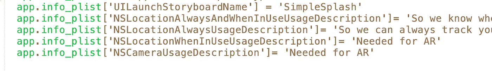

# 用 Ruby 创建一个增强现实应用

> 原文：<https://blog.devgenius.io/create-an-augmented-reality-app-with-ruby-37272f1355f3?source=collection_archive---------18----------------------->

Ruby Motion + ARKit << SceneKit

Thank you Lori Olson for the amazing [主题演讲](https://www.youtube.com/watch?v=9eqjppyV6iY&t=1341s)这个话题

**第一步**注册一个苹果开发者账户

Apple 开发者帐户登录屏幕

创建一个苹果开发帐户是超级容易和快速设置它，它与你的苹果 ID…超级方便。您还需要下载 Xcode，它可以为您的终端启用一些 iOS 开发工具。

**第 2 步**添加新的证书和唯一标识符

您可以通过 Apple Connect 登录并转到“证书、标识符与描述文件”部分，轻松创建新的唯一标识符。请务必记下您的唯一标识符，因为我们将很快在您的 rakefile 中使用它。

**第三步**下载 Ruby Motion

ruby motion 订阅页面

安装 Ruby Motion 很简单，只需点击一下。出于 SDK 的原因，这个项目需要 AR 的付费版本——解释为什么——AR 不能使用模拟器，因为模拟器没有摄像头

轻松安装(一次点击)

**步骤 4** 创建一个新的 ruby motion 项目

要在适当的目录中创建新的 motion 项目 CD，并运行 motion create 和您想要的应用程序名称

**第五步**添加宝石

Gemfile

Simplesplash gem 消除了 iOS 闪屏的错误

Motion provisioning 有助于将您的应用和证书验证到您提供的 iOS 帐户

**步骤 5** 编辑 rake 文件

rakefile 由注释掉的步骤组成，以下是可用的步骤以及如何填写信息

1.  阅读自述文件
2.  添加你的应用。name = 'ARDemo '和应用版本= '1.0 '
3.  注释掉部署目标(这在免费版本中不起作用，所以为了在最新的 iPhone 上使用 ruby motion 和 AR，你需要付费版本的 Ruby motion)
4.  连接你的应用标识符“com.andyflatiron.ARDemo”

5.继承苹果框架

**第 6 步**将以下代码添加到您的 rake 文件中，以提供动作

该代码与 motion provisioning gem 一起工作，验证您的帐户，并确保您拥有开发 iOS 应用程序的有效证书。

**合理默认值下的第 7 步**包括

添加 UI 警告/弹出窗口，要求用户允许访问他们的位置和相机，这两者都是 AR 体验所需要的。

**步骤 8** 将根视图控制器更换为新的控制器

app_delegate.rb 是用一个新的 ruby motion 文件自动创建的，保持它的原样只是编辑根视图控制器到 ARViewController

第九步创建一个视图控制器

在新创建的 ARViewController 和固有的 UI 视图控制器中。超级控制器是 objective C，所以下面的一些语言可能看起来有点奇怪。现在，我们添加了 attr_accessors 来访问 UIViewControllers 实例变量。创建 AR 场景的场景视图和配置场景的场景配置

**第 10 步** AddDidLoad 方法

我们使用 AddDidLoad 方法，该方法可从 UIViewController 获得。我们确保调用 super 来继承它的所有属性。然后我们创建一个新的场景并初始化它的一个新实例。我们给场景默认的闪电，这样它在环境中看起来很自然，我们指定你的设备的屏幕大小

**步骤 11** 添加配置方法

然后，我们需要一个配置方法——我们通过创建一个 ViewWillAppear 方法并启动一个新的 ar 世界跟踪配置实例来做到这一点。然后我们用场景配置的配置创建一个新的场景视图

**第 12 步**给场景添加物体

我们需要将盒子添加到场景中。为了做到这一点，我们需要创建盒子的尺寸，创建一个节点并将其放置在场景中，最后将节点添加到场景视图中

**步骤 13** 在您的终端运行*耙子装置*

插入您的 iOS 设备并运行 rake 设备，因为这是一个 AR 应用程序，您需要运行 rake 设备，在其他情况下，您可以只运行 rake 并打开模拟器

**步骤 14** 运行&测试

希望你喜欢阅读！