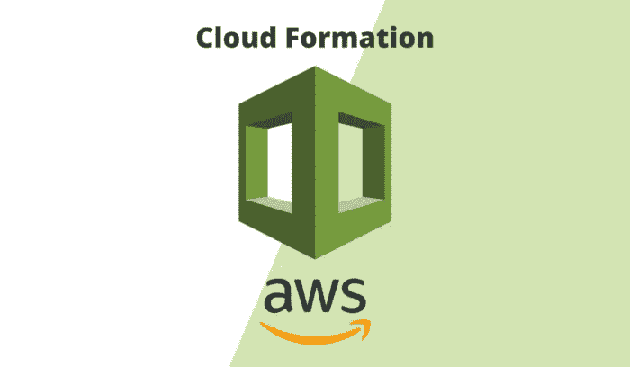
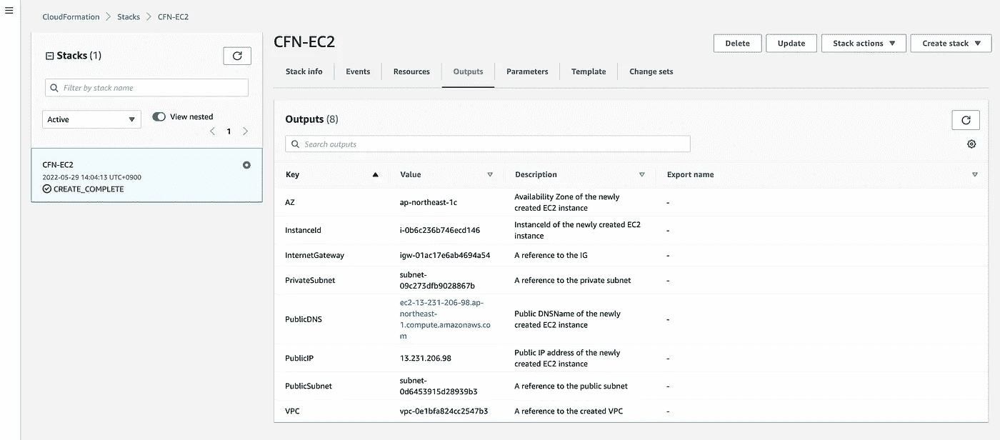
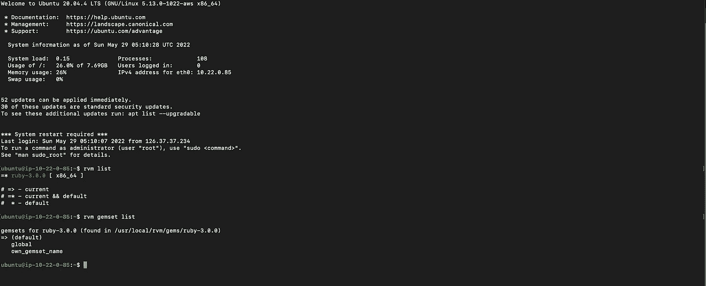

# 使用 AWS CloudFormation 创建带有 Ruby 安装的 EC2 实例

> 原文：<https://blog.devgenius.io/create-an-ec2-instance-with-ruby-installation-using-aws-cloudformation-abc5aa8da0c8?source=collection_archive---------14----------------------->

我们正在使用 AWS CloudFormation 创建一个带有 Ruby 安装的 EC2 实例

# 什么是 AWS Cloudformation？

AWS CloudFormation 是一项服务，为开发人员和企业提供了一种简单的方法来创建相关 AWS 和第三方资源的集合，并以有序和可预测的方式提供和管理它们。我们将在这个项目中使用映射、资源和输出。

以下是我们将要创建的核心组件:

*   Web 服务器安全组
*   EC2 实例，带有 Ubuntu 20.04 映像和 8Gb Ebs 卷以及 Ruby 安装。

> 要创建 VPC 和子网，请查看下面的文章，在这篇文章中，我们将创建一个安装了 Ruby 的 EC2 实例。
> [**使用 CloudFormation**](https://awstip.com/create-a-vpc-with-private-and-public-subnets-using-cloudformation-939114a38f22) 创建带有私有和公共子网的 VPC

**映射:**

[映射](https://docs.aws.amazon.com/AWSCloudFormation/latest/UserGuide/mappings-section-structure.html)部分基本上是一个使用键:值关系的查找表。在这个模板中，Amazon 机器映像被映射到其各自的区域。我只为这个项目映射了一个区域，所以模板仅限于这一个区域，如果在这些区域之外启动将会失败。

**参数:**

使用可选的`[Parameters](https://docs.aws.amazon.com/AWSCloudFormation/latest/UserGuide/parameters-section-structure.html)`部分定制您的模板。参数使您能够在每次创建或更新堆栈时向模板输入自定义值。

更改您的密钥名。

**资源:**

[Resources](https://docs.aws.amazon.com/AWSCloudFormation/latest/UserGuide/resources-section-structure.html) 部分包括您想要在堆栈中创建的所有 AWS 资源。

1.  对于 *WebserverSecurityGroup* ，模板正在创建一个安全组，该安全组具有允许 HTTP 上所有流量的入站规则。

2.对于 *EC2Instance* ，模板正在创建一个具有以下属性的 EC2 实例:

*   ImageID:您可以直接为该属性输入 AMI-Id，但是因为我们希望能够在一个区域中使用模板，所以我们使用 [FindInMap 函数](https://docs.aws.amazon.com/AWSCloudFormation/latest/UserGuide/intrinsic-function-reference-findinmap.html)来引用我们的映射。
*   UserData:这个部分用于使用 [CloudFormation::Init](https://docs.aws.amazon.com/AWSCloudFormation/latest/UserGuide/aws-resource-init.html) 安装 Ruby

> **AWS::CloudFormation::Init** 使用 AWS::cloud formation::Init 类型包含 Amazon EC2 实例上的元数据

EC 实例模板

**输出:**

创建堆栈后，[输出](https://docs.aws.amazon.com/AWSCloudFormation/latest/UserGuide/outputs-section-structure.html)部分将信息打印到 CloudFormation 中的输出选项卡，也可用于将信息导入其他堆栈。

**完整的云形成模板:**

**最终输出**

RVM 和 Ruby 默认安装输出。

> *注意，使用* `*DeletionPolicy*` *可以保留该属性，并且在某些情况下，当资源的堆栈被删除时，可以对其进行备份。您为想要控制的每个资源指定一个* `*DeletionPolicy*` *属性。如果一个资源没有* `*DeletionPolicy*` *属性，亚马逊 CloudFormation 默认删除该资源。如果您想保留您的所有资源，则在每个资源
> 中添加* `*DeletionPolicy: Retain*` *以了解更多详细信息:* [AWS 文档](https://docs.amazonaws.cn/en_us/AWSCloudFormation/latest/UserGuide/aws-attribute-deletionpolicy.html)

**结论**

使用该模板，您可以创建带有公共和私有子网、Web 服务器安全组的 VPC，并使用 AWS CloudFormation 启动带有 Ruby 安装的 EC2 实例。它构建了一个私有网络环境，您可以在其中安全地运行 AWS 资源以及相关的网络资源。

如果本指南对您和您的团队有所帮助，请与他人分享！