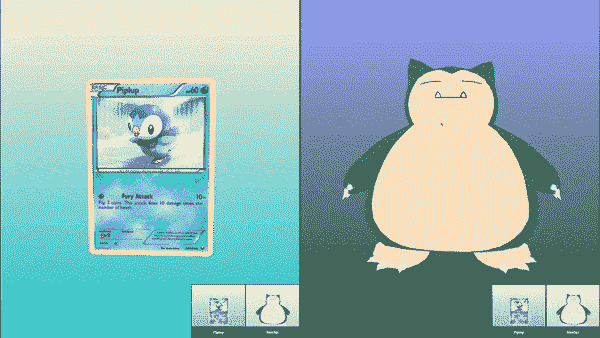
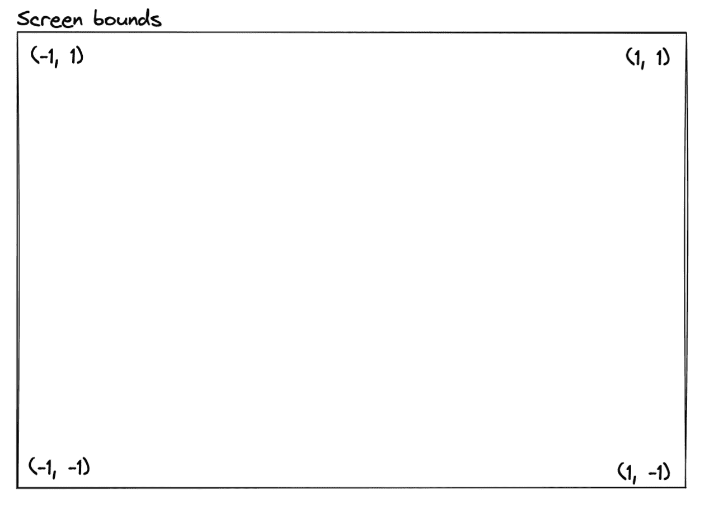
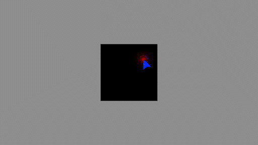
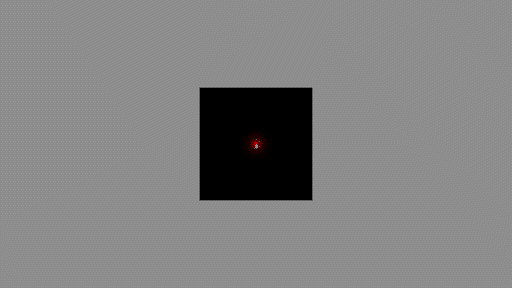
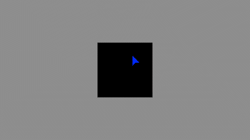
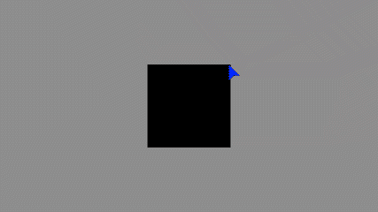

# 用 Three.js 创建一个弹性材质

> 原文：<https://blog.devgenius.io/create-an-elastic-material-with-three-js-ea8d0a394bcf?source=collection_archive---------6----------------------->

演示，以波加曼和卡比兽为特色🐧

我受到启发，想创造一种弹性材料，并想分享如何复制它。Javascript、Three.js 的知识和一些关于着色器的概念将有助于理解！

上面的 snorlax/piplup 演示可以在 [*这里*](https://elastic-material.vercel.app/) 查看，源代码可以在 [*这里*](https://github.com/arcaneCheco) 获取。好吧…

## 创造我们的场景

这是我们的起点。一个基本的 Three.js 场景，带有一个摄像机、渲染器和一个红色平面。

## 设置着色器材质

让我们用 Three.js **ShaderMaterial 替换场景中的材质。这个类为我们提供了大部分必要的常量和属性(位置、uv、modelViewProjectionMatrices 等)。**

创建两个新文件， *fragment.glsl* 和 *vertex.glsl.*

将文件导入到我们的脚本中，并实例化材质。

我们应该能再次看到我们的红色飞机。🥳

## 使用射线投射器

接下来，让我们解决交互性问题。

我们将添加一个 Three.js **Raycaster** 来确定用户是否试图拖动红色平面。

在事件监听器的回调中，我们调用了 *setFromCamera* 方法，该方法从摄像机的位置向屏幕上的指定点发射光线。该方法期望点位置被格式化为*标准化设备坐标* (NDC)，即我们的视口尺寸，映射到 range -1 = > 1。

intersectObject 方法检查光线和一个对象之间的交集，我们将它作为参数传递。如果我们找到了，它将返回一个数组中的 Javascript 对象，该数组包含交叉点的位置，它的 uv 位置，到相机的距离和其他信息。我们稍后将通过制服把这个信息传递给我们的着色器。

## 实现拖动控件

我们需要三个事件监听器来设置我们的控件， *mousedown* 、 *mousemove* 和 *mouseup* 。

onMouseDown:

*   使用光线投射器来检查用户是否点击了我们的平面。
*   如果是，将位置作为一个制服传递给我们的材质，并设置布尔值来显示用户当前正在拖动。

onMouseMove:

*   如果用户在拖动，使用光线投射器得到一个交点，并将其位置传递给我们的材质。因为我们的平面没有覆盖屏幕的整个视口，所以我们需要创建一个虚拟平面来覆盖屏幕的整个视口。

onMouseUp:

*   如果用户在拖动飞机，重置我们的布尔值来显示用户已经释放了飞机。

## 扭曲我们的飞机

回到着色器。我们将修改我们的顶点着色器来扭曲我们的平面。首先，增加几何图形中高度和宽度部分的数量。

使用拖动控件中的起始位置和目标位置，我们将创建一个影响范围来确定我们需要在什么位置应用多少扭曲。这应该 a)以起始位置为中心，b)在其中心最强，c)向其边缘逐渐减弱，以及 d)随着起始位置和目标位置之间的距离而增大。

我们可以将扭曲传递给我们的片段着色器来可视化它。

最后，使用变形创建一个偏移向量，并将其添加到我们的位置属性中:

目前为止的代码..

## 放

让我们添加一个动画来恢复用户释放平面时的形状。我们需要两个额外的制服，一个告诉我们控件已经被释放的变量， *uDragRelease* ，以及自释放以来的时间 *uDragReleaseTime。*我们还需要一个全局时间的制服，我们将在渲染循环中更新。

修改顶点着色器以抑制扭曲。

添加一个变形，使它看起来更“有弹性”。正弦函数工作良好。

瞧..

最终沙盒

## 更进一步

尝试不同的释放动画，修改我们用来创建影响区域的规则，或者改变扭曲的形状。

感谢阅读。如果你也是 WebGL 和创造性编码的粉丝，请在 [Twitter](https://twitter.com/checo272) 上联系我。祝你今天开心！玩的开心！