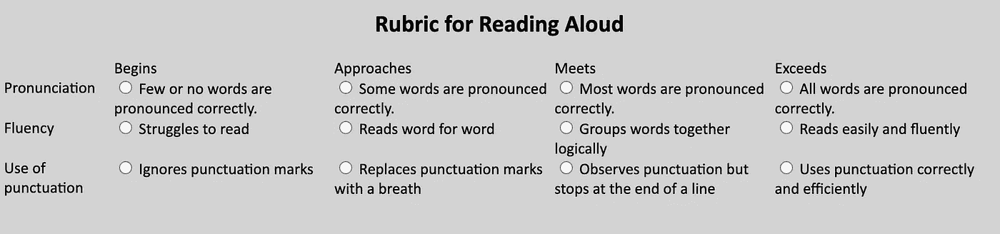

# 用 CSS 网格创建一个交互式标题

> 原文：<https://blog.devgenius.io/create-an-interactive-rubric-with-css-grid-fc8fbf1eee4f?source=collection_archive---------8----------------------->


Sharon McCutcheon 在 [Unsplash](https://unsplash.com/s/photos/grid?utm_source=unsplash&utm_medium=referral&utm_content=creditCopyText) 上拍摄的照片

如果你正在开发一个教育网站或应用程序，你可能需要创建一个交互式的标题——一个描述每项被评估技能的具体标准的表格。在本教程中，我们将从头开始，为下面显示的交互标题构建 HTML 和 CSS。


我们将创建的标题。

对于每项技能，用户查看技能行中的描述，并通过单击或点击来选择与匹配级别相对应的面板。

为了构建标题的布局，我们将使用 CSS 网格布局，现在现代浏览器已经很好地支持它了。

让我们从两个文件开始:一个`index.html`文件和一个`css`文件。或者，可以随意使用代码沙箱，如 [CodePen](https://codepen.io) 或 [JSFiddle](https://jsfiddle.net) 。

# 添加 HTML 标记

让我们先建立页面。在代码沙箱的 HTML 面板或 HTML 文档的`<body>`标签中，添加一个`<h2>`标题。

```
<h2>Rubric for Reading Aloud</h2>
```

接下来，添加一个空的`<div>`，其`id`为`rubric`。

```
<div id="rubric"></div>
```

与 HTML 表格不同，我们在 HTML 中没有像`<th>`和`<tr>`这样的行元素——行格式将由 CSS grid 处理。

因此，对于标题的第一行，让我们从单元格开始。我们将为角落添加一个空白单元格，并为每个级别添加四个单元格。

```
<div id="rubric">
   <div class="cell"></div>
   <div class="cell">Begins</div>
   <div class="cell">Approaches</div>
   <div class="cell">Meets</div>
   <div class="cell">Exceeds</div>
</div>
```

它应该是这样的:


我们标题的开始

我知道——我们有了一个不太好的开始，但让我们继续努力吧。

让我们通过简单地添加另外五个单元格来开始我们的第一行。第一个单元格将有第二个类`skill`，它将以特定的样式调用。在单元格内，我们将有一个带有技能名称的`<label>`元素。

表中没有内部内容的一行。

## 添加一行中的第一个单选按钮

为了使我们的表格具有交互性，代表某项技能的特定级别的每个单元格都有一个单选按钮，由一个`<input>`元素和一个`<label>`元素组成。下面是单元格中的`<input>`元素的标记。

```
<div class="cell">  
      <input type="radio" id="**radio-1**" name="row1"/>
</div>
```

`<input>`元素有三个属性:

*   一个`type`，将其指定为`radio`
*   独一无二的`id`
*   一个`name`，指定它所属的单选按钮组

现在让我们添加一个`<label>`元素，它在风格上比`<input>`更灵活。

```
.<div class="cell">  

      <input type="radio" id="**radio-1**" name="row1"/> **     <label for="radio-1" class="begins">
         Few or no words are pronounced correctly.
      </label>**
</div>
```

`<label>`元素有两个属性:

*   `for`，用匹配的`id`将其绑定到`<input>`元素
*   `class`中的`"begins"`，这将为该级别赋予特定的样式

`<label>`将是用户所看到的和与之交互的，并作为用户和`<input>`之间的中介。

## 附加单选按钮

该行中的下一个单选按钮将有一个具有相同`name`和`type`属性但不同`id`的输入。它的标签也将具有不同的属性值。

```
<div class="cell">
     <input type="radio" id="**radio-2**" name="row1"/>
     <label for="**radio-2**" class="approaches">
      Some words are pronounced correctly.
     </label>
</div>
```

在最后两个空单元格中，添加一对`<input>`和`<label>`元素，如下所示。

下两个单选按钮。

## 添加行

现在，标题的一行已经完成，以同样的方式再添加两行。以下是第二行和第三行的内容:

```
**Skill:** Fluency**Begins:** Struggles to read.
**Approaches:** Reads word for word.
**Meets:** Groups words together logically.
**Exceeds:** Reads easily and fluently.
```

下面是第三行也是最后一行的内容。

```
**Skill:** Use of punctuation**Begins:** Ignores punctuation marks.
**Approaches:** Replaces punctuation marks with a breath.
**Meets:** Observes punctuation but stops at the end of a line.
**Exceeds:** Uses punctuation correctly and efficiently.
```

在第二行中，让我们使用`row2`作为每个`<input>`元素的`name`属性。在第三排，使用`row3`。

你的完整 HTML 页面应该有这个标记，看起来像下面的页面。


现在让我们使用 CSS 来使它看起来像它应该的样子。

# 风格

我们先补充一些通用的样式。

```
body {
  font-family: Calibri;
  background-color: lightgrey;
}
h2 {
  text-align: center;
  font-size: 1.5em;
}
```

## 标题一般样式

接下来，让我们添加`display: grid`使我们的主容器采用 CSS 网格格式。

```
#rubric {
  display: grid;
}
```

接下来，让我们添加`grid-template-columns`来设置列数和它们的相对宽度。

```
#rubric {
  display: grid;
 **grid-template-columns: 1fr 2fr 2fr 2fr 2fr;**
}
```

现在我们有了网格。第一列列出了技能，宽度是其他四列的一半。



添加了基本全球风格的标题。

让我们把它的宽度设为 100%，它在浏览器和窄宽度的设备上生效。对于宽屏幕，让我们把它放在中间，给它一个`650px`的`max-width`。

```
#rubric {
  display: grid;
  grid-template-columns: 1fr 2fr 2fr 2fr 2fr;
 **width: 100%;
  max-width: 650px;
  margin: 0px auto;** 
}
```

现在你应该会发现，在 650 像素以上的屏幕上，标题居中并保持最大宽度。


具有最大宽度的标题。

## 标题单元格

让我们给顶行单元格添加样式。

首行的样式。

让我们来看看会发生什么。


带有第一行单选按钮的半样式标题。

格式有所改进，但是单元格用白色字体很难阅读！所以让我们为每个级别添加一个背景色。

指定技能级别的标题单元格的样式。

啊，这样好多了。现在每个标题都有不同的颜色。


带有彩色堆的标题。

## 样式标签

除了左上角的单元格，其他单元格都有`<label>`元素。让我们在每个单元格中设置标签的样式，使它们为白色和全角。

```
label {
  background-color: #fff;
  display: block;
  width: 100%;
}
```

让我们也添加一些填充，并设置一个标签被选中时平滑的颜色过渡阶段。

```
label {
  background-color: #fff;
  display: block;
  width: 100%;
 **padding: 10px;
  transition: 0.2s ease;**
}
```

这是它的样子。


带有白色标签的标题。

那些单选按钮开始困扰我了，所以我们把它们藏起来吧。不用担心——你可以隐藏`<input>`，用户将与`<label>`互动。

```
input {
  display: none;
}
```

此外，让我们为左侧列的每个单元格的标签添加样式，该列没有`<input>`元素。

```
.cell.skill label {
  background-color: #3e3d3e;
  color: white;
}
```

这是它现在的样子。


标签不均匀的标题。

## 控制单元格高度

当标题开始成形时，每个`<label>`元素的高度仅仅是它的文本量所要求的——所以我们需要让每个元素延伸到它的容器的高度。让我们通过在每个单元格上添加`display: flex`来做到这一点。

```
.cell {
  display: flex;
}
```

虽然如果将`display: flex`应用于`<table>`元素的`<td>`单元格会破坏布局，但它在这里与 CSS Grid 配合得很好。在下面显示的标题中，每个单元格都应用了`display: flex`。


单元格伸展到最大高度的网格。

## 使细胞与众不同

现在我想在单元格之间留一点空间，所以让我们回到主容器，给它一个`5px`的`grid-gap`。

```
#rubric {
  display: grid;
  grid-template-columns: 1fr 2fr 2fr 2fr 2fr;
 width: 50%;
  max-width: 650px;
  margin: 0px auto; **grid-gap: 5px;** }
```

现在细胞更加明显了。


## 设置选定状态的样式

现在我们仍然不能判断我们的单元格是否被选中，所以让我们为标签的选中状态添加样式。颜色将取决于标签所代表的能力水平。

这是表格现在的样子，每行都有一个选择。


选定州的标题和样式。

## 微调

为了清楚地说明这些单元格应该被点击，让我们将`cursor: pointer`添加到可选单元格中。

```
.cell:not(.skill) label {
  cursor: pointer;
}
```

作为装饰步骤，让我们在每个可选单元格的左侧添加一条垂直线。

垂直线的样式。

这是最终标题的样子。


带垂直线的标题。

如果你已经创建了你的标题，祝贺你！下面是一个快速的代码笔，供你检查你的工作。

完成的标题。

## 更进一步

以下是一些建议的后续步骤。

*   为学生帐户添加一些逻辑。
*   改变标题的内容以适应你的目的。
*   添加一个提交按钮和一些将标题数据保存到文件系统或数据库的逻辑。

我希望你喜欢这个教程。如果您对其他文章有任何问题或建议，请告诉我。

[](https://medium.com/codex/create-a-star-rating-widget-with-css-in-9-steps-fe323352dba4) [## 用 CSS 分 9 步创建一个星级小部件

### 在这个过程中，我们将使用 flexbox、伪选择器、CSS 组合器和 CSS 转换。

medium.com](https://medium.com/codex/create-a-star-rating-widget-with-css-in-9-steps-fe323352dba4)