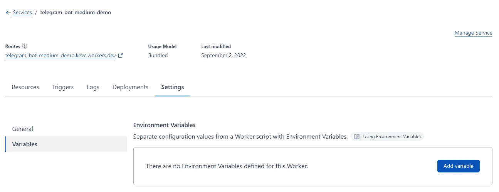

# 我如何完全免费地部署我的电报机器人

> 原文：<https://blog.devgenius.io/create-and-deploy-your-telegram-bot-here-entirely-free-757d5d5e8099?source=collection_archive---------0----------------------->


照片由[拉娜码](https://unsplash.com/@lanacodes?utm_source=medium&utm_medium=referral)在 [Unsplash](https://unsplash.com?utm_source=medium&utm_medium=referral)

在本教程中，我将向您展示如何部署您的电报机器人，并保持它 24/7 运行完全免费。

# 介绍

对于电报机器人的开发，通常有两种方法:轮询和 webhooks。许多教程使用 NodeJS 或 Python 服务器的轮询方法，轮询(或拉)bot 收到的任何消息到服务器。这意味着为了部署它，我们需要一台 24/7 全天候运行的服务器来不断轮询更新。没有多少免费选项可以让服务器保持 24/7 运行，所以这是一个问题。

今天，我们将探讨 webhooks 的选项。为您的 telegram bot 设置一个 webhook 意味着无论何时您的 bot 接收到一条新消息，telegram 都会将该更新发送到您预定义的 webhook 端点。从我们的自定义端点，我们可以自由地做任何我们想做的事情，因为我们知道我们的机器人已经收到了一条消息，我们可以对它做出响应。

例如，当我们的机器人收到来自用户的消息时，telegram 会向我们预定义的端点发送一个 POST 请求，其中包含关于该消息的信息(用户、消息文本、时间等)。我们的端点将接收带有有效负载的 POST 请求，这样我们就可以响应用户了。

但是这是否意味着我们也需要一个服务器来接受这些 POST 请求呢？是的，但是我们不需要服务器全天候运行。相反，我们将使用无服务器功能。有很多免费的无服务器函数可供选择:Cloudflare Workers，Vercel 无服务器函数等。

在本教程中，我们将利用 Cloudflare Workers 创建一个 POST 端点，并将其设置为 Telegram bot 的 webhook。

目录:

1.  创建新的 Cloudflare 工作线程
2.  为我们的电报机器人设置 webhooks

# **1。创建新的 Cloudflare 工作进程**

*   导航到[dash.cloudflare.com](http://dash.cloudflare.com)并登录(或注册)
*   在侧边栏上，点击“工人”
*   单击“创建服务”创建您的新员工
*   为您的新员工输入一个名称，并选择“HTTP 处理程序”作为启动程序，然后单击“创建服务”


“创建服务”

*   创建服务后，单击“快速编辑”直接在浏览器中编辑您的员工


*   现在，在您的编辑器中，您应该会看到新 Cloudflare worker 的默认代码。

```
addEventListener("fetch", event => {
  event.respondWith(handleRequest(event.request))
})async function handleRequest(request) {
  return new Response("Hello world")
}
```

我们将如何处理传入请求的逻辑将在`handleRequest`函数中完成。

在这一点上，知道电报将发送给我们的有效载荷是什么是很好的。

```
{
  "update_id": 1140,
  "message": {
    "message_id": 73,
    "from": {
      "id": "id of user",
      "is_bot": false,
      "first_name": "name of user",
      "username": "username of user",
      "language_code": "en"
    },
    "chat": {
      "id": id of chat,
      "first_name": "name of user",
      "username": "username of user",
      "type": "private"
    },
    "date": 1662102031,
    "text": "hi"
  }
}
```

从有效载荷中，我们能够知道用户是谁，用户正在发送的聊天内容是什么(这对群聊很重要)以及消息文本是什么。首先，让我们的机器人回显用户的消息，但是在消息的末尾添加一个‘over’。

```
async function handleRequest(request) {
  if (request.method === "POST") {
    const payload = await request.json() 
    // Getting the POST request JSON payload
    if ('message' in payload) { 
      // Checking if the payload comes from Telegram
      const chatId = payload.message.chat.id
      const text = payload.message.text + " over"
      const url = `[https://api.telegram.org/bot${API_KEY}/sendMessage?chat_id=${chatId}&text=${text}`](https://api.telegram.org/bot${API_KEY}/sendMessage?chat_id=${chatId}&text=${text}`)
      const data = await fetch(url).then(resp => resp.json()) 
      // Calling the API endpoint to send a telegram message
    }
  }
  return new Response("OK") // Doesn't really matter
}
```

在这个代码片段中，我们检查传入的请求是否是 POST，以及有效负载是否包含来自 Telegram 的重要信息。我们从有效载荷中获取 chatId 和文本，并生成一个惟一的 URL，我们将调用 GET to，它将通过我们的 bot 程序发送一条消息。还缺一样东西，就是`${API_KEY}`。这是 bot API 令牌将被替换的地方，我们可以通过 Cloudflare Workers 设置来设置该值。

*   点击“保存和部署”,然后退出编辑器，返回您员工的控制面板。
*   在设置面板下，点击变量。在这里，您可以为 worker 设置环境变量。



*   点击“添加变量”,输入变量名为`API_KEY`,输入值为机器人的 API 令牌，保存您的设置。

# **2。为我们的 bot 设置 web hooks**

现在，我们的端点已经准备好了，剩下要做的就是将 bot 的 webhook 设置为自定义端点。

使用我们的 bot API 令牌和我们的新 worker 的 URL(应该以 workers.dev 结尾)，将值替换到这个 URL 中，然后简单地将其复制并粘贴到您的浏览器中，并输入

```
https://api.telegram.org/bot<replace with bot api token>/setWebhook?url=<replace with our worker url>
```

如果你把这看作是一种回应，那你就万事俱备了！

```
{"ok":true,"result":true,"description":"Webhook was set"}
```


现在，当你跟你的机器人打招呼时，它应该回应‘你好完毕’！

# **那不是很容易吗？**

所以现在你已经设置了你的电报机器人，它可以 24/7 完全免费运行！你可以定制这段代码，让你的机器人做你想做的任何事情。在未来的教程中，我将向您展示如何使用 Cloudflare KV 为您的机器人设置一个简单的数据库，以保留用户数据并增强您的机器人的功能！这真的很简单，所以如果你想看更多，就喜欢这个教程吧！