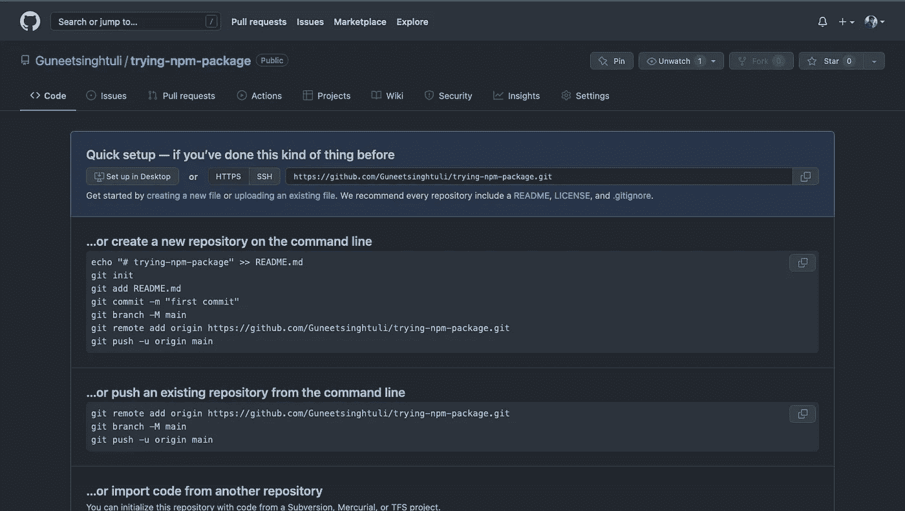

# 与我一起创建并发布您的第一个 npm 包

> 原文：<https://blog.devgenius.io/create-and-publish-your-first-npm-package-with-me-678758b29ebe?source=collection_archive---------12----------------------->

到目前为止，我们都已经使用了这么多的 NPM 软件包，但是还没有创建任何一个，可以说我们已经创建了这个软件包。**所以是时候拿出我们的枪，砸碎这辆红色的 NPM 了。**


所以让我们从在 GitHub 上创建一个空存储库开始，这样我们也可以在上面发布代码。我将把我的回购命名为 Trying-npm-package，你可以在这里找到回购。



现在使用`**git clone**` 命令将其克隆到您的本地环境中。克隆它之后，我们需要使用`**npm init**` *在存储库中初始化 npm。我不喜欢使用-y 标志。*

这个文件可以像一个函数一样简单，只需要导出到你能想到的任何地方。因此，为了使它更简单，我会去一个简单的文件有一个`**class**`被导出。

首先，我们可以安装我的 axios 包所需的所有依赖项，我们可以使用

> npm i axios

安装完依赖项后，我们将创建一个名为 API 的类，它有一个**构造函数**和一个 **get 方法** **(向端点发出 get 请求)**

现在我们已经准备好了这个包，但是我们需要在发布它之前测试它。我们可以使用

```
**npm link**
```

这将创建到当前工作 repo 的本地链接，我们可以创建一个测试文件夹(确保它在当前包之外)，为了使用我们在包中创建的类，我们可以这样使用它

现在，要使用我们创建的本地链接将包带到测试位置，我们可以使用命令

```
npm link <name-of-package>
```

这将创建一个 node_modules 文件夹，其中包含我们之前编写的所有代码。如果测试成功，我们可以尝试使用以下命令将包发布到 npm

> **国家预防机制发布**

您可能会看到 404 错误，这意味着您可能需要首先使用命令登录

> **npm 登录**

再试一次，击倒对手，NPM 就完了。你也可以试着在 Github 上发布你的代码，并在评论区分享，让我知道你用 npm 包创造了哪些很酷的东西。

> 我希望你喜欢它，并从这个故事中学到很多，如果你不想错过我发表另一个故事的任何时间，请确保关注我并订阅以获得电子邮件更新。

*你可以在*[***Twitter***](https://twitter.com/Guneetsingh02)*和*[***LinkedIn***](https://www.linkedin.com/in/guneetsinghtuli/)*上关注我，在那里我可以分享更多信息。*