# 使用 Azure PowerShell 创建 Azure Automation 帐户(使用托管身份)和 Runbooks，并通过 Azure DevOps 管道进行部署。

> 原文：<https://blog.devgenius.io/create-azure-automation-account-using-managed-identity-and-runbooks-using-azure-powershell-and-e43beafb6668?source=collection_archive---------10----------------------->

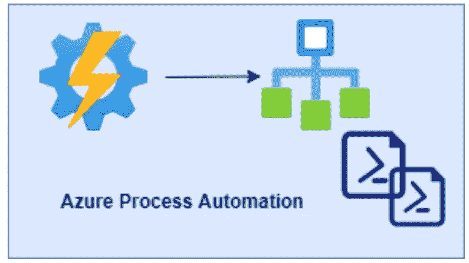

Azure 自动化和操作手册

Azure Automation 是最受欢迎的自动化工具之一，专为解决流程自动化、配置管理和更新管理方面的日常运营挑战而设计。

Azure Automation 的一些有用场景是:

*   如果你想自动化在 Azure 上创建虚拟机的过程。
*   或者更新/修补虚拟机
*   在一天结束时取消虚拟机的分配
*   将各种 Azure 服务向下和向上扩展到不同的 SKU，以帮助您降低运营成本和节省时间。

这个清单还不止这些..

在这篇文章中，我将主要讨论流程自动化，这是一种使用 PowerShell 或 python 脚本自动化 azure 管理或编排流程的方法。创建的运行手册是用于编写逻辑的 PowerShell 或 python 脚本。微软文档中描述了几种类型的操作手册 [Azure Automation 操作手册类型|微软文档](https://docs.microsoft.com/en-us/azure/automation/automation-runbook-types)

我将重点介绍如何使用**托管身份**创建自动化帐户，以及如何以编程方式创建和运行**Azure Automation PowerShell run books**。

PowerShell runbooks 基于 Windows PowerShell。您可以使用 Azure 门户中的文本编辑器直接编辑 runbook 的代码。您也可以使用任何离线文本编辑器，并将 runbook 导入 Azure Automation。

# 使用运行方式帐户与托管身份的 Azure 自动化帐户

无论何时创建运行方式帐户，都会在 Azure Ad 中的应用程序注册下注册一个新的应用程序，并将生成自签名证书，有效期为一年。

因此，每年在证书到期前更新证书会产生开销，以防止自动化帐户停止工作。

**运行方式帐户**需要的一些权限是，

1.  订阅级别的用户访问管理员(创建运行方式帐户和续订证书时需要)
2.  在 Azure AD，应用程序管理员(用于创建服务主体)
3.  贡献者对自动化帐户的访问

现在，微软能够将自动化帐户配置为使用**托管身份**，这是创建帐户时的默认选项。有了 is 功能，自动化帐户可以像它自己一样向 Azure 进行身份验证，而不需要交换任何凭据。并且这消除了更新证书或管理服务主体的开销。

**托管身份**可以由系统分配，也可以由用户分配。现在，默认情况下，每当创建新的自动化帐户时，系统分配的受管身份都会启用。

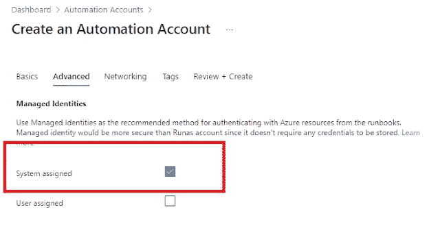

# 以编程方式创建自动化帐户并导入运行手册

本节使用 Azure PowerShell 脚本创建以下内容:

1.  使用系统分配的托管身份创建自动化帐户
2.  创建角色分配以授予自动化帐户权限
3.  创建自动化计划(一次/重复)
4.  创建和导入操作手册
5.  计划运行手册

# GitHub 知识库

您可以从我的 GitHub repo 访问所有代码和脚本:

[https://github.com/Pujago/AzureRunbooks](https://github.com/Pujago/AzureRunbooks)

# 使用系统分配的托管身份创建自动化帐户

这可以简单地用一行代码完成:

> **New-AzAutomationAccount-Name＄automation account Name-Location＄Location-resource group Name＄resource group Name-AssignSystemIdentity**

完整的脚本位于我的 GitHub 存储库中:

完整的脚本位于我的 GitHub 存储库中:

【https://github.com/Pujago/AzureRunbooks/tree/main/templates 

**脚本名:createAutomationAccount.ps1**

以上脚本将创建启用了系统分配的受管身份的自动化帐户:

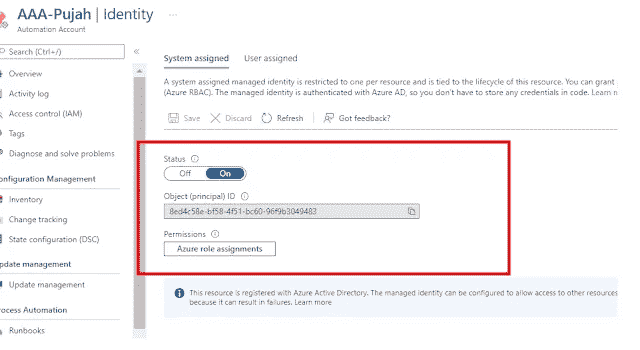

# 创建角色分配以授予自动化帐户权限

在使用系统分配的托管身份进行身份验证之前，您需要在目标 Azure 资源上为该身份分配适当的角色。例如，为了启动或停止 Azure VM，托管身份应该被分配启动或停止 VM 的适当权限。

在前面的屏幕截图中，如果您单击“Azure 角色分配”，您将看到没有找到角色分配，如下图所示:

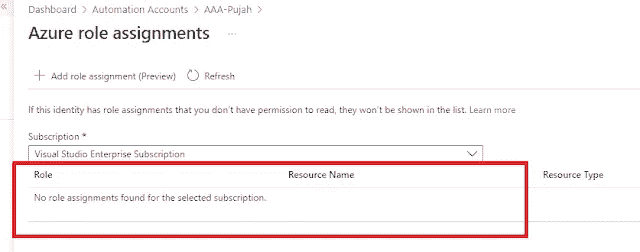

为了创建角色分配，我使用了下面的命令:

> **New-azrole assignment-ObjectId $ automation object-role definition name $ role definition-Scope $ Scope**

其中，可以使用下面的命令获得 objectId:

> **$ automation object =(Get-AzAutomationAccount-Name $ automation account Name-resource group Name $ resource group Name). identity . principal id**

例如，要授予参与者对资源组的访问权限，您可以使用:

> **New-azrole assignment-ObjectId $ automation object-role definition name " Contributor "-Scope/subscriptions/<subscription id>/resource groups/<您的资源组名称>**

**注意:在实际场景中，遵循最低特权原则，谨慎分配仅执行您的操作手册所需的权限。**

完整的脚本位于我的 GitHub 存储库中:

[https://github.com/Pujago/AzureRunbooks/tree/main/templates](https://github.com/Pujago/AzureRunbooks/tree/main/templates)

**脚本名称:createRoleAssignment.ps1**

一旦分配了角色，您将在 Azure 门户中看到该角色:

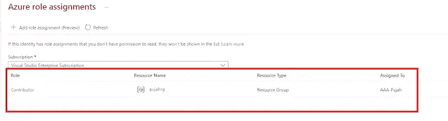

# 创建和导入操作手册

现在，为了创建操作手册，PowerShell 脚本中使用了 3 个命令:

New-AzAutomationRunbook —这将创建一个空的 Runbook。

**Import-AzAutomationRunbook**—这将导入包含 PowerShell 脚本命令的 Runbook

**发布-AzAutomationRunbook** —这将发布 Runbook

下面的代码片段用于**从特定位置导入所有的操作手册:**

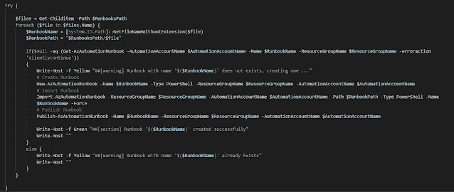

runbook 的名称将与 PowerShell 脚本的文件名相同。

完整的脚本位于我的 GitHub 存储库中:

[https://github.com/Pujago/AzureRunbooks/tree/main/templates](https://github.com/Pujago/AzureRunbooks/tree/main/templates)

**脚本名:createandimportrunbooks . PS1**

在我的 GitHub 存储库示例中，我在 GitHub 存储库的位置 **runbooks/rgs** 创建了 2 个 PowerShell 脚本文件。**createandimportrunbooks . PS1**将这些 PowerShell 脚本(GetAllResourceGroups.ps1 和 GetAResourceGroup.ps1)作为 Runbooks 从 runbooks/rgs 位置导入。runbooks 的名称将是— GetAllResourceGroups 和 GetAResourceGroup

在执行脚本时，可以在门户中查看操作手册，如下所示:

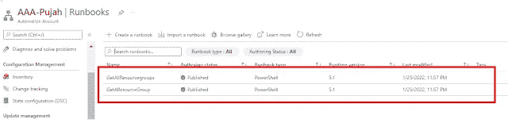

# 创建自动化计划(一次/重复)

现在，自动化帐户已创建，并具有受管身份的适当权限。此外，还会创建、导入和发布运行手册。

接下来，让我们创建一个自动化计划，该计划将由在上一步中创建的运行手册使用。

计划可以是“重复”或“一次”。

下面的代码片段创建了“重复”计划:

这将创建一个从周一到周五每天晚上运行的计划。

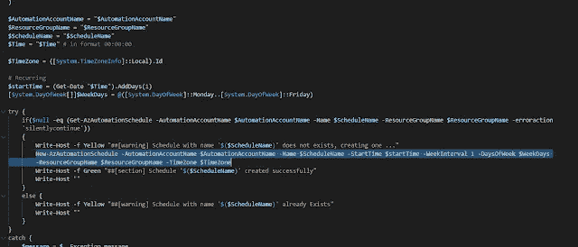

对于非重复计划，命令中仅提供小时间隔:

> **New-AzAutomationSchedule-automation account Name $ automation account Name-Name $ schedule Name-start time $ start time-hour interval 1-resource group Name $ resource group Name-time zone $ time zone**

完整的脚本位于我的 GitHub 存储库中:

[https://github.com/Pujago/AzureRunbooks/tree/main/templates](https://github.com/Pujago/AzureRunbooks/tree/main/templates)

**名称:createSchedule.ps1**

成功执行脚本后，将按如下方式创建重复计划:

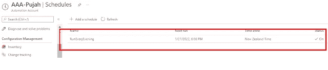

# 将运行手册添加到计划中

最后一步是向时间表中添加一本操作手册。下面的脚本代码片段调用**Register-AzAutomationScheduledRunbook**命令将 Runbook 添加到时间表中。

要将多个 runbooks 添加到计划中，请调用带有 **-RunbooksName** 参数的脚本，其名称用逗号分隔，如下所示:

**-run books name " GetAllResourcegroups，getresourcegroup "**

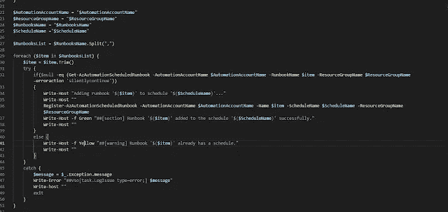

完整的脚本位于我的 GitHub 存储库中:

【https://github.com/Pujago/AzureRunbooks/tree/main/templates 

**脚本名:registerrunbookstoaschedule . PS1**

成功执行上述脚本会将运行手册添加到计划中，并可在门户网站中查看，如下所示:

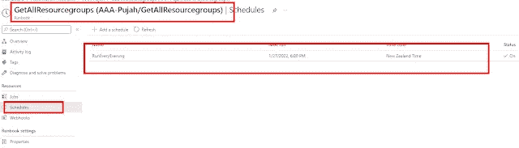

# 使用 Azure DevOps 管道运行脚本

虽然这些脚本可以从您的本地机器上执行，但我更喜欢通过管道自动运行脚本。

对于这一部分，我不得不假设，你对 Azure DevOps 管道很熟悉并且很有经验。

要创建管道:

1.  在 Azure DevOps 中创建存储库(或者您可以使用自己的 Git-Hub 存储库)
2.  在 Azure DevOps 中创建服务连接
3.  使用存储库创建 YAML 管道

我添加了一个 YAML 管道文件，用于在 GitHub 存储库中调用这些脚本:

**文件名:CreateRunBooks.yml**

可以改进管道，使其在可重用性方面更加通用，我在这个演示中保持了简单。只需更新 variables.yml 文件中的服务连接和参数

请随时在我的帖子上留下您的建议和评论:)

*原载于*[*https://www.leogether.com*](https://www.leogether.com/2022/01/create-azure-automation-account-using.html)*。*