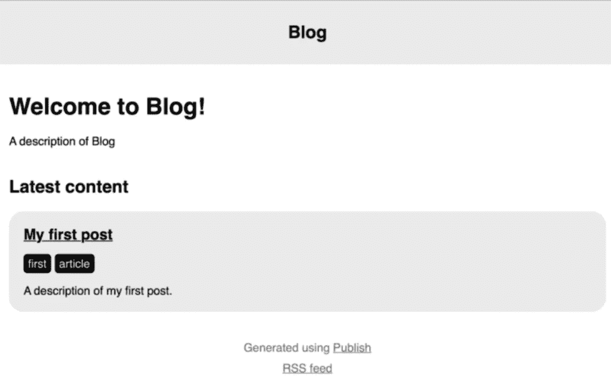
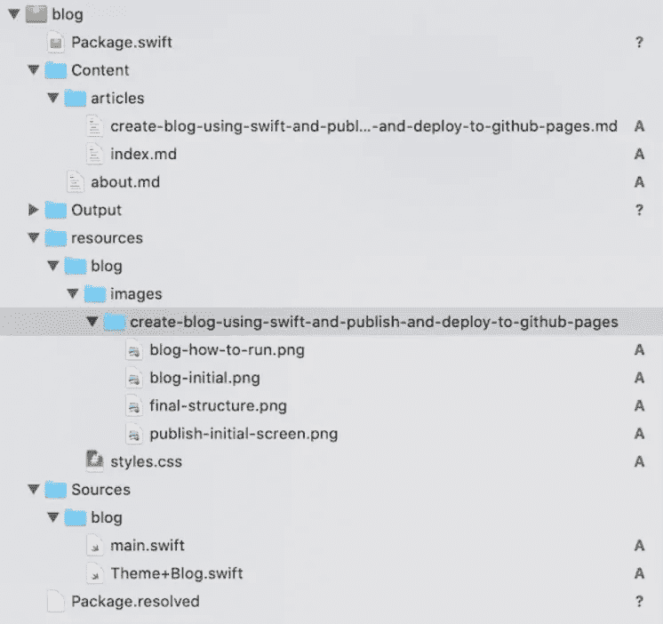

# 使用 Swift 和 GitHub 页面创建博客

> 原文：<https://blog.devgenius.io/create-blog-with-swift-github-pages-53382aa3e824?source=collection_archive---------5----------------------->

## 编程；编排

## 如何使用 Swift 和 Github 页面轻松创建个人博客


照片由[普拉蒂克·卡蒂亚尔](https://www.pexels.com/ru-ru/@prateekkatyal?utm_content=attributionCopyText&utm_medium=referral&utm_source=pexels)拍摄:[派克斯](https://www.pexels.com/ru-ru/photo/2740954/?utm_content=attributionCopyText&utm_medium=referral&utm_source=pexels)

首先，先说我已经有一个博客了，它在 WordPress 上，我已经厌倦了所有关于版本更新、插件、黑客等等的大惊小怪。最可悲的是，它扼杀了继续发展它的欲望。


作者:@iamdevloper

我的目标是与世界分享我的想法和发现，但仍然完全控制我的网站。在我能写一篇文章之前，我没有另外的 8-10 年来学习 PHP。

对我来说，最近 [Github Pages](https://pages.github.com/) 已经提供了存储简单站点的能力。

没有数据库和 PHP，一个静态的网站就像好的老网站。依我看，对于博客来说，这是完美的。

此外，由于部署过程将通过 GitHub，因此将有所有更改的透明历史记录，并完全控制网站上的真实内容:木马和其他邪恶的灵魂不会通过。

[](https://pages.github.com/) [## GitHub 页面

### 使用你最喜欢的文本编辑器，在你的项目中添加一个 index.html 文件:Hello World I hosted with GitHub Pages…

pages.github.com](https://pages.github.com/) 

但是他们建议使用用 Ruby 编写的静态站点生成器 Jekyll。我仍然想在您日常使用的语言中磨练我的技能，所以作为替代，我从 John Sundell 那里获得了一个用 Swift 编写的新的静态生成器。

[](https://jekyllrb.com/) [## Jekyll *简单的、支持博客的静态网站

### 厌倦了和托管公司打交道？GitHub 页面由 Jekyll 提供支持，因此您可以使用…

jekyllrb.com](https://jekyllrb.com/) 

我们有三件事要做:

1.  在 gitрub 页面上创建博客。
2.  了解如何使用 Publish。
3.  将您的新博客上传到 gitрub Pages。

# 在 Github 页面上创建博客

官方说明可在 https://pages.github.com 获得。

主要条件是博客登录名必须与您的 GitHub 登录名匹配(在我的例子中，它是 sparklone)。我们的行动:

*   登录 GitHub
*   前往[**https://github.com/new**](https://github.com/new)，
*   输入 **login.github.io** 作为存储库名称，在我的例子中是 spark lone . github . io；
*   确定会是**【公开】**；
*   点击**“创建资源库”**；
*   就这样，我们的博客已经可以在 **https://login.github.io** 上看到了。

但到目前为止，网站上没有任何文件。让我们继续讨论第二点。

# 如何使用发布

Publish 是一个用 Swift 编写的静态站点生成器，允许你在生成站点时构建任何逻辑:标签、站点地图、RSS、特定链接……—我们有足够想象力的一切。我对未来的一个想法是尝试用两种语言写文章，这样定制的模板可以理解这一点，并在文章中插入一个开关。我不知道 hands 是否会走到这一步，但作为一个想法——很有趣。

我更喜欢通过 git 直接安装，创建了***~/Developer/tools***文件夹，在那里执行:

```
git clone https://github.com/JohnSundell/Publish.git
cd Publish
make
```

接下来，我创建了一个文件夹来存储我的站点(更准确地说，是它的生成器的源代码)——在我的例子中是***~/Developer/my/blog***。在该文件夹中，运行命令

```
publish new
```

这将创建一个新站点，只需在控制台`publish`中运行即可找到该命令的选项列表。

`publish run`将用 python 编译所有的源代码并启动 web 服务器(如果你用 Ctrl + C 中断，web 服务器不会死，你必须在进程中摸索才能杀死 Python)。

第一次构建需要一些时间(必要的库被添加，所有东西都被编译)，在随后的发布中`publish run`一切都发生得更快。

在浏览器中打开[**http://localhost:8000**](http://localhost:8000/)，看看我们得到了什么样的站点:



发布博客欢迎页面

不是很多，但我们实际上没有做任何事情来期待更多的东西。

我将离开风格设置和其他点稍后。今天，我看到我面前有以下任务:

1.  为我们的站点进行初始生成器设置。
2.  更改记录的路径并自定义菜单。
3.  为源文件添加高亮显示并创建您自己的主题。

# 我们站点的初始发电机设置

让我们看看 Publish 给我们带来了什么。文件夹里面，会有一个 ***包*。 *swift* 截图显示应该是什么结果。**

测试岗位在 ***内容/岗位/首发岗位. md*** 。让我们检查一下我们可以改变什么，这将反映在网站上:我们将更正 first-post.md 中的文本(您可以更改日期、标签、描述和内容本身)。

在 **Xcode** 中，选择 Mac 作为你要启动的目标，运行项目。


之后我们再刷新一下网页[**http://localhost:8000**](http://localhost:8000/)**。**

# **我们改变条目的路径，并定制菜单**

**为什么马上做这件事很重要？如果你在填写了一些文章后决定改变路径，这些页面的链接将会失效。这不是你自己的服务器/ VPS，从旧链接重定向到新路径会很成问题。并非不可能(例如，这里有一个 [Jekyll](https://github.com/jekyll/jekyll-redirect-from) 的插件)，但是如果你能避免的话，为什么要在将来给自己制造麻烦呢？**

**默认情况下，所有帖子都在*帖子*文件夹中。考虑到以后你要打类别，而*帖子*是常用名，不如把文件夹改名为 ***文章*** 。关于 页面加一个 ***也无妨。但是我们的生成器对此一无所知。*****

**在 ***中把****改成***

***下面我们将文件 ***about.md*** 添加到 ***Content* 文件夹**中，填写一些自己的信息。***

***顺便说一下，我正在用 XCode 写这篇文章，编辑**。md** 文件，并定期启动项目以查看它在浏览器中的外观。***

***我犹豫了很久是否要为**的日期而烦恼。md** 文件，即不叫 **my-article.md** ，而是比如**2020–07–10-my-article . MD**。然而我决定放弃这个想法:T48。md 文件本身有元数据(日期字段)，如果需要，这将允许您在将来自动添加日期。并且您不必监控文件名中日期的正确性，此外，如果文件名有一个日期，而其中的元数据是另一个日期，这将使您避免不一致。***

***这个解决方案的缺点，我明白了，就是假设将来可能会有**MD**-文件的名字冲突，但还是，这种可能性不大，而且，我们会在创建帖子的时候发现这一点，而不是保存。***

# ***向源文件添加突出显示***

***发布生成器的作者还编写了 [Splash](https://github.com/JohnSundell/Splash) 库，它允许您突出显示源代码。它在 Swift 包管理器中作为一个包连接。***

***[](https://github.com/JohnSundell/Splash) [## 约翰森德尔/飞溅

### 欢迎使用 Splash -一个快速、轻量和灵活的 Swift 语法荧光笔。它可以用来生成代码样本…

github.com](https://github.com/JohnSundell/Splash) 

打开**的*包*。 *swift* 和**加支持，其实需要加 2 行。这是我得到的:

为了在生成过程中开始应用高亮显示，您需要连接 ***main* 中的插件。*雨燕*** :

```
try Blog().publish(withTheme: .foundation)
```

我改成了

```
try Blog().publish(
    withTheme: .foundation,
    plugins: [.splash(withClassPrefix: "")]
)
```

如果我们现在生成站点，我们将看到带有代码的块将被突出显示，但不是突出显示:这是因为您需要添加 [CSS](https://github.com/JohnSundell/Splash/blob/master/Examples/sundellsColors.css) ，我们将使用插件作者默认使用的那个。

但是问题来了:在哪里添加这个 CSS？如果你深入研究源代码，你会发现这一切都是在主题层次上解决的。我们的主题是标准的: ***foundation*** ，在于路径[Sources/Publish/API/Theme+foundation . swift](https://github.com/JohnSundell/Publish/blob/master/Sources/Publish/API/Theme%2BFoundation.swift)下的 *Publish* 包本身。

在我的项目(博客)里面 ***main.swift*** 所在的文件夹里，我创建了一个类似的文件***Theme+Blog . swift****。*同样在资源文件夹里面，我创建了一个博客文件夹，把 ***样式*放进去。 *css*** 文件里面，我把 css 内容从[基础](https://github.com/JohnSundell/Publish/blob/master/Resources/FoundationTheme/styles.css)主题，和 CSS 从[飞溅](https://github.com/JohnSundell/Splash/blob/master/Examples/sundellsColors.css)。是的，最好是分开，或者甚至把主题放在一个单独的包中，但是我们不要提前把事情复杂化。

总之，我必须以这种方式更改文件中的主题:

如果我们添加另一个 CSS，我们不仅要将它添加到`resourcePaths`，还要添加到每个`head`页面，这是我目前绝对不想做的。

`.head(for: item, on: context.site, stylesheetPaths: ["/styles.css", "/splash.css"]),`

因此，现在我的项目文件结构如下所示:



# 将您的博客上传到 GitHub 页面

所以，让我们使用内置的发布工具来上传我们的博客。在 ***main.swift*** 中添加

`.**deploy(using: .gitHub("login/login.github.io", useSSH: false))**`

所以我补充道:

我们最后一次检查一切正常。最后一点——在我看来，在 git 中存储我们的存储库以及模板、如何构建站点、输出文件夹的内容是没有意义的，为此我们将有一个单独的存储库，只需***log in . github . io***如果您同意，我们将从**中排除此文件夹。gitignore** 通过在末尾添加 ***/Output*** 行。如果一切正常，在控制台中执行(从我们执行`publish new`的文件夹)

```
git add .
git commit -m "post title or some description"
git push origin
publish deploy
```

一分钟之内，GitHub 页面将获取您的更改，一切都将在线。

恭喜你！🙂

# 阅读更多

*如果您觉得本文有帮助，请单击💚或者👏按钮或分享关于脸书的文章，这样你的朋友也可以从中受益。****