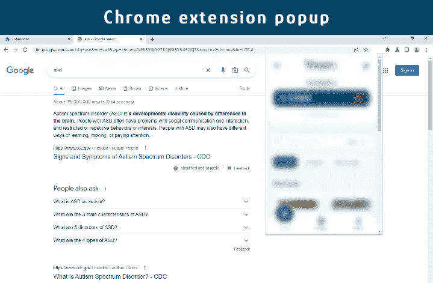
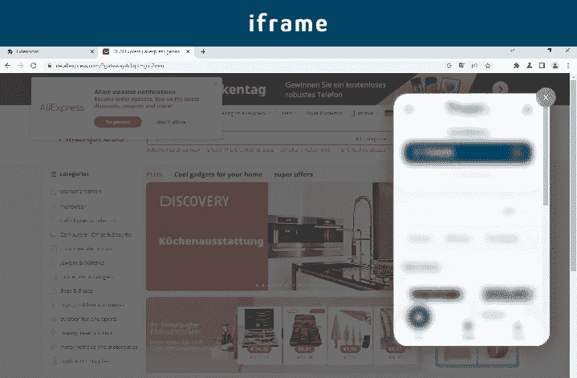

# 使用角度创建铬延伸

> 原文：<https://blog.devgenius.io/create-chrome-extension-using-angular-5ae8ad48b39d?source=collection_archive---------1----------------------->


Artem Maltsev 在 [Unsplash](https://unsplash.com?utm_source=medium&utm_medium=referral) 上拍摄的照片

本教程基于 chrome 扩展清单版本 3 (MV3)和 Angular 版本 2+ (2、3 和…)。如果你还没有使用过 manifest 版本 3，你可以按照[这个教程](https://developer.chrome.com/docs/extensions/mv3/mv3-migration/)从 manifest V2 迁移到 V3。

在本文结束时，您将能够在一个 **chrome 扩展弹出框**或一个**对话框**中演示您的 Angular 应用程序(通过使用一个由 chrome 扩展内容脚本文件启动的 [iframe](https://www.w3schools.com/tags/tag_iframe.ASP) )。

# 有角度的应用配置

首先，创建和开发你想要的角度应用程序。这意味着，当你开发一个 Angular 应用程序时，不要考虑任何与 chrome 扩展相关的配置，一如既往地开发你的应用程序。

完成 Angular 应用程序的开发后，您只需要做 2 处修改，就可以准备将 Angular 应用程序部署到 chrome 扩展中。

1.  在角度应用 index.html 内改变应用的**“基本 href”**。

```
<base href="/app/index.html">
```

角度应用的全景图**index.html**:

```
<!DOCTYPE html>
<html>
<head>
    <meta charset="utf-8" />
    <title>Application Title</title>

    <!--   <base href="/" />   --> // Remove this 
    <base href="/app/index.html"> // Use this instead of the above line

    <meta name="viewport" content="width=device-width, initial-scale=1" />
    <link rel="icon" type="image/x-icon" href="favicon.ico" />
</head>
<body>
<app-root></app-root>
</body>
</html>
```

我将在本文的下一部分解释“/app/index.html”的含义。

2.将以下配置添加到 Angular 应用程序路由配置中。

```
useHash: true
```

路由配置的完整视图:

```
RouterModule.forRoot(routes, { useHash: true })
```

现在，我们应该构建我们的 Angular 应用程序，并通过在 Angular 应用程序项目目录的终端中运行这个命令来生成 **dist** 文件夹。

```
ng build --prod
```

到目前为止，我们学习了如何将 Angular 应用程序配置为可在 chrome 扩展中部署。

下一步将向我们展示如何在 chrome 扩展中使用 Angular 应用程序。

# Chrome 扩展配置

首先，值得注意的是，本教程基于 chrome 扩展清单版本 3 (MV3)。

我们想在 chrome 扩展中的什么地方展示我们的角度应用？ **Chrome 扩展弹出**或**对话框**(使用 iframe)？

为了更好地理解，请看下面的图片，第一张图片与 chrome 扩展弹出窗口中的 Angular 应用程序相关，第二张图片与 chrome 扩展 iframe 中的 Angular 应用程序相关。



使用 chrome 扩展弹出菜单中的 Angular 应用程序



通过使用 iframe 在对话框中使用 Angular 应用程序

现在，让我们一步一步地解释每一个。

## 使用 chrome 扩展弹出窗口显示 Angular 应用程序

1.  在 chrome 扩展项目的根目录下创建一个文件夹，命名为 **app** 、**、**，然后从里面的 **dist** 文件夹中复制粘贴你的 Angular app 构建文件。**注意，仅粘贴角度应用分布文件夹**的内容。
    见下面的项目目录结构。

```
Sample Extension Project Directory

-- app
   - index.html
   .
   .
   .
-- assets
   - cancel.png
   - icon.png
-- popup
   - popup.js 
   - popup.html
   - popup.css
-- background.js
-- content_script.js
-- manifest.json
```

2.Config **manifest.json** 文件。

```
"manifest_version": 3,
"name": "Angular App",
"version": "1.0.1",
.
.
.
"action": {
  "default_icon": "assets/icon.png",
  "default_title": "Angular App",
  "default_popup": "app/index.html" // Please, look at the path carefully!
},
.
.
.
"web_accessible_resources": [
  {
    "resources": [
      "app/index.html"
      .
      .
      .
    ]
  }
]
```

这就是全部，现在你可以在 chrome 扩展弹出窗口中观看 Angular 应用程序。

## 使用对话框(iframe)显示 Angular 应用程序

在这种方法中，我们将在 chrome 扩展内容脚本文件中创建一个 iframe，然后将我们的 Angular 应用程序附加到这个 iframe，以在屏幕上的对话框(模态)中查看我们的应用程序。

为了实现这一点，我更喜欢创建一个通过唯一 id 打开和关闭对话框的函数(modal)。因此，有了这个功能，你可以创建和显示尽可能多的对话框，每个对话框都有一个唯一的 id。

1.  在 **content_script.js** 文件中创建 **openDialog()** 函数。该函数将获得 3 个参数:

*   **id** :对话框的唯一 id。
*   **选项**:您想要在对话框上设置的自定义选项。
*   **contentPath** :打开对话框后要立即显示的初始角度应用路径。注意，要在 chrome 扩展项目内的 Angular app 目录路径之后写初始 Angular app 路径。例如，如果 Angular app build 文件(dist 文件夹的内容)在 chrome 扩展根目录内的 **app** 文件夹下，那么 **contentPath** 就会是这样的: **"app/index.html#/"** 。或者，如果你想打开 Angular app 的一个具体路线(比如/store)，那么 **"/store 的**content path**(**Angular route path 要在对话框里面显示)会是这样的:**" app/index . html #/store "**。

```
const preModalContainerId = '_container-';

function openDialog(id, options, contentPath) {

    // First load dialog html file
    getHtmlContent(contentPath).then(modalHtmlContent => {

        // Create dialog overlay (a black layer behind the dialog body)
        const overlayElem = document.createElement("div");
        overlayElem.classList.add('myext-modal-overlay');
        overlayElem.setAttribute("id", id);

        // Create an iframe for showing dialog body (in Chrome extension the dialog should be used with iframe)
        const iframeElement = document.createElement("iframe");

        // Check if options has iframe class name for styling
        if (options?.iframe?.className) {
            iframeElement.classList.add(options.iframe.className);
        } else {
            iframeElement.setAttribute("style", "width: 100%; height: 100%;");
        }

        // Assign src for iframe to show Angular app
        iframeElement.src = chrome.runtime.getURL(contentPath);

        // If overlay has cancel button then prepare to clear iframe from screen by click on cancel icon
        if (options?.overlay?.hasCancelBtn) {
            const cancelButton = document.createElement("span");

            // if options has cancel button class name for styling
            if (options?.overlay?.cancelBtnImage) {
                cancelButton.style.backgroundImage = 'url(' + getAssetImgPath(options.overlay.cancelBtnImage) + ')';
            } else {
                cancelButton.innerText = '+';
            }

            // if options has cancel button class name for styling
            if (options?.overlay?.cancelBtnClassName) {
                cancelButton.classList.add(options.overlay.cancelBtnClassName);
            } else {
                cancelButton.classList.add('myext-modal-overlay-cancel-btn');
            }

            overlayElem.appendChild(cancelButton);

            jq(cancelButton).click(() => {
                closeDialog(id);
            });
        }

        // Set iframe as dialog overlay child
        overlayElem.appendChild(iframeElement);

        // Dialog body container
        const modalBodyContainerId = preModalContainerId + id;
        const modalBodyContainer = document.createElement("div");
        modalBodyContainer.classList.add('myext-modal-container');
        modalBodyContainer.setAttribute("id", modalBodyContainerId);

        // Add dialog html file content to dialog body container
        modalBodyContainer.innerHTML = modalHtmlContent;

        document.body.appendChild(overlayElem);
        document.body.appendChild(modalBodyContainer);
    });
}

function getAssetImgPath(assetPath) {
    return chrome.runtime.getURL(assetPath);
}
```

创建了常量变量 preModalContainerId ，并将其添加到对话框容器唯一 Id 的开头，以防止与同时在屏幕上打开 iframe 的任何其他 chrome 扩展发生冲突。

**openDialog()** 函数中的**getHtmlContent(***content path***)**函数是一个监听器函数，用于调用和加载 Angular 应用的初始路径，并返回如下 **HTML** 内容:

```
async function getHtmlContent(htmlFileUrl) {
    let fileUrl;

    // Check if html file url is decoded or not
    if (htmlFileUrl.includes('chrome-extension://')) {
        fileUrl = htmlFileUrl;
    } else {
        fileUrl = chrome.runtime.getURL(htmlFileUrl);
    }

    return await (await fetch(fileUrl)).text();
}
```

2.在 **content_script.js** 文件中创建 **closeDialog()** 函数。该函数将获得 1 个参数:

*   **id** :要关闭的对话框的唯一 id。

```
function closeDialog(id) {
    const overlayElem = document.getElementById(id);
    const modalBodyContainerId = preModalContainerId + id;
    const modalBodyContainer = document.getElementById(modalBodyContainerId);

    if (overlayElem) overlayElem.remove();
    if (modalBodyContainer) modalBodyContainer.remove();
}
```

3.在 chrome 扩展项目的根目录下创建 **style.css** 文件，并在其中粘贴以下代码。您可以根据需要更改每一项。

```
.myext-modal-overlay {
    display: inline-block;
    position: fixed;
    width: 100%;
    height: 100%;
    left: 0;
    top: 0;
    background: rgba(51, 51, 51, 0.7);
    z-index: 1000000;
}

.myext-modal-overlay-cancel-btn {
    position: absolute;
    width: 50px;
    height: 50px;
    left: 50px;
    top: 50px;
    font-size: 2.5em;
    color: white;
    background-color: #c57070;
    border-radius: 50%;
    display: flex;
    justify-content: center;
    align-items: center;
    transform: rotate(45deg);
    cursor: pointer;
    z-index: 1001;
    transition: all 0.25s ease-in-out;
}

.myext-modal-overlay-cancel-btn:hover {
    background-color: #b06565;
    box-shadow: 0 2px 10px #666;
}

.myext-modal-container {
    display: block;
    position: fixed;
    border-radius: 18px;
    overflow: hidden;
    box-shadow: 0 2px 50px #444;
    background: #1d222f;
    top: 50%;
    left: 50%;
    transform: translate(-50%, -50%);
    z-index: 2001;
}

.myext-iframe {
    position: fixed;
    border-radius: 35px;
    overflow: hidden;
    box-shadow: 0 2px 50px #444;
    top: 50px;
    right: 50px;
    height: 630px;
    width: 390px;
}

.myext-modal-overlay-custom-cancel-btn {
    position: absolute;
    width: 50px;
    height: 50px;
    top: 35px;
    right: 35px;
    border-radius: 50%;
    background-repeat: no-repeat;
    object-fit: cover;
    background-size: cover;
    display: flex;
    justify-content: center;
    align-items: center;
    cursor: pointer;
    z-index: 1001;
    transition: all 0.25s ease-in-out;
}

.myext-modal-overlay-custom-cancel-btn:hover {
    box-shadow: 0 2px 10px #666;
}
```

4.Config **manifest.json** 文件。

```
"manifest_version": 3,
"name": "Angular App",
"version": "1.0.1",
.
.
.
"content_scripts": [
  {
    "matches": [
      "<all_urls>"
    ],
    "js": [
      "content_script.js",
    ],
    "css": [
      "style.css"
    ],
    "run_at": "document_end",
    "all_frames": false
  }
],
"action": {
  "default_icon": "assets/icon.png",
  "default_title": "Angular App",
  "default_popup": "app/index.html" // Please, look at the path carefully!
},
.
.
.
"web_accessible_resources": [
  {
    "resources": [
      "app/index.html"
      "style.css",
      .
      .
      .
    ],
    "matches": [
      "<all_urls>"
    ]
  }
]
```

现在您可以调用 **openDialog()** 函数来创建并在屏幕上显示您的第一个对话框，如下所示:

```
const dialogOptions = {
    iframe: {
        className: 'myext-iframe'
    },
    overlay: {
        hasCancelBtn: true,
        cancelBtnClassName: 'myext-modal-overlay-custom-cancel-btn',
        cancelBtnImage: 'assets/images/cancel-btn.png'
    }
}

openDialog('example-id', dialogOptions, 'app/index.html#/');
```

此外，您可以像这样关闭上面的对话框:

```
closeDialog('example-id');
```

# 结论

现在，您可以在一个 **chrome 扩展弹出窗口**或一个**对话框**中演示您的 Angular 应用程序(通过使用一个由 chrome 扩展内容脚本文件启动的 [iframe](https://www.w3schools.com/tags/tag_iframe.ASP) )。

非常感谢您阅读这篇文章。