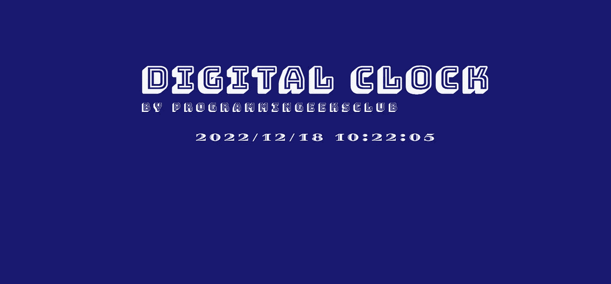
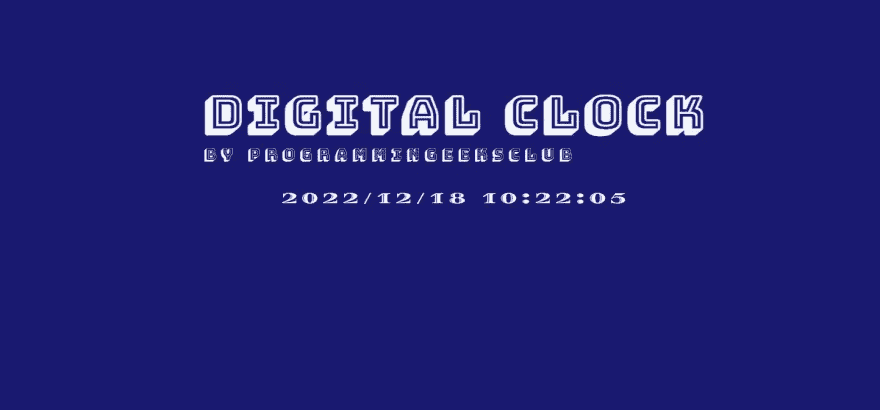
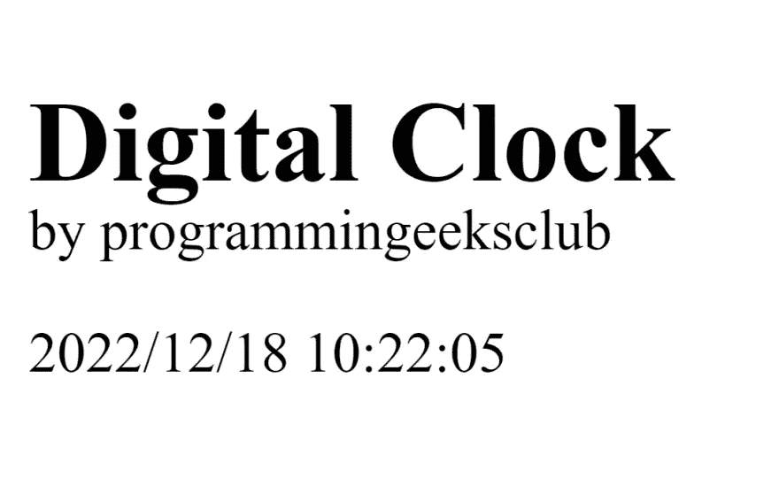

# 使用 JavaScript 创建数字时钟

> 原文：<https://blog.devgenius.io/create-digital-clock-using-javascript-9c01a3fe2f1c?source=collection_archive---------12----------------------->



在这篇文章中，我将使用 html、css 和 javascript 创建一个数字时钟。下面是我们将要创建的最终输出:



时钟的格式是 YYYY/MM/DD HH:MM:SS AM|PM，我们的时钟也相应地更新分钟秒、小时和日期。

要使用 JavaScript 创建数字时钟，我们可以使用 setInterval 函数每 1000 毫秒(1 秒)更新一次时间显示。我们将使用 Date 对象来获取当前时间，然后使用 getFullYear、getMonth、getDate、getHours、getMinutes 和 getSeconds 等方法来提取当前的年、月、日、小时、分钟和秒，所以现在我们知道我们必须做什么了。让我们开始吧，但在此之前，我将把代码分成三个部分:HTML、CSS 和 JavaScript，每个部分都有自己的文件，最后我们将 CSS 和 JavaScript 与 HTML 连接起来。

# HTML 代码

在数字钟目录中创建一个名为数字钟和 CD 的目录，并在任何代码编辑器中打开这个目录。

加载代码编辑器后，创建一个 html 文件 index.html，并将以下代码粘贴到该文件中:

```
<!DOCTYPE html>
<html lang="en">
<head>
    <meta charset="UTF-8">
    <meta http-equiv="X-UA-Compatible" content="IE=edge">
    <meta name="viewport" content="width=device-width, initial-scale=1.0">
    <title>Digital Clock Using HTML, CSS and JavaScript</title>
</head>
<body>
    <div class="box">
        <div>
            <span>
                <h1 style="margin-bottom: -30px;">Digital Clock</h1>
                by programmingeeksclub
            </span>
            <p id="digitalClock">2022/12/18 10:22:05</p>
        </div>
    </div>
</body>
</html>
```

到目前为止，我们还没有创建任何 css 文件。如果您仍然尝试在浏览器中打开该文件，您将看到以下输出:



# 添加 CSS

现在，让我们将 css 添加到我们的模板中，使其看起来更好，为此，在同一个目录中，让我们创建一个 style.css 文件，并将以下代码添加到其中:

```
@import url('https://fonts.googleapis.com/css2?family=Bungee+Shade&display=swap');
@import url('https://fonts.googleapis.com/css2?family=Diplomata+SC&display=swap');
body {
    background-color: midnightblue;
    color: whitesmoke;
    font-family: 'Bungee Shade', cursive;
    letter-spacing: 0.1em;
}
#digitalClock {
    font-size: 5px;
    margin-top: -5px;
    text-align: center;
    font-family: 'Diplomata SC', cursive;
}
.box {
    display: flex;
    align-items: center;
    justify-content: center;
}
h1 {
    font-size: 15px;
}
span {
    font-size: 5px;
}
```

现在，如果你看看输出，你会看到我们的数字时钟的新面貌:


# 添加 JavaScript

下面是 javascript 代码:

```
// make div gloabally accessable
var containingItem = document.getElementById('digitalClock');

// give us the zero leading values
function ISODateString(d) {
    function pad(n) {
        return n < 10 ? '0' + n : n
    }
    return d.getFullYear() + '-' +
        pad(d.getMonth() + 1) + '-' +
        pad(d.getDate()) + ' ' +
        pad(d.getHours()) + ':' +
        pad(d.getMinutes()) + ':' +
        pad(d.getSeconds()) + ' ' +
        pad(d.getHours() >= 12 ? 'PM' : 'AM')
}

let doc = () => {
    let t = new Date();
    containingItem.innerHTML = ISODateString(t);
}

// set interval 1 sec so our clock
// our clock output can update on each
// second
setInterval(() => { doc() }, 1000);
```

[实时预览](https://mavensingh.github.io/JavaScript/projects/create-digital-clock-using-javascript/)

如果你觉得这很有帮助，那么你可以给这篇文章一颗心，也检查我的网站，我上传更多这样的文章，你会发现它很有帮助。

[*原文贴在这里*](https://programmingeeksclub.com/create-digital-clock-using-javascript/)

*我的个人博客网址:* [*编程极客俱乐部*](https://programmingeeksclub.com/)
*我的脸书页面:* [*编程极客俱乐部*](https://www.facebook.com/profile.php?id=100086258693659)
*我的电报频道:* [*编程极客俱乐部*](https://t.me/dpgcl)
*我的推特账号:* [*库尔迪普辛格*](https://twitter.com/kusinghofficial)
*我的 Youtube 频道:【T28*