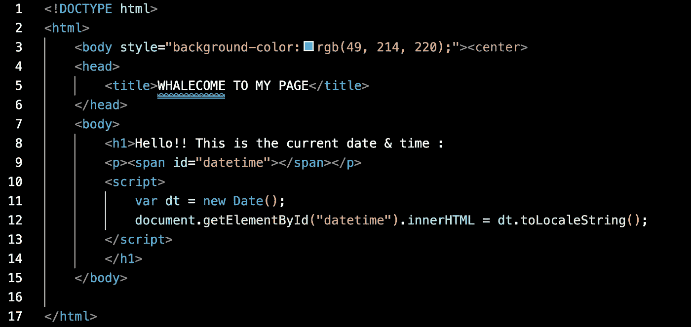

# 创建 Docker NGINX 映像并推送到 AWS ECR

> 原文：<https://blog.devgenius.io/create-docker-nginx-image-and-push-to-aws-ecr-a09522932d3d?source=collection_archive---------1----------------------->


**我们的场景:**

*您的团队需要您快速部署自定义映像，并在文件中编写快速脚本来完成任务。你将会做一个你以前可能没有做过的任务，所以如果你不知道怎么做的话，一定要研究一下。*

*1。使用 Nginx 创建您自己的映像，并添加一个文件来告诉您容器部署的日期*

*2。在端口 8080 打开的情况下部署您的容器*

*3。将您的容器数据保存到 AWS 弹性容器注册表(ECR)*

***我们开始吧！***

## 1|创建目录

在您选择的 IDE 中，您需要创建一个目录来保存您的 HTML & Dockerfile。为此，我们将使用以下命令来制作目录，然后将 cd 放入所述目录:

```
mkdir <DIRECTORY NAME>
cd <DIRECTORY NAME>
```

## 2|从注册表中提取图像

在我们的场景中，我们被要求使用 Nginx 来部署我们的网站，所以我们将从 Docker 注册中心获取 Nginx 的最新版本。


正如您从上图中看到的，拉取是成功的——但是，让我们验证我们拉取了最新的图像。


成功！现在我们可以进入下一步了！

## 3|创建 docker file & index.html

使用终端，确保更改目录`$ cd`并使用命令`$ touch Dockerfile`创建新文件。一旦创建完成，打开文件并开始工作！

接下来，我们将在同一个目录中创建我们的 index.html 文件。



## 4|从 Dockerfile 构建映像

为了开始构建 docker 容器，我们将运行以下命令:

```
docker build -t <nameofcontainer> .docker build -t nginx16 .
```

*注:“容器名后面的句点非常重要。这将确保我们在当前工作目录中查找文件。*


## 5|创建 Docker 容器

使用以下命令根据您的新映像创建容器:

```
docker run -d --name <container-name> -p 8080:80 nginx16docker run -d --name kinsey-container -p 8080:80 nginx16
```


通过使用命令`$ docker ps`，你可以看到我们的新容器已经完成了！现在，我们将确认我们的容器可以访问互联网(v 重要！！)通过使用以下命令:

```
curl localhost:8080
```


要查看您的网站，在浏览器中键入`[http://localhost:8080](http://localhost:8080/)`，您将看到一切正常:


## 6|将集装箱数据保存并推送到 AWS ECR

要将数据推送到 AWS ECR，我们必须首先创建一个存储库。使用以下命令初始化新的存储库:

```
aws ecr create-repository --repository-name <Project name> --region <region>aws ecr create-repository --repository-name docker-nginx16 --region us-east-1
```


我们可以通过查看 AWS 存储库控制台来确认存储库的创建:


接下来，我们将登录 Docker CLI，但我们需要先获取一个令牌。为此，运行以下命令并复制非常长的输出:

```
aws ecr get-login-password --region us-east-1
```

要完成登录，请输入以下命令:

```
aws ecr --region us-east-1| docker login -u AWS -p <Token Output> <ECR Repository URI>
```

登录成功！现在，我们将需要标记我们的图像，以便它可以被推送到我们的 ECR 存储库。我们将使用以下命令来完成这项工作:

```
docker tag <Image Name> <ECR Repository URI>docker tag nginx16 <ECR Repository URI>
```

使用以下命令推送 Docker 映像:

```
docker push <ECR Repository URI>
```

***哒哒！成功了！***


*看。在。你！*恭喜您，您刚刚创建了一个 Docker NGINX 映像并推送到 ECR。不要忘记使用以下命令删除终端中的容器和图像:

```
Remove ALL containers: docker   rm -f $(docker ps -a -q)Remove ALL images: docker   rm -f $(docker images -q)
```