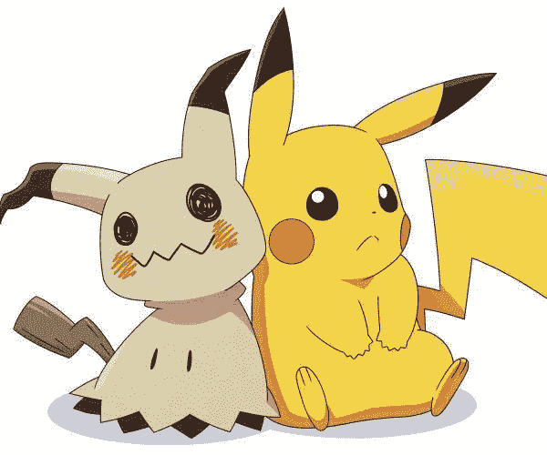

# 利用 Mockito 框架创建有效的测试代码

> 原文：<https://blog.devgenius.io/create-effective-test-code-by-leveraging-the-mockito-framework-1f25ee74db82?source=collection_archive---------6----------------------->

## 如何隔离依赖其他服务进行测试的组件



由 [Pinterest](https://www.pinterest.com/) 上的 [spyro](https://www.pinterest.com/The_Purple_Dragon/_saved/)

测试是编码中非常重要的一部分，📈测试驱动开发是一种非常流行的测试方式，在实际编写任何实际代码之前，先编写测试代码😲。

测试应该是隔离一个服务的一个功能，并确保它工作✅.然而，当这个服务依赖于其他服务时，可能很难隔离那个部分并验证任何错误都来自那个服务😞。

这是一个为什么我们需要嘲笑的例子

*   假设我们想测试服务 A，它将把一串字符串转换成一个句子。
*   服务 A 通过调用服务 b 来获取这个列表。
*   服务 B 中断并返回 null。
*   即使我们正确地实现了 A，我们对服务 A 的测试也会失败。

我们如何解决这个问题？

嘲讽！！！

通过模仿服务 B，我们可以告诉我们的测试当服务 B 被调用时返回什么，而不是依赖于 B 的实际实现。

# 个案研究

我们将测试服务 A，它打印出一个句子*“添加了{num1}和{num2}结果是{ sum }”*。服务 A 将调用📞服务 B 获取 num1 和 num2 的总和并放入句子中。

## 服务 A

服务 A (MyService)依赖于服务 B(未完成)。我们称*为 unfinished.addNumbers(a，b)* 。让我们看看我们现在已经在服务 B 中实现了什么。

## 服务 B

哦不！🙀看起来我们的服务 B 总是返回-1。那么当我们测试它的时候会发生什么呢？


通过[斯科特·格雷厄姆](https://unsplash.com/@sctgrhm)上[的 Unsplash](https://unsplash.com/)

## 测试(不带嘲讽)👎

毫不奇怪，我们得到这个…😕

```
org.junit.ComparisonFailure: 
Expected :Added 5 and 7 result is 12
Actual :Added 5 and 7 result is -1
```

这是意料之中的，因为 addNumbers()总是返回-1。但是即使懒惰的 dev😪 😴负责编码的 addNumbers()还没有完成，我们不应该被封锁🚫在我们的测试中。既然我们知道 addNumbers()的行为应该是怎样的，为什么我们不干脆*嘲弄一下呢？*

## 属国

为了嘲弄它，我们要用🥁🥁🥁·莫克托！！

```
<!-- https://mvnrepository.com/artifact/org.mockito/mockito-all -->
<dependency>
    <groupId>org.mockito</groupId>
    <artifactId>mockito-all</artifactId>
    <version>1.10.19</version>
    <scope>test</scope>
</dependency>
```

在您的 POM 文件中添加这个依赖项来开始。

## 测试(带嘲讽)👍

在这个测试中…

*   我们在第 11–12 行声明了一个未完成类的模拟。
*   然后，我们使用*mockito annotations . init mocks(this)*启动模拟，这将启动所有声明的模拟。并将我们的模拟注入到我们的 MyService 实例中(第 18–19 行)
*   最后，神奇的事情发生在第 28 行。我们告诉 Mockito，当这个未完成的实例使用存储在 *a (5)* 和 *b (7)* 中的值调用 *addNumbers()* 时，它应该返回 *a + b (12)* 。

该测试运行成功！耶！

⚠️NOTE⚠️:如果你想测试当模拟服务失败时会发生什么，你也可以使用。然后抛出()而不是。然后返回()。

# 何时嘲笑

当你有一个注入的对象时，应该使用模仿💉通过构造函数依赖于其他对象。使用该构造函数，我们可以注入我们的模拟对象，并指定我们希望它们如何表现，这样我们就可以确保我们编写的测试只关注我们想要测试的单个对象。这样一来，被模仿的对象是否有缺陷、未实现或未测试都无关紧要，因为 or test 不会使用这些对象的实际实现！我们告诉它什么，它就会做什么😃！

如果你对学习感兴趣📚关于 more 的更多信息，这里是到 Mockito 文档的链接。在那里，您可以了解更多关于验证方法调用和监视真实对象上的🕵️‍♀️的知识，以及其他一些很酷的事情。