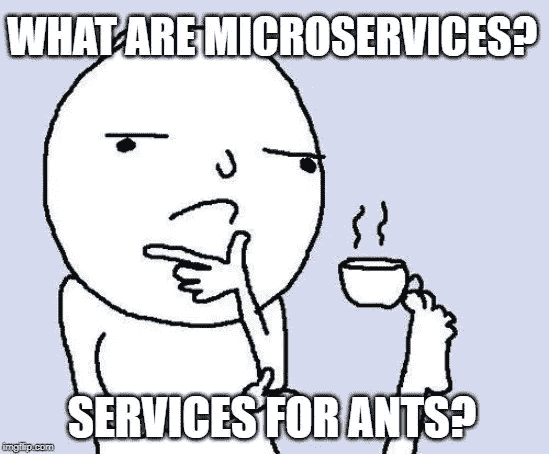
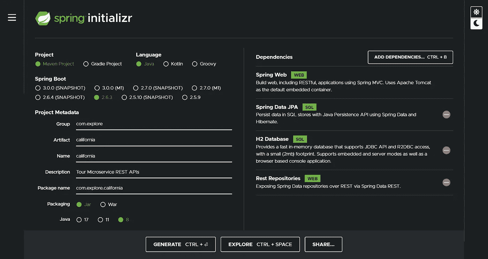
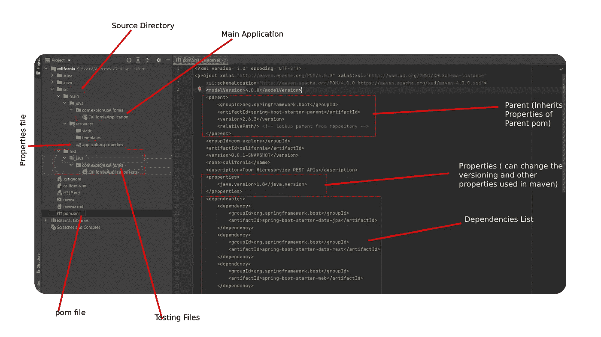
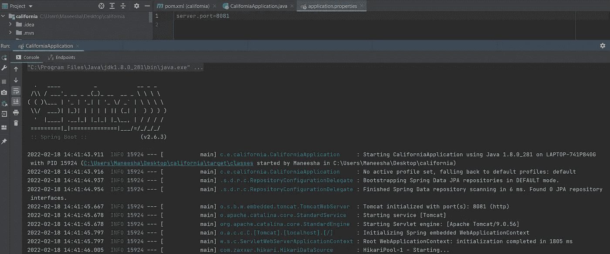
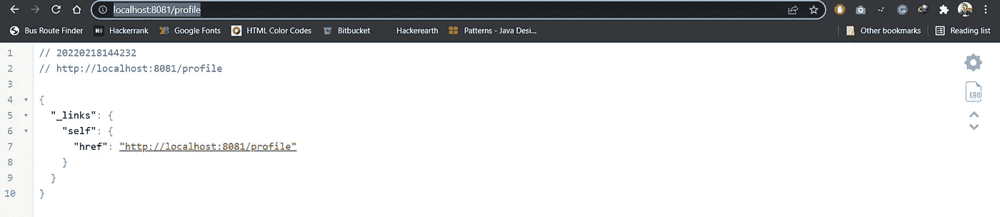
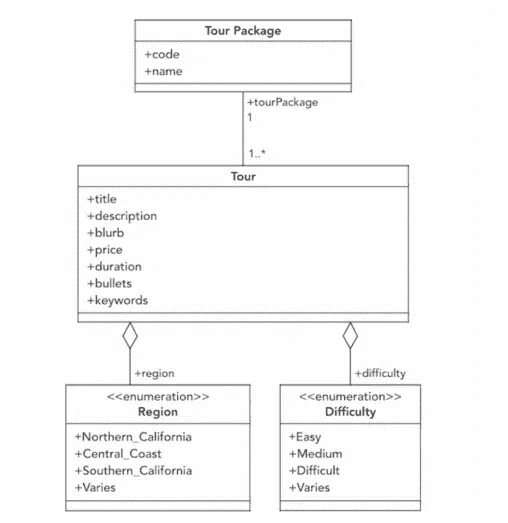
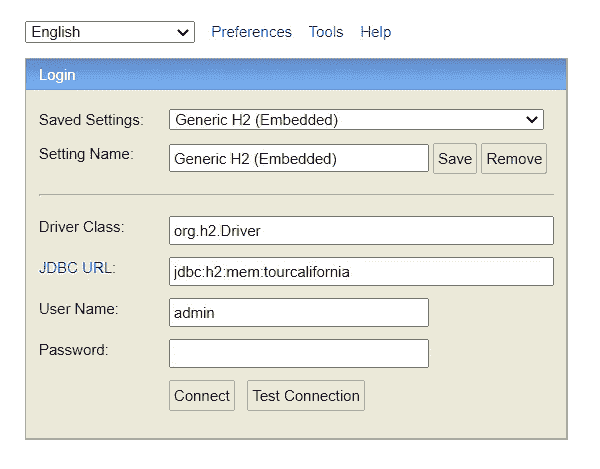
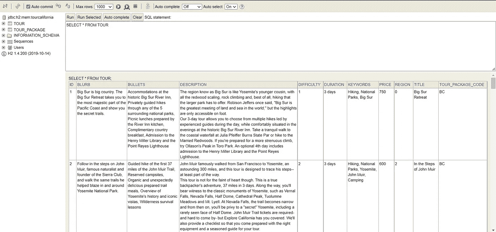
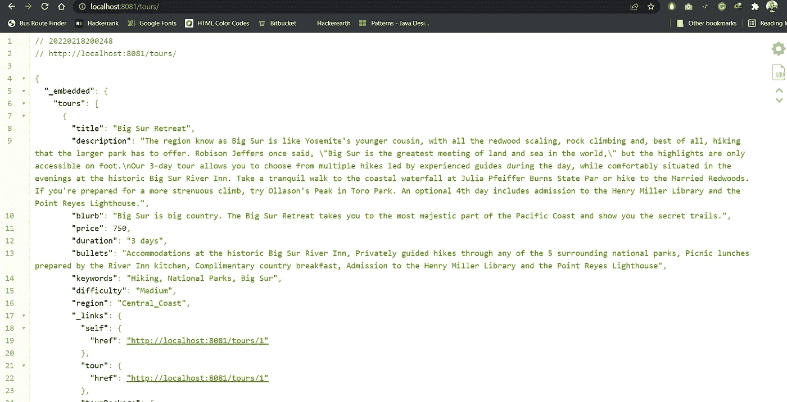
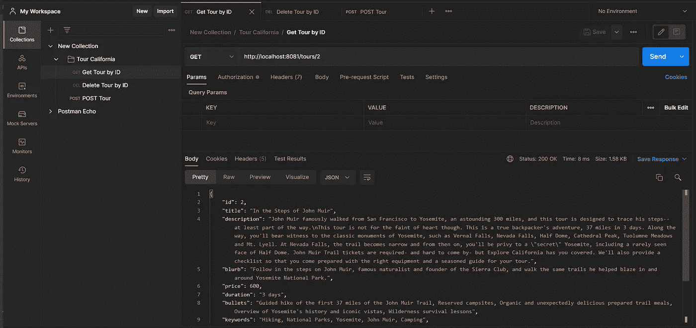

# 使用 Spring Boot 创建首个微服务

> 原文：<https://blog.devgenius.io/create-first-microservice-using-spring-boot-1994cd78bbdf?source=collection_archive---------4----------------------->


[基兰·伍德](https://unsplash.com/@kieran_wood?utm_source=unsplash&utm_medium=referral&utm_content=creditCopyText)在 [Unsplash](https://unsplash.com/s/photos/puzzle?utm_source=unsplash&utm_medium=referral&utm_content=creditCopyText) 上拍摄的照片

读完标题后，你可能想知道什么是微服务，以及它与整体 Java 程序的不同之处。如果我们研究微服务的定义。基本上，微服务是一种架构。



> **微服务(或微服务架构)是一种云原生架构方法，其中单个应用由许多松散耦合且可独立部署的较小组件或服务组成**

那么为什么是微服务而不是使用 monolith 程序呢？

*   ***更容易构建和维护应用*** —微服务的关键原则是简单。当应用程序被分割成一组更小的、可组合的片段时，它们变得更容易构建和维护。管理代码也变得不那么痛苦，因为每个微服务实际上是一个独立的代码块。服务可以使用不同的编程语言、数据库和软件环境来实现。这允许独立地部署、重建、重新部署和管理每个服务。
*   ***提高生产力和速度—*** 因为有了微服务，每个开发团队可以只看自己正在构建的具体服务，而不用担心整个源代码。这将随着交付速度提高团队的生产力。
*   ***微服务可独立扩展—*** 随着应用需求的增加，使用微服务更容易扩展。您可以将资源增加到最需要的微服务，而不是扩展整个应用。这也意味着扩展速度更快，通常也更具成本效益。
*   ***微服务通过故障隔离减少停机时间—*** 如果某个特定的微服务出现故障，您可以将故障隔离到单个服务，并防止会导致应用崩溃的级联故障。这种故障隔离意味着，即使其中一个模块出现故障，您的关键应用程序也可以继续运行。

所以现在我们知道了为什么通常所有的大组织更喜欢微服务，而不是维护一个大的组合源代码。让我们尝试使用 Spring Boot 开发一个微服务，这是一个非常流行的 Java 框架，用于开发企业应用程序。

## 项目描述

我们要开发的是一个微服务，为加州的旅游应用程序创建 RESTful APIs🗻。我们开始吧，

## 创建项目

在 Spring 生态系统中，你可以找到很多依赖关系。为此，我们需要依赖于

*   Web，其中包括 Tomcat 和 Spring MVC
*   Rest 存储库通过 REST APIs 公开 Spring 数据存储库
*   Java 持久性 API
*   H2 内存数据库

使用[***Spring Initializer***](https://start.spring.io/)***可以轻松创建一个 Spring 项目。*** 进入 spring initializer 网页，选择 project 作为 Maven 项目，对于语言选择 Java，填充项目元数据，选择 packaging as JAR，选择你正在开发的 Java 版本。然后添加依赖项，

*   Spring MVC
*   REST 存储库
*   春季数据 JPA
*   H2 数据库

最后，单击 generate，它将下载一个 zip 文件，该文件使用您的`pom.xml`文件中指向的依赖项创建了您的项目结构。



Spring initializer 项目示例详细信息

## 项目结构



正如你在上面的图片中看到的，有几个文件，如果我们检查`pom.xml`文件，我们可以看到我们在 Spring 初始化器中添加的依赖项。

让我们看看`CaliforniaApplication.java`的文件。

这个`CaliforniaApplication.java`文件有一个`main`方法，还有一个`@SpringBootApplication`注释。添加这个注释意味着我们告诉 JVM 这是微服务启动的地方，方法就在那里，所以它不像打包的 war 文件，所以我们可以实际控制 web 应用程序的启动和停止。

> `@SpringBootApplication`注释用于标记声明一个或多个`@Bean`方法的配置类，同时触发`auto-configuration`和组件扫描。这和用`@Configuration, @EnableAutoConfiguration and @ComponentScan`注释声明一个类是一样的。

## 正在启动 Spring Boot 服务器

当您运行 main 方法时，您可以看到 Spring 应用程序正在启动。要更改服务器正在启动的端口，您可以转到`application.properties`文件并添加一个新属性`server.port=8081`



要检查服务器是否工作，请转到[http://localhost:8081/profile](http://localhost:8081/profile)，您可以看到如下内容:



## **开发项目**

现在我们准备开发 Tour California restful web 服务。首先，让我们检查将要构建的 restful web 服务的类图



## ***1。创建模型***

首先，创建一个新的包并将其命名为*模型*，并在其中创建这些业务对象

Tour.java

TourPackage.java

Difficulty.java-枚举类

Region.java-枚举类

正如你在`Tour.java`和`TourPackage.java`文件中看到的，这里使用了一些注释。让我们看看他们的意思。这些注释在 Java 持久 API 中使用。作为一种规范，

> Java Persistence API 与持久性有关，持久性泛指 Java 对象比创建它们的应用程序进程更长寿的任何机制。

*   ***@Entity —*** 用@Entity 标注你所有的实体 beans。
*   ***@Column*** —使用@Column 注释指定列映射。
*   ***@Id*** —使用@Id 标注 Id 列。
*   ***@ generated value***—让数据库生成(自动递增)id 列。
*   ***@OneToOne —*** 对于共享同一个主键的实体，我们可以用@OneToOne 将它们关联起来。
*   ***@ManyToOne —*** 对于与一个实体有多种关系的实体，例如在我们的项目中，一个 TourPacakge 由多个 tour 组成。
*   ***@ Enumerated***—通过这种方式，我们可以指示 JPA 提供者将枚举转换为它的序号或字符串值。

## ***2。创建资源库***

创建一个新的包名*存储库*并创建项目所需的存储库

TourRepository.java

TourPackageRepository.java

> 我们正在为我们拥有的两个实体创建存储库，并且我们还扩展了`CrudRepository`接口，这是一个 Spring 数据接口，用于对特定类型的存储库进行通用 CRUD 操作。它提供了几种现成的与数据库交互的方法。扩展`CrudRepository<T, ID>`时需要定义`*T-entity, ID-the type of your ID column in Entity*` *。*

在上面的代码中，使用了一些注释。让我们看看它们是什么，

*   ***@ RepositoryRestResource—***用于设置公共存储库接口上的选项—它将根据正在扩展的存储库类型(crud Repository/PagingAndSortingRepository/etc)自动创建适当的端点
*   ***@ Repository—****@ Component*注释的专门化，用于表示该类提供了对对象进行存储、检索、更新、删除和搜索操作的机制。

## 3.创建服务

创建一个名为 *service* 的新包，并在其中创建项目所需的服务。

TourService.java

TourPackageService.java

在上面的代码中，使用了一些注释。让我们看看它们是什么，

*   ***@Service*** —这是**用于提供一些业务功能**的类。当使用基于注释的配置和类路径扫描时，Spring context 将自动检测这些类。
*   ***@Autowired*** —该注释提供了对在何处以及如何完成自动连线的更细粒度的控制。就像 *@Required* 注释、构造函数、具有任意名称和/或多个参数的属性或方法一样， *@Autowired* 注释可用于在 setter 方法上自动连接 bean。

正如你在上面的代码中看到的，我们正在使用之前创建的存储库接口来使用已经在`CrudRepository`中开发的方法，比如`findById(),findAll()`。基本上，我们使用服务向外部屏蔽存储库，并在*业务层*中使用我们想要的逻辑。

## 4.数据库设置

在我们的项目中，为了看到 API 正在工作，我们需要在数据库中有一些数据。这里我们使用的是 h2 内存数据库。因此，让我们首先向`application.properties`添加一些配置，在这里我们可以访问内存数据库。

```
spring.h2.console.enabled=true
spring.datasource.url=jdbc:h2:mem:tourcalifornia
spring.datasource.driverClassName=org.h2.Driver
spring.datasource.username=admin
spring.datasource.password=admin
spring.jpa.database-platform=org.hibernate.dialect.H2Dialect

spring.jpa.hibernate.ddl-auto=create-drop
```

现在从主方法所在的`CaliforniaApplication.java`开始，我们可以实现接口`CommandLineRunner`，这是一个简单的 Spring Boot 接口，带有一个运行方法。加载应用程序上下文后，Spring Boot 将自动调用实现该接口的所有 bean 的 run 方法。

首先，我们向我们的`application.properties`文件添加一个属性来读取`ExploreCalifornia.json`文件

```
ec.importfile=ExploreCalifornia.json
```

然后我们添加一些代码来读取 JSON 文件，并将它们添加到数据库的`CaliforniaApplication.java` 文件中。我们可以在 spring 中使用@value 来导入文件名。

*   ***@Value*** —该注释提供了一种将属性值注入组件的便捷方式。对于属性可能不存在的情况，提供合理的缺省值也非常有用

CaliforniaApplication.java

我们需要为`TourPackageRepository.java`文件添加一个新方法，因为我们使用了

```
TourPackage tourPackage = tourPackageRepository.findByName(tourPackageName).orElseThrow(() ->
        new RuntimeException("Tour package does not exist: " + tourPackageName));
```

因此，让我们将`Optional<TourPackage> findByName(String name);`添加到`TourPackageRepository.java`文件中。

更新的 TourRepository.java

让我们重新启动服务器，并转到 h2 数据库控制台所在的[http://localhost:8081/H2-console/](http://localhost:8081/h2-console/)URL。



h2 登录控制台

然后添加您在`application.properties`中配置的用户名、密码、JDBC 网址，登录 h2 控制台。看到填充到表格中的数据可以运行一个简单的查询，如`SELECT * from TOUR;`



或者我们实际上可以在浏览器中访问[http://localhost:8081/tours/](http://localhost:8081/tours/)并查看数据(因为我们在存储库中添加了*@ RepositoryRestResource*，所以我们可以在存储库中运行 GET/POST/PUT/DELETE 命令)。



如果您不希望数据像这样暴露，您需要在您的存储库中添加`@RepositoryRestResource(exported = false)`。

## 5.创建控制器

创建一个名为*控制器*的新包，并在其中创建项目所需的控制器。

TourController.java

在上面的代码中，使用了一些注释。让我们看看它们是什么，

*   ***@ rest Controller***—*@ rest Controller*结合了 *@Controller* 和 *@ResponseBody*
*   ***@ request mapping***—该注释标记了 *@Controller* 类中的请求处理程序方法；可以使用
    - path 或其别名、名称和值进行配置:该方法映射到哪个 URL
    -method:兼容的 HTTP 方法
    - params:根据 HTTP 参数的存在、不存在或值过滤请求
    - headers:根据 HTTP 头的存在、不存在或值过滤请求
    - consumes:该方法可以在 HTTP 请求正文中使用哪些媒体类型
    - produces:该方法可以在 HTTP 响应正文中产生哪些媒体类型
*   ***@ request body—***将 HTTP 请求的主体映射到一个对象。
*   ***@ path variable—***这个注释表示一个方法参数被绑定到一个 URI 模板变量。
*   ***【@ request param—***该注释用于访问 HTTP 请求参数
*   ***@ POST mapping***—*@ Controller*注释类中的 *@PostMapping* 注释方法处理与给定 URI 表达式匹配的 HTTP POST 请求
*   ***@ GET mapping***—*@ Controller*注释类中的 *@GetMapping* 注释方法处理与给定 URI 表达式匹配的 HTTP GET 请求
*   @Controller 注释类中的***@ PUT mapping—****@ PUT mapping*注释方法处理与给定 URI 表达式匹配的 HTTP PUT 请求
*   ***@ DELETE mapping—****@ Controller*注释类中的 *@DeleteMapping* 注释方法处理与给定 URI 表达式匹配的 HTTP 删除请求
*   ***@ PATCH mapping—****@ Controller*注释类中的 *@PatchMapping* 注释方法处理与给定 URI 表达式匹配的 HTTP 补丁请求
*   ***@ exception handler***—使用这个注释我们可以声明一个定制的错误处理方法。当请求处理程序方法抛出任何指定的异常时，Spring 调用这个方法。
*   ***@ ResponseStatus***—如果我们用这个注释来注释一个请求处理程序方法，使用这个注释我们可以指定期望的响应的 HTTP 状态。我们可以用 code 参数声明状态代码，或者它是一个别名，value 参数

## **6。测试 API**

为了测试 API，我们可以使用 [Postman](https://www.postman.com/) 。你可以从[这里](https://www.getpostman.com/collections/dfc841f2e6a5663e6038)获得邮差集锦。



在邮递员中通过 id 测试获得旅游

你可以在这里找到完整的代码。

[](https://github.com/maneeshaindrachapa/Tour-California-SpringBoot-Sample-Application) [## GitHub-maneeshaindrachapa/Tour-California-spring boot-Sample-Application:这是一个示例…

### 此时您不能执行该操作。您已使用另一个标签页或窗口登录。您已在另一个选项卡中注销，或者…

github.com](https://github.com/maneeshaindrachapa/Tour-California-SpringBoot-Sample-Application) 

这就是了。这就是你如何使用 Spring Boot 开发微服务。这只是春天生态系统的一小部分。在另一篇博文中，让我们看看如何保护 API，以及接下来我们可以对 springs 做些什么。如果你喜欢这个，请给我买一杯[☕️](https://ko-fi.com/maneeshaindrachapa)咖啡

## 参考

 [## CrudRepository (Spring 数据核心 2.6.2 API)

### 针对特定类型的存储库的通用 CRUD 操作的接口。

docs.spring.io](https://docs.spring.io/spring-data/commons/docs/current/api/org/springframework/data/repository/CrudRepository.html)  [## 2.JPA 存储库

### Spring Data 的 JPA 模块包含一个自定义名称空间，允许定义存储库 beans。它还包含…

docs.spring.io](https://docs.spring.io/spring-data/jpa/docs/1.5.0.RELEASE/reference/html/jpa.repositories.html) [](https://spring.io/quickstart) [## Spring 快速入门指南

### 使用 start.spring.io 创建一个“web”项目。在“依赖项”对话框中，搜索并添加“web”依赖项作为…

spring.io](https://spring.io/quickstart) [](https://solace.com/blog/microservices-advantages-and-disadvantages/) [## 微服务的优点和缺点:你需要知道的一切

### 对于那些研究微服务以及他们如何帮助他们的组织的人来说，并不缺少很好的资源…

solace.com](https://solace.com/blog/microservices-advantages-and-disadvantages/) 

[https://skelia . com/articles/5-major-benefits-microservice-architecture/](https://skelia.com/articles/5-major-benefits-microservice-architecture/)

https://www.baeldung.com/spring-bean-annotations

【https://www.baeldung.com/spring-boot-h2-database 