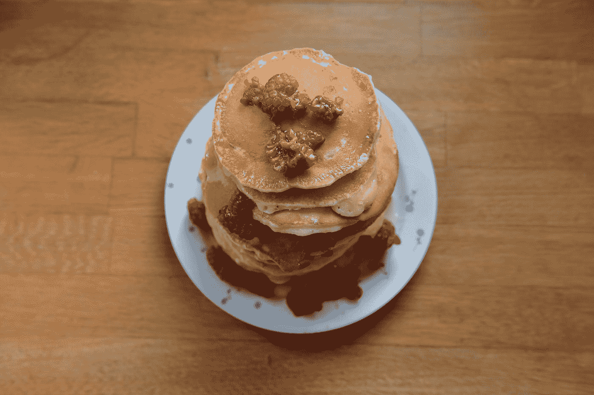

# 使用 Visx 库的缩放和平移功能创建图形

> 原文：<https://blog.devgenius.io/create-graphics-with-zoom-and-pan-with-the-visx-library-9cb6403a8ebe?source=collection_archive---------3----------------------->



micha Parzuchowski 在 [Unsplash](https://unsplash.com?utm_source=medium&utm_medium=referral) 上拍摄的照片

Visx 是一个库，让我们可以轻松地将图形添加到 React 应用程序中。

在本文中，我们将了解如何在 React 应用程序中使用它来创建带有缩放和平移功能的图形。

# 安装所需的软件包

我们必须安装一些模块。

首先，我们运行:

```
npm i @visx/clip-path @visx/event @visx/mock-data @visx/responsive @visx/scale @visx/zoom d3-scale-chromatic
```

安装软件包。

# 创建图形

我们可以通过添加模块提供的项目来创建图表。

我们使用来自`@visx/mock-data`模块的数据。

为了创建和弦图，我们写下:

```
import React, { useState } from "react";
import { interpolateRainbow } from "d3-scale-chromatic";
import { Zoom } from "@visx/zoom";
import { localPoint } from "@visx/event";
import { RectClipPath } from "@visx/clip-path";
import genPhyllotaxis from "@visx/mock-data/lib/generators/genPhyllotaxis";
import { scaleLinear } from "@visx/scale";const bg = "#0a0a0a";
const points = [...new Array(1000)];const colorScale = scaleLinear({ range: [0, 1], domain: [0, 1000] });
const sizeScale = scaleLinear({ domain: [0, 600], range: [0.5, 8] });const initialTransform = {
  scaleX: 1.27,
  scaleY: 1.27,
  translateX: -211.62,
  translateY: 162.59,
  skewX: 0,
  skewY: 0
};function Example({ width, height }) {
  const [showMiniMap, setShowMiniMap] = useState(true); const genenerator = genPhyllotaxis({
    radius: 5,
    width,
    height
  });
  const phyllotaxis = points.map((d, i) => genenerator(i));return (
    <>
      <Zoom
        width={width}
        height={height}
        scaleXMin={1 / 2}
        scaleXMax={4}
        scaleYMin={1 / 2}
        scaleYMax={4}
        transformMatrix={initialTransform}
      >
        {(zoom) => (
          <div className="relative">
            <svg
              width={width}
              height={height}
              style={{ cursor: zoom.isDragging ? "grabbing" : "grab" }}
            >
              <RectClipPath id="zoom-clip" width={width} height={height} />
              <rect width={width} height={height} rx={14} fill={bg} />
              <g transform={zoom.toString()}>
                {phyllotaxis.map(({ x, y }, i) => (
                  <React.Fragment key={`dot-${i}`}>
                    <circle
                      cx={x}
                      cy={y}
                      r={i > 500 ? sizeScale(1000 - i) : sizeScale(i)}
                      fill={interpolateRainbow(colorScale(i) ?? 0)}
                    />
                  </React.Fragment>
                ))}
              </g>
              <rect
                width={width}
                height={height}
                rx={14}
                fill="transparent"
                onTouchStart={zoom.dragStart}
                onTouchMove={zoom.dragMove}
                onTouchEnd={zoom.dragEnd}
                onMouseDown={zoom.dragStart}
                onMouseMove={zoom.dragMove}
                onMouseUp={zoom.dragEnd}
                onMouseLeave={() => {
                  if (zoom.isDragging) zoom.dragEnd();
                }}
                onDoubleClick={(event) => {
                  const point = localPoint(event) || { x: 0, y: 0 };
                  zoom.scale({ scaleX: 1.1, scaleY: 1.1, point });
                }}
              />
              {showMiniMap && (
                <g
                  clipPath="url(#zoom-clip)"
                  transform={`
                    scale(0.25)
                    translate(${width * 4 - width - 60}, ${
                    height * 4 - height - 60
                  })
                  `}
                >
                  <rect width={width} height={height} fill="#1a1a1a" />
                  {phyllotaxis.map(({ x, y }, i) => (
                    <React.Fragment key={`dot-sm-${i}`}>
                      <circle
                        cx={x}
                        cy={y}
                        r={i > 500 ? sizeScale(1000 - i) : sizeScale(i)}
                        fill={interpolateRainbow(colorScale(i) ?? 0)}
                      />
                    </React.Fragment>
                  ))}
                  <rect
                    width={width}
                    height={height}
                    fill="white"
                    fillOpacity={0.2}
                    stroke="white"
                    strokeWidth={4}
                    transform={zoom.toStringInvert()}
                  />
                </g>
              )}
            </svg>
            <div className="controls">
              <button
                type="button"
                className="btn btn-zoom"
                onClick={() => zoom.scale({ scaleX: 1.2, scaleY: 1.2 })}
              >
                +
              </button>
              <button
                type="button"
                className="btn btn-zoom btn-bottom"
                onClick={() => zoom.scale({ scaleX: 0.8, scaleY: 0.8 })}
              >
                -
              </button>
              <button
                type="button"
                className="btn btn-lg"
                onClick={zoom.center}
              >
                Center
              </button>
              <button type="button" className="btn btn-lg" onClick={zoom.reset}>
                Reset
              </button>
              <button type="button" className="btn btn-lg" onClick={zoom.clear}>
                Clear
              </button>
            </div>
            <div className="mini-map">
              <button
                type="button"
                className="btn btn-lg"
                onClick={() => setShowMiniMap(!showMiniMap)}
              >
                {showMiniMap ? "Hide" : "Show"} Mini Map
              </button>
            </div>
          </div>
        )}
      </Zoom>
      <style jsx>{`
        .btn {
          margin: 0;
          text-align: center;
          border: none;
          background: #2f2f2f;
          color: #888;
          padding: 0 4px;
          border-top: 1px solid #0a0a0a;
        }
        .btn-lg {
          font-size: 12px;
          line-height: 1;
          padding: 4px;
        }
        .btn-zoom {
          width: 26px;
          font-size: 22px;
        }
        .btn-bottom {
          margin-bottom: 1rem;
        }
        .description {
          font-size: 12px;
          margin-right: 0.25rem;
        }
        .controls {
          position: absolute;
          top: 15px;
          right: 15px;
          display: flex;
          flex-direction: column;
          align-items: flex-end;
        }
        .mini-map {
          position: absolute;
          bottom: 25px;
          right: 15px;
          display: flex;
          flex-direction: column;
          align-items: flex-end;
        }
        .relative {
          position: relative;
        }
      `}</style>
    </>
  );
}
export default function App() {
  return (
    <div className="App">
      <Example width={500} height={300} />
    </div>
  );
}
```

我们用`bg`变量添加背景色。

`points`有一个数组，将与叶序螺旋图形的点填充，我们可以缩放和平移。

`initialTransform`具有初始缩放和平移值。

在`Example`组件中，我们有`showMiniMap`状态来切换小地图。

小地图让我们看到我们在图形中的位置。

为了生成图形，我们调用`genPhyllotaxis`来生成叶序螺旋图形。

然后我们创建`phyllotaxis`变量来生成环的点。

接下来，我们返回`Zoom`组件，让我们放大和缩小图形。

我们设置比例和初始变换来显示初始图形。

然后为了创建叶序图形，我们调用`phylloTaxis.map`来渲染螺旋的圆形。

我们用`interpolateRainbow`方法为叶序创建填充颜色。

这将创建一个彩虹颜色的效果。

下面，我们用`g`元素创建小地图。

在里面，我们用小地图上显示的叶序的迷你版本创建了一个片段。

下面的`rect`元素在小地图中显示的区域周围绘制了一个矩形。

在此之下，我们创建按钮，让我们放大和缩小，中心的图形，并重置图形到它的初始位置。

我们添加了一些样式来定位带有`style`元素的图形显示。

# 结论

我们可以使用 Visx 提供的库模块在 React 应用程序中创建图形并缩放和平移。