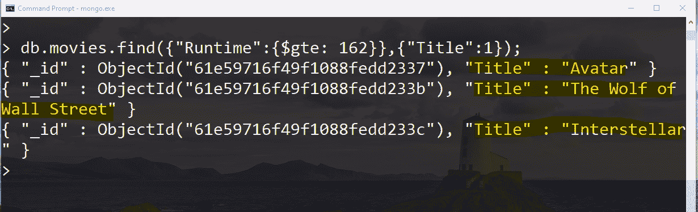
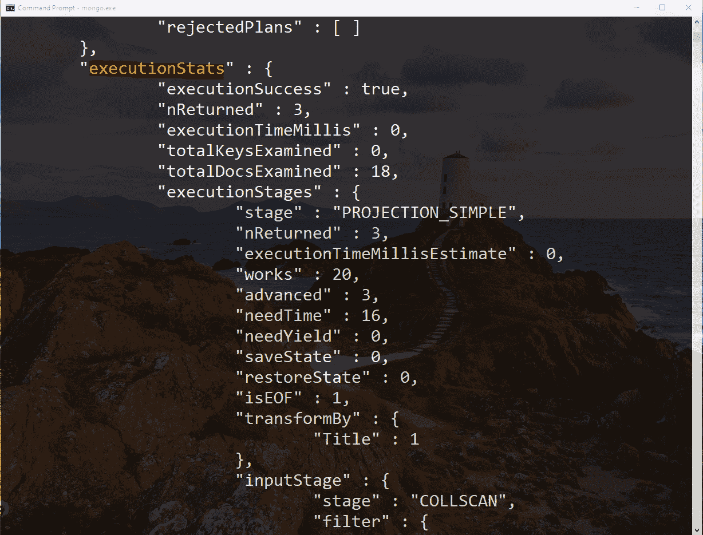
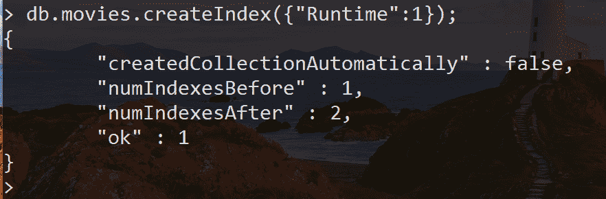
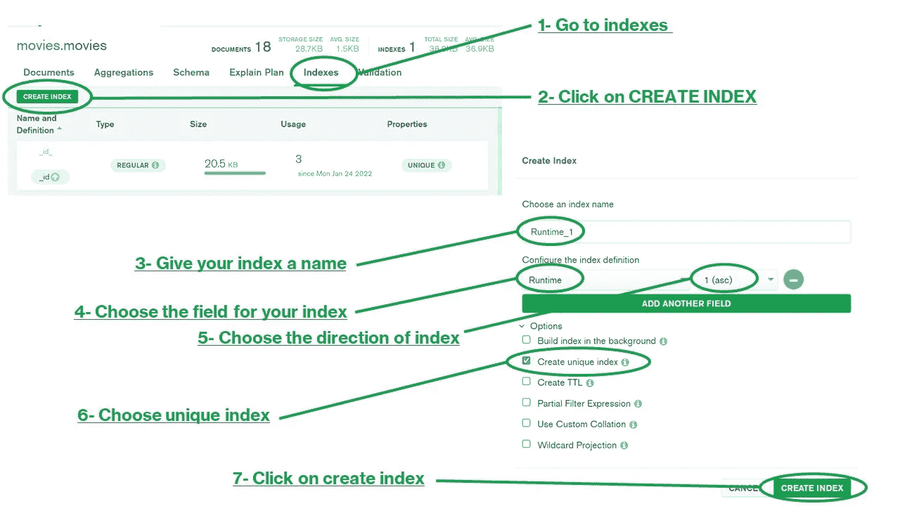
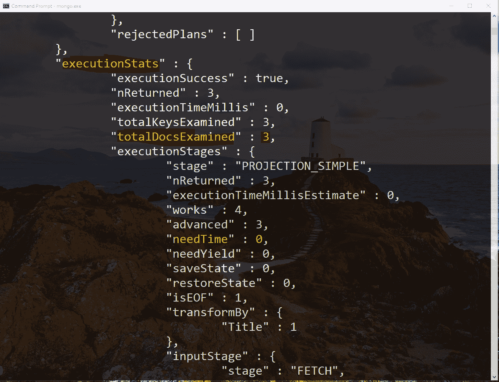
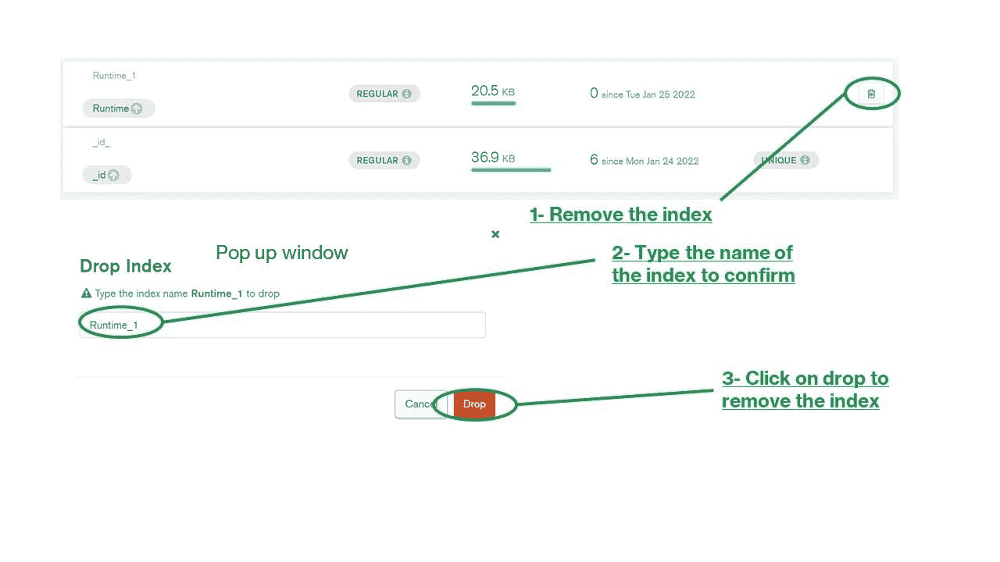

# 创建索引来提高您在 MongoDB 上的查询性能

> 原文：<https://blog.devgenius.io/create-indexes-to-enhance-the-performance-of-your-queries-on-mongodb-9baec757d684?source=collection_archive---------11----------------------->

哇，我们经历了很多！对吗？

*   [如何在 windows 上安装 MongoDB？](https://medium.com/@ibtissam.makdoun/from-rdbms-to-non-relational-databases-119f4007b214)
*   [如何创建和处理文档？](https://medium.com/@ibtissam.makdoun/creating-updating-and-deleting-mongodb-documents-94c12219783f)
*   [如何在 MongoDB 上查询和更新文档？](https://medium.com/@ibtissam.makdoun/querying-and-updating-documents-on-mongodb-compass-c9be25ffffb2)

但是事情变得越来越令人兴奋。那之后呢？我们可以运行查询，让我们去构建我们的应用程序。没那么快。如果我告诉你有一种方法可以帮助你增强你的查询。因此，您不用在数百万个文档中运行 find，而是只在满足条件的文档中运行！

霍顿。这可能吗？是啊！就像使用索引来更好地查找书中的文档一样，我们可以使用索引来轻松地扫描您的收藏中的文档。

因此，在本教程中，我们将讨论如何使用索引来提高查询性能，从而提高应用程序的性能。

让乐趣开始吧！

此外，您可以查看视频了解更多详情:

[MongoDB 索引提高查询性能——YouTube](https://www.youtube.com/watch?v=yGzeMDZ_jCM)

# 索引简介:

正如我们前面提到的，数据库索引类似于书籍索引。我们将采用一种快捷方式，查看包含内容参考的有序列表，而不是浏览整本书。因此我们的查询会运行得更快。

不使用索引的查询称为*集合扫描*。服务器将在整个集合中查找结果。基本上，如果我们在一本没有索引的书中查找信息，这就是我们要做的。所以你会从第一页开始，阅读整本书，也许是为了找到所要求的部分。你可以想象这将花费你多少时间，尤其是当这本书变得更大的时候。

同样，您希望让服务器避免扫描所有文档，因为这个过程会非常慢，尤其是对于大型数据库。

# 为什么我们需要索引:

让我们在电影列表上运行一个查询，找到所有运行时间*高于 162 的电影:*

*运行此命令后，我们会得到以下结果:*

**

*现在，让我们尝试相同的命令，但这次我们将向链接添加一个解释。我们可以在 MongoDB 中使用 ***explain*** 来看看我们运行查询时幕后发生了什么。这个方法有多种详细模式，对我们来说，我们将选择运行 ***executionStats*** 模式，因为这将帮助我们理解在查询中使用索引的效果。*

*这个查询的结果很大，我们会对嵌套的文档“ ***executionStats*** ”感兴趣。*

**

*现在关注键***totalDocsExamined***来查看 MongoDB 检查了多少个文档来返回查询结果，这正好是我们的集合中的文档数。所以要运行这个查询，MongoDB 必须查看所有文档，看看它们是否满足查询。您还可以在 ***needTime*** 字段中看到，该查询运行该查询花费了 16 毫秒。*

*为了使 MongoDB 能够更好地响应和运行查询，尤其是那些我们最需要的查询，需要对应用程序中的查询模式进行索引。*

# *创建索引:*

*现在，让我们使用索引，看看我们的查询性能将如何变化。所以我根据电影的运行时间过滤文档。因此，我需要在运行时字段上创建一个索引。要使用命令行做到这一点，你可以使用 ***createIndex*** 命令。通过指定要索引的键，然后指定索引的方向，可以做到这一点。就像排序一样，1 表示升序，2 表示降序。*

*除非你的收藏非常多，否则不会超过几秒钟。*

> **你也可以用***create indexes***，随便你！**

**

*要从 MongoDB Compass 创建索引，您只需:*

**

*创建索引的步骤*

*然后，您的索引将被创建:*

**

*现在，如果我们对查询运行 explain，我们会看到:*

**

*您可以看到，所检查的文档数量和所需的时间比使用没有索引的查询要少。*

> *MongoDB 索引与关系数据库索引的工作方式几乎相同。因此，如果您熟悉索引，本教程将只是为您发现语法。*

# *删除索引:*

*通过命令行删除索引非常简单。你只需要在方法 ***dropIndex*** 里面指定你要移除的索引。就像这样:*

**

*在 MongoDB Compass 上更简单，你只需点击索引旁边的垃圾箱:*

**

*删除索引的步骤*

> *注意 _id_ index 是在 MongoDB 中默认创建的*

# *总结:*

*如您所见，索引可以极大地改变我们的查询性能。然而，一切好的东西都是有代价的。索引的代价是，对有索引的字段执行(插入、更新、删除)操作将花费更长的时间。基本上，因为服务器将(更新、插入和删除)集合中的数据和(更新、插入和删除)索引中的数据。然而，在大多数情况下，这种权衡是值得的。*

*接下来，我们将了解如何在 MongoDB 上存储文档*