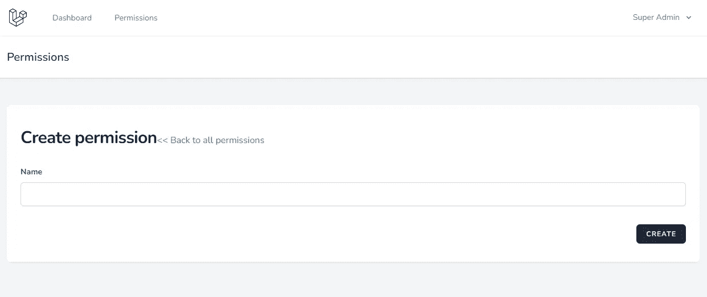
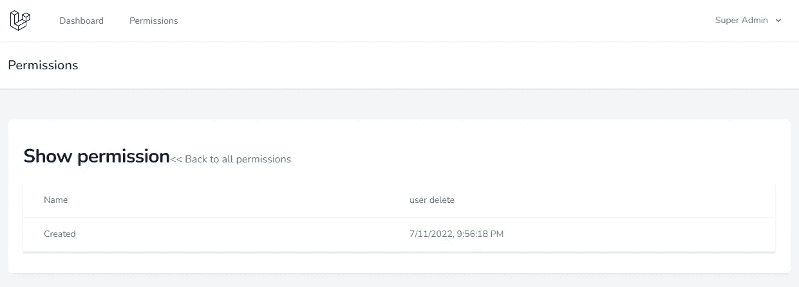

# 使用惯性和 Vue 创建和更新页面

> 原文：<https://blog.devgenius.io/create-laravel-crud-create-and-update-pages-using-inertia-and-vue-48162d8bf6ee?source=collection_archive---------5----------------------->

## Laravel 从头开始创建 Vue 管理面板——第 3 部分

在最后一部分中，我们完成了带有分页和基本搜索的[权限列表页面](/create-laravel-crud-using-inertia-and-vue-3-list-page-with-search-and-pagination-c4a52b6501c3)。此外，我们完成了删除权限。在这一部分，我们将完成权限添加和更新页面。

您也可以尝试使用 blade 模板创建的[基本 Laravel 管理面板](https://github.com/balajidharma/basic-laravel-admin-panel)。我们需要执行以下步骤来创建添加和更新页面。

*   1.添加创建和编辑方法
*   2.添加创建和编辑组件
*   3.创建存储和更新方法
*   4.创建验证请求
*   5.添加视图方法和视图组件

## 1.添加创建和编辑方法

打开 PermissionController 并添加创建和编辑方法。

`app/Http/Controllers/Admin/PermissionController.php`

```
public function create()
{
    return Inertia::render('Admin/Permission/Create');
}public function edit(Permission $permission)
{
    return Inertia::render('Admin/Permission/Edit', [
        'permission' => $permission
    ]);
}
```

## 2.添加`create`组件

在 resources/js/Pages/Admin/Permission 文件夹中添加下面的 create 组件

`resources/js/Pages/Admin/Permission/Create.vue`

```
<script setup>
import BreezeAuthenticatedLayout from "@/Layouts/Authenticated.vue";
import { Head, Link, useForm } from "@inertiajs/inertia-vue3";
import BreezeButton from "@/Components/Button.vue";const form = useForm({
  name: '',
});
</script><template>
  <Head title="Create permission" /> <BreezeAuthenticatedLayout>
    <template #header>
      <h2 class="font-semibold text-xl text-gray-800 leading-tight">
        Permissions
      </h2>
    </template> <div class="py-12">
      <div class="max-w-7xl mx-auto sm:px-6 lg:px-8">
        <div class="bg-white overflow-hidden shadow-sm sm:rounded-lg">
          <div class="p-6 bg-white border-b border-gray-200">
            <div class="flex flex-col">
              <div>
                <h1
                  class="
                    inline-block
                    text-2xl
                    sm:text-3xl
                    font-extrabold
                    text-slate-900
                    tracking-tight
                    dark:text-slate-200
                    py-4
                    block
                    sm:inline-block
                    flex
                  "
                >
                  Create permission
                </h1>
                <Link
                  :href="route('permission.index')"
                  class="
                    no-underline
                    hover:underline
                    text-cyan-600
                    dark:text-cyan-400
                  "
                  >&lt;&lt; Back to all permissions</Link
                >
              </div>
              <div class="w-full py-2 bg-white overflow-hidden">
                <form @submit.prevent="form.post(route('permission.store'))">
                  <div class="py-2">
                    <label
                      class="block font-bold text-sm text-gray-700"
                      :class="{ 'text-red-400': form.errors.name }"
                      for="name"
                    >
                      Name
                    </label> <input
                      class="
                        my-2
                        rounded-md
                        shadow-sm
                        border-gray-300
                        focus:border-indigo-300
                        focus:ring
                        focus:ring-indigo-200
                        focus:ring-opacity-50
                        block
                        w-full
                      "
                      :class="{ 'border-red-400': form.errors.name }"
                      id="name"
                      type="text"
                      v-model="form.name"
                    />
                    <div class="text-red-400 text-sm" v-if="form.errors.name">
                      {{ form.errors.name }}
                    </div>
                  </div> <div class="flex justify-end mt-4">
                    <BreezeButton
                      class="ml-4"
                      :class="{ 'opacity-25': form.processing }"
                      :disabled="form.processing"
                    >
                      Create
                    </BreezeButton>
                  </div>
                </form>
              </div>
            </div>
          </div>
        </div>
      </div>
    </div>
  </BreezeAuthenticatedLayout>
</template>
```

惯性`@submit.prevent=”form.post(route(‘permission.store’))”`是将表单值提交给权限存储方法。

`resources/js/Pages/Admin/Permission/Edit.vue`

```
<script setup>
import BreezeAuthenticatedLayout from "@/Layouts/Authenticated.vue";
import { Head, Link, useForm } from "@inertiajs/inertia-vue3";
import BreezeButton from "@/Components/Button.vue";const props = defineProps({
  permission: {
    type: Object,
    default: () => ({}),
  },
});const form = useForm({
  _method: 'put',
  name: props.permission.name,
});
</script><template>
  <Head title="Update permission" /><BreezeAuthenticatedLayout>
    <template #header>
      <h2 class="font-semibold text-xl text-gray-800 leading-tight">
        Permissions
      </h2>
    </template><div class="py-12">
      <div class="max-w-7xl mx-auto sm:px-6 lg:px-8">
        <div class="bg-white overflow-hidden shadow-sm sm:rounded-lg">
          <div class="p-6 bg-white border-b border-gray-200">
            <div class="flex flex-col">
              <div>
                <h1
                  class="
                    inline-block
                    text-2xl
                    sm:text-3xl
                    font-extrabold
                    text-slate-900
                    tracking-tight
                    dark:text-slate-200
                    py-4
                    block
                    sm:inline-block
                    flex
                  "
                >
                  Update permission
                </h1>
                <Link
                  :href="route('permission.index')"
                  class="
                    no-underline
                    hover:underline
                    text-cyan-600
                    dark:text-cyan-400
                  "
                  >&lt;&lt; Back to all permissions</Link
                >
              </div>
              <div class="w-full py-2 bg-white overflow-hidden">
                <form
                  [@submit](http://twitter.com/submit).prevent="
                    form.post(route('permission.update', this.permission.id))
                  "
                >
                  <div class="py-2">
                    <label
                      class="block font-bold text-sm text-gray-700"
                      :class="{ 'text-red-400': form.errors.name }"
                      for="name"
                    >
                      Name
                    </label><input
                      class="
                        my-2
                        rounded-md
                        shadow-sm
                        border-gray-300
                        focus:border-indigo-300
                        focus:ring
                        focus:ring-indigo-200
                        focus:ring-opacity-50
                        block
                        w-full
                      "
                      :class="{ 'border-red-400': form.errors.name }"
                      id="name"
                      type="text"
                      v-model="form.name"
                    />
                    <div class="text-red-400 text-sm" v-if="form.errors.name">
                      {{ form.errors.name }}
                    </div>
                  </div><div class="flex justify-end mt-4">
                    <BreezeButton
                      class="ml-4"
                      :class="{ 'opacity-25': form.processing }"
                      :disabled="form.processing"
                    >
                      Update
                    </BreezeButton>
                  </div>
                </form>
              </div>
            </div>
          </div>
        </div>
      </div>
    </div>
  </BreezeAuthenticatedLayout>
</template>
```

## 3.创建存储和更新方法

添加 store 方法以保存创建的表单值，添加 update 方法以保存更新的表单值。

```
public function store(StorePermissionRequest $request)
{
    Permission::create($request->all()); return redirect()->route('permission.index')
                    ->with('message', __('Permission created successfully.'));
}public function update(UpdatePermissionRequest $request, Permission $permission)
{
    $permission->update($request->all()); return redirect()->route('permission.index')
                    ->with('message', __('Permission updated successfully.'));
}
```

## 4.创建验证请求

从[基本工资管理面板](https://github.com/balajidharma/basic-laravel-admin-panel)中复制`[StorePermissionRequest](https://github.com/balajidharma/basic-laravel-admin-panel/blob/master/app/Http/Requests/Admin/StorePermissionRequest.php)`和`[UpdatePermissionRequest](https://github.com/balajidharma/basic-laravel-admin-panel/blob/master/app/Http/Requests/Admin/UpdatePermissionRequest.php)`



## 5.添加显示方法和视图组件

我们添加了创建和编辑页面。现在要添加一个权限查看页面。

```
public function show(Permission $permission)
{
    return Inertia::render('Admin/Permission/Show', [
        'permission' => $permission,
    ]);
}
```

现在创建 Show 组件来显示权限

`resources/js/Pages/Admin/Permission/Show.vue`

```
<script setup>
import BreezeAuthenticatedLayout from "@/Layouts/Authenticated.vue";
import { Head, Link, useForm } from "@inertiajs/inertia-vue3";
import BreezeButton from "@/Components/Button.vue";const props = defineProps({
  permission: {
    type: Object,
    default: () => ({}),
  },
});
</script><template>
  <Head title="View permission" /><BreezeAuthenticatedLayout>
    <template #header>
      <h2 class="font-semibold text-xl text-gray-800 leading-tight">
        Permissions
      </h2>
    </template> <div class="py-12">
      <div class="max-w-7xl mx-auto sm:px-6 lg:px-8">
        <div class="bg-white overflow-hidden shadow-sm sm:rounded-lg">
          <div class="p-6 bg-white border-b border-gray-200">
            <div class="flex flex-col">
              <div>
                <h1
                  class="
                    inline-block
                    text-2xl
                    sm:text-3xl
                    font-extrabold
                    text-slate-900
                    tracking-tight
                    dark:text-slate-200
                    py-4
                    block
                    sm:inline-block
                    flex
                  "
                >
                  View permission
                </h1>
                <Link
                  :href="route('permission.index')"
                  class="
                    no-underline
                    hover:underline
                    text-cyan-600
                    dark:text-cyan-400
                  "
                  >&lt;&lt; Back to all permissions</Link
                >
              </div>
              <div class="w-full py-2">
                <div class="min-w-full border-b border-gray-200 shadow">
                  <table class="table-fixed w-full text-sm">
                    <tbody class="bg-white dark:bg-slate-800">
                      <tr>
                        <td
                          class="
                            border-b border-slate-100
                            dark:border-slate-700
                            p-4
                            pl-8
                            text-slate-500
                            dark:text-slate-400
                          "
                        >
                          Name
                        </td>
                        <td
                          class="
                            border-b border-slate-100
                            dark:border-slate-700
                            p-4
                            text-slate-500
                            dark:text-slate-400
                          "
                        >
                          {{ permission.name }}
                        </td>
                      </tr>
                      <tr>
                        <td
                          class="
                            border-b border-slate-100
                            dark:border-slate-700
                            p-4
                            pl-8
                            text-slate-500
                            dark:text-slate-400
                          "
                        >
                          Created
                        </td>
                        <td
                          class="
                            border-b border-slate-100
                            dark:border-slate-700
                            p-4
                            text-slate-500
                            dark:text-slate-400
                          "
                        >
                          {{ new Date(permission.created_at).toLocaleString() }}
                        </td>
                      </tr>
                    </tbody>
                  </table>
                </div>
              </div>
            </div>
          </div>
        </div>
      </div>
    </div>
  </BreezeAuthenticatedLayout>
</template>
```



## GitHub 知识库

Laravel Vue 管理面板在[https://github.com/balajidharma/laravel-vue-admin-panel](https://github.com/balajidharma/laravel-vue-admin-panel)上可用。安装管理面板并分享您的反馈。

感谢您的阅读。

敬请关注更多内容！

*跟我来*[](https://balajidharma.medium.com/)*。*

*上一部分—第 2 部分:[使用惯性和 Vue 3 创建 Laravel CRUD 带有搜索和分页的列表页面](/create-laravel-crud-using-inertia-and-vue-3-list-page-with-search-and-pagination-c4a52b6501c3)*

*下一部分—第 4 部分:[使用惯性和 Vue 创建 Laravel CRUD 列排序](/laravel-crud-column-sorting-with-inertia-and-vue-6bb16c30d3e0)*