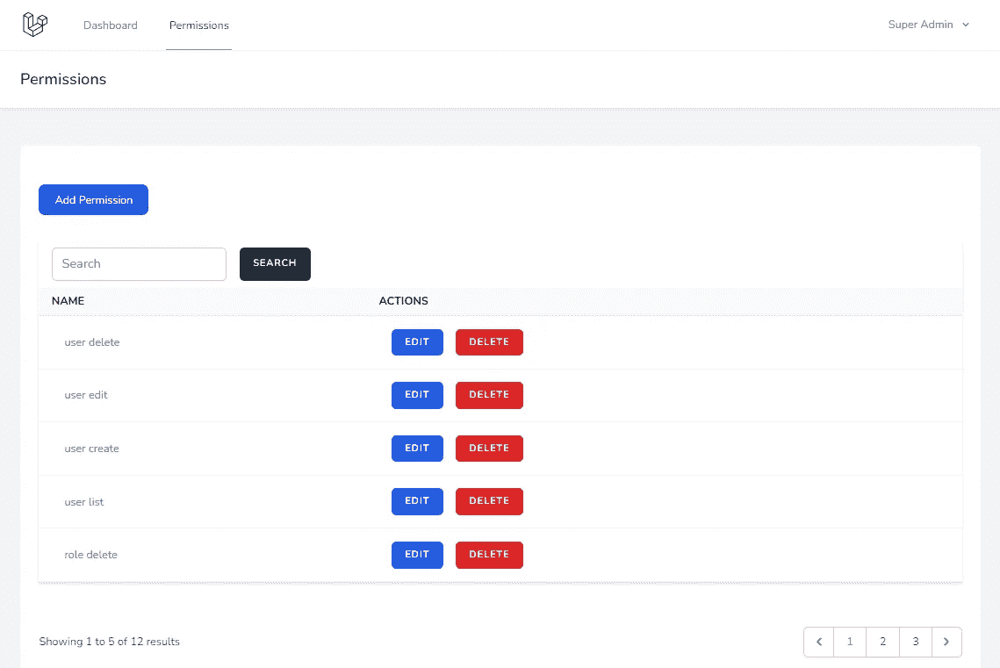

# 使用惯性和 Vue 创建 Laravel CRUD 带有搜索和分页的列表页面

> 原文：<https://blog.devgenius.io/create-laravel-crud-using-inertia-and-vue-3-list-page-with-search-and-pagination-c4a52b6501c3?source=collection_archive---------2----------------------->

## Laravel 从头开始创建 Vue 管理面板——第 2 部分



最后一部分我们完成了[安装和认证](/laravel-creates-a-vue-admin-panel-from-scratch-part-1-installation-and-authentication-56c451d4d697)。在这一部分，我们将添加许可 CRUD 列表页面。我们可以在创建列表页面之前为用户、角色和权限添加种子。

1.  创建模型
2.  创建一个种子并重新迁移
3.  授予超级管理员访问权限
4.  添加路线
5.  创建控制器
6.  创建索引视图
7.  添加分页组件
8.  添加即时消息
9.  添加权限菜单

## 1.创建模型

我们已经创建了一个基于刀片模板的管理面板，这个代码已经在 Github[https://github.com/balajidharma/basic-laravel-admin-panel](https://github.com/balajidharma/basic-laravel-admin-panel)上可用

所以我们要从这个管理面板复制大部分代码。因此，将[中的所有模型复制到这里](https://github.com/balajidharma/basic-laravel-admin-panel/tree/master/app/Models)

## 2.创建一个种子并重新迁移

现在，将[这个](https://github.com/balajidharma/basic-laravel-admin-panel/blob/master/database/seeders/BasicAdminPermissionSeeder.php)播种机复制到我们的`database/seeders`文件夹。

以下命令将删除您的所有数据。它将删除所有表，并再次运行所有迁移，最后，我们的种子将运行。

```
sail artisan migrate:fresh --seed --seeder=BasicAdminPermissionSeeder
```

如果您不想删除您的数据，请运行以下命令。它只会运行播种机

```
sail artisan db:seed --class=BasicAdminPermissionSeeder
```

## 3.授予超级管理员访问权限

超级管理员将拥有对应用程序的所有访问权限。所以当超级管理员登录时，需要为所有的权限检查函数`can()`或`@can()`返回 true

在下面添加一个`Gate::before`检查你的`AuthServiceProvider`启动功能。

```
public function boot()
    {
        $this->registerPolicies();
        // Implicitly grant "Super-Admin" role all                  permission checks using can()
       Gate::before(function ($user, $ability) {
           if ($user->hasRole('super-admin')) {
               return true;
           }
       });
    }
```

## 4.添加路线

我们将在 app/routes 文件夹中创建一个新的 admin.php 文件。这个文件将包含我们所有的管理路径，在 URL 中带有一个管理前缀。

routes/admin.php

```
<?phpRoute::group([
    'namespace'  => 'App\Http\Controllers\Admin',
    'prefix'     => 'admin',
    'middleware' => ['auth'],
], function () {
    Route::resource('permission', 'PermissionController');
});
```

这些新的管理路线需要包含在 RouteServiceProvider.php 的`boot`函数中
用下面的代码更新`boot()`函数

app/Providers/routeserviceprovider . PHP

```
public function boot()
{
    $this->configureRateLimiting();$this->routes(function () {
        Route::prefix('api')
            ->middleware('api')
            ->namespace($this->namespace)
            ->group(base_path('routes/api.php'));Route::middleware('web')
            ->namespace($this->namespace)
            ->group(base_path('routes/web.php'));Route::middleware('web')
            ->namespace($this->namespace)
            ->group(base_path('routes/admin.php'));
    });
}
```

## 5.创建控制器

用下面的索引和销毁函数创建`PermissionController`。

`app/Http/Controllers/Admin/PermissionController.php`

```
<?phpnamespace App\Http\Controllers\Admin;use App\Http\Controllers\Controller;
use App\Http\Requests\Admin\StorePermissionRequest;
use App\Http\Requests\Admin\UpdatePermissionRequest;
use App\Models\Permission;
use Illuminate\Http\Request;
use Inertia\Inertia;class PermissionController extends Controller
{
    function __construct()
    {
         $this->middleware('can:permission list', ['only' => ['index','show']]);
         $this->middleware('can:permission create', ['only' => ['create','store']]);
         $this->middleware('can:permission edit', ['only' => ['edit','update']]);
         $this->middleware('can:permission delete', ['only' => ['destroy']]);
    }
    /**
     * Display a listing of the resource.
     *
     * @return \Illuminate\Http\Response
     */
    public function index()
    {
        $permissions = (new Permission)->newQuery(); if (request()->has('search')) {
            $permissions->where('name', 'Like', '%' . request()->input('search') . '%');
        } if (request()->query('sort')) {
            $attribute = request()->query('sort');
            $sort_order = 'ASC';
            if (strncmp($attribute, '-', 1) === 0) {
                $sort_order = 'DESC';
                $attribute = substr($attribute, 1);
            }
            $permissions->orderBy($attribute, $sort_order);
        } else {
            $permissions->latest();
        } $permissions = $permissions->paginate(5)->onEachSide(2); return Inertia::render('Admin/Permission/Index', [
            'permissions' => $permissions,
            'filters' => request()->all('search'),
        ]);
    } /**
     * Remove the specified resource from storage.
     *
     * @param  \App\Models\Permission  $permission
     * @return \Illuminate\Http\Response
     */
    public function destroy(Permission $permission)
    {
        $permission->delete(); return redirect()->route('permission.index')
                        ->with('message', __('Permission deleted     successfully'));
    }
}
```

`Inertia::render`用于共享要查看的数据。

## 6.创建索引视图

在`resources/js/Pages/Admin/Permission`文件夹中创建 Index.vue。

`resources/js/Pages/Admin/Permission/Index.vue`

```
<script setup>
import BreezeAuthenticatedLayout from '@/Layouts/Authenticated.vue';
import { Head, Link, useForm } from '@inertiajs/inertia-vue3';
import BreezeButton from "@/Components/Button.vue";
import Pagination from "@/Components/Admin/Pagination.vue";const props = defineProps({
  permissions: {
    type: Object,
    default: () => ({}),
  },
  filters: {
    type: Object,
    default: () => ({}),
  },
})const form = useForm({
    search: props.filters.serach,
})const formDelete = useForm({})function destroy(id) {
    if (confirm("Are you sure you want to delete?")) {
        formDelete.delete(route('permission.destroy', id));
    }
}
</script><template>
    <Head title="Permissions" /><BreezeAuthenticatedLayout>
        <template #header>
            <h2 class="font-semibold text-xl text-gray-800 leading-tight">
                Permissions
            </h2>
        </template><div class="py-12">
            <div class="max-w-7xl mx-auto sm:px-6 lg:px-8">
                <div v-if="$page.props.flash.message" class="p-4 mb-4 text-sm text-green-700 bg-green-100 rounded-lg dark:bg-green-200 dark:text-green-800" role="alert">
                    <span class="font-medium">
                        {{ $page.props.flash.message }}
                    </span>
                </div>
                <div class="bg-white overflow-hidden shadow-sm sm:rounded-lg">
                    <div class="p-6 bg-white border-b border-gray-200">
                        <div class="flex flex-col mt-8">

                        <div class="d-print-none with-border mb-8">
                            <Link :href="route('permission.create')" class="text-white bg-blue-700 hover:bg-blue-800 focus:ring-4 focus:ring-blue-300 font-medium rounded-lg text-sm px-5 py-2.5 text-center mr-2 mb-2 dark:bg-blue-600 dark:hover:bg-blue-700 dark:focus:ring-blue-800">Add Permission</Link>
                        </div><div class="py-2">
                                <div class="min-w-full border-b border-gray-200 shadow overflow-x-auto">
                                    <form @submit.prevent="form.get(route('permission.index'))">
                                    <div class="py-2 flex">
                                        <div class="flex pl-4">
                                            <input type="search" v-model="form.search" class="rounded-md shadow-sm border-gray-300 focus:border-indigo-300 focus:ring focus:ring-indigo-200 focus:ring-opacity-50" placeholder="Search">
                                            <button type='submit' class='ml-4 inline-flex items-center px-4 py-2 bg-gray-800 border border-transparent rounded-md font-semibold text-xs text-white uppercase tracking-widest hover:bg-gray-700 active:bg-gray-900 focus:outline-none focus:border-gray-900 focus:ring ring-gray-300 disabled:opacity-25 transition ease-in-out duration-150'>
                                                Search
                                            </button>
                                        </div>
                                    </div>
                                    </form>
                                    <table class="border-collapse table-auto w-full text-sm">
                                        <thead>
                                            <tr>
                                                <th class="py-2 px-4 bg-gray-50 font-bold uppercase text-sm text-grey-dark border-b border-grey-light text-left">
                                                    Name
                                                </th>
                                                <th class="py-2 px-4 bg-gray-50 font-bold uppercase text-sm text-grey-dark border-b border-grey-light text-left">
                                                    Actions
                                                </th>
                                            </tr>
                                        </thead><tbody class="bg-white dark:bg-slate-800">
                                            <tr v-for="permission in permissions.data" :key="permission.id">
                                                <td class="border-b border-slate-100 dark:border-slate-700 p-4 pl-8 text-slate-500 dark:text-slate-400">
                                                    <div class="text-sm text-gray-900">
                                                        <a :href="route('permission.show', permission.id)" class="no-underline hover:underline text-cyan-600 dark:text-cyan-400">{{ permission.name }}</a>
                                                    </div>
                                                </td>
                                                <td class="border-b border-slate-100 dark:border-slate-700 p-4 pl-8 text-slate-500 dark:text-slate-400">
                                                    <div class="flex">
                                                        <Link :href="route('permission.edit', permission.id)" class="inline-flex items-center px-4 py-2 text-white mr-4 bg-blue-600 border border-transparent rounded-md font-semibold text-xs text-white uppercase tracking-widest hover:bg-gray-700 active:bg-gray-900 focus:outline-none focus:border-gray-900 focus:shadow-outline-gray transition ease-in-out duration-150 px-4 py-2 text-white">
                                                            Edit
                                                        </Link>
                                                        <BreezeButton class="px-4 py-2 text-white bg-red-600" @click="destroy(permission.id)">
                                                            Delete
                                                        </BreezeButton>
                                                    </div>
                                                </td>
                                            </tr>
                                        </tbody>
                                    </table>
                                </div>
                                <div class="py-8">
                                    <Pagination class="mt-6" :data="permissions" />
                                </div>
                            </div>
                        </div>
                    </div>
                </div>
            </div>
        </div>
    </BreezeAuthenticatedLayout>
</template>
```

我们使用 Vue [组合 API](https://vuejs.org/guide/extras/composition-api-faq.html) 。我们将为分页创建新的组件。

## 7.添加分页组件

在`resources/js/Components/Admin/`文件夹中创建一个分页组件。

```
<script setup>
import { Link } from '@inertiajs/inertia-vue3';defineProps({
    data: {
        type: Object,
        default: () => ({}),
    },
});
</script><template>
    <nav v-if="data.links.length > 3" role="navigation" aria-label="Pagination Navigation" class="flex items-center justify-between">
        <div class="flex justify-between flex-1 sm:hidden">
            <span v-if="data.current_page <= 1" class="relative inline-flex items-center px-4 py-2 text-sm font-medium text-gray-500 bg-white border border-gray-300 cursor-default leading-5 rounded-md">
                Previous
            </span>
            <Link v-else :href="data.prev_page_url" class="relative inline-flex items-center px-4 py-2 text-sm font-medium text-gray-700 bg-white border border-gray-300 leading-5 rounded-md hover:text-gray-500 focus:outline-none focus:ring ring-gray-300 focus:border-blue-300 active:bg-gray-100 active:text-gray-700 transition ease-in-out duration-150">
                Previous
            </Link><Link v-if="data.current_page < data.last_page" :href="data.next_page_url" class="relative inline-flex items-center px-4 py-2 ml-3 text-sm font-medium text-gray-700 bg-white border border-gray-300 leading-5 rounded-md hover:text-gray-500 focus:outline-none focus:ring ring-gray-300 focus:border-blue-300 active:bg-gray-100 active:text-gray-700 transition ease-in-out duration-150">
                Next
            </Link>
            <span v-else class="relative inline-flex items-center px-4 py-2 ml-3 text-sm font-medium text-gray-500 bg-white border border-gray-300 cursor-default leading-5 rounded-md">
                Next
            </span>
        </div><div class="hidden sm:flex-1 sm:flex sm:items-center sm:justify-between">
            <div>
                <p class="text-sm text-gray-700 leading-5">
                    Showing
                    <span class="font-medium">{{ data.from }}</span>
                    to
                    <span class="font-medium">{{ data.to }}</span>
                    of
                    <span class="font-medium">{{ data.total }}</span>
                    results
                </p>
            </div><div>
                <span class="relative z-0 inline-flex shadow-sm rounded-md">
                    <span v-if="data.current_page <= 1" aria-disabled="true" aria-label="Previous">
                        <span class="relative inline-flex items-center px-2 py-2 text-sm font-medium text-gray-500 bg-white border border-gray-300 cursor-default rounded-l-md leading-5" aria-hidden="true">
                            <svg class="w-5 h-5" fill="currentColor" viewBox="0 0 20 20">
                                <path fill-rule="evenodd" d="M12.707 5.293a1 1 0 010 1.414L9.414 10l3.293 3.293a1 1 0 01-1.414 1.414l-4-4a1 1 0 010-1.414l4-4a1 1 0 011.414 0z" clip-rule="evenodd" />
                            </svg>
                        </span>
                    </span>
                    <Link v-else :href="data.prev_page_url" rel="prev" class="relative inline-flex items-center px-2 py-2 text-sm font-medium text-gray-500 bg-white border border-gray-300 rounded-l-md leading-5 hover:text-gray-400 focus:z-10 focus:outline-none focus:ring ring-gray-300 focus:border-blue-300 active:bg-gray-100 active:text-gray-500 transition ease-in-out duration-150" aria-label="Previous">
                        <svg class="w-5 h-5" fill="currentColor" viewBox="0 0 20 20">
                            <path fill-rule="evenodd" d="M12.707 5.293a1 1 0 010 1.414L9.414 10l3.293 3.293a1 1 0 01-1.414 1.414l-4-4a1 1 0 010-1.414l4-4a1 1 0 011.414 0z" clip-rule="evenodd" />
                        </svg>
                    </Link><template v-for="(link, key) in data.links">
                        <template v-if="key > 0 && key < data.last_page + 1">
                            <span v-if="!link.active && link.url === null" :key="key" aria-disabled="true">
                                <span class="relative inline-flex items-center px-4 py-2 -ml-px text-sm font-medium text-gray-700 bg-white border border-gray-300 cursor-default leading-5">{{ link.label }}</span>
                            </span><span v-else-if="link.active" :key="`current-${key}`" aria-current="page">
                                <span class="relative inline-flex items-center px-4 py-2 -ml-px text-sm font-medium text-gray-500 bg-white border border-gray-300 cursor-default leading-5">{{ link.label }}</span>
                            </span><Link v-else :key="`link-${key}`" :href="link.url" v-html="link.label" class="relative inline-flex items-center px-4 py-2 -ml-px text-sm font-medium text-gray-700 bg-white border border-gray-300 leading-5 hover:text-gray-500 focus:z-10 focus:outline-none focus:ring ring-gray-300 focus:border-blue-300 active:bg-gray-100 active:text-gray-700 transition ease-in-out duration-150" aria-label="`Go to page ${link.label}`" />
                        </template>
                    </template><Link v-if="data.current_page < data.last_page" :href="data.next_page_url" rel="next" class="relative inline-flex items-center px-2 py-2 -ml-px text-sm font-medium text-gray-500 bg-white border border-gray-300 rounded-r-md leading-5 hover:text-gray-400 focus:z-10 focus:outline-none focus:ring ring-gray-300 focus:border-blue-300 active:bg-gray-100 active:text-gray-500 transition ease-in-out duration-150" aria-label="Next">
                        <svg class="w-5 h-5" fill="currentColor" viewBox="0 0 20 20">
                            <path fill-rule="evenodd" d="M7.293 14.707a1 1 0 010-1.414L10.586 10 7.293 6.707a1 1 0 011.414-1.414l4 4a1 1 0 010 1.414l-4 4a1 1 0 01-1.414 0z" clip-rule="evenodd" />
                        </svg>
                    </Link>
                    <span v-else aria-disabled="true" aria-label="Next">
                        <span class="relative inline-flex items-center px-2 py-2 -ml-px text-sm font-medium text-gray-500 bg-white border border-gray-300 cursor-default rounded-r-md leading-5" aria-hidden="true">
                            <svg class="w-5 h-5" fill="currentColor" viewBox="0 0 20 20">
                                <path fill-rule="evenodd" d="M7.293 14.707a1 1 0 010-1.414L10.586 10 7.293 6.707a1 1 0 011.414-1.414l4 4a1 1 0 010 1.414l-4 4a1 1 0 01-1.414 0z" clip-rule="evenodd" />
                            </svg>
                        </span>
                    </span>
                </span>
            </div>
        </div>
    </nav>
</template>
```

## 8.添加即时消息

在 HandleInertiaRequests 中间件上添加 Intertia 消息共享数据。在`share`功能中添加以下闪存数据

`app/Http/Middleware/HandleInertiaRequests.php`

```
public function share(Request $request)
{
    return array_merge(parent::share($request), [
        'auth' => [
            'user' => $request->user(),
        ],
        'ziggy' => function () use ($request) {
            return array_merge((new Ziggy)->toArray(), [
                'location' => $request->url(),
            ]);
        },
        'flash' => [
            'message' => fn () => $request->session()->get('message')
        ],
    ]);
}
```

该消息已经包含在 Index.vue 中

```
<div v-if="$page.props.flash.message" class="p-4 mb-4 text-sm text-green-700 bg-green-100 rounded-lg dark:bg-green-200 dark:text-green-800" role="alert">
    <span class="font-medium">
        {{ $page.props.flash.message }}
    </span>
</div>
```

## 9.添加权限菜单

将权限菜单添加到下面经过验证的布局中

```
+++ b/resources/js/Layouts/Authenticated.vue
@@ -30,6 +30,9 @@ const showingNavigationDropdown = ref(false);
                                 <BreezeNavLink :href="route('dashboard')" :active="route().current('dashboard')">
                                     Dashboard
                                 </BreezeNavLink>
+                                <BreezeNavLink :href="route('permission.index')" :active="route().current('permission.index')">
+                                    Permissions
+                                </BreezeNavLink>
                             </div>
                         </div><BreezeResponsiveNavLink :href="route('dashboard')" :active="route().current('dashboard')">
                         </BreezeResponsiveNavLink>
+                        <BreezeResponsiveNavLink :href="route('permission.index')" :active="route().current('permission.index')">
+                            Permissions
+                        </BreezeResponsiveNavLink>
                     </div>
```

现在，我们成功地创建了一个带有搜索和分页的权限列表页面。

在下一部分，我们将创建添加和更新页面。

## GitHub 知识库

Laravel Vue 管理面板在[https://github.com/balajidharma/laravel-vue-admin-panel](https://github.com/balajidharma/laravel-vue-admin-panel)上可用。安装管理面板并分享您的反馈。

感谢您的阅读。

敬请关注更多内容！

*跟我来*[***balajidharma.medium.com***](https://balajidharma.medium.com/)。

上一部分—第 1 部分:[安装和认证](/laravel-creates-a-vue-admin-panel-from-scratch-part-1-installation-and-authentication-56c451d4d697)

下一部分—第 3 部分:[创建 Laravel CRUD 使用 Inertia 和 Vue 创建和更新页面](https://medium.com/dev-genius/create-laravel-crud-create-and-update-pages-using-inertia-and-vue-48162d8bf6ee)