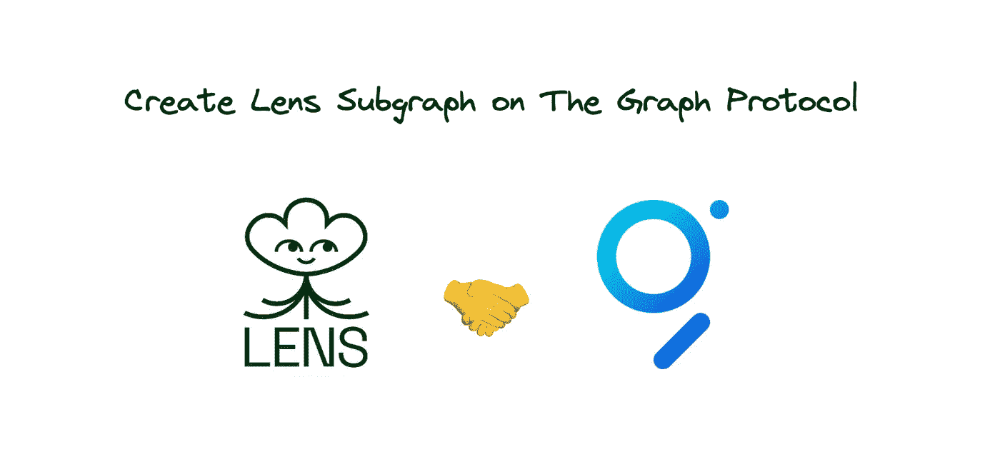
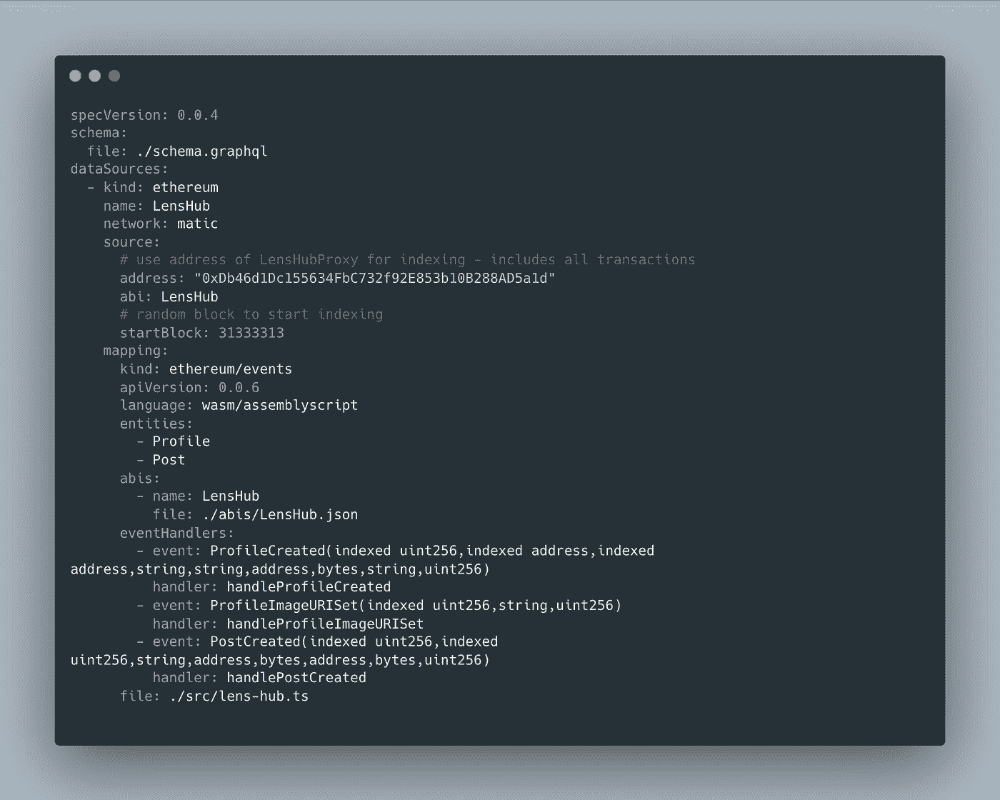
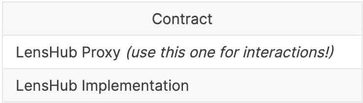
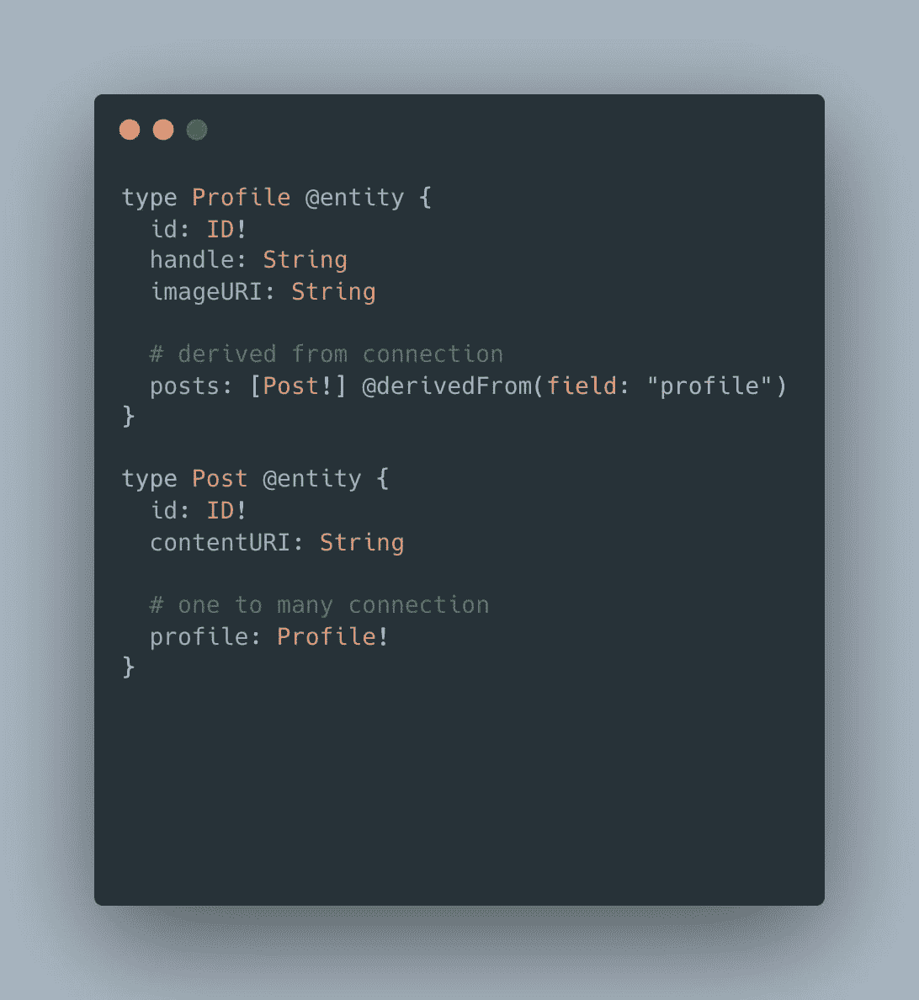
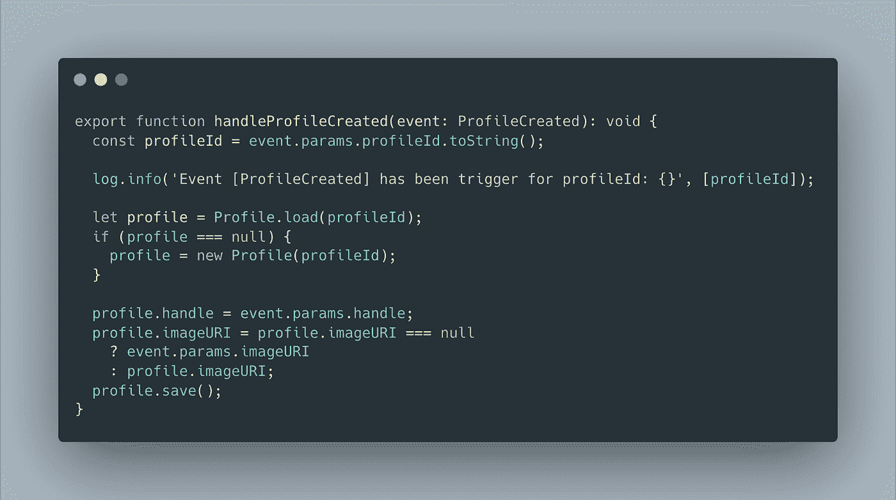
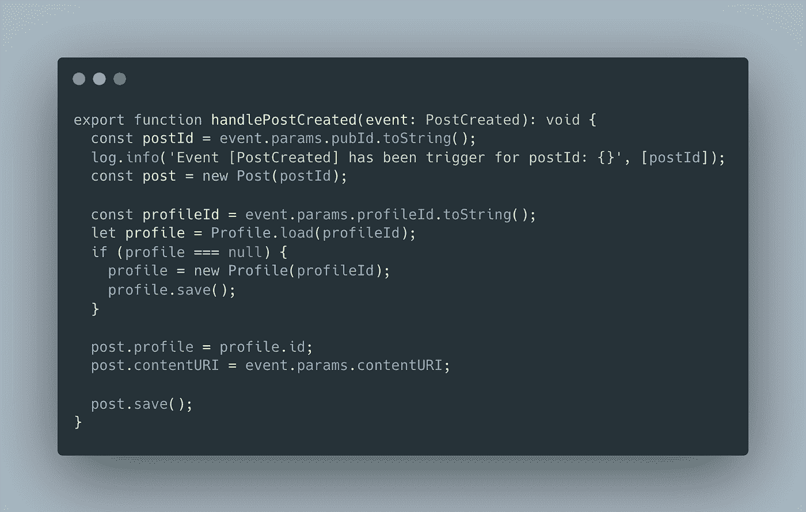
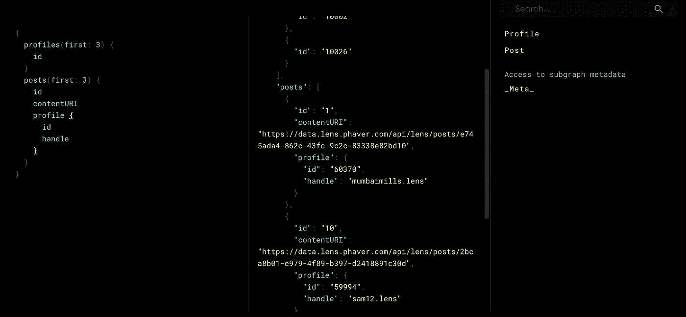

# 在图形协议上创建镜头子图

> 原文：<https://blog.devgenius.io/create-lens-subgraph-on-the-graph-protocol-8acfbac94ea8?source=collection_archive---------11----------------------->

在图上创建透镜子图协议

# 🔗链接

*   [github:andriishupta/the graph-hello-world](https://github.com/andriishupta/thegraph-hello-world)
*   [子图:andriishupta/hello-world](https://thegraph.com/hosted-service/subgraph/andriishupta/hello-world)
*   [图表文档](https://thegraph.com/docs/en/developing/creating-a-subgraph/)
*   [镜头文档](https://docs.lens.xyz/docs)

# 📰发布于

*   [个人博客💻](https://blog.andriishupta.dev)
*   [中型✍️](https://andriishupta.medium.com/)
*   [开发社区👩‍💻👨‍💻](https://dev.to/andriishupta)

# ✨

最初，我通过参与 [DeveloperDAO](https://twitter.com/developer_dao) 一个做同样事情的项目——索引镜头协议而熟悉了这个图表。附:本教程是对现有代码的复制粘贴，我从头开始创建了一个库来理解图形的基础以及如何开始。我需要开发我的子图来测试事件如何被索引。

# 🤓分散查询

> [*图*](https://thegraph.com/en/) *是以太坊、IPFS 等网络查询的索引协议。任何人都可以构建和发布开放的 API，称为子图，使数据易于访问。*

许多不同的工具和 API 帮助我们使用集中式 API 查询区块链数据，就像我们过去使用 web2 一样。我最喜欢的是[炼金术](https://www.alchemy.com/)和 [infura](https://infura.io/) 。

但是，如果我们想要去中心化，我们必须使用去中心化的工具。

> *所有数据都以可验证的完整性在开放网络上存储和处理。该图使查询这些数据变得快速、可靠和安全。*

# 镜头

> [*Lens Protocol*](https://lens.xyz/)*是一个可组合的分散式社交图，随时可供您构建，因此您可以专注于创建出色的体验，而不是扩展您的用户。*
> 
> 拥有自己的内容。拥有你的社交图谱。拥有您的数据。

有了 [Lens API](https://docs.lens.xyz/docs) ，我们可以用协议做任何我们想做的事情，但它仍然包括 web2 原则，并有一个基于智能合同数据构建的不同事物的集中式数据库。

如果我们想要得到真实的区块链数据，我们需要使用一个像图表一样的协议。

*免责声明:关于镜头 API 集中部分的假设是基于智能合约没有的功能，例如:“喜欢”功能。我非常喜欢 Lens API，99.9%的时候我会把它作为个人偏好，平衡集中式和分散式工具*。

# 👀如何创建子图

*在本教程中，我将给出一个使用* [*托管服务*](https://thegraph.com/hosted-service) 创建子图的例子——它将在几个月后关闭。尽管如此，编码方法不会有什么不同，只是在内部部署方式上有所不同。有了托管服务，更容易用于测试目的。

## [图形初始化](https://thegraph.com/docs/en/deploying/hosted-service/#create-a-subgraph)

*   安装[图形界面](https://github.com/graphprotocol/graph-cli)
*   运行`graph init --product hosted-service`
*   当您需要添加协议、名称和合同地址时，请遵循 CLI 步骤

您将获得一个生成的项目。主入口点是**子图. yaml** 。这是我的子图的完成版本。

🔗[源代码](https://github.com/andriishupta/thegraph-hello-world/blob/main/subgraph.yaml)

*你可以阅读更多关于什么是* [*子图清单*](https://thegraph.com/docs/en/developing/creating-a-subgraph/#the-subgraph-manifest)

## 源块

指示从哪个地址开始索引。许多合同使用[代理升级模式](https://docs.openzeppelin.com/upgrades-plugins/1.x/proxies)，这有助于修复关键错误或更新实现。这就是为什么我添加了 LensHub ABI( [应用程序二进制接口](https://www.alchemy.com/overviews/what-is-an-abi-of-a-smart-contract-examples-and-usage))作为源 ABI，然后将地址改为[代理](https://docs.lens.xyz/docs/deployed-contract-addresses)`startBlock`——我选择了一些随机的块用于测试目的，所以它不会从头开始索引——这需要更多的时间。通常，该值被省略或等于合同创建的块。

要获得 ABI，您可以:

*   从以太扫描/多边形扫描整体复制[合同 ABI](https://polygonscan.com/address/0xDb46d1Dc155634FbC732f92E853b10B288AD5a1d#code)
*   去[remix.ethereum.org](https://remix.ethereum.org/)，复制 github 项目，编写合同

我采用了 50/50 的方法，比如 Lens has library `[Events.sol](https://github.com/lens-protocol/lens-protocol/blob/main/contracts/libraries/Events.sol)`不是作为主合同的一部分编译的。

# `graph codegen`

在适当的设置之后，我们可以运行代码生成——我们将获得所有类型的代码。

✨ [图表](https://thegraph.com/docs/en/developing/creating-a-subgraph/)有很好的文档，所以跟随它，在那里找到所有的答案。✨

# 心态转变

作为一名使用数据库的开发人员，我开始线性思考:实体创建->实体更新。但是事件可以从`startBlock`开始索引，并且在时间上是非线性的，所以即使我们像`handleProfileImageURISet`一样索引事件，我们也需要检查实体以前是否存在(在代码示例中有更多)。

为了找到更多的技巧，Graph 文档有一个章节[“定义实体”](https://thegraph.com/docs/en/developing/creating-a-subgraph/#defining-entities)——它完整地描述了在创建模式时应该考虑的事情。

> *在定义实体之前，重要的是后退一步，考虑数据是如何构建和链接的。*

# 密码

众所周知，模式以及如何创建我们的数据至关重要。让我们看看我是如何添加实体定义的:

🔗[源代码](https://github.com/andriishupta/thegraph-hello-world/blob/main/schema.graphql)

`Profile`是`@entity`，包括我从`[ProfileCreated](https://docs.lens.xyz/docs/events#profilecreated)`事件中获取的默认字段和`posts`字段，是一个[实体关系](https://thegraph.com/docs/en/developing/creating-a-subgraph/#entity-relationships)

在这种情况下，这是一个“一对多”的关系，它使用了 Graph 推荐我们使用的[反向查找](https://thegraph.com/docs/en/developing/creating-a-subgraph/#reverse-lookups)方法。

> *对于一对多关系，关系应始终存储在“一”方，而“多”方应始终派生。…将显著提高索引和查询子图的性能…*

`Post`也是一个`@entity`。都有一个`ID`，对于子图应该是唯一的。

在`lens-hub.ts`中有对应于我们想要索引的事件的函数。

## `handle*Created`

正如我们所看到的，即使对于一个新帖子，我们也要检查概要文件是否已经存在。我发现了在子图部署和索引期间得到的错误，当我只是想加载 profile 来发布时，它说了类似“Profile 不能为 null”的话。

该图还支持“合并”方法——这意味着如果我们创建一个新的 Profile 实例并且它已经存在——这是可以的，因为子图会尝试合并字段。我想在例子中成为更精确的原因，我看到在每一个我们希望创造某物的地方——我们首先检查它是否已经被创造了。

例子:我创建了一个帖子，子图知道这个帖子应该有一个概要。Profile 事件在 Post 之前，所以我们没有配置文件，我们需要创建它；即使你能想到“没有个人资料怎么能创建一篇文章”，它也不能，但是关于这篇文章的事件我们可以先进行索引。

🔗[源代码](https://github.com/andriishupta/thegraph-hello-world/blob/main/src/lens-hub.ts)

# ✅测试

要了解它是如何工作的，你可以访问我的[子图:andriishupta/hello-world](https://thegraph.com/hosted-service/subgraph/andriishupta/hello-world) 。它有一个预定义的“测试”查询，将为您提供个人资料和职位的信息。您可以修改它以在查询窗口中获得更多或更少的信息。

# 🙇

感谢阅读！

*原载于*[*https://blog . andriishupta . dev*](https://andriishupta.dev/create-lens-subgraph-on-the-graph-protocol)*。*