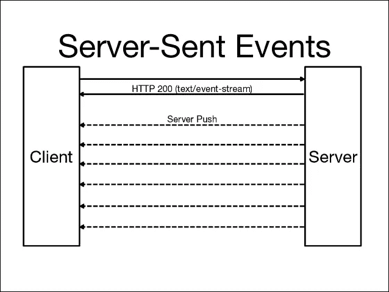

# 使用 SSE 创建通知 Laravel Webapp

> 原文：<https://blog.devgenius.io/create-notification-laravel-webapp-with-sse-1fadd509c33b?source=collection_archive---------1----------------------->

创建实时网站或在 webapp 上创建通知最常用的方法是使用 websocket，如 socket.io、firebase 或 pusher。但是这次我想分享不同的方法。使用服务器发送事件(SSE)创建通知。

SSE 正在用 javascript 在前端创建一个监听器。侦听器将订阅服务器发送的事件数据流。和服务器推送事件数据流，它与 websocket 方法相似，但不同的是我们不需要一个代理来发送它。

我不是说这是正确的方式，我认为 websocket 仍然是最好的，更值得推荐。但是这个方法可以帮助你，即使你没有足够的资源。它不需要监听服务器，如 socket.io，firebase 或 pusher。

让我们试试吧。

创建控制器，然后将其路由到此函数。

在下面添加您的标题模板脚本

**注意**:我在我的上一个项目中使用了它，它在 chrome 上工作得很好，但在 firefox 上有点滞后。但是我的客户说没问题，因为他总是用 chrome 来访问它。