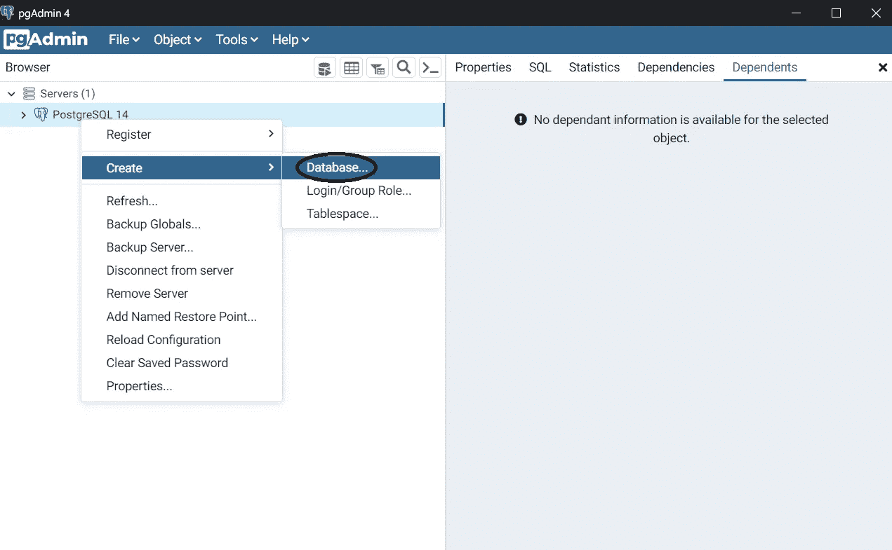
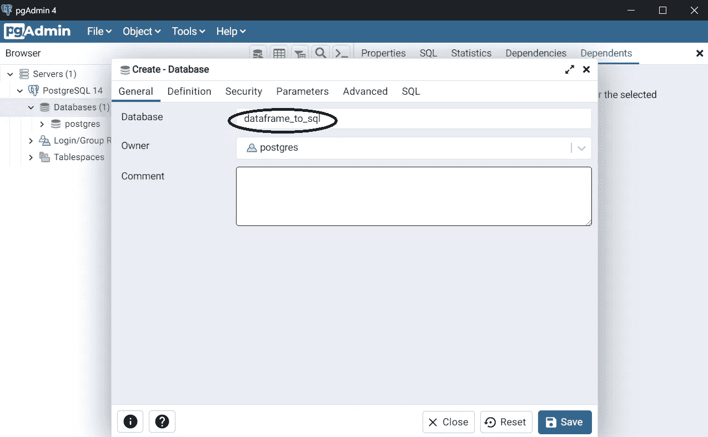
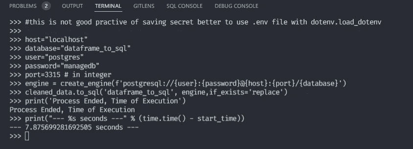
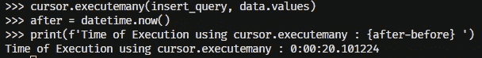
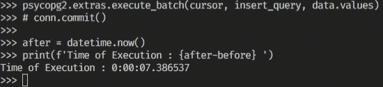
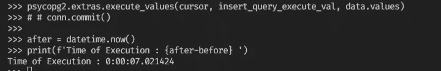
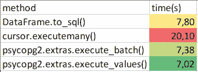

# 从 Pandas 数据框架创建 PostgreSQL 数据库

> 原文：<https://blog.devgenius.io/create-postgresql-database-from-pandas-dataframe-b759b3b986e9?source=collection_archive---------1----------------------->

本杰明·雷曼在 [Unsplash](https://unsplash.com?utm_source=medium&utm_medium=referral) 上的照片

在这篇中型文章中，我想比较如何将 pandas 数据帧转换成 PostgreSQL 数据库的不同的 T4 方法。

**指标**:

0.准备需求

0.a .通过 PgAdmin4 在 PostreSQL 中创建数据库

1.  数据理解
2.  使用 pandas to SQL 方法将 Pandas DataFrame 转换为 Postgres DB
3.  使用钻头手动方法

3.a .创建表格

3.b .用几种方法插入值

0.我们需要的要求:

a.已安装的 PostgreSQL 数据库

0.a .创建数据库

1.  数据理解和预处理

根据以上检查，数据集有 **83.691** 行和 **20** 列。但是，有一个几乎整个列的值都丢失了( **ehail_fee** )。为了处理丢失的值，我决定放弃这个特性。还有另一个缺失值。在这种情况下，我删除了 VendorID、passanger _ count、payment_type、trip_type 和 congestion _ overload 的子集，因为这不是机器学习案例，目的是演示从 dataframe 到 PostgreSQL DB 的转换过程。

基于这些方法，我创建了一个函数来包装基本的数据预处理

理解数据后，我们可以进入下一步。

2.使用 Pandas 将 DataFrame 转换为 Postgres DB。to_sql 方法

文件:[https://pandas.pydata.org/docs/reference/api/pandas.data frame . to _ SQL . html #熊猫。DataFrame.to_sql](https://pandas.pydata.org/docs/reference/api/pandas.DataFrame.to_sql.html#pandas.DataFrame.to_sql)

基本功能

**data frame . to _ SQL(*name*， *con* ， *schema=None* ， *if_exists='fail'* ， *index=True* ， *index_label=None* ， *chunksize=None* ， *dtype=None* ，*method = None*)【T33**

名称=表名

con = sqlite3 . connection/[sqlalchemy . engine](https://docs.sqlalchemy.org/en/13/core/connections.html)

if_exists =如果表已经创建，您将如何处理该表默认“失败”另一个选项(“替换”和“追加”)

这个过程花了将近**7.8 秒**，现在我们可以假设这个过程有点慢。

3.使用手动方法

3.a .创建一个 PostgreSQL 连接器，并基于数据帧创建表(如上)

3.b. 1 使用 cursor.executemany(query，vars_list)方法插入

***方法:cursor.executemany(query，vars _ list)***

参数:

查询:sql 查询

vars _ list:tuple/mappings

根据文档 [*站点*](https://www.psycopg.org/docs/cursor.html)*execute many 函数需要两个参数 query(postgesql 命令)和 var_list(参数元组或映射)*

**

*使用 executemany 方法插入值所需的时间约为 **10s。***

*3.b.2 使用 psycopg2.extras.execute_batch()方法插入*

****方法:psycopg 2 . extras . execute _ batch(cur*， *sql* ， *argslist)****

*参数:*

**cur* :连接的光标，*

**sql :* sql 查询，*

**argslist* :元组/可映射序列。*

**

*与之前的方法相比，**7.3 秒**有显著增加。*

*3.b.3 使用 psycopg 2 . extras . execute _ values(*)方法*插入*

****方法:psycopg 2 . extras . execute _ values(cur，sql，argslist)****

*参数:*

**cur* :连接的光标，*

**sql :* sql 查询，*

**argslist* :元组/可映射序列。*

*与 psycopg2.extras.execute_batch 相比，语法看起来是一样的。但是，sql 命令是不同的。在 execute_values 中，对于许多列输入，语法只需要“%s ”,而不是 execute.batch()函数中的每个列输入都需要“%s”。*

**

*因为我只是比较了将 pandas 数据帧转换成 postgresql 数据库需要多长时间，所以我没有提交这个过程。实际上，您必须在插入后提交。最后一种方法最快，产生 **7.0s(最快)。***

***结论***

*时间比较*

**

*作者的 excel 表格屏幕截图*

*基于时间，最快的方法是 **execute_values** 方法。最慢的是。执行许多方法。其他的在大约 7 秒时有相似的性能。*

*感谢您的关注。你可以通过我的 [LinkedIn](https://www.linkedin.com/in/fakhrirobi/) 联系我，或者你可以在这里星/叉/关注我的 github 账户[。](https://github.com/fakhrirobi)*

*或者，如果你想了解更多关于我以前的媒体文章:*

***我的 Fullstack Timeseries 项目:***

***第一部分:** [**时间序列预测:航空客运(时间序列端到端项目第一部分)**](/time-series-forecasting-passenger-air-traffic-time-series-project-part-1-da51d4e8520a)*

***第二部分:** [**使用 Dash 创建时间序列仪表板(时间序列端到端项目第二部分)**](https://medium.com/@fakhrirobi.fra/create-timeseries-dashboard-using-dash-timeseries-end-to-end-project-part-2-38f0319e952?source=your_stories_page----------------------------------------)*

***第 3 部分:** [**使用 Fast API 和 Heroku 将预测模型部署为 API(时间序列端到端项目第 3 部分)**](/deploy-forecasting-model-as-api-with-fast-api-and-heroku-timeseries-end-to-end-project-part-3-34692d980c3?source=your_stories_page----------------------------------------)*