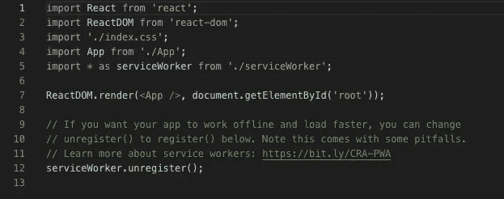

# 创建 React 应用程序——服务人员到底是什么？

> 原文：<https://blog.devgenius.io/create-react-app-what-the-heck-is-a-service-worker-566dbd815b0d?source=collection_archive---------20----------------------->

你有没有想过什么是服务工作者，为什么他们会自动内置到`create-react-app`应用程序中？

照片由 [sol](https://unsplash.com/@solimonster?utm_source=unsplash&utm_medium=referral&utm_content=creditCopyText) 在 [Unsplash](https://unsplash.com/s/photos/worker?utm_source=unsplash&utm_medium=referral&utm_content=creditCopyText) 上拍摄

我构建 React 应用程序已经有一段时间了，我一直质疑为什么在我的应用程序中会自动调用一个默认的 service worker 类。老实说，这通常是我从应用程序中移除的第一件事，因为我从未使用过它们，也不太了解它们的用途。

下面是执行`create-react-app`后`index.js`文件的样子:

create-react-app 后的 index.js 文件

正如您在底部看到的，有一个简短的描述和一个链接，可以了解更多有关如何使用服务人员的信息。默认情况下，会调用 unregister()函数，并且需要将其更改为 register()，以便使用服务工作器的功能。

除了 index.js 文件之外，您还可以查看一下在`src/serviceWorker.js`文件中组成服务工作者的实际代码。如果没有`create-react-app`为您生成的这个方便的文件，您将不得不自己手动编码所有的注册、安装、缓存和返回请求，以便实现这种类型的功能，这将会有点耗时。

## 那是什么？

基本上，服务人员使您的应用程序能够在后台离线运行您的客户端，并与网页分离，从而实现不需要用户交互或网页的特定功能。通过使用这些助手，您可以为 web 创建更快、更可靠的应用程序，为您的用户提供更具吸引力的移动体验。

由于它们的异步特性，它们大量使用承诺，所以如果你还不知道承诺是什么，我会在尝试使用服务工作者之前从这里开始。如果你需要从某个地方开始学习承诺，你可以看看我的博客[这里](https://medium.com/dev-genius/i-promise-there-is-more-data-728e2048449a)。

服务助手的常见用途是推送通知或后台同步。例如，每当你收到来自脸书或 Instagram 的通知，那都是因为一名服务人员在工作。

由于服务人员相对较新，他们确实有自己的缺点。首先，如果 worker 的实际安装失败，很难判断它是否没有出现在浏览器中。要真正检查这个问题，您必须打开 Chrome DevTools，并在安装事件开始时放入一个调试器。由于一些默认设置，可能会出现其他问题，如获取请求没有凭据，或者如果您的应用程序不支持 CORS，默认情况下也会失败。这些问题可以通过指定在获取请求中包含凭据并添加一个`no-cors`选项来解决。

对于我们今天使用的应用程序，服务工作者是一个强大的工具，应该充分利用它们的潜力，希望随着它们越来越受欢迎，当前的错误将在不久的将来得到纠正。