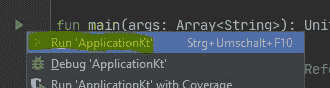
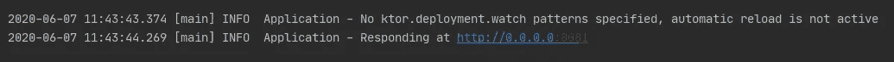
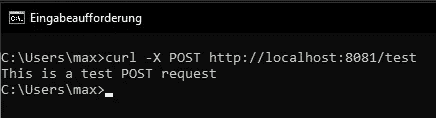

# 用 ktor 创建简单的 POST 请求

> 原文：<https://blog.devgenius.io/create-simple-post-request-with-ktor-591deab01861?source=collection_archive---------18----------------------->

在本教程中，我们将在 ktor 中创建我们的第一个后置路径并测试它。

Ktor 是一个用 kotlin 编程语言构建异步服务器的框架。


照片由[本多·金](https://unsplash.com/@bundo?utm_source=medium&utm_medium=referral)在 [Unsplash](https://unsplash.com?utm_source=medium&utm_medium=referral) 上拍摄

# 要求

对于本教程，要求您已经创建了“Hello World”ktor 应用程序。如果你没有，你可以看看我的 youtube 视频，我在那里解释了如何开始。

这个视频的比特率质量很差，所以如果你喜欢读点什么，试试 jetbrains 的官方快速入门指南。

# 开始

所以让我们不要再等了，开始吧！

向我们的应用程序添加新的 post-Route 非常简单。您只需要向您的`routing`块添加一个新的 post()-method-call

```
routing **{
  ...** post("/test") **{** *call*.respondText("This is a test POST request")
  **}**}
```

## 一些解释

*   `/test`是我们执行路由必须调用的资源 url
*   当我们调用路由时，`call.respondText()`中的字符串将被返回

只是测试一下，看看下面，然后改变这两个参数，并试图理解你做了什么。

# 测试后路线

1.  单击主方法旁边的播放图标，然后单击“运行应用程序”



play-main()方法旁边的图标

2.在控制台中，您应该可以看到您的服务器正在哪个端口上运行。在我的情况下，这是端口 8081。这对下一步很重要



应用程序启动后的控制台窗口

3.打开终端并执行以下命令

```
curl -X POST http://localhost:8081/test
```



命令行结果

您应该会看到我们在源代码中指定的消息“这是一个测试 POST 请求”。

在 curl 命令中指定正确的端口很重要。否则你应该得到错误`**Connection refused**`