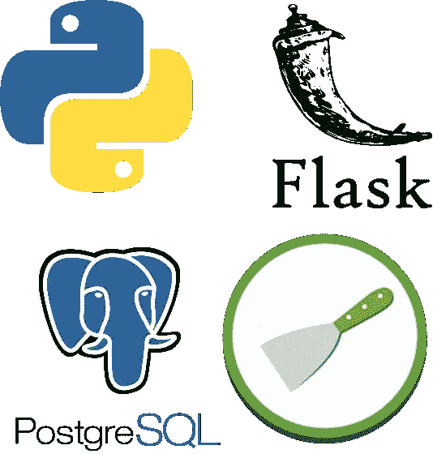
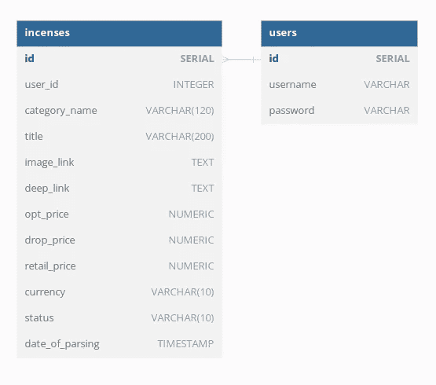
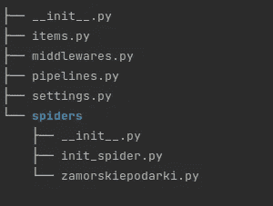
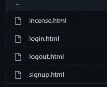

# 创建强大的 Flask + Scrapy + PostgreSQL 项目！

> 原文：<https://blog.devgenius.io/create-strong-flask-scrapy-postgresql-project-3ab6a3d45b56?source=collection_archive---------2----------------------->

最好的学习方法是用你想学的工具创建项目！这篇文章将向你展示如何使用 Scrapy，Flask 和 PostgreSQL 数据库！



好久不见，但幸运的是，你在这里，我带你创建一个强大的 Flask + Scrapy + PostgreSQL 项目，它将教你如何使用这些工具！跟随 [GitHub 资源库链接](https://github.com/flyosprey/incense_extractor)来研究我的代码，并在阅读本文时保持关闭。

## 内容计划:

1.  *数据库准备*
2.  *Scrapy 项目创建
    2.1 开始项目
    2.2 生成蜘蛛
    2.3 创建辅助
    2.4 构建蜘蛛*
3.  *烧瓶项目创建
    3.1 Models.py
    3.2 模板
    3.3 装饰者
    3.4 控制器
    t16】⠀⠀*3 . 4 . 1 注册
    ⠀⠀3.4.2 登录
    ⠀⠀3.4.3 注销
    ⠀⠀3.4.4 主页
    3.5 用户参数验证
    3.6 数据库调度**
4.  *烧瓶+刮刀一体化*
5.  *结果*
6.  *结论*


# 1.数据库准备

由于我们要创建一个 Scrapy 爬虫，我们应该了解数据库应该是什么样子。这取决于应该提取什么信息。

让我们爬上[出售熏香和其他不同工作人员的站点](https://zamorskiepodarki.com/uk/blagovoniya-i-aksessuary/aromapalochky-tulasi/)。所以，为了它，我们应该准备一张桌子。

此外，我们需要为 Flask 站点准备一个注册用户表。

那么数据库将如下所示:



**Incenses** 表告诉我们应该提取哪些字段，而 **Users** 表不需要任何注释，它只有 id、用户名和密码。此外，**这些表具有多对一的关系**，这意味着所有提取的产品都将被附加到一个需要爬行的用户。 **user_id 是** **的** **外键**。

下一步我们需要安装 PostgreSQL。

> 按照官方文档的[链接](https://www.postgresql.org/download/)安装 PostgreSQL。

安装后需要通过终端以默认用户**的身份连接到 PostgreSQL，postgres** 使用以下命令:

```
sudo -u postgres psql
```

让我们为默认用户 **postgres** 设置一个密码:

```
\password postgres
```

然后需要创建一个名为**香**的数据库:

```
CREATE DATABASE incense;
```

我们将在 **Models.py** 段落中做的其他事情，如创建表格

如果你愿意，你可以创建和使用另一个用户，但不要忘记给他特权。


# 2.零碎的项目创建

## 2.1 启动项目

首先，我们需要使用以下代码行创建一个项目:

```
scrapy startproject incense
```

## 2.2 生成蜘蛛

之后，蜘蛛应该以如下方式创建:

```
cd incense/incense/spiders && scrapy genspider zamorskiepodarki zamorskiepodarki.com
```

在这个阶段，我们有一个关于下一棵树的零碎项目:



## 2.3 创建辅助文件

让我们创建 **init_spider.py** ，在其中我们将为将来的请求实现一些参数的初始化:

```
from random_user_agent.user_agent import UserAgent
from random_user_agent.params import SoftwareName, OperatingSystem

def get_headers():
    user_agent = _get_random_user_agent()
    headers = {
        'authority': 'zamorskiepodarki.com',
        'accept': 'text/html,application/xhtml+xml,application/xml;q=0.9,image/avif,image/webp,image/apng,'
                  '*/*;q=0.8,application/signed-exchange;v=b3;q=0.9',
        'accept-language': 'en-US,en;q=0.9,ru;q=0.8,de;q=0.7,uk;q=0.6',
        'upgrade-insecure-requests': '1',
        'user-agent': user_agent
    }
    return headers

def _get_random_user_agent():
    software_names = [SoftwareName.CHROME.value]
    operating_systems = [OperatingSystem.WINDOWS.value, OperatingSystem.LINUX.value]
    user_agent_rotator = UserAgent(software_names=software_names, operating_systems=operating_systems, limit=100)
    user_agent = user_agent_rotator.get_random_user_agent()
    return user_agent
```

因为我们将发送 GET 请求来获取要提取的数据，所以我们只需要准备头部。随机**用户代理的创建需要每个请求看起来都是唯一的**。

此外，需要**延迟发送请求，以避免网站过载，并让爬虫更加匿名**。

将下面的命令放到 Scrapy 项目的 **settings.py** 中。

```
DOWNLOAD_DELAY = 1 # 1 second delay between requests.
```

## 2.4 内置蜘蛛

最后，我们准备实现蜘蛛的逻辑:

```
import re
import logging
from datetime import datetime
import scrapy
from scrapy.crawler import CrawlerProcess
from incense.spiders.init_spider import get_headers

class ZamorskiepodarkiSpider(scrapy.Spider):
    name = "zamorskiepodarki"
    allowed_domains = ["zamorskiepodarki.com"]
    start_urls = []

    def __init__(self, url_to_parse="", user_id=None, **kwargs):
        self.headers = get_headers()
        self.start_urls.append(url_to_parse)
        self.user_id = user_id
        if not self.user_id:
            raise Exception("user_id is None in scrape")
        super().__init__(**kwargs)
        self.images, self.pages, self.image_index = {"images": []}, None, None

    def start_requests(self):
        for url in self.start_urls:
            yield scrapy.Request(url=url, headers=self.headers, callback=self.parse)

    def parse(self, response, **kwargs):
        products = response.xpath("//div[@class='product-layout product-grid']")
        logging.debug("FIRST - %s", self.images)
        for product in products:
            logging.debug("URL - %s", response.url)
            product_link = product.xpath("div[@class='product-thumb']//div[@class='image']/a/@href").get()
            yield scrapy.Request(url=product_link, headers=self.headers, callback=self._get_image)
        # pagination
        next_page_url = self._next_page_url(response)
        if next_page_url:
            yield scrapy.Request(url=next_page_url, headers=self.headers, callback=self.parse)

    def _extract_images_link(self, response):
        products = response.xpath("//div[@class='product-layout product-grid']")
        for product in products:
            product_link = product.xpath("div[@class='product-thumb']//div[@class='image']/a/@href").get()
            yield scrapy.Request(url=product_link, headers=self.headers, callback=self._get_image)

    @staticmethod
    def _next_page_url(response) -> str or None:
        url = None
        next_pages_tag = response.xpath("//ul[@class='pagination']//li[@class='active']/following-sibling::li")
        next_pages_text = next_pages_tag.xpath("./a/text()").get()
        if next_pages_text and next_pages_text.isdigit():
            url = next_pages_tag.xpath("./a/@href").get()
        return url

    def _get_image(self, response):
        prices_data = self._get_prices_data(response)
        general_product_data = self._get_general_product_data(response)
        logging.debug("IMAGE SHOULD BE DOWNLOADED")
        incense_item = {"user_id": self.user_id, **general_product_data, **prices_data}
        yield incense_item

    @staticmethod
    def _get_general_product_data(response) -> dict:
        deep_link, date_of_parsing, status = response.url, datetime.now(), "NEW"
        category_name = \
            response.xpath("//ul[@class='breadcrumb']//li[@itemprop='itemListElement']//span/text()")[-1].get()
        image_link = response.xpath("//a[@class='thumbnail']/@href").get()
        title = response.xpath("//a[@class='thumbnail']/@title").get().replace("(", "").replace(")", "")
        general_product_data = {"deep_link": deep_link, "date_of_parsing": date_of_parsing, "status": status,
                                "image_link": image_link, "title": title, "category_name": category_name.strip()}
        return general_product_data

    @staticmethod
    def _get_prices_data(response) -> dict:
        product_div = response.xpath("//div[@id='product']")
        currency = product_div.xpath("..//meta[@itemprop='priceCurrency']//@content").get()
        opt_price = product_div.xpath("..//span[@class='price-new price-opt-new']/b//text()").get()
        opt_price = float(re.search(r"\d+.\d+", opt_price)[0])
        drop_price = round(opt_price * 1.1, 2)
        retail_price = product_div.xpath("..//div[@class='price-detached price-retail']/span//text()").get()
        retail_price = float(re.search(r"\d+.\d+", retail_price)[0])
        prices_data = {"opt_price": opt_price, "drop_price": drop_price, "retail_price": retail_price,
                       "currency": currency}
        return prices_data

if __name__ == "__main__":
    process = CrawlerProcess()
    process.crawl(ZamorskiepodarkiSpider)
    process.start()
```

在这里，我们简单地提取一些信息，这些信息将被放入数据库。实现了分页逻辑，所以所有页面都将被抓取。


# 3.Flask 项目创建

## 3.1 模型. py

现在让我们构建已经在 **models.py** 中准备好的表格:

> 重要提示:PostgresQL 应该安装在您的计算机上。

```
import logging
import psycopg2
# credentials.py gets credentials from .env
from credentials import HOSTNAME, USERNAME, PASSWORD, DATABASE

class IncenseProducts:
    def __init__(self):
        self.connection = psycopg2.connect(host=HOSTNAME, user=USERNAME, password=PASSWORD, dbname=DATABASE)
        self.cur = self.connection.cursor()
        logging.debug("CREATING DATABASE")
        self.cur.execute("""
                CREATE TABLE IF NOT EXISTS incenses(
                    id SERIAL PRIMARY KEY, 
                    user_id INTEGER REFERENCES users(id) ON DELETE CASCADE,
                    category_name VARCHAR(120),
                    title VARCHAR(200),
                    image_link TEXT,
                    deep_link TEXT,
                    opt_price NUMERIC,
                    drop_price NUMERIC,
                    retail_price NUMERIC,
                    currency VARCHAR(10),
                    status VARCHAR(10),
                    date_of_parsing TIMESTAMP
                )
                """)
        self.connection.commit()

    def process_item(self, item):
        self.cur.execute("SELECT * FROM incenses WHERE title = '%s'" % item['title'])
        result = self.cur.fetchone()
        if result:
            logging.debug("ITEM IS ALREADY IN EXIST: '%s'", item['title'])
            self.cur.execute("UPDATE incenses SET status = 'OLD', "
                             "opt_price = %(opt_price)s, "
                             "drop_price = %(drop_price)s, "
                             "retail_price = %(retail_price)s, "
                             "date_of_parsing = %(date_of_parsing)s "
                             "WHERE title = '%(title)s'" % item)
        else:
            logging.debug("INSERTING ITEM")
            self.cur.execute("INSERT INTO incenses "
                             "(user_id, category_name, title, image_link, deep_link, opt_price, drop_price, retail_price, "
                             "currency, status, date_of_parsing) VALUES (%(user_id)s, '%(category_name)s', '%(title)s', "
                             "'%(image_link)s', '%(deep_link)s', %(opt_price)s, %(drop_price)s, %(retail_price)s, "
                             "'%(currency)s', '%(status)s', '%(date_of_parsing)s')" % item)
        self.connection.commit()
        self.cur.close()
        self.connection.close()
        return item

class Users:
    def __init__(self):
        self.connection = psycopg2.connect(host=HOSTNAME, user=USERNAME, password=PASSWORD, dbname=DATABASE)
        self.cur = self.connection.cursor()
        logging.debug("CREATING DATABASE")
        self.cur.execute("""
                        CREATE TABLE IF NOT EXISTS users (
                        id SERIAL PRIMARY KEY,
                        username TEXT NOT NULL UNIQUE,
                        password TEXT NOT NULL
                        );
                        """)
        self.connection.commit()

    def create_user(self, user_credentials):
        query = "SELECT * FROM users WHERE username='%(username)s' AND password='%(password)s'" % user_credentials
        self.cur.execute(query)
        user = self.cur.fetchone()
        if user:
            logging.debug("USER ALREADY EXISTS: '%s'", user_credentials["username"])
            result = {"error": {"message": "Such user already exists"}}
        else:
            logging.debug("CREATING USER")
            self.cur.execute("INSERT INTO users "
                             "(username, password) VALUES (%(username)s, %(password)s)", user_credentials)
            self.cur.execute("SELECT * FROM users WHERE username=%(username)s", user_credentials)
            user = self.cur.fetchone()
            result = {"user_id": user[0]}
        self.connection.commit()
        self.cur.close()
        self.connection.close()
        return result
```

## 3.2 模板

第二步告诉我们，我们需要构建前端。为了简化这个过程，让我们使用免费的 HTML/CSS 模板并编辑它们:



[https://github . com/flyo sprey/香 _ 提取器/tree/master/flask _ app/templates](https://github.com/flyosprey/incense_extractor/tree/master/flask_app/templates)

## 3.3 装修工

因为我们希望 Flask 网站要求用户注册，所以我们需要在用户登录或注销时限制对某些页面的访问:

```
from functools import wraps
from flask import session, redirect
from flask_api import status

def login_required(f):
    @wraps(f)
    def decorated_function(*args, **kwargs):
        if session.get('is_logged_in', False) is False:
            return redirect('/login', code=status.HTTP_302_FOUND)
        return f(*args, **kwargs)
    return decorated_function

def logout_required(f):
    @wraps(f)
    def decorated_function(*args, **kwargs):
        if session.get('is_logged_in', False) is True:
            return redirect('/incense', code=status.HTTP_302_FOUND)
        return f(*args, **kwargs)
    return decorated_function
```

**为了保持用户登录，我们可以使用 flask 库的一个会话**。当用户注销时，会话将被清除，并保留用户的一些数据，直到用户登录。

## 3.4 控制器

因为我们有模板，我们需要为他们每个人建立一个后端。

## 3.4.1 注册

首先，在这个阶段让我们实现用户注册逻辑:

```
from flask import request, render_template, make_response
from flask_api import status
from flask_restful import Resource
from flask import redirect, url_for, session
from flask_app.models import Users
from flask_app.decorators import logout_required

class SignUpPage(Resource):
    DEFAULT_HEADERS = {'Content-Type': 'text/html'}

    @logout_required
    def get(self):
        rendered_result = render_template("signup.html", result={})
        return make_response(rendered_result, status.HTTP_200_OK, self.DEFAULT_HEADERS)

    @logout_required
    def post(self):
        log_in_args = request.form
        result = Users().create_user(log_in_args)
        if result.get("error"):
            rendered_result = render_template("signup.html", result=result)
            return make_response(rendered_result, status.HTTP_403_FORBIDDEN, self.DEFAULT_HEADERS)
        else:
            session["is_logged_in"] = True  # Set a user logged in
            session["user_id"] = result["user_id"]
            return redirect(url_for("incense"), code=status.HTTP_302_FOUND)
```

在该文件中，我们使用我们的用户模型创建一个新用户，并保持该用户登录。注意，这里我们使用了**@ logout _ required**decorator，如果用户已经登录，它将限制对页面的访问。

## 登录

我们的下一步是实现用户登录逻辑:

```
from flask import request, render_template, make_response
from flask_api import status
from flask_restful import Resource
from flask_app.database_dispatcher import DatabaseDispatcher
from flask import redirect, url_for, session
from flask_app.decorators import logout_required

class LoginPage(Resource):
    DEFAULT_HEADERS = {'Content-Type': 'text/html'}

    @logout_required
    def get(self):
        rendered_result = render_template("login.html", result={})
        return make_response(rendered_result, status.HTTP_200_OK, self.DEFAULT_HEADERS)

    @logout_required
    def post(self):
        log_in_args = request.form
        result = DatabaseDispatcher().get_user(log_in_args)
        if result.get("error"):
            result = {"error": {"message": "Credentials are wrong"}}
            rendered_result = render_template("login.html", result=result)
            return make_response(rendered_result, status.HTTP_401_UNAUTHORIZED, self.DEFAULT_HEADERS)
        else:
            session["is_logged_in"] = True
            session["user_id"] = result["user_id"]
            return redirect(url_for("incense"), code=status.HTTP_302_FOUND)
```

## 退出登录

也许，最简单的是用户注销逻辑。

```
from flask_api import status
from flask_restful import Resource
from flask import redirect, url_for, session
from flask_app.decorators import login_required

class LogoutPage(Resource):
    DEFAULT_HEADERS = {'Content-Type': 'text/html'}

    @login_required
    def get(self):
        session.clear()
        return redirect(url_for("login"), code=status.HTTP_302_FOUND)
```

这里我们使用了**@ log in _ required**decorator，它限制了用户退出时对页面的访问。

## 主页

最后，我们应该处理我们的主页:

```
from flask import request, render_template, make_response
from flask_api import status
from flask_restful import Resource
from flask_app.scrapy_trigger import ScrapyTrigger
from flask_app.database_dispatcher import DatabaseDispatcher
from flask import session
from flask_app.decorators import login_required
from flask_app.user_input_validator import UserInputValidator

class Incense(Resource):
    __slots__ = ("DEFAULT_HEADERS",)

    def __init__(self):
        self.DEFAULT_HEADERS = {'Content-Type': 'text/html'}

    @login_required
    def get(self):
        rendered_result = render_template("incense.html")
        return make_response(rendered_result, status.HTTP_200_OK, self.DEFAULT_HEADERS)

    @login_required
    def post(self):
        # The page has two options
        # 1\. Extract products
        # 2\. Show already extracted products
        user_id, form_args = session["user_id"], request.form
        is_extract_args_valid, is_show_args_args_valid = self._put_through_validator(form_args)
        if is_extract_args_valid:
            table_name, scrape = "Table of extracted data", ScrapyTrigger()
            result = scrape.parse_data(form_args["url"], user_id)
            rendered_result = render_template("incense.html", result=result, table_name=table_name)
            return make_response(rendered_result, status.HTTP_200_OK, self.DEFAULT_HEADERS)
        elif is_show_args_args_valid:
            table_name, dispatcher = "Table of already existing data", DatabaseDispatcher()
            result = dispatcher.get_exist_data(form_args, user_id)
            rendered_result = render_template("incense.html", result=result, table_name=table_name)
            return make_response(rendered_result, status.HTTP_200_OK, self.DEFAULT_HEADERS)
        else:
            return {"result": "BAD REQUEST!"}, status.HTTP_400_BAD_REQUEST

    @staticmethod
    def _put_through_validator(form_args):
        validator = UserInputValidator()
        is_extract_args_valid, is_show_args_args_valid = validator.valid_extract_args(form_args), False
        if not is_extract_args_valid:
            is_show_args_args_valid = validator.valid_show_args(form_args)
        return is_extract_args_valid, is_show_args_args_valid
```

## 3.5 用户参数验证

因为我们有一个来自用户的 POST 请求，所以我们需要检查他发送的数据。

```
import re

class UserInputValidator:
    __slots__ = ("RESTRICTED_WORDS",)

    def __init__(self):
        self.RESTRICTED_WORDS = ("drop", "create", "role", "database", "insert", "alter", "select")

    @staticmethod
    def valid_extract_args(args):
        if "url" in args:
            if re.search(r"https?://zamorskiepodarki\.com/uk/.+?/.+?/", args["url"]):
                return True
        return False

    def valid_show_args(self, args):
        if "limit" in args:
            if args["limit"].isnumeric():
                if args.get("category_name"):
                    if self._check_restricted_words(args["category_name"]):
                        return False
                if args.get("title"):
                    if self._check_restricted_words(args["title"]):
                        return False
                return True
        return False

    def _check_restricted_words(self, text):
        for word in self.RESTRICTED_WORDS:
            if word in text.lower():
                return True
        return False
```

## 3.6 数据库调度程序

此外，我们需要向用户显示提取的数据，并获取用户 id 以将所有提取的产品附加到他身上。那么，让我们创建**数据库调度程序**，它将向我们发送我们需要的数据。

```
import logging
import psycopg2.extras
# credentials.py gets credentials from .env
from credentials import HOSTNAME, USERNAME, PASSWORD, DATABASE

class DatabaseDispatcher:
    def get_exist_data(self, filters, user_id) -> list:
        # Returns exists products to user by filters
        where_query_part, limit_query_part = self._build_where_and_limit_query_part(filters, user_id)
        full_query = self._build_full_query(where_query_part, limit_query_part)
        results = self._get_data(full_query)
        return results

    def get_extracted_data(self, limit, user_id) -> list:
        # Returns just extracted products to user
        query = "SELECT * FROM incenses WHERE user_id=%s ORDER BY date_of_parsing DESC LIMIT %s" % (user_id, limit)
        results = self._get_data(query)
        return results

    def get_user(self, user_credentials):
        # Returns user_id to attach extracted products to special user
        query = "SELECT * FROM users WHERE username='%(username)s' AND password='%(password)s'" % user_credentials
        user_credentials = self._get_data(query)
        if not user_credentials:
            result = {"error": {"message": "Credentials are wrong"}}
        else:
            result = {"user_id": user_credentials[0]["id"]}
        return result

    @staticmethod
    def _build_full_query(where_query_part, limit_query_part) -> str:
        # Create query by user's filters
        full_query = "SELECT * FROM incenses %s ORDER BY date_of_parsing DESC %s" \
                     % (where_query_part, limit_query_part)
        full_query = " ".join(full_query.split())
        return full_query

    def _build_where_and_limit_query_part(self, filters, user_id) -> (str, str):
        where_query_part, like_query_part, filters, limit = "", "", {**filters}, None
        for key in filters:
            field = self._get_field(key, filters)
            if key == "limit" and filters[key]:
                limit = filters[key]
                continue
            like_query_part += "%s LIKE %s, " % (key, field) if field else ""
        like_query_part = like_query_part.rstrip(", ")
        like_query_part = " AND %s" % like_query_part if like_query_part else ""
        where_query_part = "WHERE user_id=%s%s" % (user_id, like_query_part)
        limit_query_part = "LIMIT %s" % limit if limit else ""
        return where_query_part, limit_query_part

    @staticmethod
    def _get_field(key, filters) -> str:
        field = None
        if filters[key]:
            field = f"'%{filters[key]}%'"
        return field

    @staticmethod
    def _get_data(query) -> list:
        connection = psycopg2.connect(host=HOSTNAME, user=USERNAME, password=PASSWORD, dbname=DATABASE)
        cur = connection.cursor(cursor_factory=psycopg2.extras.RealDictCursor)
        logging.debug("CONNECTED TO DB")
        cur.execute(query)
        results = cur.fetchall()
        cur.close()
        connection.close()
        return results
```

# 4.*烧瓶+刮刀集成*

最后，在最后阶段，我们应该**将 Flask 集成到 Scrapy** 中，根据用户的请求运行一个蜘蛛。**触发 Scrapy's spider 的主要工具是钩针库**:

```
import time
import crochet # <---
from scrapy import signals
from scrapy.signalmanager import dispatcher
from scrapy.crawler import CrawlerRunner
from incense.spiders.zamorskiepodarki import ZamorskiepodarkiSpider
from flask_app.database_dispatcher import DatabaseDispatcher
from models import IncenseProducts

crochet.setup()  # setting up crochet to execute
CRAWL_RUNNER = CrawlerRunner()  # initialize CrawlerRunner

class ScrapyTrigger:
    def __init__(self):
        self.scrape_complete, self.number_of_items = False, 1

    def parse_data(self, url_to_parse, user_id):
        self.scrape_with_crochet(url_to_parse=url_to_parse, user_id=user_id)
        # Wait until crawling process is finished
        while self.scrape_complete is False:
            time.sleep(5)
        # Get just extracted products from DB
        result = DatabaseDispatcher().get_extracted_data(self.number_of_items, user_id)
        return result

    def crawler_result(self, item):
        # Count extracted products
        self.number_of_items += 1
        # Save extracted product
        save_obj = IncenseProducts()
        save_obj.process_item(item)

    @crochet.run_in_reactor
    def scrape_with_crochet(self, url_to_parse, user_id):
        # Deep to crawler_result func by item scraped signal
        dispatcher.connect(self.crawler_result, signal=signals.item_scraped)
        # Trigger spider and send url to parse data from
        eventual = CRAWL_RUNNER.crawl(ZamorskiepodarkiSpider, url_to_parse=url_to_parse, user_id=user_id)
        # Deep to finished_scrape when all requests are crawled
        eventual.addCallback(self.finished_scrape)
        return eventual

    def finished_scrape(self, *args, **kwargs):
        self.scrape_complete = True
```

# 5.结果

这个项目已经完成，可以使用了。让我们运行并测试它！


# 6.结论

让我们看看你会得到什么结果。
现在你知道如何使用:

1.  PostgreSQL 数据库并创建查询
2.  整理和解析数据
3.  烧瓶和构建后端
4.  前端并将其连接到后端
5.  钩针和集成刮刀+烧瓶
6.  模型和集成 Flask + PostgreSQL

*附:如果你喜欢这篇文章，* [*关注我*](https://medium.com/@vlad.bashtannyk) ，*点击几次“鼓掌”，然后* *留下反馈。祝你好运，高效编程！谢谢大家！*

关注我上[*LinkedIn*](https://www.linkedin.com/in/vladyslav-bashtannyk/)*和*[*GitHub*](https://github.com/flyosprey)！**