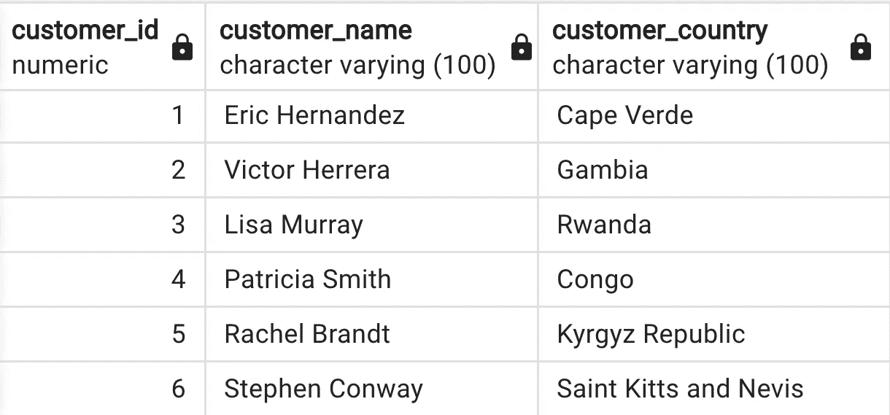

# 使用 Python 和 Faker 创建合成数据

> 原文：<https://blog.devgenius.io/create-synthetic-data-using-python-and-faker-54e6d10afa45?source=collection_archive---------3----------------------->

Miguel Teirlinck 在 [Unsplash](https://unsplash.com?utm_source=medium&utm_medium=referral) 上拍摄的照片

让我们想象你对这个令人惊奇的项目有**的想法。这个项目需要数据。当然，你会开始搜索寻找符合项目需求的数据集。你可能会到达像 [kaggle](https://www.kaggle.com/) 或 [data.world](https://data.world/) 这样的网站。但是你仍然没有你想要的数据，你应该在这里结束并埋葬你的项目想法吗？不要！下面是 **Python 库—** [**faker**](https://faker.readthedocs.io/en/master/) ，可以创建**合成数据**。**

在本文中，我将展示如何创建**人工销售表**，如下所示:

表 1.1

事不宜迟，让我们直接进入代码和解释。

这篇文章的代码存储在这个 [Github repo](https://github.com/Cloudy17g35/data-modeling-example) 中

导入模块并将 Faker 对象赋给变量 **fake** :

照片 1.2

# 客户表

照片 1.3

该函数采用一个参数— **row_number** 并创建行数等于 **row_number 的 **pandas 数据帧**。**

在每次迭代中，dataframe 中的新行(存储在变量 **df** 中)有 3 列:

*   客户标识
*   客户名称
*   客户 _ 国家

正在被创建。为了创建**客户名称**和**客户国家**，使用了 Faker 对象。

结果:

表 1.2

# 产品表

让我们用下面的代码创建产品表:

照片 1.4

这个函数使用一个参数 **fake_products** 作为字符串列表，返回 pandas dataframe。在这种情况下，存储在变量 **FAKE_PRODUCTS** 中的列表将被用作该函数的参数。

它迭代假冒产品列表中的每个产品，并在 dataframe(存储在变量 **df** 中)中创建一个包含 4 列的行，这是什么函数？

*   product_id(用[枚举](https://docs.python.org/3/library/functions.html#enumerate)得到的列表中对象的当前索引)
*   product_name(假冒产品列表中的当前产品)
*   产品价格(1 到 100 之间的随机数)
*   产品 _ 品牌(通过 Faker 方法创建的随机品牌)

结果:

表 1.3

# 销售表

最后一步是创建销售表，我们来看看这个函数:

照片 1.5

名为 **create_sales_table** 的函数有 3 个参数，其中 2 个是已经创建的表: **customer_table** 和 **product_table。** **number_of_rows** 是我们希望在**输出销售表**中的行数。当然这个函数的输出是**熊猫数据帧。**

这个函数做什么？

1.  创建空列表并将其存储在变量 **all_dfs** 中
2.  迭代范围 0 — **行数— 1** 中的每个数字
3.  从**客户表**和**产品表**中随机抽取一行
4.  水平连接**—在这个阶段，单行看起来像这样:**

****

**表 1.4**

**5.现在添加了 3 个新列:**

*   **数量(购买的产品数量—1 到 10 之间的随机数)**
*   **日期(交易日期—使用名为 **date_between_dates —** 的 Faker 对象和方法生成，更多信息请查看[文档](https://faker.readthedocs.io/en/master/providers/faker.providers.date_time.html)**
*   **transaction_id(迭代中的当前数目，范围从 0 到 **number_of_rows** — 1)**

**6.销售表单行追加到 **all_dfs****

**7.将每次迭代中生成的单行(当然是垂直的)连接成一个表，如下所示:**

****

**表 1.5**

**该表现在可能被加载到 sql 数据库中，并在您的项目中使用。**

**感谢阅读！**