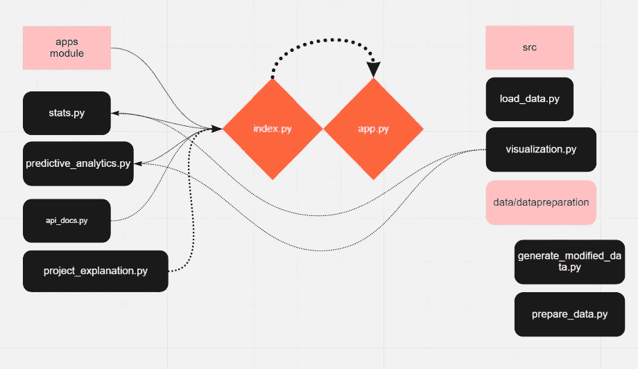
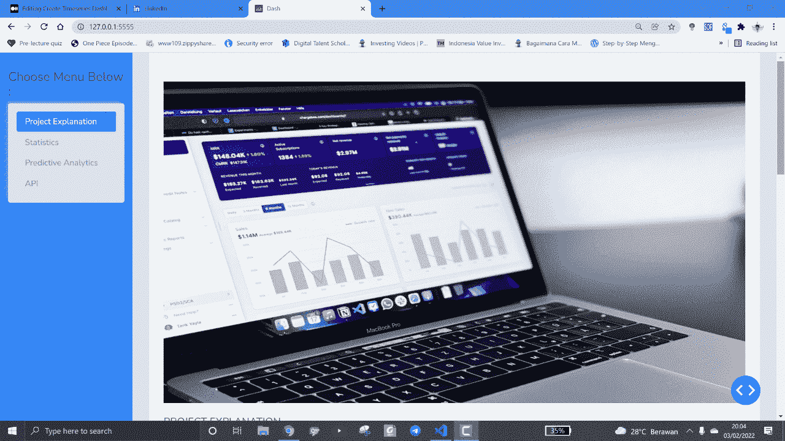

# 使用 Dash 创建时间序列仪表板(时间序列端到端项目第 2 部分)

> 原文：<https://blog.devgenius.io/create-timeseries-dashboard-using-dash-timeseries-end-to-end-project-part-2-38f0319e952?source=collection_archive---------3----------------------->

使用 dash 和 plotly 创建多个带有导航/标签的应用程序。


卢卡斯·布拉塞克在 [Unsplash](https://unsplash.com?utm_source=medium&utm_medium=referral) 上的照片

本教程不会解释逐行代码，但只给出了这个项目的中级概述。

本教程的重点是:

1.  Dash 回调概念
2.  部署到 Heroku
3.  技巧

**项目结构**

```
forecast_passenger_bi/
├── .gitignore
├── app.py
├── apps/
│   ├── api_docs.py
│   ├── predictive_analytics.py
│   ├── project_explanation.py
│   └── stats.py
├── index.py
├── joblib_file_ref/
│   ├── geo_region.joblib
│   ├── list_year.joblib
│   ├── operating_airline.joblib
│   └── operating_airlines.joblib
├── LICENSE
├── model/
│   └── moving_avg_diff_passenger_ovetime_model.pkl
├── print_listdir.py
├── Procfile
├── readme.MD
├── requirements.txt
├── runtime.txt
└── src/
    ├── data/
    │   ├── Air_Traffic_Passenger_Statistics.csv
    │   ├── datapreparation/
    │   │   ├── Air_Traffic_Passenger_Statistics.csv
    │   │   ├── forecast_data.csv
    │   │   ├── generate_modified_data.py
    │   │   ├── prepare_data.py
    │   │   └── prepare_for_eda.csv
    │   └── passanger_total.csv
    ├── load_data.py
    └── visualization.py
```



该预测控制板的工作流程解释如下:

上面的预测仪表板中有多个 python 文件，具有不同的用途:

a. **stats.py** 展示我们预测数据的统计(绘制 plotly 图)。这些图是从 **visualization.py 文件中产生的。**完整的 stats.py 代码可以在这里[访问。](https://github.com/fakhrirobi/forecast_passenger_BI/blob/main/apps/stats.py)

b.**predictive _ analytics . py**用于根据选择的时间范围创建预测，并在模型上创建实验。这些图是从 **visualization.py 文件中产生的。**由于该文件包含近 400 行，您可以在这里查看全部代码[。](https://github.com/fakhrirobi/forecast_passenger_BI/blob/main/apps/predictive_analytics.py)

c. **api_docs.py** 具有创建解释的功能，说明我们如何创建预测 api 请求。这里是 API [链接](https://forecastpassengerapi.herokuapp.com/docs)。 [api_docs 代码](https://github.com/fakhrirobi/forecast_passenger_BI/blob/main/apps/api_docs.py)

d.**project _ explain . py**具有作为项目文档的功能。[完整代码](https://github.com/fakhrirobi/forecast_passenger_BI/blob/main/apps/predictive_analytics.py)

e. **load_data.py** 具有时间序列数据转换功能。[全码](https://github.com/fakhrirobi/forecast_passenger_BI/blob/main/src/load_data.py)。

f. **visualization.py** 。这个文件有一个至关重要的工作，因为它运行的逻辑过程，如创建预测和渲染图(plotly 图)。完整的代码可以访问[这里](https://github.com/fakhrirobi/forecast_passenger_BI/blob/main/src/visualization.py)。

g. **index.py** 的目的是创建基本布局，并将每个应用程序(统计、预测 _ 分析、项目 _ 解释、api_docs)映射为导航栏，同时运行服务器。

h. **app.py** 的目的是实例化将在 **index.py** 中使用的 Dash app

要运行该应用程序，您可以在终端中键入以下内容

```
E:\DATA SCIENCE\forecast_passenger_BI> python index.py 
```



从本地主机运行 webapp

**破折号回调**

dash 与另一个 web 应用包 streamlit 的区别在于 Dash 有一个回调的概念。根据 dash [文档](https://dash.plotly.com/basic-callbacks)回调是一个跟踪 dash 属性(如 dash html 元素)变化的函数，最终会影响另一个 dash 元素/属性。

**如何创建回调？**

1.  创建 dash 元素并在其元素中添加 id 属性(提示:无论何时创建 className，都要确保它是清晰的)
2.  如果你想要简单的例子:请访问上面的 index.py

**部署**

在我的例子中，我选择 heroku 来部署我的 web 应用程序。步骤与我之前的帖子非常相似:[**使用 Fast API 和 Heroku 将预测模型部署为 API(时间序列端到端项目第 3 部分)**](/deploy-forecasting-model-as-api-with-fast-api-and-heroku-timeseries-end-to-end-project-part-3-34692d980c3?source=your_stories_page----------------------------------------) **。**虽然在 Procfile 文件中有区别:

```
web: gunicorn index:server
# index -> refer to python file where server would be running 
#server = variable name where server is defined
```

**做这个项目后的小技巧:**

1.  **创建尽可能清晰的变量**此外，如果你有一堆几乎相似的回调函数。
2.  当期望在 dash 回调上有多个输出时，你应该知道返回依赖于输出参数的排列和定位。例子

```
@app.callback([Output(component_id='a',component_property='children'), Output(component_id='a',component_property='children')], Input(component_id='a',component_property='data') 
def update_value(input_data) : 
      #some logic 
      return to_a, to_b
```

感谢您的关注。我部署的 web 应用程序可以在这里 访问 [**。**](https://dashboardpassenger.herokuapp.com/)

完整的代码实现可在[这里](https://github.com/fakhrirobi/forecast_passenger_BI)获得。

**我的 Fullstack Timeseries 项目:**

**第 1 部分:** [**时间序列预测:空中交通乘客(时间序列首尾项目第 1 部分)**](/time-series-forecasting-passenger-air-traffic-time-series-project-part-1-da51d4e8520a)

**第 2 部分:** [**使用破折号创建时间序列仪表板(时间序列端到端项目第 2 部分)**](https://medium.com/@fakhrirobi.fra/create-timeseries-dashboard-using-dash-timeseries-end-to-end-project-part-2-38f0319e952?source=your_stories_page----------------------------------------)

**第 3 部分:** [**将预测模型部署为具有 Fast API 和 Heroku 的 API(时间序列端到端项目第 3 部分)**](/deploy-forecasting-model-as-api-with-fast-api-and-heroku-timeseries-end-to-end-project-part-3-34692d980c3?source=your_stories_page----------------------------------------)

感谢您的关注。

感谢您的关注。你可以通过我的 [LinkedIn](https://www.linkedin.com/in/fakhrirobi/) 联系我，或者你可以在这里开通/开通/关注我的 github 账户[。](https://github.com/fakhrirobi)