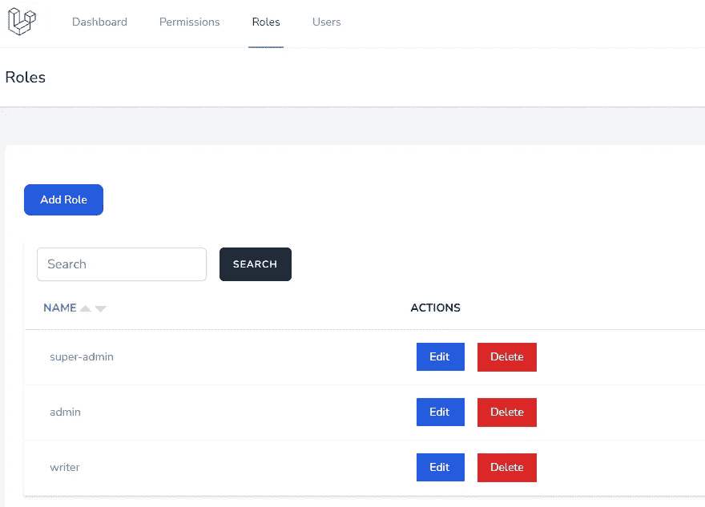
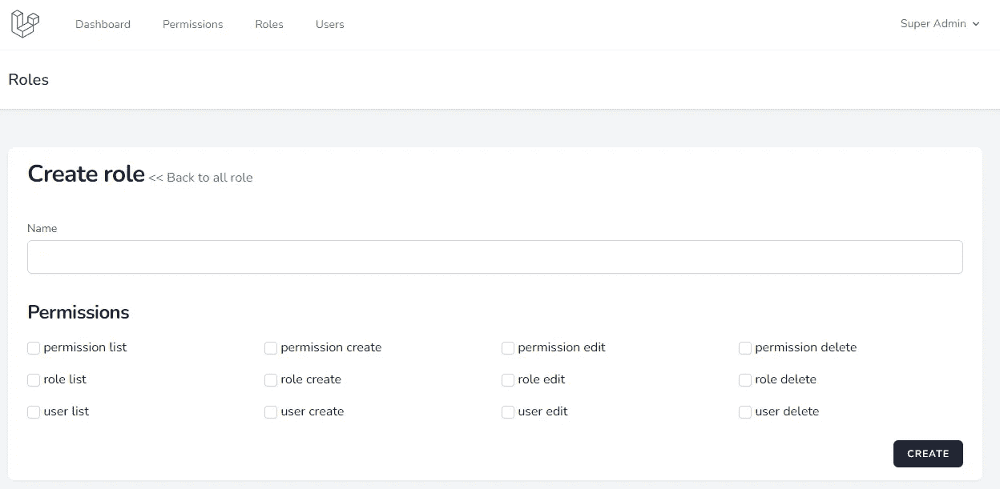
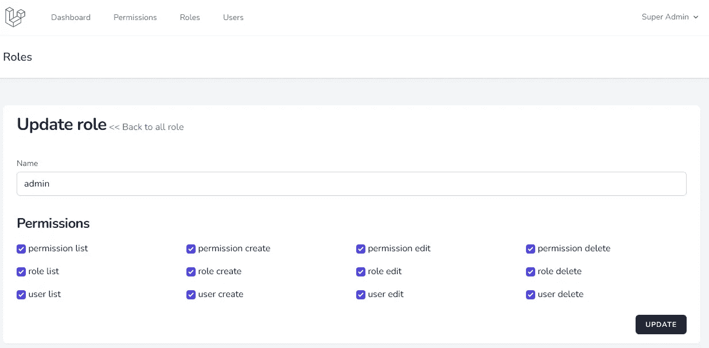
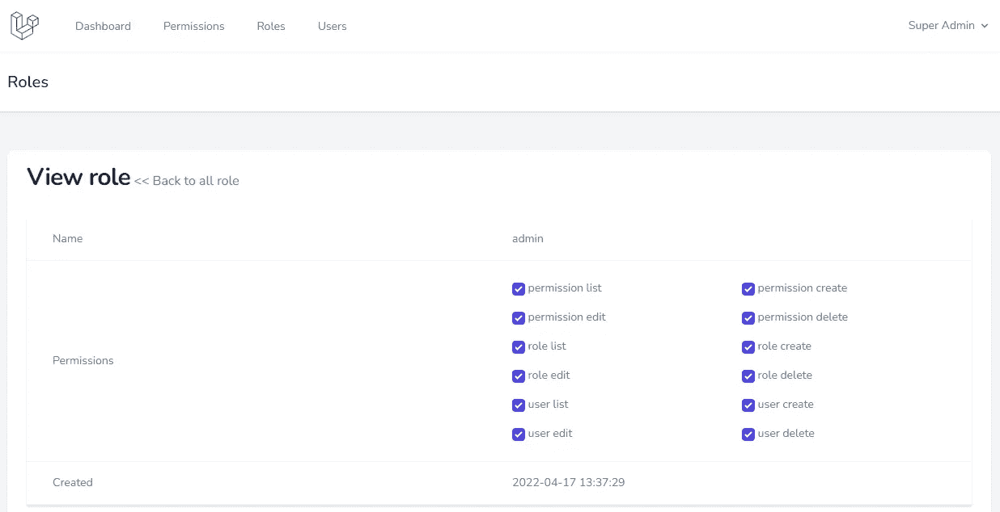

# 为 Laravel 管理面板的角色管理创建 UI

> 原文：<https://blog.devgenius.io/create-ui-for-role-management-to-laravel-admin-panel-dce72b09d2ea?source=collection_archive---------0----------------------->

## Laravel 从头开始创建一个管理面板——第 7 部分

我们已经为我们的管理面板[角色和权限](/laravel-user-roles-and-permissions-6dbfd4abfcf8)配置了 Spatie[Laravel-permission](https://github.com/spatie/laravel-permission)包。在这一部分，我们将创建一个角色管理用户界面。


照片由 [Mpho Mojapelo](https://unsplash.com/@mpho_mojapelo?utm_source=medium&utm_medium=referral) 在 [Unsplash](https://unsplash.com?utm_source=medium&utm_medium=referral) 上拍摄

# 角色管理

下面的步骤是为我们的 Laravel 管理面板创建一个角色 CRUD。

*   1.创建模型
*   2.创建控制器
*   3.添加路线
*   4.带有操作链接的索引页面
*   5.创建有权限的操作
*   6.有权限的更新操作
*   7.查看页面
*   8.向导航添加链接

## 1.创建模型

使用下面的`make:model`创建你的模型

```
sail artisan make:model Role
```

用`Spatie\Permission\Models\Role`扩展我们的角色模型，用下面的代码更新模型。

app/Models/Role.php

```
<?php
namespace App\Models;
use Spatie\Permission\Models\Role as OriginalRole;
class Role extends OriginalRole
{
    protected $fillable = [
        'name',
        'guard_name',
        'updated_at',
        'created_at'
    ];
}
```

## 2.创建控制器

`make:controller` Artisan 命令用于创建控制器。

```
sail artisan make:controller Admin/RoleController --model=Role --resource
```

## 3.添加路线

在 routes/admin.php 上添加角色路由

```
<?phpRoute::group([
    'namespace'  => 'App\Http\Controllers\Admin',
    'prefix'     => 'admin',
    'middleware' => ['auth'],
], function () {
    Route::resource('permission', 'PermissionController');
    Route::resource('role', 'RoleController');
});
```

现在进入`/admin/role`页面，显示空白页。

## 4.带有操作链接的索引页面

在索引功能上添加带有搜索和排序的角色分页。在构造函数中，添加中间件来检查访问。

app/Http/Controllers/Admin/role controller . PHP

```
function __construct()
{
     $this->middleware('can:role list', ['only' => ['index','show']]);
     $this->middleware('can:role create', ['only' => ['create','store']]);
     $this->middleware('can:role edit', ['only' => ['edit','update']]);
     $this->middleware('can:role delete', ['only' => ['destroy']]);
}
/**
 * Display a listing of the resource.
 *
 * @return \Illuminate\Http\Response
 */
public function index()
{
    $roles = (new Role)->newQuery();
    if (request()->has('search')) {
        $roles->where('name', 'Like', '%' . request()->input('search') . '%');
    }
    if (request()->query('sort')) {
        $attribute = request()->query('sort');
        $sort_order = 'ASC';
        if (strncmp($attribute, '-', 1) === 0) {
            $sort_order = 'DESC';
            $attribute = substr($attribute, 1);
        }
        $roles->orderBy($attribute, $sort_order);
    } else {
        $roles->latest();
    }
    $roles = $roles->paginate(5);
    return view('admin.role.index',compact('roles'))
        ->with('i', (request()->input('page', 1) - 1) * 5);
}
```

在管理员/角色文件夹中创建 index.blade.php 视图文件

资源/视图/管理/角色/索引. blade.php

```
<x-app-layout>
    <x-slot name="header">
        <h2 class="font-semibold text-xl text-gray-800 leading-tight">
            {{ __('Roles') }}
        </h2>
    </x-slot>
    <div class="py-12">
        <div class="max-w-7xl mx-auto sm:px-6 lg:px-8">
            <div class="bg-white overflow-hidden shadow-sm sm:rounded-lg">
                <div class="p-6 bg-white border-b border-gray-200">
                    <div class="flex flex-col mt-8">
                    @can('role create')
                    <div class="d-print-none with-border mb-8">
                        <a href="{{ route('role.create') }}" class="text-white bg-blue-700 hover:bg-blue-800 focus:ring-4 focus:ring-blue-300 font-medium rounded-lg text-sm px-5 py-2.5 text-center mr-2 mb-2 dark:bg-blue-600 dark:hover:bg-blue-700 dark:focus:ring-blue-800">{{ __('Add Role') }}</a>
                    </div>
                    @endcan
                        <div class="py-2">
                        @if(session()->has('message'))
                            <div class="mb-8 text-green-400 font-bold">
                                {{ session()->get('message') }}
                            </div>
                        @endif
                            <div class="min-w-full border-b border-gray-200 shadow">
                                <form method="GET" action="{{ route('role.index') }}">
                                <div class="py-2 flex">
                                    <div class="overflow-hidden flex pl-4">
                                        <input type="search" name="search" value="{{ request()->input('search') }}" class="rounded-md shadow-sm border-gray-300 focus:border-indigo-300 focus:ring focus:ring-indigo-200 focus:ring-opacity-50" placeholder="Search">
                                        <button type='submit' class='ml-4 inline-flex items-center px-4 py-2 bg-gray-800 border border-transparent rounded-md font-semibold text-xs text-white uppercase tracking-widest hover:bg-gray-700 active:bg-gray-900 focus:outline-none focus:border-gray-900 focus:ring ring-gray-300 disabled:opacity-25 transition ease-in-out duration-150'>
                                            {{ __('Search') }}
                                        </button>
                                    </div>
                                </div>
                                </form>
                                <table class="border-collapse table-auto w-full text-sm">
                                    <thead>
                                        <tr>
                                            <th class="py-4 px-6 bg-grey-lightest font-bold uppercase text-sm text-grey-dark border-b border-grey-light text-left">
                                                @include('admin.includes.sort-link', ['label' => 'Name', 'attribute' => 'name'])
                                            </th>
                                            @canany(['role edit', 'role delete'])
                                            <th class="py-4 px-6 bg-grey-lightest font-bold uppercase text-sm text-grey-dark border-b border-grey-light text-left">
                                                {{ __('Actions') }}
                                            </th>
                                            @endcanany
                                        </tr>
                                    </thead>
<tbody class="bg-white dark:bg-slate-800">
                                        @foreach($roles as $role)
                                        <tr>
                                            <td class="border-b border-slate-100 dark:border-slate-700 p-4 pl-8 text-slate-500 dark:text-slate-400">
                                                <div class="text-sm text-gray-900">
                                                    <a href="{{route('role.show', $role->id)}}" class="no-underline hover:underline text-cyan-600 dark:text-cyan-400">{{ $role->name }}</a>
                                                </div>
                                            </td>
                                            @canany(['role edit', 'role delete'])
                                            <td class="border-b border-slate-100 dark:border-slate-700 p-4 pl-8 text-slate-500 dark:text-slate-400">
                                                <form action="{{ route('role.destroy', $role->id) }}" method="POST">
                                                    @can('role edit')
                                                    <a href="{{route('role.edit', $role->id)}}" class="px-4 py-2 text-white mr-4 bg-blue-600">
                                                        {{ __('Edit') }}
                                                    </a>
                                                    @endcan
                                                    @can('role delete')
                                                    @csrf
                                                                                          @method('DELETE')
                                                    <button class="px-4 py-2 text-white bg-red-600">
                                                        {{ __('Delete') }}
                                                    </button>
                                                    @endcan
                                                </form>
                                            </td>
                                            @endcanany
                                        </tr>
                                        @endforeach
                                    </tbody>
                                </table>
                            </div>
                            <div class="py-8">
                                {{ $roles->appends(request()->query())->links() }}
                            </div>
                        </div>
                    </div>
                </div>
            </div>
        </div>
    </div>
</x-app-layout>
```

别忘了跑`sail npm run dev`去重建 CSS

用下面的代码更新销毁函数

app/Http/Controllers/Admin/role controller . PHP

```
public function destroy(Role $role)
{
    $role->delete();
    return redirect()->route('role.index')
                    ->with('message','Role deleted successfully');
}
```



Laravel 管理面板-角色索引页面

## 5.创建有权限的操作

用下面的代码更新`create`函数并创建`create.blade.php`一个视图文件。`Permission::all()`用于列出创建页面的权限。

app/Http/Controllers/Admin/role controller . PHP

```
public function create()
{
    $permissions = Permission::all();
    return view('admin.role.create', compact('permissions'));
}
```

资源/视图/管理/角色/创建. blade.php

```
<x-app-layout>
    <x-slot name="header">
        <h2 class="font-semibold text-xl text-gray-800 leading-tight">
            {{ __('Roles') }}
        </h2>
    </x-slot>
<div class="py-12">
        <div class="max-w-7xl mx-auto sm:px-6 lg:px-8">
            <div class="bg-white overflow-hidden shadow-sm sm:rounded-lg">
                <div class="px-6">
                    <h1 class="inline-block text-2xl sm:text-3xl font-extrabold text-slate-900 tracking-tight dark:text-slate-200 py-4 block sm:inline-block flex">{{ __('Create role') }}</h1>
                    <a href="{{route('role.index')}}" class="no-underline hover:underline text-cyan-600 dark:text-cyan-400">{{ __('<< Back to all role') }}</a>
                    @if ($errors->any())
                        <ul class="mt-3 list-none list-inside text-sm text-red-400">
                            @foreach ($errors->all() as $error)
                                <li>{{ $error }}</li>
                            @endforeach
                        </ul>
                    @endif
                </div>
                <div class="w-full px-6 py-4 bg-white overflow-hidden">
<form method="POST" action="{{ route('role.store') }}">
                    @csrf
<div class="py-2">
                            <label for="name" class="block font-medium text-sm text-gray-700{{$errors->has('name') ? ' text-red-400' : ''}}">{{ __('Name') }}</label>
<input id="name" class="rounded-md shadow-sm border-gray-300 focus:border-indigo-300 focus:ring focus:ring-indigo-200 focus:ring-opacity-50 block mt-1 w-full{{$errors->has('name') ? ' border-red-400' : ''}}"
                                            type="text"
                                            name="name"
                                            value="{{ old('name') }}"
                                            />
                        </div>
<div class="py-2">
                            <h3 class="inline-block text-xl sm:text-2xl font-extrabold text-slate-900 tracking-tight dark:text-slate-200 py-4 block sm:inline-block flex">Permissions</h3>
                            <div class="grid grid-cols-4 gap-4">
                                @forelse ($permissions as $permission)
                                    <div class="col-span-4 sm:col-span-2 md:col-span-1">
                                        <label class="form-check-label">
                                            <input type="checkbox" name="permissions[]" value="{{ $permission->name }}" class="rounded border-gray-300 text-indigo-600 shadow-sm focus:border-indigo-300 focus:ring focus:ring-indigo-200 focus:ring-opacity-50">
                                            {{ $permission->name }}
                                        </label>
                                    </div>
                                @empty
                                    ----
                                @endforelse
                            </div>
                        </div>
<div class="flex justify-end mt-4">
                            <button type='submit' class='inline-flex items-center px-4 py-2 bg-gray-800 border border-transparent rounded-md font-semibold text-xs text-white uppercase tracking-widest hover:bg-gray-700 active:bg-gray-900 focus:outline-none focus:border-gray-900 focus:ring ring-gray-300 disabled:opacity-25 transition ease-in-out duration-150'>
                                {{ __('Create') }}
                            </button>
                        </div>
                    </form>
                </div>
            </div>
        </div>
    </div>
</x-app-layout>
```

在浏览器中导航`http://localhost/admin/role/create` URL。



角色创建页面

所以复制下面的代码`store`函数

app/Http/Controllers/Admin/role controller . PHP

```
public function store(Request $request)
{
    $request->validate([
        'name' => 'required|string|max:255|unique:'.config('permission.table_names.roles', 'roles').',name',
    ]);
    $role = Role::create($request->all());
    if(! empty($request->permissions)) {
        $role->givePermissionTo($request->permissions);
    }
    return redirect()->route('role.index')
                    ->with('message','Role created successfully.');
}
```

$ role-> givePermissionTo($ request-> permissions)用于保存对所创建角色的所有权限。

## 6.有权限的更新操作

类似于创建两个用于更新的函数。显示表格的`edit`功能和保存表格的`update`功能。

app/Http/Controllers/Admin/role controller . PHP

```
public function edit(Role $role)
{
    $permissions = Permission::all();
    $roleHasPermissions = array_column(json_decode($role->permissions, true), 'id');
    return view('admin.role.edit',compact('role', 'permissions', 'roleHasPermissions'));
}
public function update(Request $request, Role $role)
{
    $request->validate([
        'name' => 'required|string|max:255|unique:'.config('permission.table_names.roles', 'roles').',name,'.$role->id,
    ]);
    $role->update($request->all());
    $permissions = $request->permissions ?? [];
    $role->syncPermissions($permissions);
    return redirect()->route('role.index')
                    ->with('message','Role updated successfully.');
}
```

这里的`$role->syncPermissions($permissions);`用于更新角色映射的权限。

资源/视图/管理/角色/编辑. blade.php

```
<x-app-layout>
    <x-slot name="header">
        <h2 class="font-semibold text-xl text-gray-800 leading-tight">
            {{ __('Roles') }}
        </h2>
    </x-slot>
<div class="py-12">
        <div class="max-w-7xl mx-auto sm:px-6 lg:px-8">
            <div class="bg-white overflow-hidden shadow-sm sm:rounded-lg">
                <div class="px-6">
                    <h1 class="inline-block text-2xl sm:text-3xl font-extrabold text-slate-900 tracking-tight dark:text-slate-200 py-4 block sm:inline-block flex">{{ __('Update role') }}</h1>
                    <a href="{{route('role.index')}}" class="no-underline hover:underline text-cyan-600 dark:text-cyan-400">{{ __('<< Back to all role') }}</a>
                    @if ($errors->any())
                        <ul class="mt-3 list-none list-inside text-sm text-red-400">
                            @foreach ($errors->all() as $error)
                                <li>{{ $error }}</li>
                            @endforeach
                        </ul>
                    @endif
                </div>
                <div class="w-full px-6 py-4 bg-white overflow-hidden">
<form method="POST" action="{{ route('role.update', $role->id) }}">
                    @csrf
                    @method('PUT')
<div class="py-2">
                            <label for="name" class="block font-medium text-sm text-gray-700{{$errors->has('name') ? ' text-red-400' : ''}}">{{ __('Name') }}</label>
<input id="name" class="rounded-md shadow-sm border-gray-300 focus:border-indigo-300 focus:ring focus:ring-indigo-200 focus:ring-opacity-50 block mt-1 w-full{{$errors->has('name') ? ' border-red-400' : ''}}"
                                            type="text"
                                            name="name"
                                            value="{{ old('name', $role->name) }}"
                                            />
                        </div>
                        @unless ($role->name == env('APP_SUPER_ADMIN', 'super-admin'))
                        <div class="py-2">
                            <h3 class="inline-block text-xl sm:text-2xl font-extrabold text-slate-900 tracking-tight dark:text-slate-200 py-4 block sm:inline-block flex">Permissions</h3>
                            <div class="grid grid-cols-4 gap-4">
                                @forelse ($permissions as $permission)
                                    <div class="col-span-4 sm:col-span-2 md:col-span-1">
                                        <label class="form-check-label">
                                            <input type="checkbox" name="permissions[]" value="{{ $permission->name }}" {{ in_array($permission->id, $roleHasPermissions) ? 'checked' : '' }} class="rounded border-gray-300 text-indigo-600 shadow-sm focus:border-indigo-300 focus:ring focus:ring-indigo-200 focus:ring-opacity-50">
                                            {{ $permission->name }}
                                        </label>
                                    </div>
                                @empty
                                    ----
                                @endforelse
                            </div>
                        </div>
                        @endunless
<div class="flex justify-end mt-4">
                            <button type='submit' class='inline-flex items-center px-4 py-2 bg-gray-800 border border-transparent rounded-md font-semibold text-xs text-white uppercase tracking-widest hover:bg-gray-700 active:bg-gray-900 focus:outline-none focus:border-gray-900 focus:ring ring-gray-300 disabled:opacity-25 transition ease-in-out duration-150'>
                                {{ __('Update') }}
                            </button>
                        </div>
                    </form>
                </div>
            </div>
        </div>
    </div>
</x-app-layout>
```

超级管理员不需要权限选择。所以增加了`@unless ($role->name == env(‘APP_SUPER_ADMIN’, ‘super-admin’))`一个权限选择部分的条件。还有“`APP_SUPER_ADMIN`”用于获取可配置的管理员名称。

在 AuthServiceProvider 上更新相同的 env 值

app/Providers/authserviceprovider . PHP

```
// Implicitly grant "Super-Admin" role all permission checks using can()
 Gate::before(function ($user, $ability) {
-            if ($user->hasRole('super-admin')) {
+            if ($user->hasRole(env('APP_SUPER_ADMIN', 'super-admin'))) {
         return true;
     }
 });
```



角色编辑页面

## 7.查看页面

在控制器显示函数上添加以下代码

app/Http/Controllers/Admin/role controller . PHP

```
public function show(Role $role)
{
    $permissions = Permission::all();
    $roleHasPermissions = array_column(json_decode($role->permissions, true), 'id');
    return view('admin.role.show', compact('role', 'permissions', 'roleHasPermissions'));
}
```

资源/视图/管理/角色/显示. blade.php

```
<x-app-layout>
    <x-slot name="header">
        <h2 class="font-semibold text-xl text-gray-800 leading-tight">
            {{ __('Roles') }}
        </h2>
    </x-slot>
<div class="py-12">
        <div class="max-w-7xl mx-auto sm:px-6 lg:px-8">
            <div class="bg-white overflow-hidden shadow-sm sm:rounded-lg">
                <div class="px-6">
                    <h1 class="inline-block text-2xl sm:text-3xl font-extrabold text-slate-900 tracking-tight dark:text-slate-200 py-4 block sm:inline-block flex">{{ __('View role') }}</h1>
                    <a href="{{route('role.index')}}" class="no-underline hover:underline text-cyan-600 dark:text-cyan-400">{{ __('<< Back to all role') }}</a>
                    @if ($errors->any())
                        <ul class="mt-3 list-none list-inside text-sm text-red-400">
                            @foreach ($errors->all() as $error)
                                <li>{{ $error }}</li>
                            @endforeach
                        </ul>
                    @endif
                </div>
                <div class="w-full px-6 py-4">
                    <div class="min-w-full border-b border-gray-200 shadow">
                        <table class="table-fixed w-full text-sm">
                            <tbody class="bg-white dark:bg-slate-800">
                                <tr>
                                    <td class="border-b border-slate-100 dark:border-slate-700 p-4 pl-8 text-slate-500 dark:text-slate-400">{{ __('Name') }}</td>
                                    <td class="border-b border-slate-100 dark:border-slate-700 p-4 text-slate-500 dark:text-slate-400">{{$role->name}}</td>
                                </tr>
                                <tr>
                                @unless ($role->name == env('APP_SUPER_ADMIN', 'super-admin'))
                                <td class="border-b border-slate-100 dark:border-slate-700 p-4 pl-8 text-slate-500 dark:text-slate-400">{{ __('Permissions') }}</td>
                                    <td class="border-b border-slate-100 dark:border-slate-700 p-4 text-slate-500 dark:text-slate-400">
<div class="py-2">
                                        <div class="grid grid-cols-4 gap-4">
                                            @forelse ($permissions as $permission)
                                                <div class="col-span-4 sm:col-span-2 md:col-span-2">
                                                    <label class="form-check-label">
                                                        <input type="checkbox" name="permissions[]" value="{{ $permission->name }}" {{ in_array($permission->id, $roleHasPermissions) ? 'checked' : '' }} disabled="disabled" class="rounded border-gray-300 text-indigo-600 shadow-sm focus:border-indigo-300 focus:ring focus:ring-indigo-200 focus:ring-opacity-50">
                                                        {{ $permission->name }}
                                                    </label>
                                                </div>
                                            @empty
                                                ----
                                            @endforelse
                                        </div>
                                    </div>
                                    </td>
                                </tr>
                                @endunless
                                <tr>
                                    <td class="border-b border-slate-100 dark:border-slate-700 p-4 pl-8 text-slate-500 dark:text-slate-400">{{ __('Created') }}</td>
                                    <td class="border-b border-slate-100 dark:border-slate-700 p-4 text-slate-500 dark:text-slate-400">{{$role->created_at}}</td>
                                </tr>
                            </tbody>
                        </table>
                    </div>
                </div>
            </div>
        </div>
    </div>
</x-app-layout>
```



## 8.向导航添加链接

在导航中添加了角色和用户链接。我们将在下一篇文章中添加用户的 CRUD。

```
+++ b/resources/views/layouts/navigation.blade.php
@@ -16,7 +16,13 @@
                         {{ __('Dashboard') }}
                     </x-nav-link>
                     <x-nav-link :href="route('permission.index')" :active="request()->routeIs('permission.index')">
-                        {{ __('Permission') }}
+                        {{ __('Permissions') }}
+                    </x-nav-link>
+                    <x-nav-link :href="route('role.index')" :active="request()->routeIs('role.index')">+                        {{ __('Roles') }}
+                    </x-nav-link>
+                    <x-nav-link :href="route('user.index')" :active="request()->routeIs('user.index')">+                        {{ __('Users') }}
                     </x-nav-link>
                 </div>
             </div>
@@ -70,7 +76,13 @@
                 {{ __('Dashboard') }}
             </x-responsive-nav-link>
             <x-responsive-nav-link :href="route('permission.index')" :active="request()->routeIs('permission.index')">
-                {{ __('Permission') }}
+                {{ __('Permissions') }}
+            </x-responsive-nav-link>
+            <x-responsive-nav-link :href="route('role.index')" :active="request()->routeIs('role.index')">
+                {{ __('Roles') }}
+            </x-responsive-nav-link>
+            <x-responsive-nav-link :href="route('user.index')" :active="request()->routeIs('user.index')">
+                {{ __('Users') }}
             </x-responsive-nav-link>
         </div>
```

## GitHub 知识库

角色代码可在 [1.0.5](https://github.com/balajidharma/basic-laravel-admin-panel/tree/archive/1.0.5) 分支上获得

上一部分—第 6 部分:[实现了一个基本的搜索过滤器和带有分页的列排序](/implements-a-basic-search-filter-and-column-sort-with-pagination-in-laravel-crud-5e3c70fb12ac)

下一部分—第 8 部分: [Laravel 用户管理 CRUD](/basic-laravel-admin-panel-user-management-crud-45f694ef60cc)