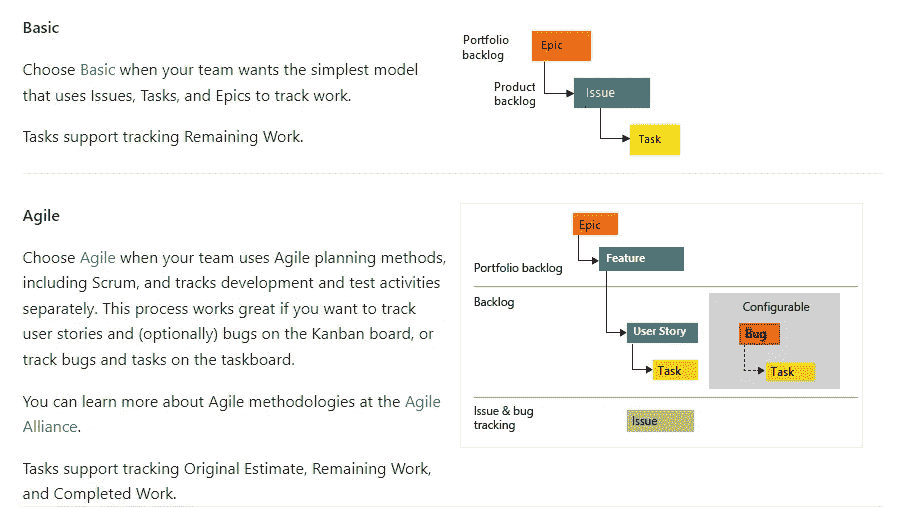

# Azure DevOps Yaml 管道中管道故障时的自动化工作项创建

> 原文：<https://blog.devgenius.io/create-work-item-on-pipeline-failure-in-azure-devops-yaml-pipeline-973bd175166?source=collection_archive---------5----------------------->


流动

在本文中，我将解释如何创建一个像 Bug 这样的工作项，并将其分配给一个管道失败的人。

作为本活动的一部分，我们将创建一个可重用的作业，该作业将添加到您现有的作业中，并在实际作业失败时被触发。

**先决条件:**

1.  您有一个活跃的 Azure DevOps 项目
2.  如果您使用的是自托管代理，则代理中会安装 Azure CLI

[](https://docs.microsoft.com/en-us/cli/azure/install-azure-cli) [## 如何安装 Azure 命令行界面

### Azure CLI 可安装在 Windows、macOS 和 Linux 环境中。它也可以在码头工人…

docs.microsoft.com](https://docs.microsoft.com/en-us/cli/azure/install-azure-cli) 

# 步骤:

作为实现的一部分，我们将创建 2 个 yaml 文件

*   可重用作业 yaml 来创建工作项
*   执行活动的实际管道 yaml

1.  **创建可重用作业**

转到您的 Azure DevOps 项目和存储库，并根据以下配置添加一个文件 workitem.yml。

> 请根据项目流程创建工作项。如果特定的工作项在项目中不可用，您将会得到错误。



```
parameters:
  - name: AssignedToUser
steps:
  - task: CmdLine@2
    displayName: Install Azure DevOps Extension
    inputs:
      script: 'az extension add --name azure-devops'
  - task: CmdLine@2
    displayName: Configure Default Settings
    inputs:
      script: |

        az devops configure --defaults organization=$(System.CollectionUri) project=$(System.TeamProject)
  - task: CmdLine@2
    displayName: Create Work Item
    inputs:
      script: 'az boards work-item create --title "Build $(Build.BuildNumber) failed" --type "Issue" --assigned-to ${{parameters.AssignedToUser}}  --description "Build failure.<div>Pipeline Name - $(Build.DefinitionName)"'
    env:
      AZURE_DEVOPS_EXT_PAT: $(System.AccessToken)
# <div> has been added to introduce new line in the description field
```

2.**使用以下 yaml 配置创建新管道**

> 工作项-onfailure.yml

用有效的 Azure DevOps 用户更新变量用户

```
trigger:
- masterpool:
  vmImage: ubuntu-latest
parameters:
  - name: User
variables:
  - name: User
    value: '[user@abc.com](mailto:user@abc.com)'
#Replace the User value with a valid azure devops user
stages:
  - stage: fail
    jobs:
      - job: fail
        steps:
          - publish: '$(System.IncorrectPath)'
      - job: createTask
        displayName: Create Bug On Failure
        dependsOn: fail
        condition: failed()
        steps:
          - template: workitem.yml
            parameters:
              AssignedToUser: $(User)
```

3.**触发/执行管道检查结果**


管道


**其他资源:**

[](https://docs.microsoft.com/en-us/azure/devops/boards/work-items/guidance/choose-process?view=azure-devops&tabs=agile-process) [## 为您的 Azure DevOps 项目选择一个流程-Azure board

### 在创建项目的任何时候，您都必须根据为…选择的流程模型来选择流程或流程模板

docs.microsoft.com](https://docs.microsoft.com/en-us/azure/devops/boards/work-items/guidance/choose-process?view=azure-devops&tabs=agile-process) [](https://docs.microsoft.com/en-us/cli/azure/boards/work-item?view=azure-cli-latest) [## az 板工作项

### az 板工作项创建创建工作项。az boards 工作项创建-标题-类型[ -区域] [ -分配给]…

docs.microsoft.com](https://docs.microsoft.com/en-us/cli/azure/boards/work-item?view=azure-cli-latest) 

我希望你喜欢阅读本文，随意添加你的评论、想法或反馈，不要忘记在 [linkedin](https://www.linkedin.com/in/babulaparida/) 上联系。