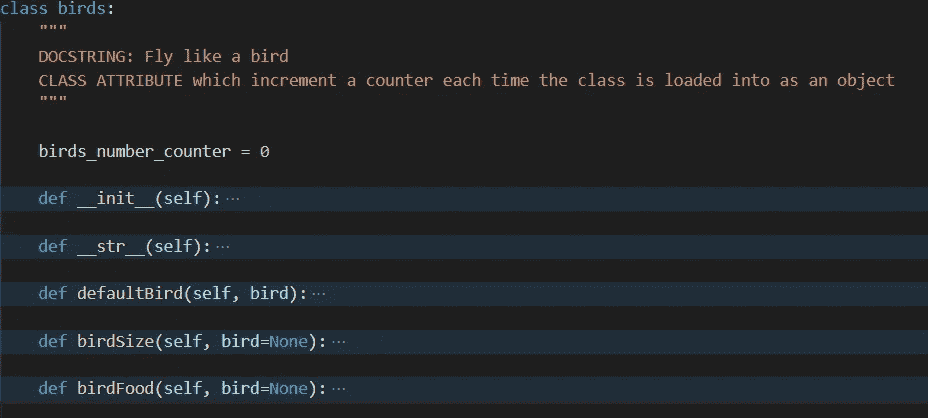
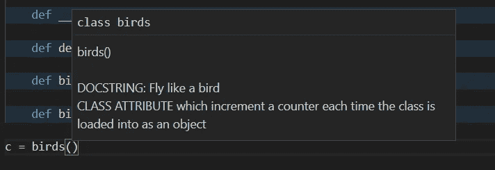
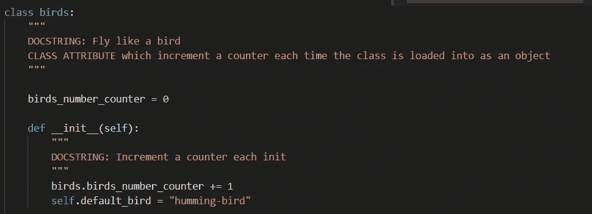
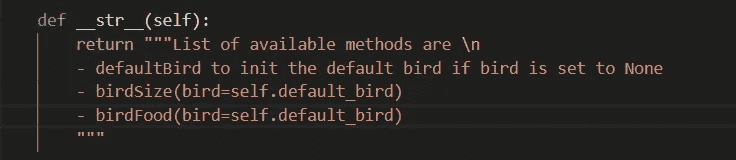
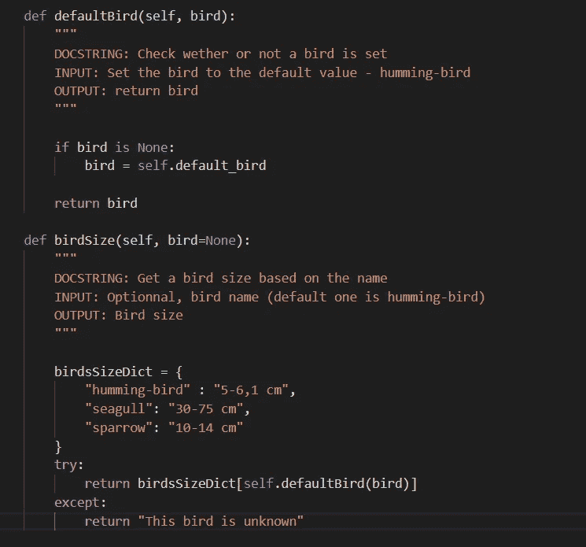
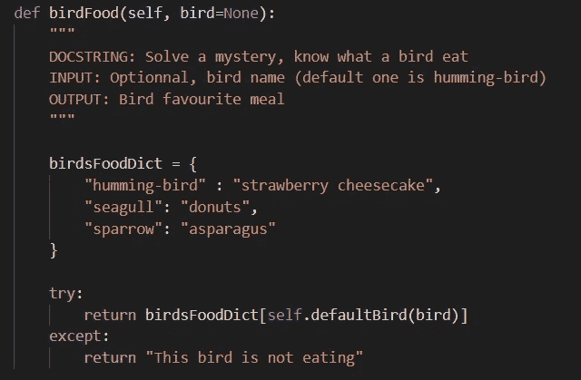

# 创建您的第一个 Python 类

> 原文：<https://blog.devgenius.io/create-your-first-python-class-d6e885cd4471?source=collection_archive---------12----------------------->

通过快速教程提升您的 Python 编码水平


[金伯利农民](https://unsplash.com/@kimberlyfarmer?utm_source=medium&utm_medium=referral)在 [Unsplash](https://unsplash.com?utm_source=medium&utm_medium=referral) 拍摄的照片

通常，如果你有操作背景，你会害怕编程(抱歉，bash 脚本不是编码)。如果有人胆敢谈论课程，你可能会在演讲结束前离开房间。

Python 类是开始编写一些更有组织的代码的好方法，并且越来越熟悉这个概念。

> 一个类可以包含方法、属性、函数、变量等等

在这节课中，我们将创建一个非常有用的课堂来讨论鸟类。结构如下:



首先要做的是初始化我们的类。在 Python 中超级简单，你只需要在你的类名前输入关键字`class`。

最好总是实现一个 docstring。这对所有人都超级有用(你的类用户和你！).可以使用三重`"`实现 docstring。Docstring 也可以直接从您喜欢的编辑器中读取，如下所示



现在你有了你的类，让我们在里面构建一些变量和方法。

我们首先需要创建 __init__ 方法，这是一个标准的 Python 方法。这个方法允许我们在类中初始化对象，并使用它们。
我们也将 self 作为参数传递，以告知要调用的对象在我们的类内部。它可以被重命名，但我强烈建议你不要重命名它！有人说`self`太长，缩短为`s`，但不推荐！

官方文档说:*当一个类定义了一个* `*__init__()*` *方法时，类实例化自动为新建的类实例调用* `*__init__()*` *。*

在我们的例子中，在`__init__`方法中，我们将用+1 递增一个计数器，并设置一个默认的 bird name 值



注意，计数器是直接在类块后面启动的

每次我们将类加载到对象中时，这里会发生什么:

*   `birds_number_counter`将按 1 递增 1
*   将设置一个名为`default_bird`的变量，其值为“蜂鸟”

```
>>> from birdclass import birds
>>> c = birds()
>>> c.birds_number_counter
1
>>> c.default_bird
'humming-bird'
>>> d = birds()
>>> c.birds_number_counter
2
>>> d.birds_number_counter
2
>>> d.default_bird
'humming-bird'
```

很酷不是吗？如您所见，如果我们的类中有两个对象，计数器将被设置为 2。另一件很酷的事情是，如果你愿意，你可以直接改变默认值，比如说，在你的`d`对象中

```
>>> d.default_bird = "seagull"
>>> c.default_bird
'humming-bird'
>>> d.default_bird
'seagull'
```

> 现在让我们给我们的类添加一些函数，让它变得更有趣一些



让我们先从`__str__`开始。你可能会想，有些 Python 的奇怪的东西…好吧，我同意在第一，由方法可以超级有用。它允许您通过使用`str()`内置方法直接访问您的类方法(或者实际上您想要的任何东西)。

```
>>> str(c)
'List of available methods are \n\n        
- defaultBird to init the default bird if bird is set to None\n        - birdSize(bird=self.default_bird)\n        
- birdFood(bird=self.default_bird)\n'
```

注意，这个方法(像这个类中的每个方法一样)必须将`self`作为参数传递。不要忘记，当您开始创建自己的类时，这是一个常见的错误。

现在是时候构建我们自己的超级有用的函数了，它会告诉我们一只鸟的大小…



请注意 defaultBird 函数，它将我们的 Bird 初始化为默认值

现在我们有了 birdSize 函数，我们可以看到需要两个参数:`self`和`bird`，默认设置为`None`

该函数仅在鸟出现在`birdsSizeDict`中时返回鸟的大小。这里需要注意的是，默认的 bird 值是`None`。如果该值未被覆盖，它将把默认值设置到`__init__`块中，即**蜂鸟**

```
>>> c.default_bird
'humming-bird'
>>> print("{} is {}").format(c.default_bird, c.birdSize())
humming-bird is 5-6,1 cm
>>> print("{} is {}").format(c.default_bird, c.birdSize("seagull"))
humming-bird is 30-75 cm
>>> c.default_bird="seagull"
>>> print("{} is {}").format(c.default_bird, c.birdSize())
seagull is 30-75 cm
```

起初，我们默认的鸟是蜂鸟。所以如果我们调用 birdSize 函数，它会使用这个参数。
接下来，我们通过`seagull`将默认值直接覆盖到我们的函数调用中。注意 default_bird 仍然是`humming-bird`。
最后，我们将默认值更改为`seagull`，这就是神奇之处。

我添加了一个额外的方法，它的工作方式和第一个方法一样，只是为了有更多的内容



```
print("{} is {} and eat {}").format(c.default_bird, c.birdSize(), c.birdFood())
seagull is 30-75 cm and eat donuts
```

希望这能比以前解释得更好一点，如果你害怕上课，你就不会害怕了

如果你想更深入地学习快速教程，你可以将`birdsSizeDict`和`birdsFoodDict`直接合并到`__init__`或其他地方，只需要维护一个字典。或者你可以添加一个类来给你的字典添加一些新的值…这里唯一的限制是你的想象力。

希望你在这篇文章中学到了一些新的东西，不要犹豫分享它，或者如果你喜欢，请鼓掌，我们将非常感谢！

下一篇文章再见