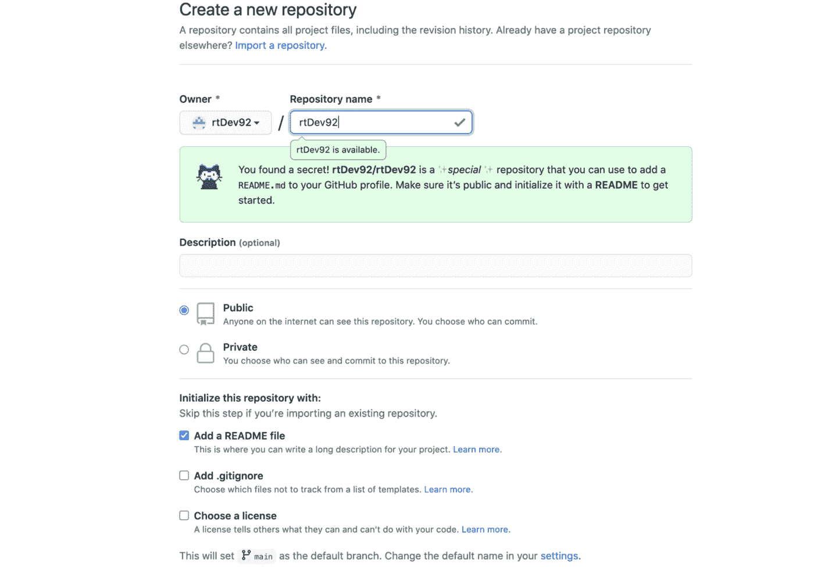
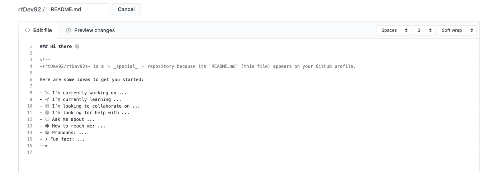
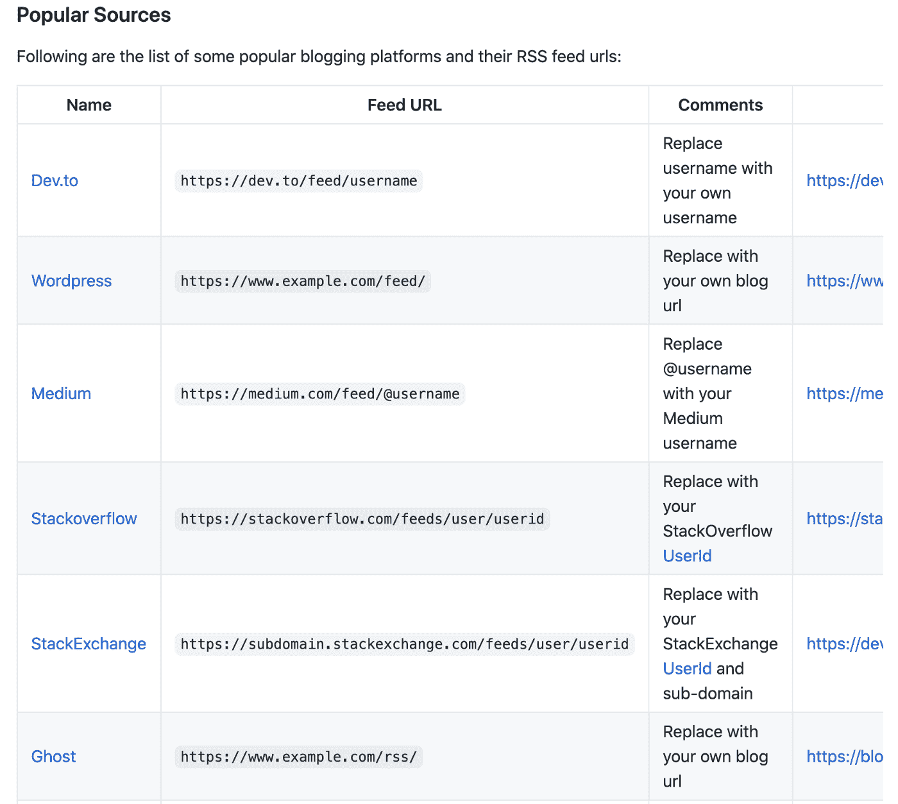
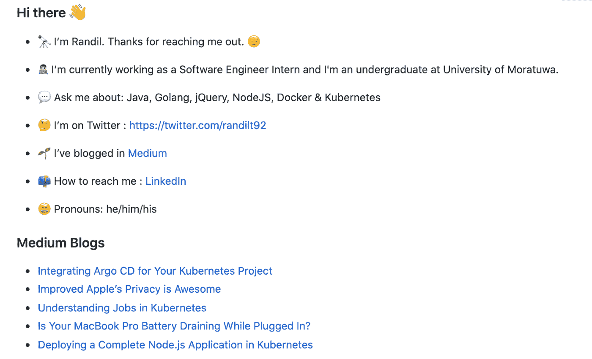

# 用博客文章创建您的新 GitHub 个人资料页面

> 原文：<https://blog.devgenius.io/create-your-new-github-profile-page-with-blog-posts-96d47419c77a?source=collection_archive---------10----------------------->

## 新的个人资料页面展示了关于您、您的工作、技能和您的博客帖子的信息


罗曼·辛克维奇在 [Unsplash](https://unsplash.com/s/photos/github?utm_source=unsplash&utm_medium=referral&utm_content=creditCopyText) 上拍摄的照片

软件开发人员非常熟悉 **GitHub** ，他们可以把自己的库放在那里，并提前获得他人的贡献。对于喜欢从**版本控制**开始的初学者来说，GitHub 是一个很好的地方，而且当你正在做一个分配给团队的项目时，GitHub 将是你的团队合作的理想场所。不仅仅是 GitHub，你还可以尝试其他资源，比如 BitBucket，Azure DevOps 等等。

通常，在 GitHub 中，您需要创建一个帐户来开始使用您的存储库。一旦你打开你的个人资料页面，你可以看到你最喜欢的回购，贡献，问题等。但是现在你可以为你的 GitHub 帐户创建一个漂亮的个人资料页面，向访问你的个人资料的人展示你的工作、技能、博客文章、GitHub 统计数据。

让我们开始吧。

首先，打开你的 GitHub 账户，点击**新建库**。输入与您的 GitHub 用户名相同的库名**，注意这个库名**区分大小写**，因此您必须遵循与您的用户名相同的大小写。将存储库保持为公共，并单击复选框**添加一个自述文件**，然后点击**创建存储库** *【您可以为您的存储库添加一个可选的描述】*。**



作者截图

接下来，您可以开始编辑 README.md 文件，为了您的利益，您将获得一个免费的模板。



作者截图

你可以为你的 README.md 添加文本、图像、链接和不同的表情符号，一旦你点击页面底部的**提交更改**按钮，这将自动出现在你的个人资料中。

接下来，您可以将博客文章的链接添加到您的个人资料中。

我选择了 **VS 代码**，但是你可以搭配任何你喜欢的代码编辑器*【如果你更喜欢 VS 代码，可以从下面的链接获取】*。

[](https://code.visualstudio.com/download) [## 下载 Visual Studio 代码- Mac、Linux、Windows

### Visual Studio 代码是免费的，可以在您喜欢的平台上获得——Linux、macOS 和 Windows。下载 Visual Studio…

code.visualstudio.com](https://code.visualstudio.com/download) 

在你的文本编辑器中打开你的 README.md 文件，在你的介绍后添加`### Blogs`，然后在你需要添加你的博客文章链接的地方添加`<!--BLOG-POST-LIST:START-->` & `<! --BLOG-POST-LIST:END -->`标签。

*【此工作流程摘自* [***乔达摩克里希纳***](https://github.com/gautamkrishnar/blog-post-workflow)**GitHub 回购；您可以访问此回购并了解更多信息]**

```
*### Blogs<!-- BLOG-POST-LIST:START --><!-- BLOG-POST-LIST:END -->*
```

*然后，您需要在 repo 中创建一个工作流，因为您需要根据最新的博客文章更新 README。因此，在代码编辑器中使用以下路径创建工作流。*

```
*.github/workflows/blog-post-workflow.yaml*
```

*在 YAML 文件中，添加下面的代码片段来创建一个 Cron 作业，该作业按照给定的时间表运行*【下面的作业每 2 天运行一次，因此您的博客文章将每 2 天更新一次】*。*

*您可以根据您的博客平台*【下面显示了一些博客平台】*将您的博客链接(RSS feed URLs)添加到上述工作流中。*

**

*来源:https://github.com/gautamkrishnar/blog-post-workflow*

*一旦你完成了这一步，你就可以提交并把你的修改推送到 GitHub。然后，前往您的存储库并选择 **Actions** 选项卡，在那里您将看到您的新工作流。选择工作流程名称并点击**运行工作流程**按钮。这将需要几分钟的时间来完成，一旦完成，请转到您的个人资料并进行刷新，您将在个人资料中看到您的博客帖子。*

**

*作者截图*

*同样，你也可以将堆栈溢出链接、YouTube 视频链接添加到 GitHub 个人资料中。添加其他相关图片和文字，在 GitHub 上为您创建一个出色的个人资料。完成新的 GitHub 个人资料后，请在下面留下您个人资料的链接。*

# *资源*

*[GitHub repo —博文工作流程](https://github.com/gautamkrishnar/blog-post-workflow)*

*感谢阅读！*