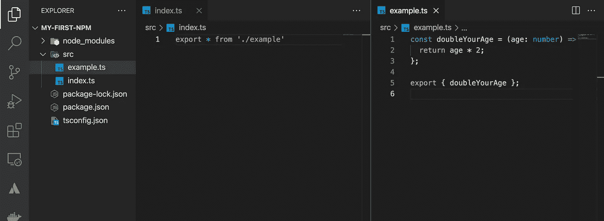

# 创建自己的 npm 包。

> 原文：<https://blog.devgenius.io/create-your-own-npm-package-776c0a4873f4?source=collection_archive---------5----------------------->

在这篇文章中，我将告诉你谁可以使用 javascript 和 typescript 创建自己的 npm 包。

作为第一步，我们可以创建项目。为此，请使用以下命令。

```
mkdir my-first-npm
cd my-first-npm
```

现在，您位于项目文件夹中。然后打开你最喜欢的 IDE。我正在使用 vs 代码，要从这个位置打开 vs 代码，请使用下面的代码。

```
code .
```

要初始化 node.js 项目，

```
npm init -y
tsc --init
```

它将在项目位置创建 package.json 和 tsconfig.json 文件。然后安装项目的依赖项。我们只需要 **del-cli** 和**打字稿**。

```
npm i del-cli typescript
```

然后创建一个 src 文件夹，并创建名为 index.ts 和 example.ts 的文件。这两个小命令我想大家都能识别。



index.ts 和 example.ts 的代码示例

```
// index.ts
const doubleYourAge = (age: number) => {return age * 2;};export { doubleYourAge };
```

然后举例

```
// exmaple.ts
export * from './example'
```

我们要创造的是你年龄的两倍。我知道这是无用的，但举例来说，这是好的。

现在，我们必须进行一些配置，然后将 npm 发布到 npmjs.com。

然后转到 tsconfig.json，进行以下更改。

```
# comment out “declaration”: true for declare the types for typescripts. # comment out “outDir”: “./build” and give it location as “./build” to output the javascript version of our code in the folder called build.
```

然后 tsconfig.json 文件配置就结束了。然后转到 package.json 文件。

然后在 package.json 文件中编写两个脚本，如下所示。

```
"clean":"del ./build/*","build":"npm run clean && tsc"
```

跑起来，

```
npm run build
```

每次运行 npm 的时候，运行 build **"clean": "del。/build"** 将清除构建文件夹。

然后您可以看到构建文件夹被创建，它包含 js 和类型定义文件。

之后，在 package.json 文件中进行这些更改。

```
"main": "./build/index.js","types": "./build/index.d.ts","files": ["build/**/*"],
```

这个命令基本上表明 index.js 是项目及其类型定义的主文件。

现在所有的配置已经完成，然后我们必须在 npmjs.com 创建我们的帐户。为此，去 npmjs.com 注册并验证您的电子邮件。所有这些都是免费的。

然后点击个人资料按钮(圆形按钮)并点击**添加组织**。然后提供一个唯一的名称。我提供的名称是 **exmaplefirst** 。然后点击无限公共包**创建**按钮并点击跳过按钮。

哦，是的，现在你创建你的组织。

然后将 package.json 文件中的项目名称改为**@<your _ NPM _ organization _ name>/any _ name _ you _ like for _ your _ project。**

我的情况是这样的。" name ":" @ exmaple first/my-first-NPM "，

现在转到代码并创建 git repo 和 add。gitignore 文件。要创建 git repo，请使用以下命令，

```
git init
```

将 node_modules 和 build 文件夹添加到. gitignore 中，然后将文件添加到 git repo 中。

```
git add .
git commit -m "initial commit"
```

然后运行 npm 登录，并提供登录 npm 所需的数据。

```
npm login
```

然后跑，

```
**npm publish --access public**
```

是的。现在，您将您的第一个 npm 库发布到 npmjs，您可以在 npmjs 的个人资料中看到它。在我的账号里可以看到是[**@ exmaple first/my-first-NPM**](https://www.npmjs.com/package/@exmaplefirst/my-first-npm)**。**

然后我们可以检查包裹。为此，我用 express 快速创建了一个 node.js 项目，并安装了这个库，然后检查它是否工作。

```
mkdir check
cd check
npm init -y
npm install express nodemon [@exmaplefirst/my-first-npm](https://www.npmjs.com/package/@exmaplefirst/my-first-npm)
```

将 package.json 中的启动脚本写成“start”:“node mon index . js”。然后创建 index.js 文件，写小代码检查包。

```
const express = require("express");const app = express();const { doubleYourAge } = require("@exmaplefirst/my-first-npm");app.use(express.json());app.get("/api", (req, res) => {const age = 20;const dAge = doubleYourAge(age);return res.status(200).send({ age: dAge });});app.listen(3005, () => {console.log("server start on port 3005");});
```

然后启动终端并运行命令 npm start。

然后启动浏览器并导航到 **localhost:3005/api。**

您可以看到输出为{age:"40"}。

是的，是结束了。知道你知道如何创建自己的 npm 包，如何发布到 npmjs，如何检查。

感谢你的阅读，希望你们能从这本书中学到新的东西。你可以从这里得到密码。https://github.com/thilina4321/npm-package