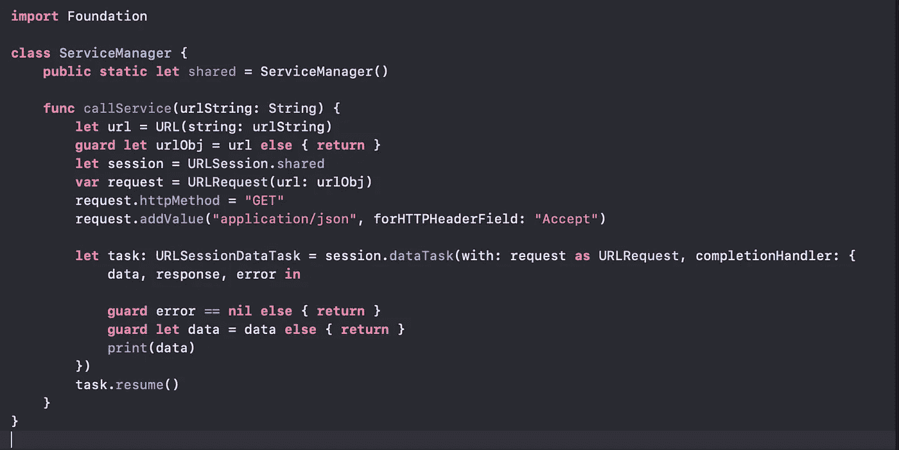
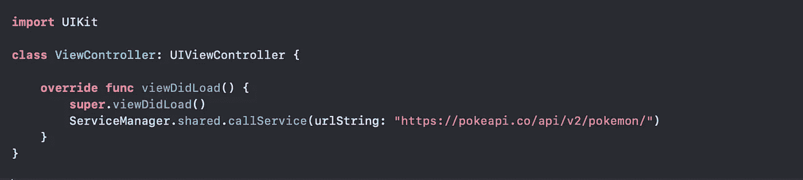
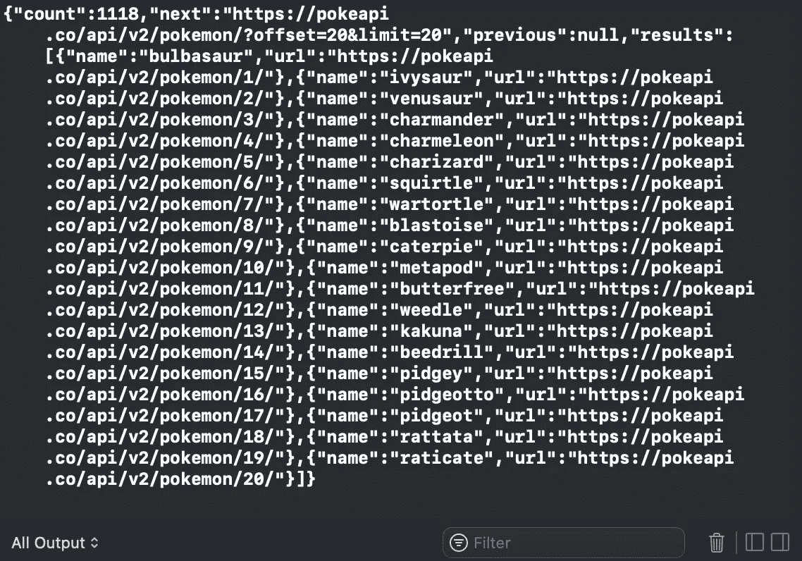
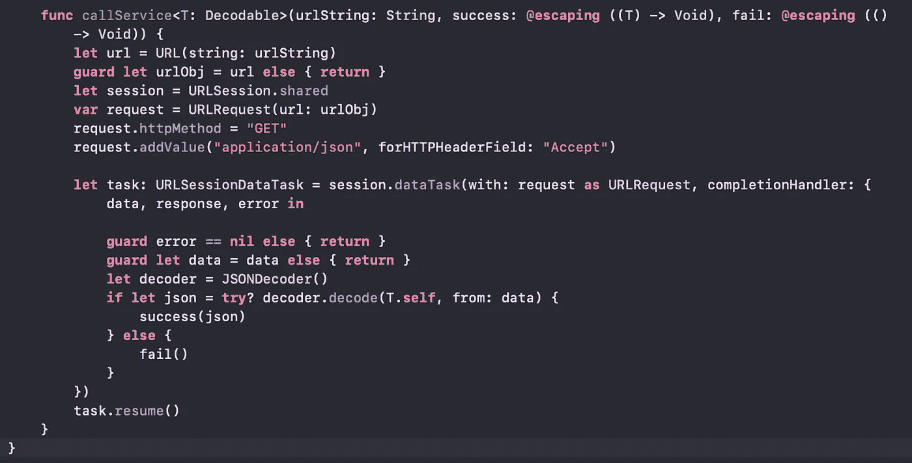
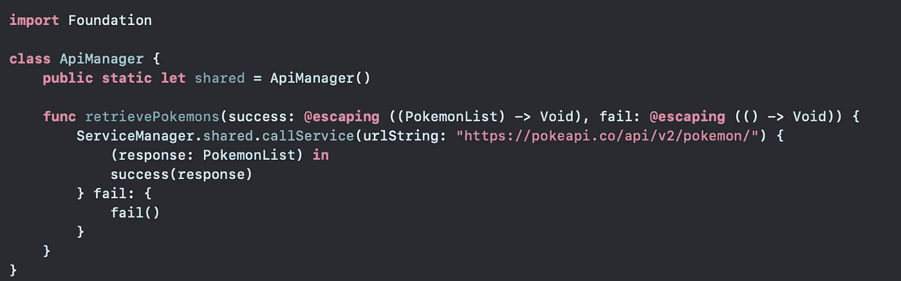
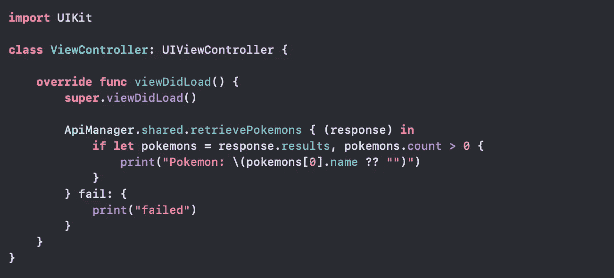

# 无需在 Swift 中使用 Alamofire，即可创建自己的 API 管理器

> 原文：<https://blog.devgenius.io/create-your-own-service-manager-without-using-alamofire-in-swift-1af5d5440461?source=collection_archive---------0----------------------->

## 调用 swift-iOS 项目中任何 API 的简单方法，无需使用第三方库

让我们从简单开始，稍后我们会添加所有的东西来完善我们的库。首先我们需要创建我们的类。在本教程中，我们将它命名为“ServiceManager ”,它应该是一个单例。创建新文件后，我们需要创建第一个名为“callService”的函数，它应该只提供发出请求所需的对象。

这是这个类开始时的样子

我们的函数将接受一个 urlString 作为输入，它可能是类似“https://www.google.com”或您需要调用的 API。

我们将使用 **URLSession** 和 **URLRequest** 来创建我们的经理。URLSession 是一个简单的 singleton，而 URLRequest 是我们需要为请求添加所有值的那个。目前我们只设置了 httpMethod to GET(这意味着我们还不能发送任何 httpbody ),我们添加了一个简单的头“Accept ”,值为“application/json ”(这是您需要添加的最常见的头之一)

如果您需要发布一些数据，您应该更改 **GET to POST** 并使用 request.httpBody = <您的数据对象>

调用 **session.dataTask** 我们的请求被发送，我们将得到数据作为响应。

让我们以口袋妖怪 API([https://pokeapi.co/](https://pokeapi.co/))为例，尝试我们的第一个简单函数调用

这就是我们的 ViewController 调用 ServiceManager 的样子。在运行之后，我们从服务器得到这个消息" **1417 字节"**，这意味着我们有 1417 字节的数据要处理。但是让我们看看我们收到的实际字符串，而不是数据的维度。在打印数据之前，添加以下行:

> **设** str = String(解码:数据，as: UTF8。**自我**
> 
> print(str) //这里您将看到从服务器接收到的 json

运行我们的应用程序后，我们可以在日志中看到:

我们拿到了口袋妖怪的名单！！！

让我们创建我们的模型，看看如何让我们的函数解析可解码的模型。

这是我们的模型，我们将对其响应进行解码。现在我们需要的是解析这个模型的 json 响应，我们应该告诉视图控制器刷新数据，或者提醒它请求成功。

函数的声明应该如下所示:

使用泛型“T”意味着我们的函数将在成功块中返回一个对象，并在出错时调用失败块。让我们在函数中添加解析部分，并调用成功/失败块。这就是我们的函数现在的样子

JSONDecoder 将完成解析工作。现在让我们创建一个名为 ApiManager 的新文件，我们将所有的 API 调用放在那里。

在 ApiManager 中，您可以放置您的服务。对于这个例子，我们将只使用一个名为 retrievePokemons 的服务。现在让我们在 ViewController 中更改我们的代码

正如您现在看到的，我们使用 ApiManager 来调用我们的服务。在成功的情况下，我们将只打印我们之前看到的模型中口袋妖怪的第一个名字。

如果您想在调用这个 API 时添加一个加载器，请阅读我的文章:

 [## Swift 中带有旋转 UIImage 的加载程序

### 如何在不扩展 UIViewController 的情况下创建一个覆盖加载器并在每个类中使用它

simaspavlos.medium.com](https://simaspavlos.medium.com/loader-with-rotating-image-in-swift-bce24abc1512) 

最后，让我们看看我们的调试器，看看打印了什么:

布尔巴瑟尔是你的 POKEMON！

感谢阅读！