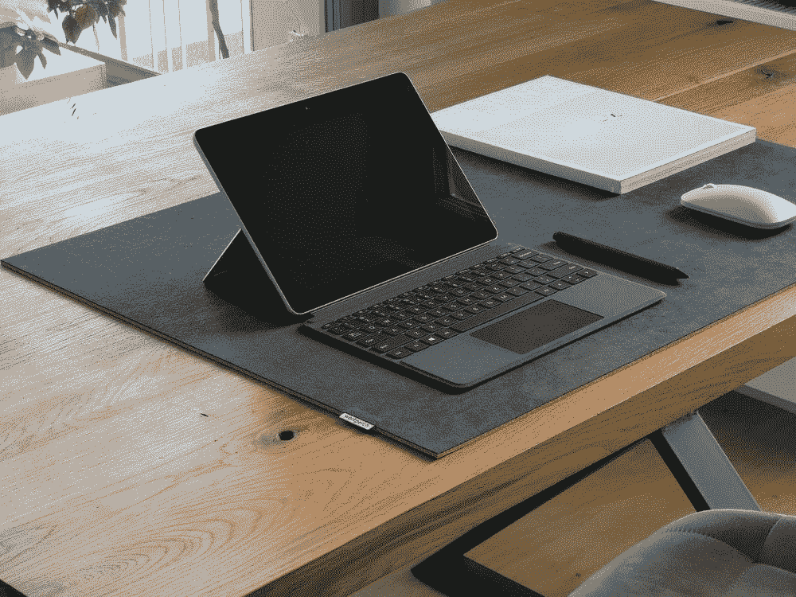
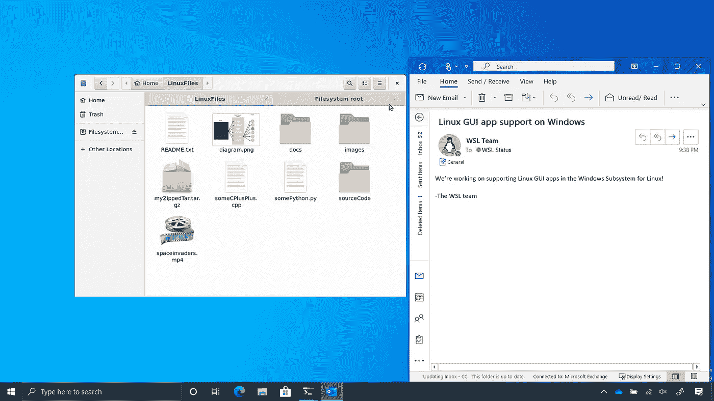
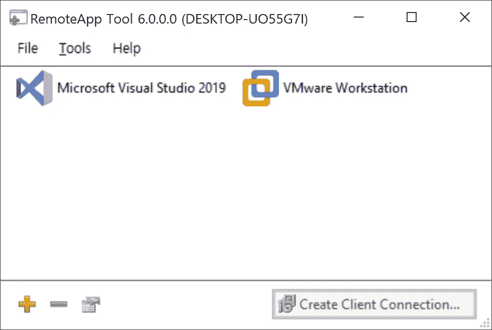
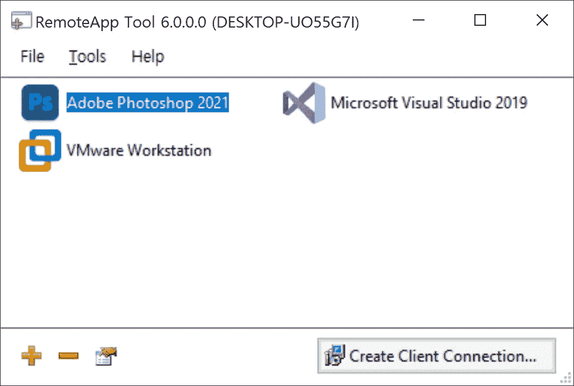
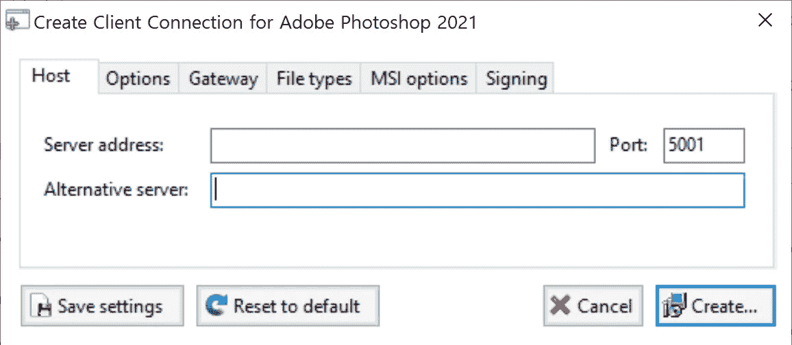
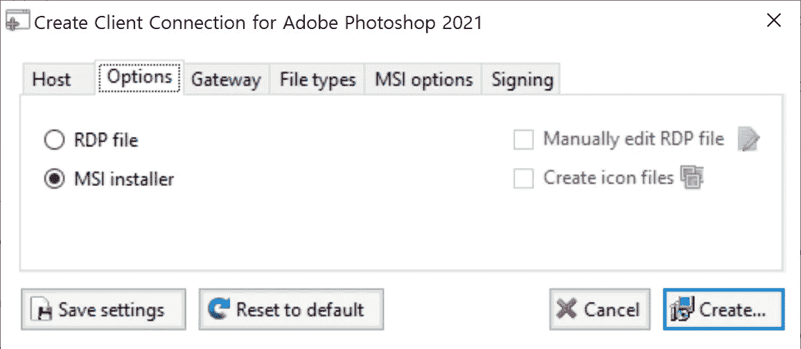
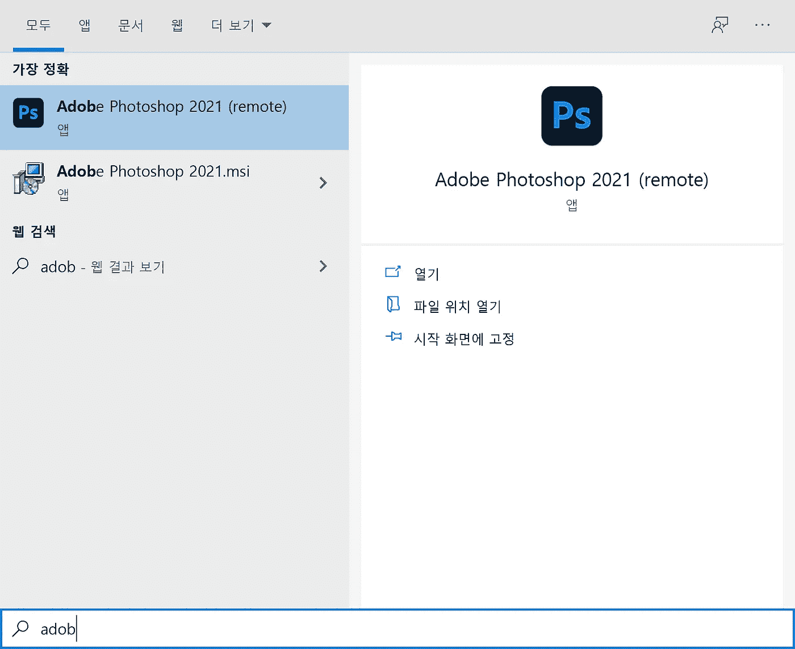
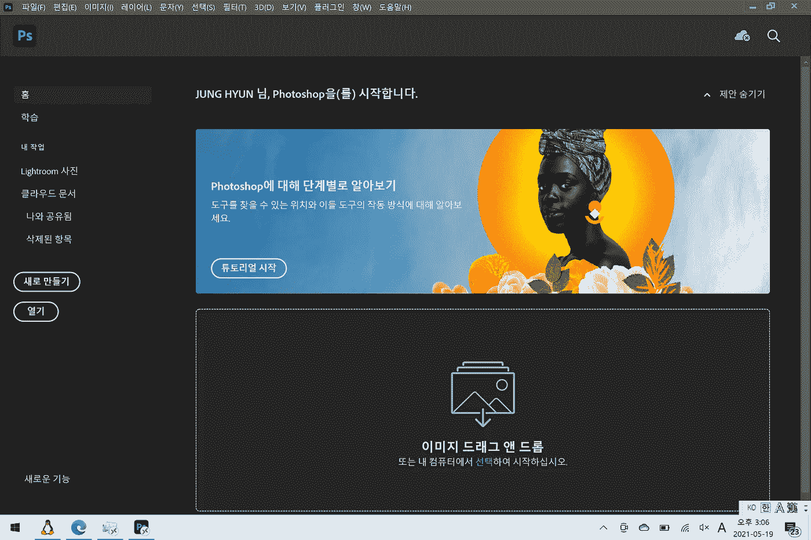
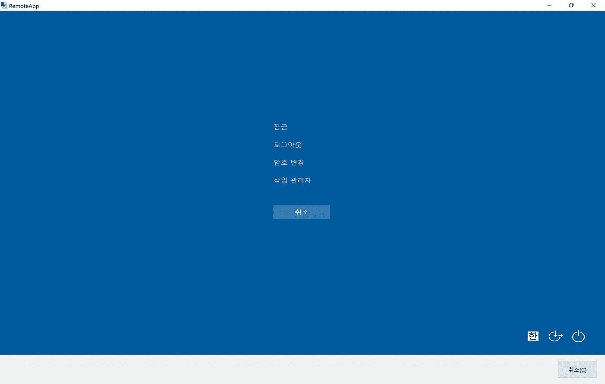

# 轻松创建您的 RemoteApp 环境

> 原文：<https://blog.devgenius.io/create-your-remoteapp-environment-easily-c243b9919948?source=collection_archive---------0----------------------->

[工人](https://unsplash.com/@workperch?utm_source=unsplash&utm_medium=referral&utm_content=creditCopyText)在 [Unsplash](https://unsplash.com/s/photos/microsoft-surface?utm_source=unsplash&utm_medium=referral&utm_content=creditCopyText) 上拍照

M 微软远程桌面是一个成熟的远程连接软件堆栈，适用于各种工作负载。它不断发展，最近，RDP 集成了 Linux 桌面。

摘自[Windows 子系统 for Linux BUILD 2020 摘要| Windows 命令行(microsoft.com)](https://devblogs.microsoft.com/commandline/the-windows-subsystem-for-linux-build-2020-summary/)

这种表现形式已经出现在现有 Windows 应用程序的 RemoteApp 功能中。您可以访问安装在家庭或办公室计算机上的应用程序，而不是查看整个桌面屏幕。

但是如何才能实现这一点呢？多亏了一个叫做 RemoteApp 工具的小实用程序；我们可以创建 RemoteApp 快捷方式，而无需复杂的技巧。您可以从下面的网站下载该工具。

 [## RemoteApp 工具- Kim Knight

### 借助 Microsoft RemoteApp 技术，您可以无缝地使用在另一台计算机上运行的应用程序…

www.kimknight.net](http://www.kimknight.net/remoteapptool) 

# 创建 RemoteApp 应用程序快捷方式

在远程计算机上安装 RemoteApp 工具后，您现在可以为其他计算机创建应用程序快捷方式。运行应用程序，你可以看到一个小窗口，如下图所示。

单击加号图标创建新的应用程序快捷方式，并打开您的应用程序文件。例如，我想为 Adobe Photoshop 应用程序创建一个快捷方式，以指向路径“C:\ Program Files \ Adobe \ Adobe Photoshop 2021 \ Photoshop . exe”中的 Photoshop 应用程序文件。

然后，选择一个 Adobe Photoshop 项目，并单击“创建客户端连接”按钮。

键入您的服务器地址。当您尝试连接此计算机时，此地址是您的普通远程访问地址。另外，请指定确切的端口号。默认的 RDP 端口号是 3389，但是您可以根据您的网络或防火墙配置选择另一个端口号。

默认情况下，该工具会为远程电脑创建一个自定义的 RDP。但是如果你想把这个 RDP 快捷方式打包成一个应用程序，你可以创建一个 MSI 包。为此，您需要在[https://wixtoolset.org/releases/](https://wixtoolset.org/releases/)安装 WiX 编译器包。

# 分发应用程序

创建 RDP 或 MSI 文件后，您可以通过将文件复制到便携式电脑或远程电脑来测试连接。我建议您创建一个 MSI 包，因为它为您的开始菜单创建了一个快捷方式。

如果您安装了分布式 MSI 包，您可以找到用小图标装饰的 RemoteApp 应用程序的图标。您可以通过图标形状来区分本地应用程序和远程应用程序。

# 提高生产力的一些技巧

即使您正在使用 RemoteApp，它仍然是一个远程桌面连接。因此，您在远程桌面环境中使用的所有快捷方式仍然可用。您可以启动任务管理器来管理现有程序，或者在没有远程“开始”菜单的情况下开始新任务。

聚焦 RemoteApp，然后按 Ctrl、Alt 和 End 键。然后 RemoteApp 显示一个系统菜单，如下图所示。

然后单击任务管理器项目。您现在可以管理您现有的所有流程。此外，您可以通过“文件”菜单启动一个新程序。

此外，你可以通过任务管理器启动一些重要的工具。键入关键字启动应用程序。

*   `control` —打开经典控制面板
*   `ms-settings:` —打开现代设置应用
*   `compmgmt.msc` —打开电脑管理控制台
*   `msconfig` —打开系统配置工具
*   `msinfo32` —打开系统信息窗口
*   `shell:startup` —打开启动文件夹
*   `explorer` —打开文件浏览器
*   `msedge` —打开微软 Edge (Chromium)
*   `calc` —打开计算器(如果已安装)
*   `cmd` —打开经典终端
*   `wt` —打开 Windows 终端(如果已经安装)
*   `wsl` —在默认终端上打开 WSL(如果已安装)

就是这样！您现在可以无缝地利用您的远程应用程序了！