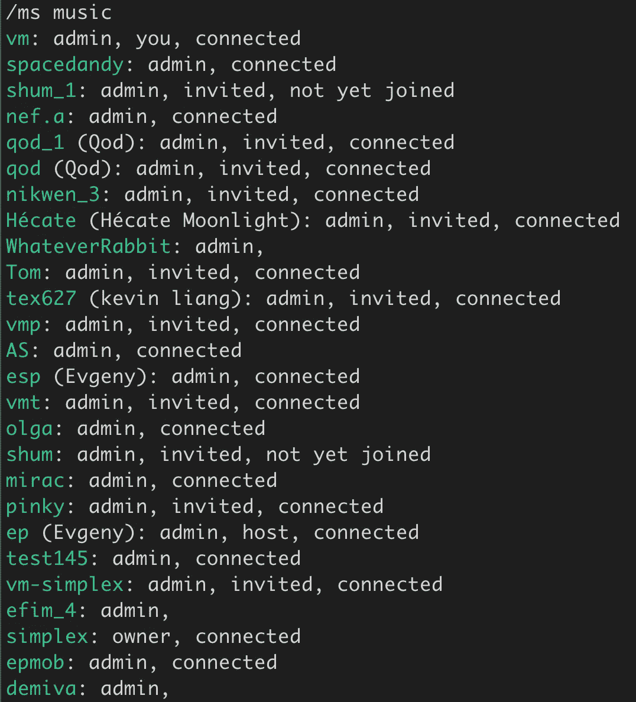
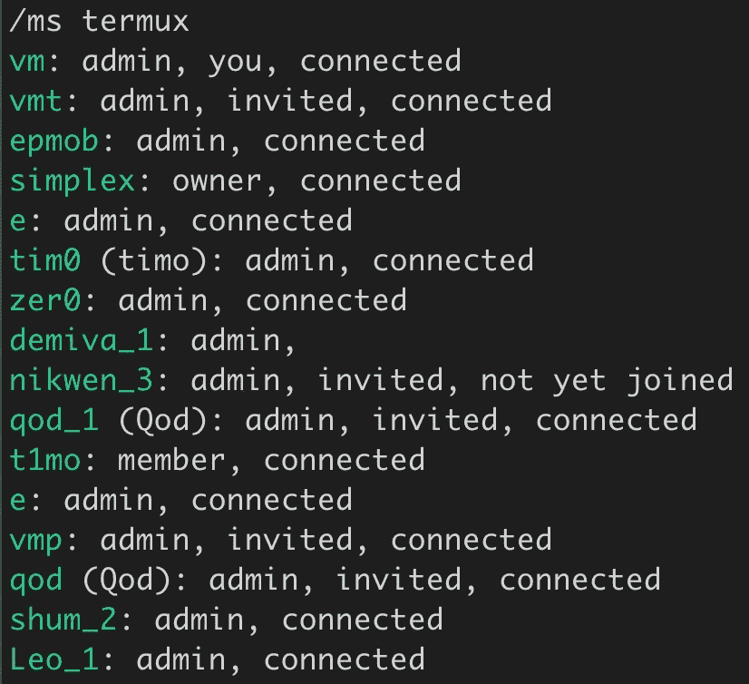
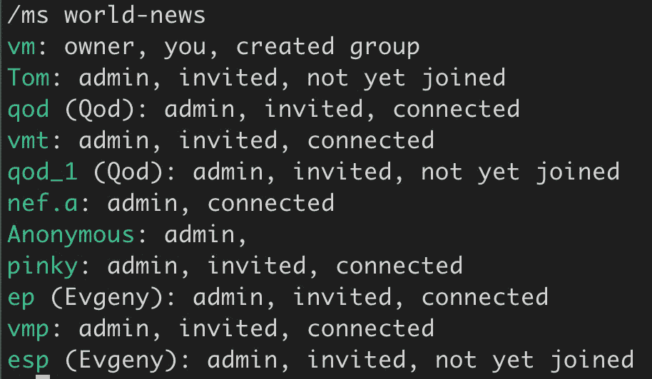

# 从头开始创建一个社区。

> 原文：<https://blog.devgenius.io/creating-a-community-from-scratch-49f55439acc5?source=collection_archive---------3----------------------->

# 介绍

最近一直在玩[单工聊天](https://simplex.chat/)。这是一个可怕的安全信使不要误会我的意思；它有群组、文件发送、命令行界面、iOS 和 Android 应用、多层加密、对 Termux 的支持等等..但是，你知道目前把它从信号和电报中分离出来最简单的方法吗？它缺少这两个所拥有的社区！让那些数十万、有时数百万的花哨团体见鬼去吧。

我并没有气馁，而是自己创建了几个小组，并试着把他们和其他人放在一起。这篇文章将概述我在这方面的经验，所犯的错误，所吸取的教训，以及我对未来的展望。

# 为什么要这么做？

因为我坚信传播网络安全、元数据隐私和密码学的信息。SimpleX 在这些方面与我合作得非常好。它拥有两层加密，其中一层是臭名昭著的双棘轮。网络架构应该提供比现有基础设施更好的元数据隐私。该项目是开源的，[托管在 GitHub](https://github.com/simplex-chat/simplex-chat) 上，因此欢迎您亲自检查加密原语，随着该项目从一个羽翼未丰的安全信使过渡到加密奇迹，许多专家目前正在排队做这件事。

# 我创建了哪些组？

**#音乐**

**#termux**

**#世界新闻**

# 怎么样了？

我认为上面的图片讲述了一个故事。这非常有趣，社区变得活跃起来:

*   我在音乐方面取得了最大的成功。成千上万的人前来聆听《SimpleX Chat》和《yours truly》的创作者们的音乐。也许这是我们最需要的，你知道…在某个时候，这个生态系统需要通过公共渠道来活跃起来，以垃圾邮件的形式发送一切和任何东西，我认为 **#music** 提供了这样一个渠道，人们立即喜欢上了它。
*   在 **#termux** 中，我们已经弄清楚了[如何在 Termux](/how-to-compile-haskell-on-termux-for-aarch64-architecture-cc15375d3595) 上编译 Haskell，我们现在有预编译的二进制文件可供所有想加入我们的新来者使用，它们来自市场上最流行的终端仿真器。
*   我创建的 3 个小组中增长最慢的是为**#世界新闻**。也许人们没有太多兴趣接收来自远离地面的我的更新，或者也许新闻内容的市场已经被现有的电报和抖音频道饱和，这些频道在几乎 24 小时的循环中以生动的细节报道了所犯下的暴行。无论如何,《T2 世界新闻报》的增长比我预期的要慢。

# 我能加入吗？

绝对的！目前没有群地址这种东西，所以你必须连接到已经在这些群中的人，请求邀请，那个人可以是我，我的地址是:【https://tinyurl.com/simplex-chat 

连接后，请告诉我您想加入哪些群组，我会向您发送邀请！

# 我要把这个项目带到哪里去？

当我们攀登主流的山峰 [Reddit](https://www.reddit.com/r/SimpleXChat/) 、[抖音](https://www.tiktok.com/@simplex_chat)、[独立黑客](https://www.indiehackers.com/product/simplex-chat)、 [LinkedIn](https://www.linkedin.com/company/simplex-chat/) 和 [Twitter](https://twitter.com/simplexchat) 时，我计划了更多的单工聊天群。不要混淆，我的意思是**更多的组，见下文！**我的直觉是，采取这种方式的正确方向是图像板格式。该基础设施承诺与 Signal 类似的加密性能，此外，由于卓越的网络拓扑，它还承诺更好的元数据隐私。这些事情加上缺乏全球身份层，导致脑海中出现一个词“**Anonymous**”…他们遵循隐私和匿名原则，因此，为了方便起见，我想我应该从创建他们已经熟悉的基础架构开始。

# 即将到来的群组列表

# **道德黑客🔓**

**简称:**#黑客

**介绍性消息:**请遵守进攻安全、认证道德黑客、TryHackMe 等社区制定的行为准则。

**动机:**鼓励人们关注网络安全问题。

# 随意😇/😈

**简称:** #r

**介绍性消息:**名字说明了一切。我们不会主动管理这个版块的内容，除非违反了人类的尊严。

# 动漫🧿

**简称:**#动漫

**介绍信息:**该版块致力于覆盖动漫&漫画的高端文化。

# 视频游戏🎮

**简称:** #vid

**介绍性消息:**一切与游戏相关的一切。

# 电视和电影🎬

**简称:**#电视

**介绍性消息:**讨论最新剧集和即将上映的剧集。剧透应该贴上这样的标签。

# 🧩科学与数学

**简称:** #sci

**介绍性信息:**我们的目标是在广泛的研究领域将科学和学术知识系统化。

# 摄影📸

**简称:**#照片

**介绍信息:**分享捕捉美丽瞬间的艺术。

# 食物和烹饪🥗🍱🧁

**简称:**#食品

**介绍信息:**食谱、想法、项目和野炊——所有食物给我们生活带来的味道在这里都是受欢迎的。

# gif💫

**简称:** #gif

介绍信息:模因移动时更有趣。

# 世界新闻🌍

**简称:**#新闻

介绍信息:全球重大新闻的绝佳去处。

# 模因🌟

**简称:**#模因

**介绍性信息:**用最乏味的内容颠覆迷因经济。

# 功能发布💡

**简称:**#特性

**介绍性消息:**这里宣布了直接从传送带上取下的最新功能。

# 🗞出版社

**简称:**#出版社

**介绍性消息:**您想在您即将发表的文章中介绍单纯形吗？为了您的方便，我们很乐意提供媒体资产包、商品和新闻稿。我们喜欢收到你的来信。

# 哈斯克尔·⚙️

**简称:**#哈斯克尔

**介绍性消息:** Haskell 不会编译？兼容性问题？在这里分享一下。我们热衷于倾听您在函数式编程与商业可伸缩性的前沿的冒险经历。

# 数据保密🔐

**简称:**#隐私

**介绍性消息:**最近有消息透露，我们以难以置信的低价出售了自己的隐私。后门、导致漏洞利用的漏洞以及违反保密性是现有基础架构不可或缺的一部分。我们 SimpleX 知道我们可以做得更好！