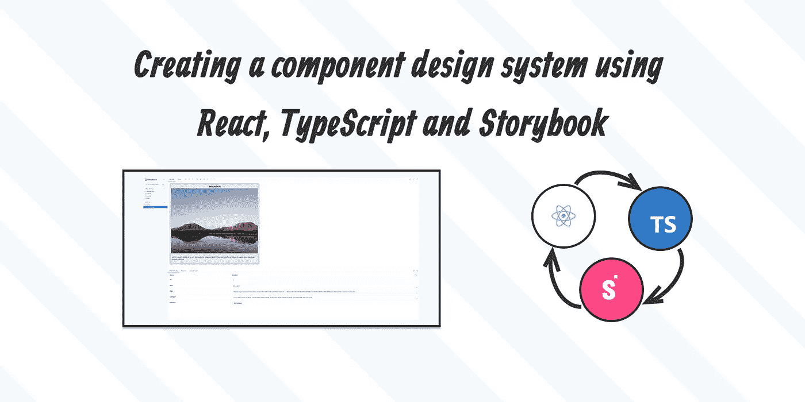

# 使用 React、TypeScript 和 Storybook 创建组件设计系统

> 原文：<https://blog.devgenius.io/creating-a-component-design-system-using-react-typescript-and-storybook-34c72d30d4fa?source=collection_archive---------2----------------------->



在处理项目时，创建设计系统非常有用。如果你是一名设计师，那么你已经熟悉这个概念。有一个设计文件，有品牌的颜色，字体大小和内容格式等。在开发方面，同样适用，因为我们需要确保前端匹配设计文件。

对于那些使用过像 Tailwindcss 或 Bootstrap 这样的 CSS 框架的人来说，使用设计系统的想法并不新鲜，因为这些框架遵循它们自己的设计系统。Storybook 本质上给了开发人员一种在前端创建自己的组件设计系统的方法。这很好，因为我们可以孤立地查看组件，这使我们能够为所有组件创建文档和测试。

例如，你可以向客户展示故事书中的设计系统，他们可以看到所有组件的外观。甚至可以改变一些值，如背景颜色和字体大小，这样他们就可以看到不同的版本。在设计师的情况下，他们将能够看到他们的设计在代码中是什么样子，如果有任何动画，他们也可以看到。

# 设置项目

让我们从用 Storybook 建立一个样板 React 项目开始。导航到一个目录并打开命令行工具。将下面的代码复制并粘贴到命令行中，以设置您的项目。

```
npx create-react-app my-app --template typescript
cd my-app
npx sb init
```

您现在应该有两个运行脚本了。运行下面的两个脚本来启动服务器。

```
# Starts the React Application
npm run start# Starts the Storybook component design system
npm run storybook
```

# 创建故事书组件

如果您进入在 web 浏览器中打开的 Storybook 开发页面，您应该会看到一些示例组件，这样您就可以了解它是如何工作的。现在让我们创建一个 UI 组件，这样您就可以看到使用 Storybook 创建组件是什么样子。

首先创建一个名为 **Hero** 的文件夹，并将它放在 src 中的 stories 文件夹中。现在创建 3 个文件，并将它们放在 **Hero** 文件夹中。创建文件`Hero.css`、`Hero.stories.tsx`和`Hero.tsx`。

将下面的代码复制并粘贴到相应的文件中。

`src/stories/Hero/Hero.css`

```
@import url('https://fonts.googleapis.com/css2?family=Quicksand:wght@400;500;700&display=swap');.hero {
    background: rgb(236, 236, 236); border: 1rem solid rgb(220, 220, 220); max-width: 50rem; width: 100%; border-radius: 1rem;
}.hero-content {
    width: 100%; display: flex; flex-flow: column nowrap;
}.hero-content h1 {
    font-family: 'Quicksand', sans-serif; color: #000000; text-transform: uppercase; text-align: center;
}.hero-content img {
    max-width: 50rem; width: 100%;
}.hero-content p {
    font-family: 'Quicksand', sans-serif; color: #000000; padding: 0.5rem;
}#preloader {
    width: 50rem; height: 50rem;
}#loader {
    display: block; position: relative; left: 50%; top: 50%; width: 150px; height: 150px; margin: -75px 0 0 -75px; border-radius: 50%; border: 3px solid transparent; border-top-color: #9370db; -webkit-animation: spin 2s linear infinite; animation: spin 2s linear infinite;
}#loader:before {
    content: ''; position: absolute; top: 5px; left: 5px; right: 5px; bottom: 5px; border-radius: 50%; border: 3px solid transparent; border-top-color: #ba55d3; -webkit-animation: spin 3s linear infinite; animation: spin 3s linear infinite;
}#loader:after {
    content: ''; position: absolute; top: 15px; left: 15px; right: 15px; bottom: 15px; border-radius: 50%; border: 3px solid transparent; border-top-color: #ff00ff; -webkit-animation: spin 1.5s linear infinite; animation: spin 1.5s linear infinite;
}@-webkit-keyframes spin {
    0% {
        -webkit-transform: rotate(0deg); -ms-transform: rotate(0deg); transform: rotate(0deg);
    } 100% {
        -webkit-transform: rotate(360deg); -ms-transform: rotate(360deg); transform: rotate(360deg);
    }
}@keyframes spin {
    0% {
        -webkit-transform: rotate(0deg); -ms-transform: rotate(0deg); transform: rotate(0deg);
    } 100% {
        -webkit-transform: rotate(360deg); -ms-transform: rotate(360deg); transform: rotate(360deg);
    }
}
```

`src/stories/Hero/Hero.stories.tsx`

```
import { ComponentStory, ComponentMeta } from '@storybook/react';import { Hero } from './Hero';export default {
    title: 'Hero/Hero', component: Hero,
} as ComponentMeta<typeof Hero>;const Template: ComponentStory<typeof Hero> = (args) => <Hero {...args} />;export const Primary = Template.bind({});Primary.args = {
    id: 1, title: 'Mountain', img: 'https://images.unsplash.com/photo-1464278533981-50106e6176b1?ixlib=rb-1.2.1&ixid=MnwxMjA3fDB8MHxwaG90by1wYWdlfHx8fGVufDB8fHx8&auto=format&fit=crop&w=2274&q=80', content:
        'Lorem ipsum dolor sit amet, consectetur adipiscing elit. Duis mollis tellus et libero feugiat, vitae dignissim augue pulvinar.',
};
```

`src/stories/Hero/Hero.tsx`

```
import './Hero.css';interface Heroprops {
    id: number; title: string; img: string; content: string; loading: boolean;
}export const Hero = ({ id, title, img, content, loading, ...props }: Heroprops) => {
    return (
        <>
            <div className="hero">
                {loading ? (
                    <div id="preloader">
                        <div id="loader"></div>
                    </div>
                ) : (
                    <div className="hero-content">
                        <h1>{title}</h1>  <p>{content}</p>
                    </div>
                )}
            </div>
        </>
    );
};export default Hero;
```

`App.css`

用下面的代码替换文件中的所有代码。

```
*,
*::before,
*::after {
    padding: 0; margin: 0; box-sizing: border-box;
}html {
    font-size: 16px;
}body {
    font-size: 1rem; font-family: 'Quicksand', sans-serif; color: #000000; background-color: #222;
}.container {
    margin: 0 auto; width: 100%; max-width: 50rem;
}
```

`App.tsx`

用下面的代码替换文件中的所有代码。

```
import Hero from '../src/stories/Hero/Hero';import './App.css';const App = () => {
    return (
        <>
            <div className="container">
                <Hero
                    id={1}
                    title={'Mountain'}
                    img={
                        'https://images.unsplash.com/photo-1464278533981-50106e6176b1?ixlib=rb-1.2.1&ixid=MnwxMjA3fDB8MHxwaG90by1wYWdlfHx8fGVufDB8fHx8&auto=format&fit=crop&w=2274&q=80'
                    }
                    content={
                        'Lorem ipsum dolor sit amet, consectetur adipiscing elit. Duis mollis tellus et libero feugiat, vitae dignissim augue pulvinar.'
                    }
                    // Change this value to true to see the loading animation loading={false}
                />
            </div>
        </>
    );
};export default App;
```

重新加载 React 应用程序的服务器和 Storybook 服务器，现在您应该会看到一个带有图像的 Hero 组件。如果由于任何原因图像被破坏，你可以改变图像的网址。在`App.tsx`和`Hero.stories.tsx`文件中执行此操作。

英雄组件在故事书中有一些可定制的选项。你可以改变 id，标题，img，内容，甚至加载状态。

# 最后的想法

这是使用故事书的简单介绍。要了解更多，请访问主要的[故事书网站](https://storybook.js.org/)。