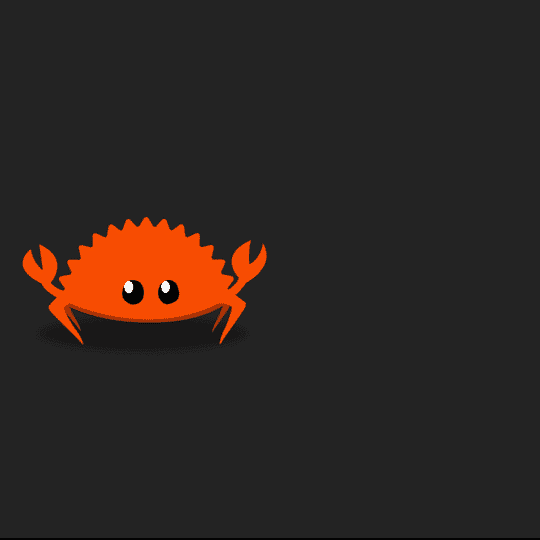
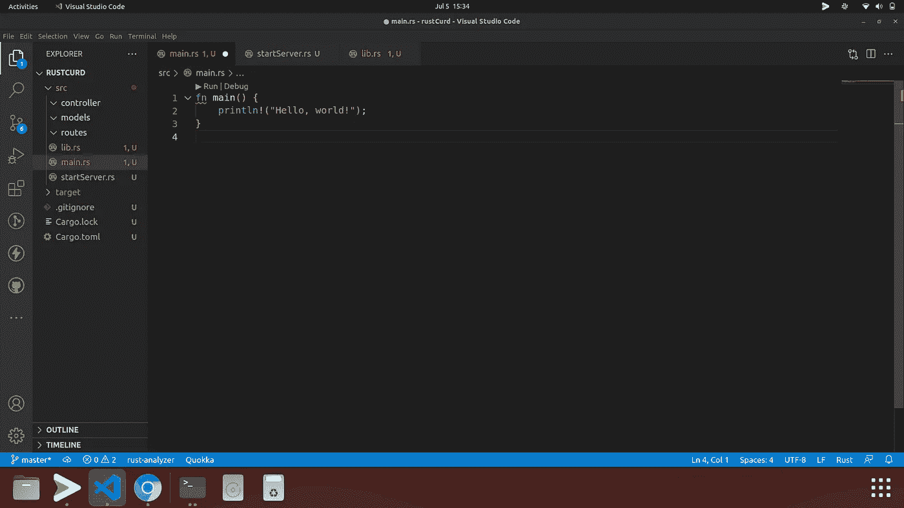
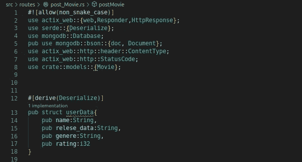
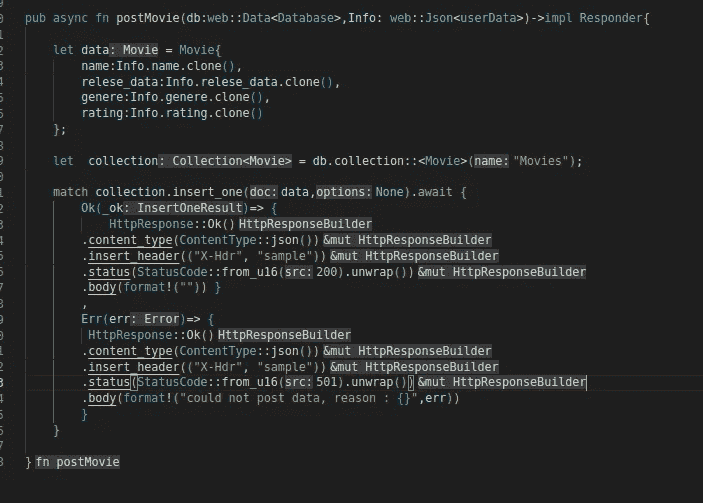
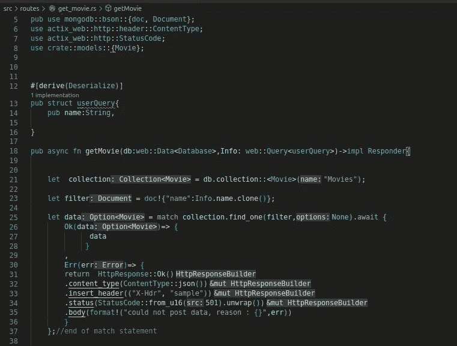
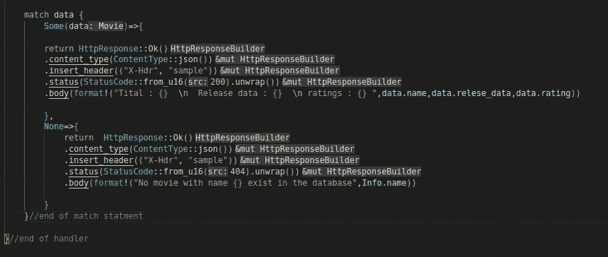
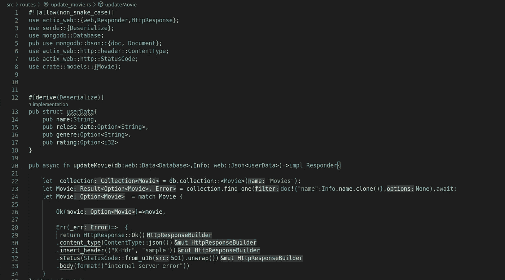
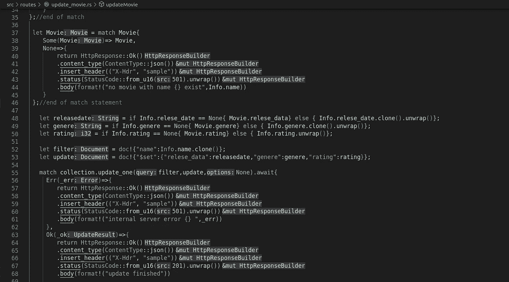
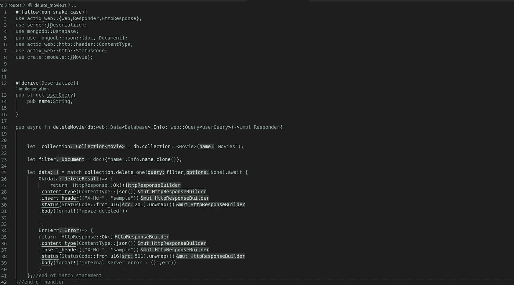

# 使用 MongoDb rust 驱动程序和 actix-web 在 rust 中创建一个凝乳应用程序

> 原文：<https://blog.devgenius.io/creating-a-curd-application-in-rust-using-mongodb-rust-driver-and-actix-web-139137615159?source=collection_archive---------10----------------------->

CRUD 是来自计算机编程领域的首字母缩写词，指的是实现持久存储应用程序所必需的四个功能:**创建、读取、更新和删除**。

在本教程中，我们将在 Actix Web 上创建 rest apis 来对数据库执行凝乳操作。我们将简单地创建一个操作，其中用户可以张贴电影及其细节，并可以删除，更新或观看电影。为了使这个 API 尽可能简单，我们将不使用任何认证或授权技术。只是一些简单的 API 来发布电影，更新电影和删除电影等。



可爱的 Ferris 祝你学习愉快

***不好意思，我把流派打错了 genere，忽略。***

确保你已经安装了最新版本的 rust 工具链，并且你在 Mongodb 上有一个帐户，我们将使用简单的云托管 Mongodb 数据库。

终端类型上

```
cargo version
```

你可能会得到一些与你的货物版本相关的输出，如果你的终端不能识别这个命令，你需要重新安装 rust。

再次前往终端，创建一个新项目

```
cargo new rustCurd
```

你可以给你的项目取任何你想要的名字，只是我不擅长取名字。

我们的 MVC 架构看起来会像这样



忽略我的铁锈分析仪。有时它会指出不必要的错误。

*   在模型文件夹中，我们将创建我们的数据库模式
*   在控制器文件夹中，我们将拥有获取和更新数据库的逻辑
*   在 routes 文件夹中，我们将有处理程序
*   startServer.rs 将创建一个 Server 实例
*   我们项目的二进制入口点中的 Main.rs

让我们开始我们的代码吧。

转到 cargo.toml 并添加这些依赖项

```
//cargo.toml[dependencies]
actix-web = "4.0.1"
tokio = { version = "1", features = ["macros", "rt-multi-thread"] }
serde = "1.0.115"
dotenv = "0.15.0"
bson = "2.3.0"[dependencies.mongodb]
version = "2.2.0"
default-features = false
features = ["async-std-runtime"]
tokio = { version = "1", features = ["full"] }
```

嗯，有很多要理解的，对吧？当我们将在代码中使用它们时，我们将遍历所有这些依赖项。

现在转到 main.rs 并键入以下代码

```
use mylib::*;use dotenv;#[tokio::main]async fn main() -> std::io::Result<()> {let address = dotenv::var("address").unwrap();let db_url = dotenv::var("db_url").unwrap();let listener = TcpListener::bind(address.clone()).expect("fail to bind to the listner");let mut client_options = ClientOptions::parse(db_url).await.expect("fail to connect to the server");client_options.app_name = Some("App".to_string());let client = Client::with_options(client_options).expect(" ");let db = client.database("RUSTcurd");println!("server is running at {}",address);run(listener,db)?.await
}
```

这可能会让你很难接受，但请耐心等待

Tokio 运行时**提供了运行异步任务**所必需的 I/O 驱动程序、任务调度程序、定时器和阻塞池。因为 Actix-web 服务器的每个工作线程都使用单线程运行时。*请注意，服务器实例的数量取决于您的 cpu 拥有的核心数量。*

通过将 TcpListner 绑定到套接字地址来创建 TcpListner 之后，它会侦听传入的 TCP 连接。*注意当值下降时，套接字将关闭。*

在我们的例子中，您将在. env 文件中存储您的本地主机地址，即 127.0.0.1:80 和 mongodb 应用程序连接 url。头，创建自己的文件。

你的。env 文件应该如下所示

```
address=127.0.0.1:80db_url=mongodb+srv://<your database url>
```

ClientOptions 它是一个结构，当连接到我们的数据库实例时将被传递，这个结构有许多属性，你可以在 mongodb rust drive 文档中找到它。连接到数据库后，我们创建自己的名为“RUSTcurd”的数据库，并将 Db connected 实例和 TcpListner 传递给我们的 run 函数，我们现在将定义这个函数。

我们的 startServer 文件将托管我们的 Http 服务器，所有的路由将只在这个文件中提供服务。基本上，它将创建一个 actix web http 服务器实例。

现在，在 startServer.rs 文件中粘贴以下代码

```
use actix_web:: {web, App, HttpServer};
use mongodb::{Database};
use std::net::TcpListener;
use actix_web::dev:: Server;
use routes::*;pub fn run(listener:TcpListener,db:Database)->Result<Server, std::io:: Error> {let db = web::Data::new(db);let _server = HttpServer::new(move|| {App:: new().route("/postMovie", web::post().to(postMovie)).route("/updateMovie", web::get().to(updateMovie))
//you could use patch method also.route("/deleteMovie", web::delete().to(deleteMovie)).route("/showMovie", web::get().to(getMovie)).app_data(db.clone())}).listen(listener).expect(" ").run();Ok(_server)}
```

我们使用 HttpServer::new 创建了一个 Http server 实例，有 4 个 api 端点，像 javascript ie 链接类上的函数调用，也可以在 rust struct 上完成，App::new 创建了一个新的 App 实例。那我们就打电话。route 方法来创建 API 的路由。这些路径的名称是“后期电影”、“更新电影”、“删除电影”、“放映电影”。我们还将我们的数据库状态(db handler)传递给每个路由，并且可以从 actixWeb 提取器中提取。请记住，我们传递的是 db.clone，因为 actix web 会产生多个线程，每个线程都需要自己的 db handler 实例。

。route 有两个参数，第一个是定义 api 端点的字符串，第二个是带有 Https 方法和处理函数的 web struct。

在转到 routes 之前，我们将首先定义电影集合的模式。

转到 models 文件夹，创建一个文件名为 movieSchema.rs 的文件，然后粘贴这段代码

```
use serde::{Deserialize,Serialize};
use mongodb::options::{IndexOptions};
use mongodb::IndexModel;
use mongodb::Client;
use bson::doc;#[derive(Deserialize,Serialize)]
pub struct Movie {
pub name:String,
pub relese_data:String,
pub genere:String,
pub rating:i32
}pub async fn create_name_unique(client: &Client) {
let options = IndexOptions::builder().unique(true).build();
let model = IndexModel::builder()
.keys(doc!{"name":1})
.options(options)
.build();client
.database("RUSTcurd")  //name of our database
.collection::<Movie>("Movies") //name of our collection
.create_index(model, None)
.await
.expect("error creating index!");
}
```

我们的结构需要被序列化和反序列化，以便它可以作为 bson 数据放入 mongodb，当从 mongo db 提取时，它可以被解析回 rust 原生结构类型。

我们的电影名称必须是唯一的，我们在这里使用 mongodb 索引来指定 name 字段的属性。我们将不讨论 mongodb 索引，因为它们超出了当前议程的范围。注意，我们只需在向数据库中插入任何内容之前运行一次此函数“create_name_unique”。但是在运行这个函数之前，我们需要在数据库中创建一个名为“Movies”的集合，我们将在 main.rs 上完成所有这些工作。

在 main.rs 糊上

```
use mylib::*;#[tokio::main]async fn main() -> std::io::Result<()> {let address = dotenv::var("address").unwrap();let db_url = dotenv::var("db_url").unwrap();let listener = TcpListener::bind(address.clone()).expect("fail to bind to the listner");let mut client_options = ClientOptions::parse(db_url).await.expect("fail to connect to the server");client_options.app_name = Some("App".to_string());let client = Client::with_options(client_options).expect(" ");let db = client.database("RUSTcurd");//we create a collection with movies struct defined in models as schema and named it 'Movies'_c = db.collection::<Movie>("Movies");//we need to run this function to create name field as uniquecreate_name_unique(&client);println!("server is running at {}",address);run(listener,db)?.await}
```

请注意，所需的文件是在 lib.rs 中导入的，我们只能从 lib.rs 中访问它们，在 main.rs 的第一行，我们有“use lib::*”将导入 lib 中定义或导入的所有函数和结构。应该记住，lib.rs 中导入的所有结构都必须是公共的。

下面是我的 lib.rs 的样子

```
pub use mongodb::{Client};pub use mongodb::options::ClientOptions;pub use std::net::TcpListener;pub mod models;pub use models::{Movie,create_name_unique};pub use dotenv;mod startServer;pub use startServer::run;mod routes;pub use routes::*;
```


如果事情对你没有多大意义，不要惊慌。

现在让我们为 api 端点创建处理程序，进入 routes 文件夹并创建 4 个名为

*   电影后期
*   更新电影. rs
*   放映电影. rs
*   删除电影

在许多情况下，人们更喜欢在同一个文件中创建与单个对象相关的处理程序。对我们来说，是电影。事实上，当你在大型项目中工作时，你有管理路径，用户路径等等。一个好的开发人员总是喜欢在同一个文件中保存具有相似对象的路线。但是由于我们只有四条路线，我们可以将它们保存在单独的文件中。

让我们来创建后期处理程序并粘贴它

```
#![allow(non_snake_case)]use actix_web::{web,Responder,HttpResponse};
use serde::{Deserialize};
use mongodb::Database;
pub use mongodb::bson::{doc, Document};
use actix_web::http::header::ContentType;
use actix_web::http::StatusCode;
use crate::models::{Movie};#[derive(Deserialize)]
pub struct userData{
pub name:String,
pub relese_data:String,
pub genere:String,
pub rating:i32}pub async fn postMovie(db:web::Data<Database>,Info: web::Json<userData>)->impl Responder{let data = Movie{
name:Info.name.clone(),
relese_data:Info.relese_data.clone(),
genere:Info.genere.clone(),
rating:Info.rating.clone()}; let  collection = db.collection::<Movie>("Movies");match collection.insert_one(data,None).await {
Ok(_ok)=> { HttpResponse::Ok()
    .content_type(ContentType::json())
    .insert_header(("X-Hdr", "sample"))
    .status(StatusCode::from_u16(200).unwrap())
    .body(format!("data posted"))          },Err(err)=> { HttpResponse::Ok()
     .content_type(ContentType::json())
     .insert_header(("X-Hdr", "sample"))
     .status(StatusCode::from_u16(501).unwrap())
     .body(format!("could not post data, reason : {}",err)) } } // end of match statement} // end of handler
```

在编辑器中应该是这样的



那里发生了很多事情。别担心，我会解释每一件事，这样你就能理解了。

首先，我们需要导入将在处理程序中使用的结构。

之后，我们需要创建一个名为“userData”的序列化结构。我们将从用户那里收到的内容是一个原始的 json 主体。我们需要提取 json 数据用于 rust 代码。这里 actix 提取器开始发挥作用。Actix 网页提取器提供了很多。我们可以提取查询、参数、表单数据等等。您可以参考 Actix web 文档了解更多信息。在我们的例子中，我们将使用' web::Json <userdata>'，注意 userData 结构已经被传递给 web::Json 提取器，以便提取器知道我们需要如何将数据解析到 rust native 结构中。</userdata>

在 mongodb rust 驱动程序中，可以使用 doc 方法或 struct 插入数据。我们将使用 struct 方法，因为我们的集合模式仅基于 struct。首先，我们将创建一个电影类型的结构，并在 init 上传递相关参数。web 提取器结构不实现复制特征，由于生命周期的限制，我们不能传递它的引用，我们每次都必须使用克隆方法。

之后，我们可以在数据库中创建一个名为“Movie”的集合的句柄，并使用 insert_one 方法，它有两个参数，第一个是您要插入的数据，第二个是 Option <:options>，因为我们没有任何 options 参数，所以我们不会向它传递任何参数。

insert_one 方法返回一个未来，就像 javascript 中的承诺一样，我们需要等待它。我不确定你是否熟悉异步编程，但是我们所有的处理函数本质上都是异步的，我们不想在 mongodb 操作完成之前发送响应。

```
collection.insert_one(data,None).await
```

该语句将返回一个结果枚举，我们使用 match 关键字来处理错误。Ok (_ok)变量将包含与成功插入相关的数据，Err()变量将包含与插入时发生的错误相关的数据。http response 结构用于创建实现 Responder 特征 http 响应，我们可以向和添加其他数据，但是现在我们只保留 json 内容类型和 HttpResponse 结构的默认头。

我们几乎完成了 80%的代码和理解，现在我们只剩下三条路线。

我们现在将创建 getMovie route，它将有一个单一的变量，其中电影的名称将从 url 的查询中提取，当然，您可以创建其他路由，这些路由采用数据或其他东西来查找电影名称，但我们将使用 query。

在 getMovie.rs 粘贴上

```
#![allow(non_snake_case)]use actix_web::{web,Responder,HttpResponse};
use serde::{Deserialize};
use mongodb::Database;
pub use mongodb::bson::{doc, Document};
use actix_web::http::header::ContentType;
use actix_web::http::StatusCode;
use crate::models::{Movie};#[derive(Deserialize)]
pub struct userQuery{
pub name:String,
}pub async fn getMovie(db:web::Data<Database>,Info: web::Query<userQuery>)->impl Responder{let  collection = db.collection::<Movie>("Movies");
let filter = doc!{"name":Info.name.clone()};
let data = match collection.find_one(filter,None).await {
Ok(data)=> {
data
}
,
Err(err)=> {return  HttpResponse::Ok()
.content_type(ContentType::json())
.insert_header(("X-Hdr", "sample"))
.status(StatusCode::from_u16(501).unwrap())
.body(format!("could not post data, reason : {}",err))}};//end of match statementmatch data {Some(data)=>{return HttpResponse::Ok()
.content_type(ContentType::json())
.insert_header(("X-Hdr", "sample"))
.status(StatusCode::from_u16(200).unwrap())
.body(format!("Tital : {}  \n  Release data : {}  \n ratings : {} ",data.name,data.relese_data,data.rating))},None=>{return  HttpResponse::Ok()
.content_type(ContentType::json())
.insert_header(("X-Hdr", "sample"))
.status(StatusCode::from_u16(404).unwrap()).body(format!("No movie with name {} exist in the database",Info.name))
   } }//end of match statment}//end of handler
```



Web::Query <userquery>是另一个 actixweb 提取器，它从 url 中提取查询，同样，我们需要使用 serde 将其表示为 rust 原生数据类型。</userquery>

这里需要注意的一点是，在 match arm 中，如果我们在表达式前使用“return”关键字，arm 会将表达式输出返回到基本函数，即定义 match 语句的函数，但如果我们在 match arm 中返回没有 return 关键字的内容，它会省略分号，match 语句将返回到变量表达式。

这里有一个快速提示，因为我们广泛使用 Http::Response，所以我们唯一要改变的是响应体和状态代码。我们可以创建一个函数，通过这两个参数构建一个响应结构。这将节省大量的复制和粘贴的东西。

我们不会实现上面的，因为这会在 mvc 中添加更多的模块，即“utils”文件夹。但是写简短的代码总是一个很好的练习。

collection.find_one 将返回一个 Result <ok>)、Err(err)> enum，Ok 变量本身包含另一个 Option enum，如果电影存在它将拥有电影的 struct 变量，否则将是 None。</ok>

我假设您熟悉 Rust 的模块系统，以及如何从一个文件向另一个文件导入和使用函数和结构。

让我们创建更新电影，这将是最大的代码

在您的 updateMovie.rs 中粘贴以下代码

```
#![allow(non_snake_case)]use actix_web::{web,Responder,HttpResponse};
use serde::{Deserialize};
use mongodb::Database;
pub use mongodb::bson::{doc, Document};
use actix_web::http::header::ContentType;
use actix_web::http::StatusCode;
use crate::models::{Movie};#[derive(Deserialize)]
pub struct userData{
pub name:String,
pub relese_date:Option<String>,
pub genere:Option<String>,
pub rating:Option<i32>}pub async fn updateMovie(db:web::Data<Database>,Info: web::Json<userData>)->impl Responder{let  collection = db.collection::<Movie>("Movies");let Movie = collection.find_one(doc!{"name":Info.name.clone()},None).await;let Movie  = match Movie {Ok(movie)=>movie,Err(_err)=>  {
 return HttpResponse::Ok()
.content_type(ContentType::json())
.insert_header(("X-Hdr", "sample"))
.status(StatusCode::from_u16(501).unwrap())
.body(format!("internal server error"))}};//end of matchlet Movie = match Movie{Some(Movie)=> Movie,None=>{
return HttpResponse::Ok()
.content_type(ContentType::json())
.insert_header(("X-Hdr", "sample"))
.status(StatusCode::from_u16(401).unwrap())
.body(format!("no movie with name {} exist",Info.name))}};//end of match statementlet releasedate = if Info.relese_date == None{ Movie.relese_data} else { Info.relese_date.clone().unwrap()};let genere = if Info.genere == None{ Movie.genere} else { Info.genere.clone().unwrap()};let rating = if Info.rating == None{ Movie.rating} else { Info.rating.unwrap()};let filter = doc!{"name":Info.name.clone()};
let update = doc!{"$set":{"relese_data":releasedate,"genere":genere,"rating":rating}};match collection.update_one(filter,update,None).await{Err(_err)=>{return HttpResponse::Ok()
.content_type(ContentType::json())
.insert_header(("X-Hdr", "sample"))
.status(StatusCode::from_u16(501).unwrap())
.body(format!("internal server error {} ",_err)) },Ok(_ok)=>{return HttpResponse::Ok()
.content_type(ContentType::json())
.insert_header(("X-Hdr", "sample"))
.status(StatusCode::from_u16(201).unwrap())
.body(format!("update finished")) }
  }//end of match arm
}//end of handler
```



我坚信，在这一点上，你必须熟悉这里发生的一切。该路线采用一个原始的 JSON 主体。“名称”字段是更新文档所必需的。其他都是可选的。例如，如果我们只在 json 主体中传递 genere，其余的字段将保持不变，genere 将被更新。

现在，您应该能够创建自己的删除电影路线了，如果您这样做，我将不胜感激。如果没有，那么看看下面的代码

```
#![allow(non_snake_case)]use actix_web::{web,Responder,HttpResponse};
use serde::{Deserialize};
use mongodb::Database;
pub use mongodb::bson::{doc, Document};
use actix_web::http::header::ContentType;
use actix_web::http::StatusCode;
use crate::models::{Movie};#[derive(Deserialize)]
pub struct userQuery{
pub name:String,}pub async fn deleteMovie(db:web::Data<Database>,Info: web::Query<userQuery>)->impl Responder{let  collection = db.collection::<Movie>("Movies");let filter = doc!{"name":Info.name.clone()};let data = match collection.delete_one(filter,None).await {Ok(data)=> {return  HttpResponse::Ok()
.content_type(ContentType::json())
.insert_header(("X-Hdr", "sample"))
.status(StatusCode::from_u16(201).unwrap())
.body(format!("movie deleted"))},Err(err)=> {
return  HttpResponse::Ok()
.content_type(ContentType::json())
.insert_header(("X-Hdr", "sample"))
.status(StatusCode::from_u16(501).unwrap())
.body(format!("internal server error : {}",err))}};//end of match statement}//end of handler
```



就这样，你的应用程序现在已经准备好了。你可以用 postman 测试它。


这就对了，你用 rust 创建了你的第一个后端，这看起来很难，但是随着你理解的越来越多，它会变得越来越容易。