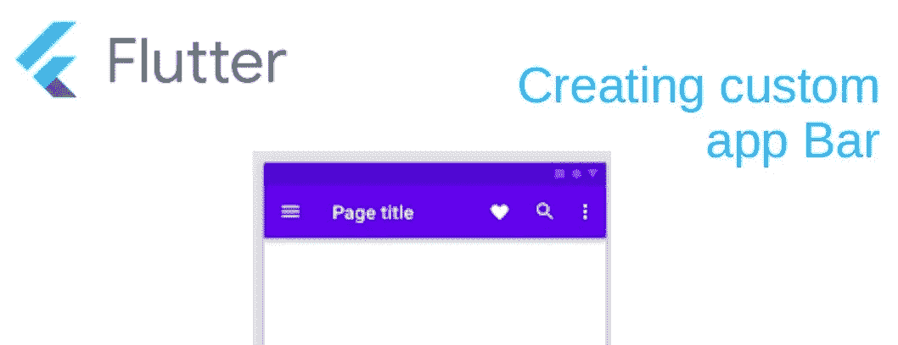
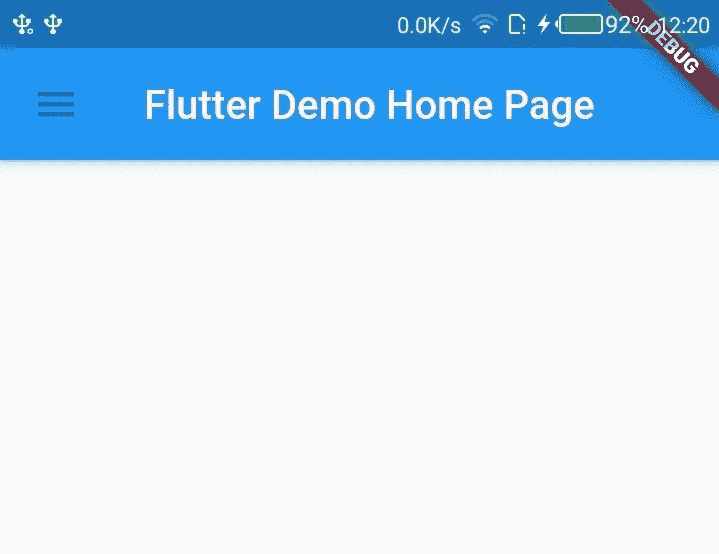
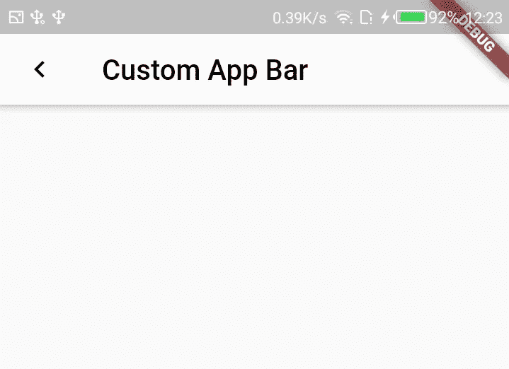

# 使用 flutter 创建自定义应用程序栏

> 原文：<https://blog.devgenius.io/creating-a-custom-app-bar-with-flutter-24e92407d007?source=collection_archive---------11----------------------->



图片来自[https://www . material . io/develop/Android/components/top-app-bars/](https://www.material.io/develop/android/components/top-app-bars/)

TL；DR ->在这里找到这个[的源代码](https://github.com/hnoor/customAppBar/)

嗨！

所以，我已经用 flutter 开发了一个项目。像很多人一样，也可能像你一样，我发现自己对 flutter 提供的一些默认小部件不满意。在这个特殊的例子中，AppBar 小部件。

如果你不知道，AppBar 是一个位于屏幕顶部的小部件，通常显示页面标题、一些常用操作和后退箭头或抽屉开关。



# **问题**

我需要一个自定义 AppBar 小部件，它接收屏幕标题作为参数，具有自定义颜色、自定义前导图标和大小。我也不想每次需要 appBar 时都设置这些变量。

在阅读了几篇关于如何定制 AppBar 的文章后，我仍然对大多数教程推荐的方法不满意。我找到的大多数文章都建议创建一个自定义的小部件，如下图所示，并将其添加到您的脚手架主体的顶部。

这种方法工作得很好(某种程度上),但我对此不满意，因为这样做，你失去了很多(如果不是全部的话)默认 AppBar 的固有特性和功能。例如，使用“自动导入”(更多信息[此处](https://api.flutter.dev/flutter/material/AppBar/automaticallyImplyLeading.html))。

一些文章还建议添加许多可用的自定义应用程序栏库之一，但为什么必须管理另一个第三方库来处理单一用例呢？

# 我的解决方案

原则是:继承所有默认的 AppBar，覆盖你想要定制的。简单吧？

这是我的方法:

1.创建一个“CustomAppBar”无状态小部件，它返回默认的 AppBar，如下所示:

```
 class CustomAppBar extends StatelessWidget {
    [@override](http://twitter.com/override)
    Widget build(BuildContext context) {
      return AppBar(
       );
   }
 }
```

这将允许我们以正确的方式将我们的“CustomAppBar”添加到 Scaffold，即:

```
 Scaffold(
     appBar: CustomAppBar(SCREEN_TITLE),
     body: //your body here
 ) 
```

2.将您的自定义添加到 AppBar，例如:

```
 return AppBar(
    title: Text(
              title,
              style: TextStyle(color: Colors.black),
           ),
    backgroundColor: Colors.white,
    leading: IconButton(
    icon: Icon(Icons.chevron_left),
    onPressed: () => Navigator.pop(context),
    color: Colors.black,
    ),
 ); 
```

如果你愿意，你也可以在这里设置“自动输入”。在这种情况下，您会看到如下内容:

```
 return AppBar(
    title: Text(
              title,
              style: TextStyle(color: Colors.black),
           ),
    backgroundColor: Colors.white,
    automaticallyImplyLeading: true,
 ); 
```

理论上，这应该足够了，但还有一个步骤。如果您在脚手架上添加我们刚刚创建的 CustomAppBar，您将会得到一个错误

```
 argument_type_not_assignable -> The argument type ‘CustomAppBar’ can’t be assigned to the parameter type ‘PreferredSizeWidget’ 
```

这是因为 Scaffold 实际上并不在其 AppBar 属性中接收 appBar。相反，in 接受“PreferredSizeWidget”。所以我们需要一个额外的步骤。

4.扩展“PreferredSizeWidget”。这是您设置“CustomAppBar”的自定义高度的地方。你必须编辑你的构造函数来解释这个变化。最后，您应该会看到类似这样的内容:

# 结论

通过这样做，我得到了我的自定义 AppBar，它包含了我想要的所有自定义功能，而没有添加任何第三方库。:)这是它的样子。



如果你有更好的方法，请告诉我。

紧抱