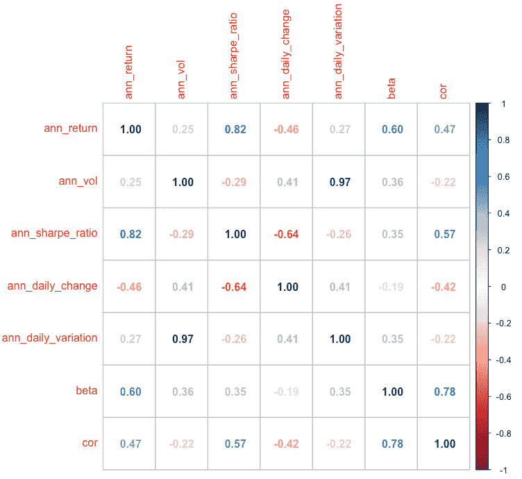
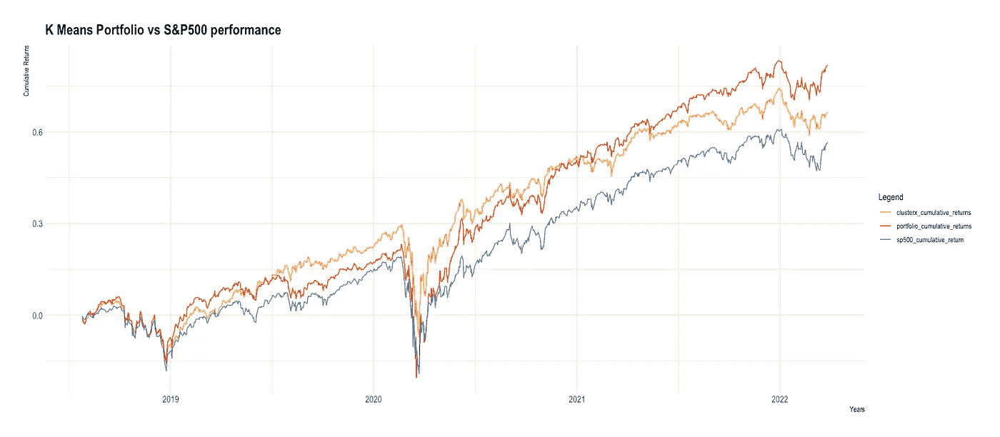

# 使用无监督学习创建多样化的股票投资组合

> 原文：<https://blog.devgenius.io/creating-a-diversified-stock-portfolio-using-clustering-analysis-aae5af284b1f?source=collection_archive---------7----------------------->

**关于** 在本文中，我展示了对标准普尔 500 指数的历史每日价格变化数据进行聚类分析的结果，以创建一个多样化的股票投资组合，并根据指数对其表现进行回溯测试。为此我使用了 [S & P500 指数数据](https://www.kaggle.com/datasets/andrewmvd/sp-500-stocks?select=sp500_companies.csv)。我试图使用基于欧几里德距离的 K-均值聚类来理解影响股票表现的不同参数的效果。

您可以在这里找到分析和代码的详细摘要:[https://github . com/karthikramx/Diversified-Stock-Portfolio-Using-Clustering-Analysis](https://github.com/karthikramx/Diversified-Stock-Portfolio-Using-Clustering-Analysis)

**项目详情** 为了执行聚类，使用根据历史价格变动计算的财务比率
创建特征向量。以下特征是根据标准普尔 500 指数中所有股票的 10 年每日历史数据计算出来的

*   与 SP500 指数值的相关性
*   具有 SP500 指数值的贝塔
*   年股本回报率(每日回报率)
*   股权年化波动率(每日回报)
*   夏普比率
*   价格的每日变化
*   价格的每日变化

可以包括更多的时间序列财务数据/比率，以改进聚类过程

## 利用相关图探索帧内特征相关矩阵

下面的图显示了根据特征向量的相关矩阵绘制的相关图。除了年化波动率和年化每日变化(基本上是每日数据中低价格和高价格变化的年化平均值)之外，大多数变量都不是强相关的

特征向量的集合程序

特征向量的集合程序值

为聚类准备的数据框的快照

## **K 均值聚类**

下面的结果描述了使用碎石图选择 K 值的最佳值，以及在选择 K=4 后形成的簇凸。股票符号用于表示其在分类中的相对位置。

碎石/弯头图。显然，肘形是在 K = 4 时形成的

k-均值聚类减少到二维空间可视化

集群年化回报率与年化波动率

从上面的图中，我们观察到关于四个集群的重要信息:

1.  **聚类 4** 在市场中表现最佳，但由于某些异常值而表现不一，可视为**高回报低波动的股票**
2.  **聚类 1** 具有较低的波动性，但也具有较低的收益。与集群 3 相比，该集群更加稳定，回报和风险相当。然而，与集群 2 相比，它们在相同或更低的波动性下提供的总体回报更低。该集群中的股票具有**低回报&低波动**
3.  **第 2 类**表示**高风险低回报**这让那些想要在市场上赚点钱的投资者望而却步。
4.  **集群 3** 的平均年化收益&波动性最高。这个集群下的股票是**高风险、高回报的股票**。

**回溯测试结果** 为了验证使用聚类创建多样化投资组合的过程，我们对测试/验证数据进行了回溯测试。

如果你想了解更多关于回溯测试策略的知识，你可以访问这篇深入探究 python 框架的文章:[https://medium.com/p/3a136be16ece](https://medium.com/p/3a136be16ece)

您还可以在这里了解更多关于用 python 对股票组合进行回溯测试的信息:[https://blog . dev genius . io/algorithm-trading-back testing-portfolio-of-stocks-in-python-9be 75 ce 9 f 232](/algorithmic-trading-backtesting-portfolio-of-stocks-in-python-9be75ce9f232)

对前 7 年的数据进行聚类，然后使用剩余 3 年的数据来验证我们投资组合的结果。为此，创建了包含 20 只股票的两个投资组合

1.  使用每个聚类中的前五只股票(根据夏普比率)创建的投资组合—[红色]
2.  根据 7 年历史表现的夏普比率，使用所有 500 只股票中的前 20 只股票创建的投资组合— [ORANGE]

**K-Means 组合有以下股票:**
ABMD、AMZN、ALGN、AVGO、NFLX、BRK-B、DG、O、GOOGL、PFE、DPZ、TDG、CTAS、HD、JKHY、CMG、COP、CF、KIM、VTR

K-Means 投资组合拥有以下行业的股票:基础材料、通信服务、消费周期、消费防御、能源、金融服务、医疗保健、工业、房地产和技术。

*   我们看到，由夏普比率最高的股票组成的橙色投资组合跑赢了 S&P500 指数。使用 k 均值聚类(红线)形成的投资组合具有更好的表现。
*   这表明 K-均值聚类成功地创建了一个多样化的投资组合，在聚类过程中提到的所有特征，不仅跑赢了标准普尔 500 指数，而且还收集了历史表现最好的股票。
*   回溯测试结果表明，在新冠肺炎期间，k-means 投资组合与指数相关，并且比橙色指数恢复得更慢。然而，由于投资组合高度多样化，k- means 投资组合的长期表现远远好于 orange 投资组合

**最终观察结果**

*   聚类可以用来创建多样化的投资组合。
*   使用每个聚类中的前 5 只股票创建的投资组合表现优于指数，为了验证这一点，我们根据夏普比率对照前 20 只历史股票检查了其表现
*   可以包括更多的时间序列财务数据/比率，以改进聚类过程

**改进/未来范围**

*   这项研究可以应用于所有交易所和国家的上市公司。
*   仅在美国就有大约 2000 只上市股票
*   全球大约有 41000 家上市公司，总市值超过 80 万亿美元