# 创建一个 DynamoDB，从 EC2 扫描。

> 原文：<https://blog.devgenius.io/creating-a-dynamodb-scanning-from-an-ec2-4e63ebb13a0?source=collection_archive---------13----------------------->

在今天的冒险中，我们将创建一个 DynamoDB，用一些有趣的数据填充它，创建一个允许 EC2 实例从 DB 获取数据的角色，然后启动一个 EC2 实例来完成这个任务。使用最小特权原则，这个 EC2 实例应该只能从数据库中读取。

# 这些是我们正在使用的工具

在这个练习中，我们将使用 AWS 中的以下工具:
-dynamo db
-IAM
-EC2
基本项目允许我们使用 AWS 控制台，如此温暖和 GUI 的感觉！

# 这是你需要知道/使用的

*   具有管理和控制台访问权限的 AWS IAM 帐户。
*   一些有趣的数据来填充你的数据库

# 第一步:创建一个 DynamoDB

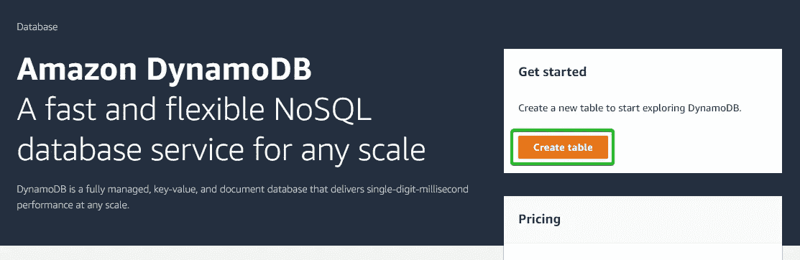

砸碎那个按钮！

非常简单，我们将命名它，然后创建主分区键。这基本上是允许数据库确定唯一记录的主要信息。
我们将继续，其余的保持默认设置。滚动到底部，点击“创建”。

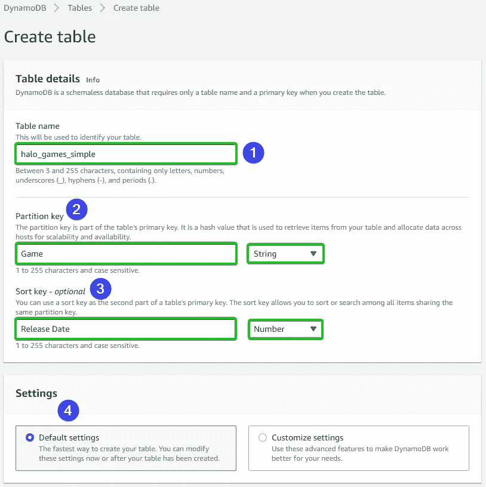

# 第二步:添加项目

现在，我的控制台通过我回到 DynamoDB 仪表板，但我们要导航到侧边栏“表格”标题下的“探索项目”。这将显示您所有的表。数据库创建完成后(这可能需要一两分钟)，单击名称进入此屏幕:

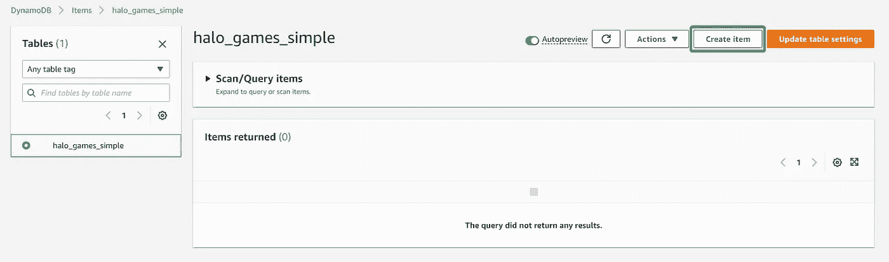

在这里，我们将多次循环这个过程，以便在表中创建至少 10 个条目。

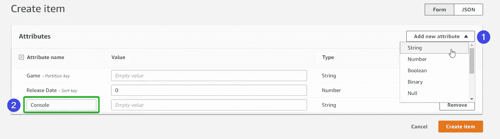

为了好玩，我为每个条目添加了一个额外的属性。

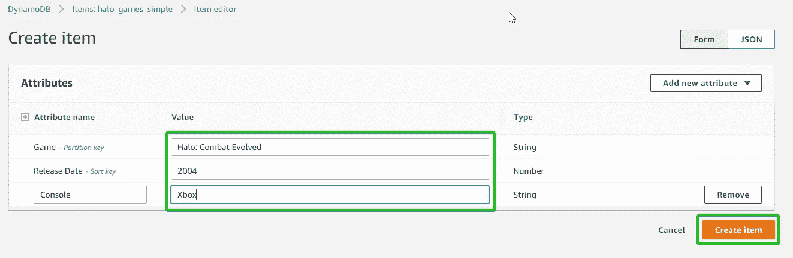

现在再做 9 次！:)

万岁。我们现在有一个数据库，里面有一些数据！继续下一个！

# 第三步:创建一个 t.2 micro EC2 实例

我不会截图，因为到处都有“启动实例”按钮。

在这一点上，创建一个实例应该是非常过时的，因为我仍然在自由层，这些选项中的大部分都是默认的，但是这样您就可以跟着做了:

— AMI: Amazon Linux 2 AMI (HVM)
—实例:t2.micro
—密钥对:在没有密钥对的情况下继续进行
—网络:允许来自“任何地方”的 SSH 流量

发射那只小狗！

注意:对于这一步和下一步，我们可以完全交换顺序，并在实例的创建中使用新的 IAM 角色，但是我们将按此顺序进行，以便我们可以观察如何向已经运行的实例添加角色！

# 第四步:使用 IAM 创建角色，授予 EC2 对数据库的访问权限

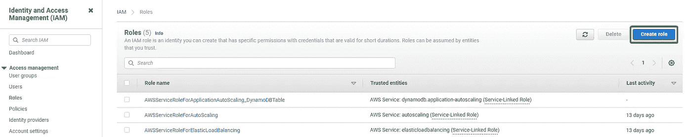

启动向导

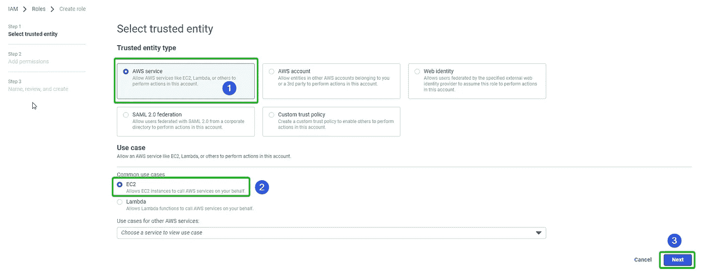

鉴于这是服务的角色，即 EC2，我们选择这些选项让 AWS 控制台为我们做一些繁重的工作。

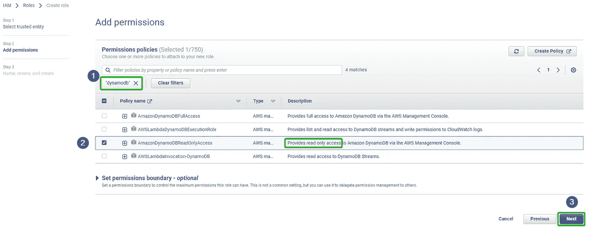

这里，我们正在搜索预构建的“AWS 托管”权限，以便让我们的角色读取我们的数据。牢记最低特权原则，我们寻找“只读”

下一个屏幕我们只需给它一个名称，滚动到底部，然后单击“下一步”。

# 步骤 4.5:我们将返回，并将该角色添加到我们的实例中。

跳回到 EC2 仪表板，并选择您的实例。从“操作”菜单中，我们可以找到“安全性”>“修改 IAM 角色”。

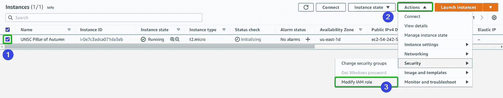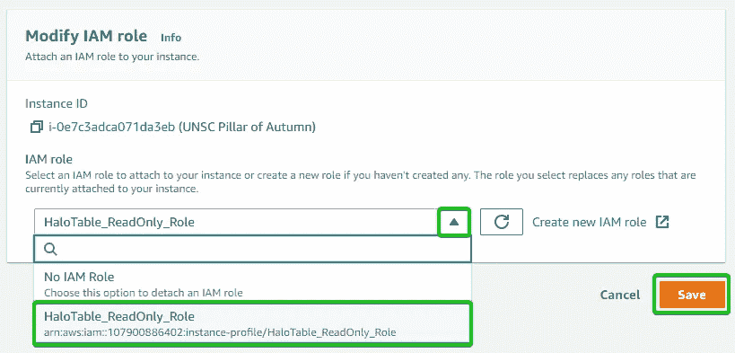

现在，您的 EC2 实例能够从数据库中读取数据了！我们最后的几个步骤基本上只是验证:

# 第五步:在 EC2 实例中使用 AWS CLI 扫描数据库

通过您最喜欢的方法跳转到您的实例(我使用了控制台内置的“连接到实例”页面)，我们将运行以下代码:

`aws dynamodb scan --table-name halo_games_simple --region us-east-2`

还有成功！我们看到来自 DynamoDB 的项目整齐地列在我们的终端上！

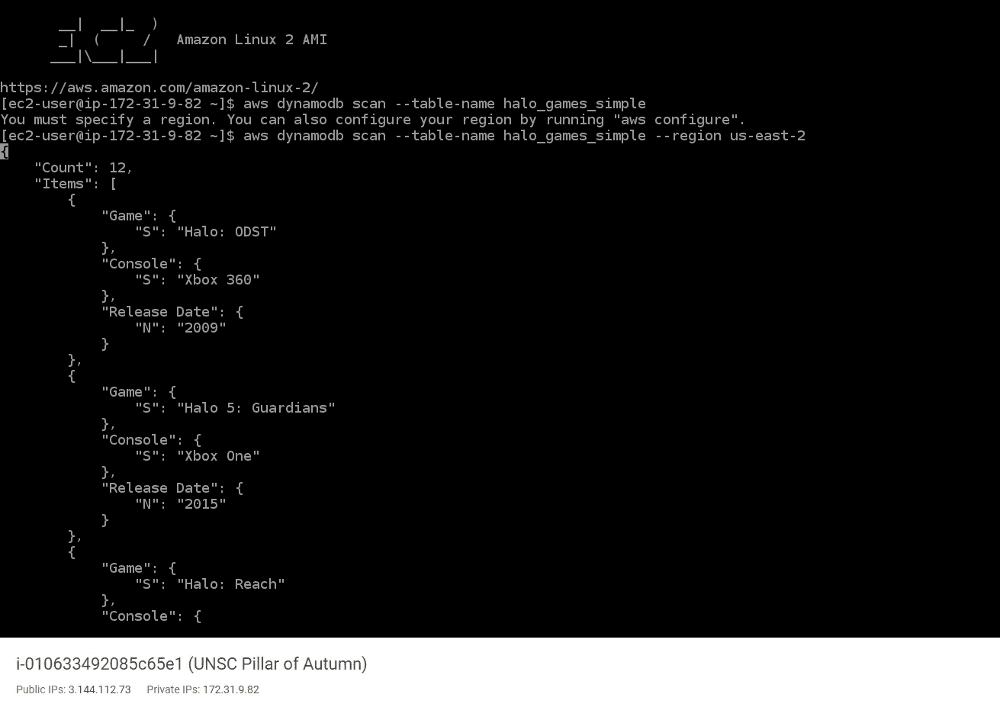

我是个光晕呆子。#无地理

# 第六步:在 EC2 实例中使用 AWS CLI 验证我们不能写入数据库

最后一个测试，让我们确保我们的策略能达到我们的目的！我将尝试在数据库中放置一个新项目:

`aws dynamodb put-item --table-name halo_games_simple --region us-east-2 --item "{\"Game\":{\"S\":\"Halo: New Game\"},\"Console\":{\"S\":\"Xbox Series X\"}, \"Release Date\":{\"N\":\"2034\"}}"`

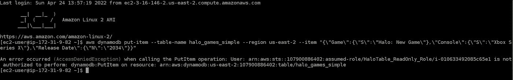

哦。拒绝！

但是，嘿，这正是我们想要看到的！我们的 EC2 实例可以获得它需要的数据，但是不能在我们不需要的时候进行写操作！

# **结论**

所以你有它，保持东西的安全，但允许一些非常重要的服务进行通信！虽然我们主要是在 AWS 控制台中完成的，但我希望发布我对这个项目的演练，但完全是通过 AWS CLI 完成的。快来这里找吧！

一如既往的感谢你坚持到最后！我希望你学会了一个新的技巧，或者至少喜欢看我学一些。感谢阅读！下次见！