# 使用 Python 创建 DynamoDB 表

> 原文：<https://blog.devgenius.io/creating-a-dynamodb-table-using-python-ce0b599c8a63?source=collection_archive---------1----------------------->

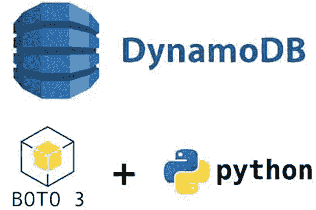

如果到目前为止您一直在关注我的 DevOps 之旅，您可能会想起一个早期的项目“使用 AWS CLI 创建 DynamoDB 表”从那时起，我们已经安全地从 CDA(AWS 开发人员协会)回来了(我保证在未来的文章中分享这个故事)，因为我们对漫游癖和一切 Cloud/DevOps 都有永不满足的渴望，我们现在正在 Python 的奇妙世界中前进(这里我们不是在谈论爬行动物。).到目前为止，我们应该对 DynamoDB 及其用例有所了解。但是为了让你这个读者能够安全地跟上这趟旅程，我们将不得不定义一些我们以后可能会遇到的新关键词。

Python:根据 python.org 的 FAQ 页面，Python 是一种解释性的、交互式的、面向对象的编程语言。Python 功能强大，用途广泛，通常被推荐为学习的第一编程语言，因为它的语法易于阅读。Python 在 DevOps 中被大量用于自动化。

Cloud9:一个 AWS 基于云的集成开发环境，让您可以编写、运行和调试代码。

Boto3:用于 AWS 的 Python SDK(软件开发工具包)。允许我们使用 Python 脚本启动、删除和更新 AWS 资源(简单地说，脚本就是命令。).

既然我们已经讨论了细节，本周的项目不再拖延，取而代之的是一个经典，并加入了不同的元素。本指南是一个初学者友好但广泛的使用 Python 创建 DynamoDB 表的指南。

***先决条件:***

AWS 账户。

Cloud9 IDE。

安装了 Boto3 的命令行终端。

Github。

***第一步:Cloud9 环境设置。***

这个项目的第一步是建立我们的 cloud9 环境。在 AWS 控制台的搜索栏中输入“Cloud9”。Cloud9 也可以在“开发者工具”子菜单下的服务下找到。

显示 Cloud9 后，单击“创建环境”。

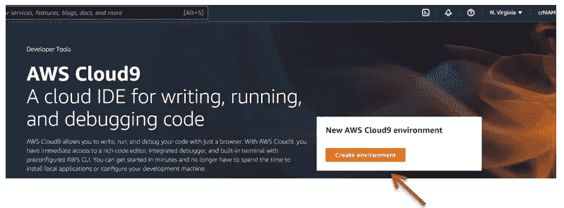

为了我们的项目，我们将接受其余选项的默认设置，并继续“创建环境”。一旦您的环境已经启动，您应该看到下面的屏幕。

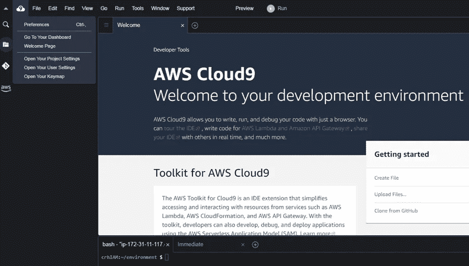

***第二步:在 CLI 上安装 boto 3***。

在这一步，我们将在命令行上安装 Boto3。如前所述，Boto3 上面几段是 Python 的 SDK(软件开发工具包)。简而言之，它允许我们在终端上生成 python 命令。

要安装 Boto3，请输入以下命令:“ **python -m pip 安装—用户 boto3** ”。

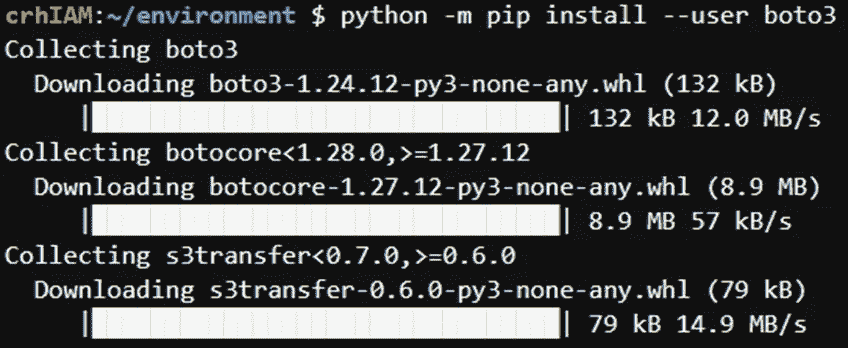

***第三步:创建表格***

创建我们的表格所需的源代码可以通过点击以下链接找到:

[https://docs . AWS . Amazon . com/Amazon dynamodb/latest/developer guide/getting started。CreateTable.html](https://docs.aws.amazon.com/amazondynamodb/latest/developerguide/GettingStarted.CreateTable.html)

必须对源文件进行编辑，以便根据您的喜好和目的对其进行配置。编辑完成后，单击 IDE 中的“+”号，创建一个新文件，并将代码粘贴到其中。

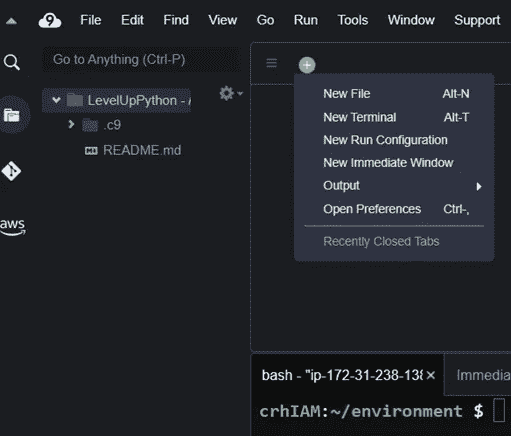

需要记住的几件事是将您的表与您所在的地区相关联，以及在表中添加“.”。py ”,以便 Cloud9 能够读取文件中的 python 脚本。

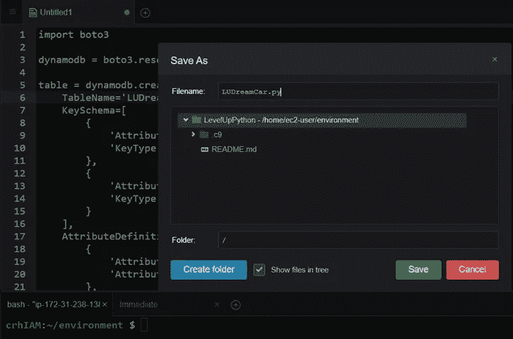

下面是我们的 LUDreamCar 表的代码。

可以通过点击位于 IDE 顶部的“运行”按钮或者输入以下命令来创建这个表:“**python<your file _ name>”。py"** 。见下图。

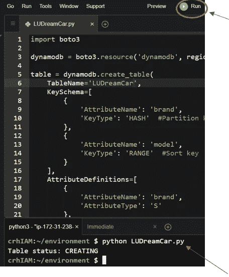

我们可以仔细检查我们的表是以两种不同的方式创建的

1.在 AWS 管理控制台中，点击“*数据库*，选择“*dynamo db”*，点击“*表格*查看我们的表格。或者只需在搜索栏中输入“DynamoDB”。

2.在 IDE 的终端部分输入以下命令:" **aws dynamodb list-tables** "。查看下面的图片。

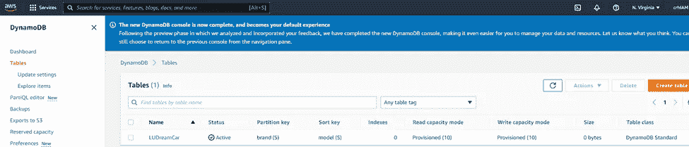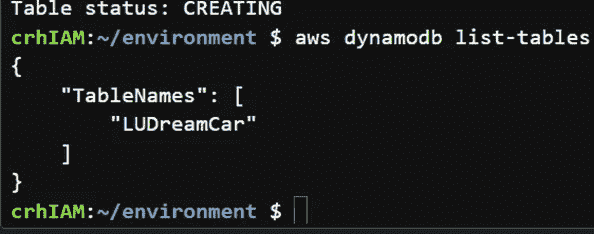

***第四步:添加表格数据***

在这一步中，我们将向表中添加项目。现在为了让我们这样做。

1.  按照从 ***步骤 3*** 开始的步骤创建一个新文件。唯一的区别是这个文件将被保存为。json 文件。

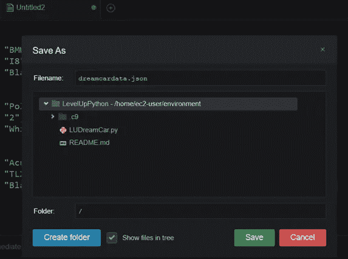

2.现在我们有了数据，我们需要创建一个 python 脚本，将数据写入我们的表中。点击下面的链接可以找到 load.py 的源代码:

[https://docs . AWS . Amazon . com/Amazon dynamodb/latest/developer guide/getting started。WriteItem.html](https://docs.aws.amazon.com/amazondynamodb/latest/developerguide/GettingStarted.WriteItem.html)

类似地，到“步骤 3”一旦您的编辑被配置，在您的 IDE 中点击“+”符号，创建它一个新的文件，并且粘贴您的代码到它里面。然后另存为”。py”文件。

下面是我们将数据插入表中的脚本。

3.可以通过按下位于 IDE 顶部的“run”按钮或者输入以下命令将数据插入到我们的表中:"**python<your file _ name>。py**

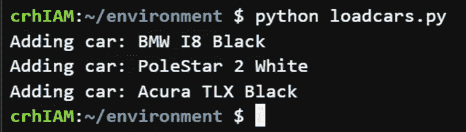

如前所述，我们可以通过管理控制台仔细检查我们的工作。

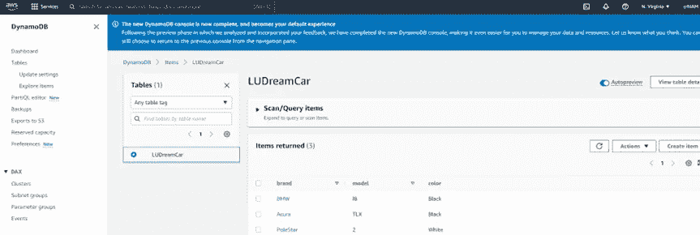

***第五步:删除表格***

最后但同样重要的是，按照上面相同的步骤创建一个 delete.table.py 文件。一旦创建了文件，现在可以通过输入下面的命令来删除该表:" **python < filename >。py** ”。

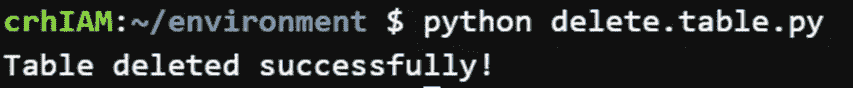

我们还可以仔细检查管理控制台，以确保删除成功。

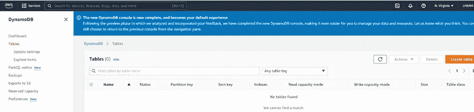

通常作为一个提醒，养成把你的代码推向回购的习惯。

这可以通过输入以下命令来完成:

git 提交。

git commit -m

git 推。

瞧啊。！！

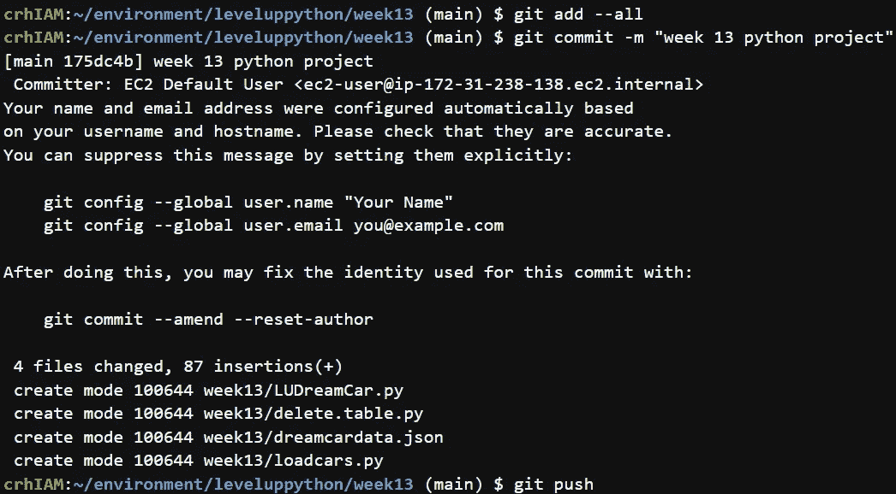

如果您已经做到了这一步，并且遵循了上面的步骤，那么您已经成功并且应该知道如何使用 Python 创建 DynamoDB 表。

也可以随时在 linkedin 上关注我(点击[链接](https://www.linkedin.com/in/claude-r-hector-mba/))，因为我希望与志同道合的人联系

谢谢你的时间，下次再见。

你友好的邻居云开发工程师。