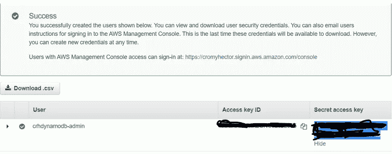
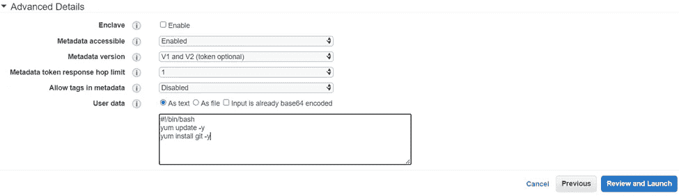

# 使用 AWS CLI 101 创建 DynamoDB 表

> 原文：<https://blog.devgenius.io/creating-a-dynamodb-using-aws-cli-101-36a86ef28f95?source=collection_archive---------9----------------------->

如果你像我一样是这个 DevOps 云世界的新手，AWS 和它的许多服务很可能对你来说是陌生的。虽然一开始可能会令人生畏，但将如此庞大的服务分成更小的块可以使吸收这些知识变得更容易。我们今天要介绍的服务是:“DynamoDB”。

在本教程中，我们将介绍 DynamoDB 的一些核心概念，并向您介绍如何使用 AWS 命令行设置一个表。

什么是 DynamoDB？简而言之，DynamoDB 是一个非关系数据库，旨在随意扩展而不牺牲性能。这在传统数据中心是不可能的。与传统数据库中的数据不同，DynamoDB 中的数据可以是非结构化的。这也是一个完全托管的选项，意味着 AWS 将代表您提供服务。

***先决条件*** 。

通过 IAM 用户访问 AWS 帐户。

命令行终端(Windows 终端或 PowerShell)。

***第一步:创建 IAM 用户***

进入 AWS 控制台，单击“ ***服务*** ”，并在“ ***安全性，身份&合规性*** ”下查找身份访问管理(IAM)。

在下面的页面中点击 ***用户*** ，然后点击右上角蓝色按钮 ***添加用户***

为新创建的用户创建用户名。因为我们将使用某种类型的命令行终端，所以请确保“ ***访问键—编程访问*** ”处于选中状态。然后单击“下一步”继续。

我们现在应该在 ***页面设置*** 权限。我们将附加一个现有的策略。在过滤器策略框下，搜索 DynamoDB 并确保选择“***amazondynamodbullaccess***”

单击下一步。出于本教程的目的，我们将跳过标签。单击“审查”,然后单击“创建用户”以完成此步骤。

下面的屏幕应该会提醒您，您的用户已成功创建。确保保存您的访问 ID 密钥和秘密访问密钥，因为在 AWS 控制台上配置您的命令行终端时会用到它们。与密码类似，保持这些密钥对的私密性(见下图)。

***第二步:启动 EC2 实例***

进入 AWS 控制台，点击“ ***服务*** ”并在“ ***计算*** ”下寻找 EC2。

点击右上角的蓝色按钮 ***启动实例***

在第 3 步中应该将 ***配置实例详细信息*** 请确保已启用。为了让我们 SSH(远程输入)到我们 EC2，需要这个特定的选项(见下图)。

向下滚动到高级，我们将粘贴下面的引导脚本。再一次，把脚本想象成一系列的命令，bootstrap 仅仅意味着起始点或者机器启动的时间。

第一行告诉实例它正在使用 bash 解释器。

第二行基本上是检查和安装任何更新，如果需要的话，这是一个最佳做法。

添加完脚本后，进入“ ***查看并启动*** ”，然后启动，这将提示您创建一个密钥对。一旦生成并下载了密钥对，就可以开始启动实例了。

一旦实例处于运行状态，单击它，检索并复制您的 IP 地址，以便 SSH。

***第三步:配置 AWS CLI***

这是很短的一步。在这一步中，我们将通过 SSH 在 EC2 实例中进行远程处理。让您在保存密钥对的目录中工作。

要在我们的实例中使用 SSH，请输入以下命令: ***ssh ec2-user@ < IP 地址> -i <密钥对名称>。pem***

如需以上段落的视觉表示，请参考下图

一旦我们从命令行登录到我们的实例，我们现在可以继续配置我们的终端。再一次，把配置想象成某种配对。从您的终端输入命令: ***aws configure*** 。

然后，系统会提示您输入上一步中的访问密钥和访问密钥 id。接下来是你的默认区域和你的默认输出格式，应该是 JSON(见下图)。

***第四步:创建 DynamoDB 表***

一旦我们将命令行配置到 AWS 管理控制台，通过输入以下命令 ***创建一个 DynamoDB 表:AWS DynamoDB create-table—table-name sneaker table—attribute-definitions \ AttributeName = brand name，attribute type = S \ AttributeName = model number，attribute type = N \—key-schema \ AttributeName = brand name，key type = HASH \ AttributeName = model number，key type = RANGE \—provisioned-throughput ReadCapacityUnits = 5，WriteCapacityUnits=5 【T2***

我们可以通过返回 AWS 控制台来仔细检查我们的工作，单击“ ***数据库*** ”，选择“***DynamoDB”***，并单击“ ***表*** ”来查看我们的表。

***第五步:向表中添加项目***

从现在开始，我们将使用 AWS 控制台来完成我们的表格。点击表格上的名称。在接下来的页面中，点击“ ***”创建项目*** ”选项，它会将您带到一个页面，其中列出了您创建的属性。

为了更完整的前景，我们可以添加更多的属性，如颜色和价格。然后点击“创建项目”完成。

冲洗&重复，在桌子上添加更多的项目。

如果您已经做到了这一步，并且遵循了上面的步骤，那么您已经成功并且应该知道如何使用 AWS CLI 创建 DynamoDB 表。

谢谢你的时间

直到下一次，

你友好的邻居云开发工程师。