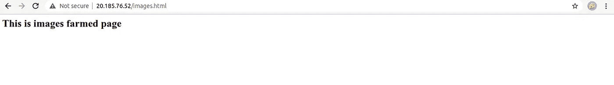

# 在 Azure 上创建基于地理冗余路径的 Web 应用程序

> 原文：<https://blog.devgenius.io/creating-a-geo-redundant-path-based-web-application-on-azure-cc70bc146303?source=collection_archive---------0----------------------->

使用负载平衡器、流量管理器、应用程序网关和 Azure 前门为我们的 web 应用程序构建高效的路由。


美国宇航局在 [Unsplash](https://unsplash.com/s/photos/world?utm_source=unsplash&utm_medium=referral&utm_content=creditCopyText) 拍摄的照片

# 动机:

我们可能已经构建了一个应用程序，但从未想过大规模发布它，更不用说在全球范围内发布了。因此，在这篇文章中，我将向你展示我们如何利用 Azure Traffic Manager、Azure Load Balancer、Application gateway 和 Azure Front Door 等 Azure 服务来扩展我们对全球人民的分发。

# 建筑:


苏拉布什雷斯塔。在 Azure 1 上创建基于地理冗余路径的 Web 应用程序。2021.JPEG 文件。

# 先决条件:

1.  Azure 虚拟机
2.  Azure 虚拟机规模集
3.  Azure 负载平衡器
4.  Azure 流量管理器
5.  Azure 应用程序网关
6.  蓝色前门

# Azure 虚拟机:

让我们从虚拟机开始，因为它们将托管我们的应用程序。我们将创建两个虚拟机。选择**虚拟机，+创建，**填写基本信息，在美国东部创建一个虚拟机，在北欧创建另一个虚拟机。


苏拉布什雷斯塔。在 Azure 2 上创建基于地理冗余路径的 Web 应用程序。2021.JPEG 文件。

提前添加这些代码块。


苏拉布什雷斯塔。在 Azure 3 上创建基于地理冗余路径的 Web 应用程序。2021.JPEG 文件。

```
#!/bin/bashsudo apt update -ysudo apt install apache2 -y
```

部署成功后，您可以点击公共 IP 来查看 apache 网页的启动和运行。


苏拉布什雷斯塔。在 Azure 4 上创建基于地理冗余路径的 Web 应用程序。2021.JPEG 文件。

在进入下一个主题之前，我们需要配置我们的 VM 的 DNS。要创建虚拟机，请转到其中一个**虚拟机**，并点击 **DNS。**


苏拉布什雷斯塔。在 Azure 5 上创建基于地理冗余路径的 Web 应用程序。2021.JPEG 文件。

将任何唯一的名称添加到 DNS 栏中，以便流量管理员以后使用。

# Azure 虚拟机规模集:

假设我们上面创建的虚拟机是面向前端的 web 应用程序，但是我们希望将使用“/images”的特定用户定向到需要更多计算的单独 web 应用程序。这也可以在虚拟机上进行，但我们有另一种方便的服务，称为虚拟机规模集。我们称之为图像农场。转到**虚拟机规模设置、+创建、**并填写基本详细信息。现在，这些是在创建它时需要注意的事情。选择**组网**上的**负载均衡器**，将 VMSS 的虚拟机自动添加到后端池中。


苏拉布什雷斯塔。在 Azure 6 上创建基于地理冗余路径的 Web 应用程序。2021.JPEG 文件。

将这些命令添加到**自定义数据中。**


苏拉布什雷斯塔。在 Azure 7 上创建基于地理冗余路径的 Web 应用程序。2021.JPEG 文件。

```
#!/bin/bashsudo apt update -ysudo apt install apache2 -yecho "<html><h2>This is images farmed page</h2></html>" > images.htmlsudo cp images.html /var/www/html/
```

部署完成后，抓取**负载平衡器 IP** 并浏览它。



苏拉布什雷斯塔。在 Azure 8 上创建基于地理冗余路径的 Web 应用。2021.JPEG 文件。

# Azure 负载平衡器:

我们从来没有在这篇文章中单独使用负载平衡器，因为我们已经将它与 Azure 虚拟机规模集集成在一起。如果我们必须创建没有 VMSS 的虚拟机，那么我们只需使用负载平衡。

# Azure 流量管理器:

我们总是谈论负载均衡器，但是流量管理器呢？为了便于描述，负载平衡器是针对区域的，而流量管理器是针对全局的。为了将这些点联系起来，我们的 EASTUS 虚拟机和 NORTH EUROPE 虚拟机位于不同的区域，但我们希望在它们之间实现负载平衡。答案是流量经理。让我们通过选择 **Traffic Manager，+Create，**来创建一个 Traffic Manager，并填写您选择的 Traffic Manager 名称的基本详细信息。


苏拉布什雷斯塔。在 Azure 9 上创建基于地理冗余路径的 Web 应用程序。2021.JPEG 文件。

现在我们需要配置端点。转到**流量管理器、设置、端点、**和**+添加。**如您所见，我已经添加了 2 台虚拟机作为我的端点。


苏拉布什雷斯塔。在 Azure 10 上创建基于地理冗余路径的 Web 应用程序。2021.JPEG 文件。

点击 **+Add** 后，填写基本信息，包括之前虚拟机的 **DNS 名称**。


苏拉布什雷斯塔。在 Azure 11 上创建基于地理冗余路径的 Web 应用程序。2021.JPEG 文件。

现在，让我们测试流量管理器是否正在加载网页。


苏拉布什雷斯塔。在 Azure 12 上创建基于地理冗余路径的 Web 应用程序。2021.JPEG 文件。

看起来效果很好。现在我们进入 Azure 应用程序网关。

# Azure 应用程序网关:

如前所述，如果用户想要进入“/images/”，那么我们需要将他/她路由到图像场，如果用户想要访问登录页面，那么我们将他们路由到最近的位置，这正是应用程序网关所做的工作。简单地说，基于路径路由它们会有所帮助。选择**应用网关，+创建，**，**填写基本信息。**记得添加一个**新的虚拟网络。**


苏拉布什雷斯塔。在 Azure 13 上创建基于地理冗余路径的 Web 应用程序。2021.JPEG 文件。

创建一个新的面向公众的 IP。


苏拉布什雷斯塔。在 Azure 14 上创建基于地理冗余路径的 Web 应用程序。2021.JPEG 文件。

接下来是最重要的部分，后端池。因为我们有两个游泳池。一个用于图像和登录页面，所以我们需要创建两个后端池。使用负载平衡器 IP 为 VMSS 创建一个后端池，并使用流量管理器 IP 为其他虚拟机创建另一个后端池。


苏拉布什雷斯塔。在 Azure 15 上创建基于地理冗余路径的 Web 应用程序。2021.JPEG 文件。

在路由规则上，填写基本详细信息。


苏拉布什雷斯塔。在 Azure 16 上创建基于地理冗余路径的 Web 应用程序。2021.JPEG 文件。

在后端目标上，由于我们根据路径进行更改，所以我们添加了基于路径的规则。


苏拉布什雷斯塔。在 Azure 17 上创建基于地理冗余路径的 Web 应用程序。2021.JPEG 文件。


苏拉布什雷斯塔。在 Azure 18 上创建基于地理冗余路径的 Web 应用程序。2021.JPEG 文件。

点击**查看并创建**，并等待 20-25 分钟以创建它。创建完成后，让我们点击 URL，检查它是否工作。


苏拉布什雷斯塔。在 Azure 19 上创建基于地理冗余路径的 Web 应用程序。2021.JPEG 文件。

和 images.html 页面。


苏拉布什雷斯塔。在 Azure 20 上创建基于地理冗余路径的 Web 应用程序。2021.JPEG 文件。

它工作得完美无缺。

# 天蓝色前门:

现在让我们将 Azure 应用程序网关添加到 Azure 前门中，使其地理冗余。请记住，应用程序网关是基于区域的，而前台是全球性的服务。点击**蓝色前门**，你会看到一个设计好的景观。


苏拉布什雷斯塔。在 Azure 21 上创建基于地理冗余路径的 Web 应用程序。2021.JPEG 文件。

我们在自己的后端池中添加应用网关 IP


苏拉布什雷斯塔。在 Azure 22 上创建基于地理冗余路径的 Web 应用程序。2021.JPEG 文件。

因为我们的应用程序是唯一基于 HTTP 的，所以我们需要选择 **HTTP Only** 选项。


苏拉布什雷斯塔。在 Azure 23 上创建基于地理冗余路径的 Web 应用程序。2021.JPEG 文件。

# 最终演示:

让我们浏览 Azure 前门给我们的 URL，并检查 index.html 和 images.html 页面的结果


苏拉布什雷斯塔。在 Azure 24 上创建基于地理冗余路径的 Web 应用程序。2021.JPEG 文件。


苏拉布什雷斯塔。在 Azure 25 上创建基于地理冗余路径的 Web 应用程序。2021.JPEG 文件。

太好了。成功了。目前可以通过这个 [URL](http://project5.sulabhshrestha.com/) 播放样本。

# 结论:

这只是 Azure 服务的一小部分，当集成在一起时，可以产生一个美妙的结果。我们甚至可以在 VMSS 中进行自动扩展，使其具有容错能力，在您认为流量会增加的区域添加更多后端池，等等。可能性是无限的，选择是无限的，你想做什么取决于你自己。如果你遇到任何问题或难以遵循这些步骤，请在下面评论这篇文章或在 tsulabh4@gmail.com 给我发消息。你也可以在 [Linkedin](https://www.linkedin.com/in/sulabhshrestha/) 和 [GitHub](https://github.com/codexponent) 上和我联系。

# 资源:

[1] Azure 流量管理器:[https://docs . Microsoft . com/en-us/Azure/Traffic-Manager/Traffic-Manager-overview](https://docs.microsoft.com/en-us/azure/traffic-manager/traffic-manager-overview)

[2] Azure 负载平衡器:[https://docs . Microsoft . com/en-us/Azure/Load-Balancer/Load-Balancer-overview](https://docs.microsoft.com/en-us/azure/load-balancer/load-balancer-overview)

[3] Azure 应用网关:[https://docs . Microsoft . com/en-us/Azure/Application-Gateway/overview](https://docs.microsoft.com/en-us/azure/application-gateway/overview)

[4]蔚蓝前门:[https://azure.microsoft.com/en-us/services/frontdoor/](https://azure.microsoft.com/en-us/services/frontdoor/)

[5]Azure VMSS:[https://docs . Microsoft . com/en-us/Azure/virtual-machine-scale-sets/overview](https://docs.microsoft.com/en-us/azure/virtual-machine-scale-sets/overview)