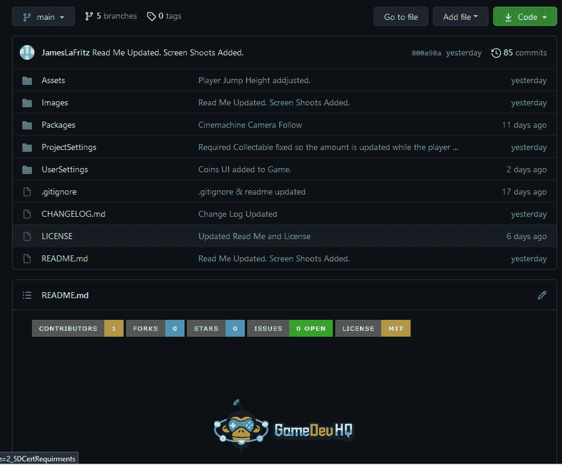
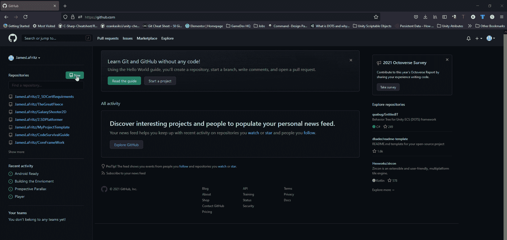
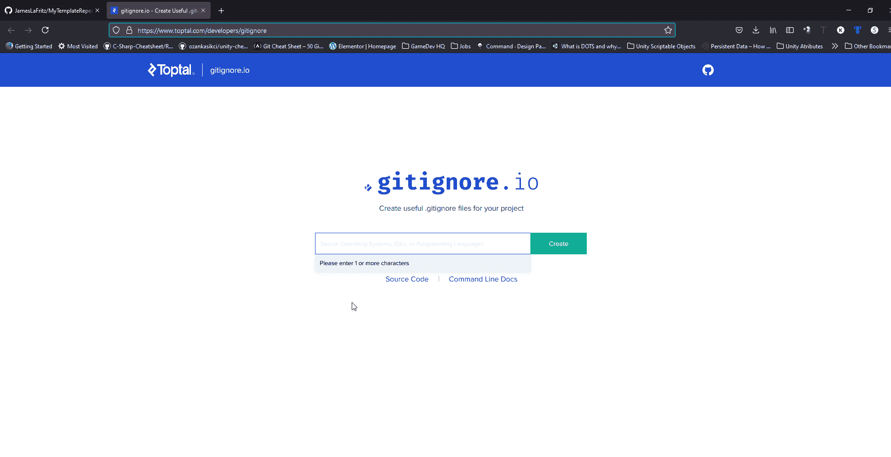
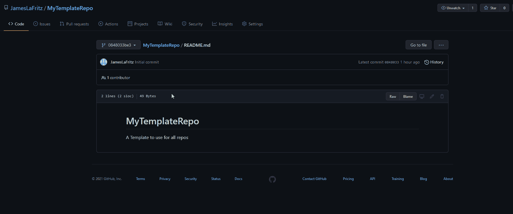
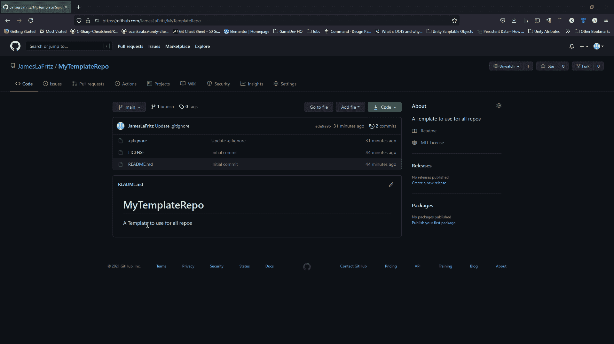
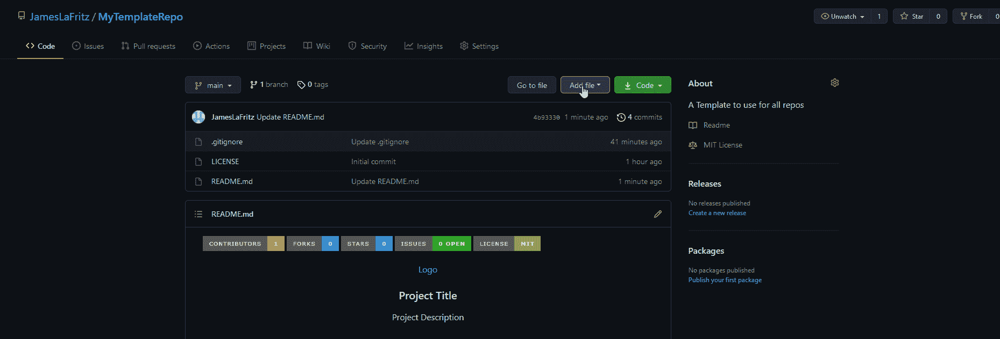
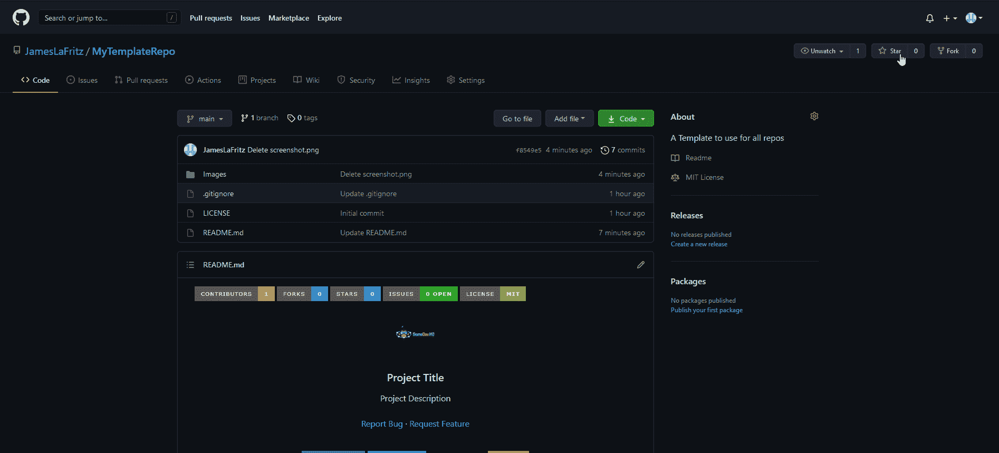
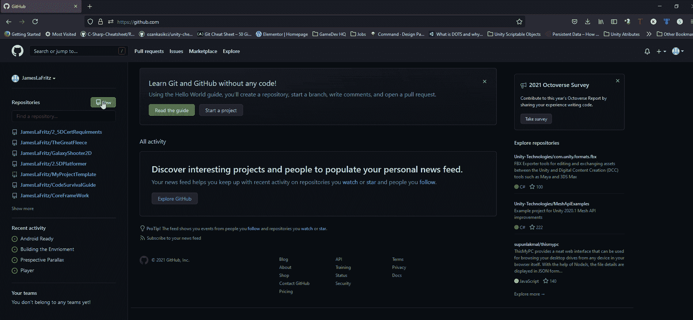
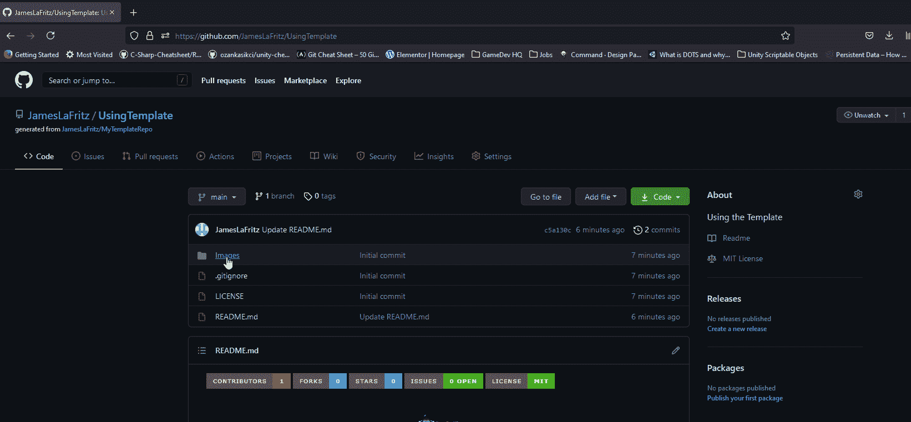

# 创建 Git Hub 模板

> 原文：<https://blog.devgenius.io/creating-a-git-hub-template-ad80ed255418?source=collection_archive---------4----------------------->

## Git 存储库模板来拯救。

我为我所有的 git hub 项目使用了一个定制的 git ignore 文件。我厌倦了复制和粘贴每次创建新 Git 项目时使用的 Ignore 文件。当我这么做的时候，我决定用一个自定义的自述文件来标准化我的项目在 Git 上的外观。

 [## 创建模板存储库

### 注意:您的模板库不能包含使用 Git LFS 存储的文件。要创建模板存储库，您必须…

docs.github.com](https://docs.github.com/en/github/creating-cloning-and-archiving-repositories/creating-a-repository-on-github/creating-a-template-repository) 

每次创建新的存储库时，都有一个使用模板的选项。我将创建一个可用作模板的回购。

# 编辑存储库中的文件

## 。gitignore

您可以使用一个有用的工具来生成这个文件。

 [## gitignore.io

### 创造有用。git 从 522 操作系统、IDE 和编程语言中选择忽略项目文件…

www.toptal.com](https://www.toptal.com/developers/gitignore) 

我输入可能在我的项目中使用的工具，我使用 Git、Unity 和 Jet Beans Rider。创建新的 Unity 项目时，可以使用 Visual Studio、Visual Code 或 Rider 作为脚本编辑器。然后，我单击“创建”按钮。我复制生成的文件并编辑我的。gitignore 文件粘贴内容。我还在 Unity 部分下添加了一条规则，用于包含单词 ignore 的任何内容。这样我就不必为我的项目添加任何规则，也不会因为公开它们而侵犯版权，我只是把它们放在一个名为 ignore 的文件夹中。

## 自述文件

我找到了一个自述文件模板，它的设置几乎符合我的喜好。

 [## othneildrew/Best-README-Template

### 一个了不起的自述文件模板，帮助您快速启动项目！探索文档的“查看演示报告错误请求”功能…

github.com](https://github.com/othneildrew/Best-README-Template) 

当你点击“生成自述文件”时，它会自动填充项目标题和描述，但这很无聊。

我把《朗读我》改得更刺激一点。

因为我的自述文件使用了一个名为 images 的文件夹中的图片，所以我将这个新文件添加到我的项目中，为它们创建一个占位符。然后，我上传我想要使用的 2 个图像，并删除我创建的占位符图像文件。

# 将此存储库设置为模板。

我转到 repo 的设置页面，选择了模板存储库复选框。现在，我的存储库将显示为一个模板。

# 使用模板创建新的存储库

要使用这个模板，我只需在创建新模板时选择它。我不需要任何其他分支，因为这个模板只有一个分支。创建存储库后，我会编辑自述文件，并更改描述和标题。

当我在做这个项目的时候，我可以来更新自述部分，比如那些什么都没有的文章。我还可以将屏幕截图添加到 Images 文件夹中。要替换项目中显示的图像，我只需将 ScreenShot.png 替换为我想要使用的图像(或者在 reademe 中，或者用另一个同名的图像替换该图像)。

