# 创建 GitHub 存储库

> 原文：<https://blog.devgenius.io/creating-a-github-repository-ba27c298d7ad?source=collection_archive---------4----------------------->

首先，你需要在**在 GitHub 上创建一个账户。它完全免费、简单，是创建在线门户来托管您的 Unity 项目的第一步。**

**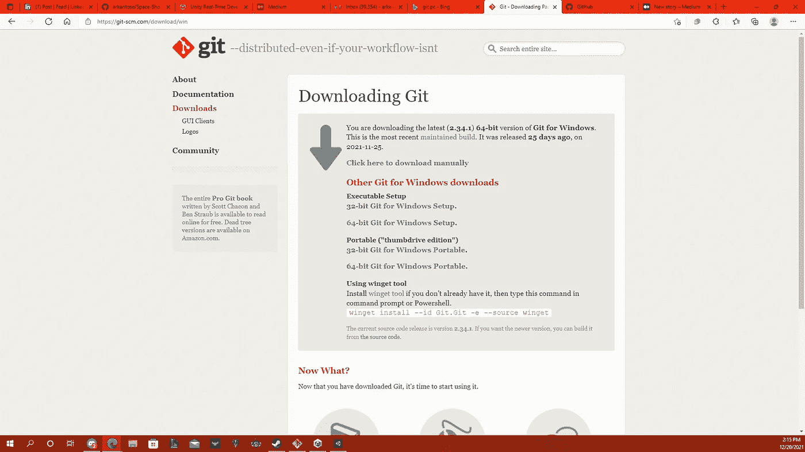**

**然后你需要在 [git](https://git-scm.com/download/win) 下载 Git。取决于您使用的操作系统将决定您下载的版本。**

**下载 git 后，你想安装它；我把它放在我的桌面上。**

**然后，您希望在您的 GitHub 帐户中创建一个存储库。它在你屏幕的左上方；你要点击新建。**

**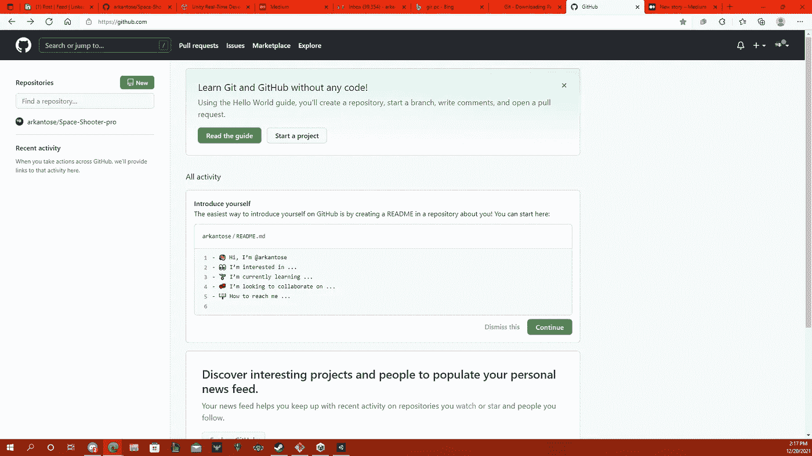**

**为存储库命名；我以我的 Unity 项目命名了它。给它一个描述，保持公开，点击添加。gitignore 选择<unity>，然后创建资源库。</unity>**

**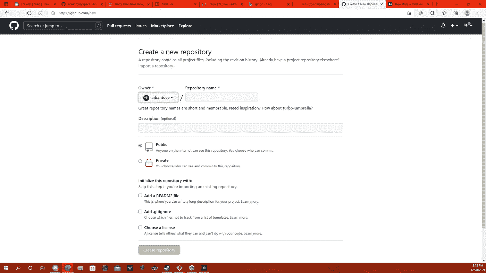**

**这部分很重要。您希望单击代码，然后复制 Url，因为这是您将如何设置此存储库以与您的计算机通信并在以后上传您的文件。**

**您还需要将中间左侧的分支机构名称更改为 master，以便能够遵循本指南。**

**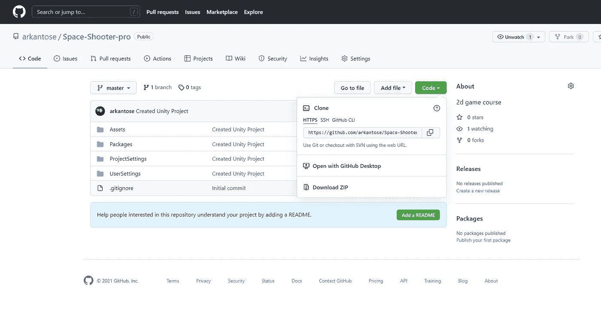**

**接下来，我们希望将 git 应用程序设置为具有正确的目录。**

**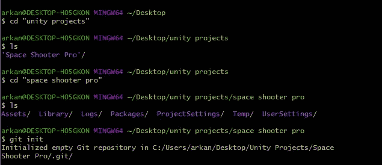**

**命令 ls <enter>会给你一个可用目录的列表，这是你想要把它的目录改变到你保存 unity 项目的地方。</enter>**

**$ CD“desktop”—使目录转到桌面**

**$ CD“unity projects”—使目录成为位于我的桌面上的 unity projects 文件夹。**

**$ CD“space shooter pro”—使我的目录成为我保存 Unity 项目的文件夹。**

**然后，您希望通过键入以下内容用您的目录初始化存储库**

**$ git init**

**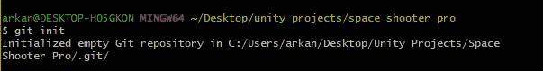**

**现在，您需要使用我们之前从 Github 复制的代码 URL，将其添加到我们的 git 桌面服务器。**

**类型:**

**$ git 远程添加原点<paste in="" the="" url=""></paste>**

**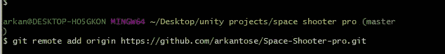**

**现在，您已经添加了您的存储库服务器，这两个服务器现在可以进行通信了。**

**要验证它是否有效，您可以输入**

**$ git remote -v**

**你应该看看**

**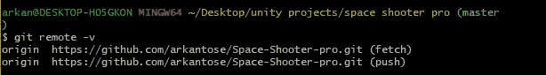**

**这也告诉你，你现在有权限获取和推到原点，这是必须的！:)**

**(如果您想查看可用的一般命令，可以键入**

**$ -帮助)**

**现在，这部分非常非常重要！**

**要使其正常工作，您必须按以下顺序执行此操作:**

1.  **拉**
2.  **犯罪**
3.  **推**

**再次为了繁荣**

1.  **拉**
2.  **犯罪**
3.  **推**

**您必须按照这个顺序完成这些步骤，才能正确上传您的文件！**

**首先让我们继续拉。**

**$ git pull origin <branch name="">在这种情况下，我们的分支名称应该是 master，因为我们就是这么命名的。</branch>**

**$ git 拉取来源主机**

**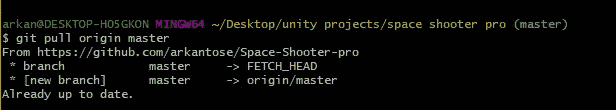**

**现在，您可以键入:**

**$ git 状态**

**这将弹出并显示您桌面上尚未上传到存储库的所有文件；好的是它们以红色列出。**

**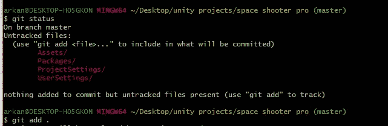**

**要将文件添加到要键入的存储库中，请执行以下操作:**

**$ git add。**

**这将添加所有文件，如果您再次键入 git status，它会将文件显示为绿色。这也是在将文件推回服务器之前，您想要用来添加对 Unity 项目所做的任何更改的命令。**

**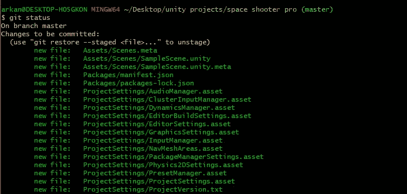**

**现在这部分很有趣，因为如果这是你第一次使用这个应用程序，你还不能执行第二步(提交)。**

**我实际上陷入了这个问题，不得不通过玩一会儿来解决它，但幸运的是，你只是在没有玩 lol 的情况下知道了修复方法。**

**在你告诉 git 你是谁之前，你不能提交或推动。让我们通过键入来告诉应用程序谁在进行提交和推送**

**$ git 配置 user.email“您的电子邮件”**

**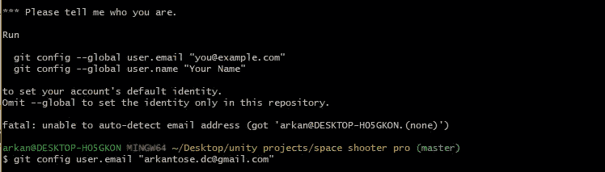**

**现在变得更加有趣了！**

**Github 将启动另一个浏览器，并要求您验证是否是您。**

**你想登录你的帐户，然后它会给你一个认证代码，然后你将按照链接，把代码到另一个浏览器。就这样，你完成了；允许您提交和推送<yay>。</yay>**

**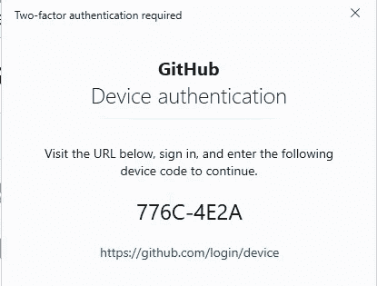****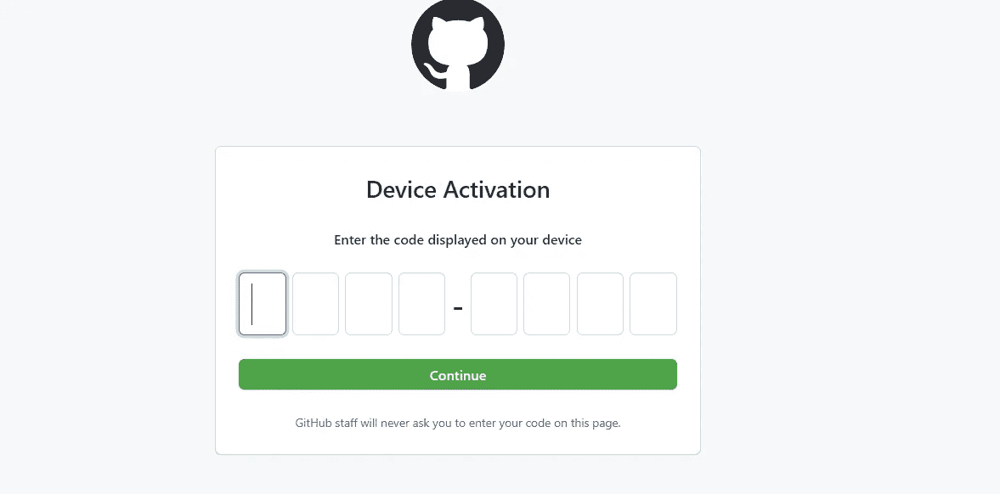**

**现在让我们做第 2 步<commit>继续输入</commit>**

**$ git commit -m "(无论你在做什么)"**

**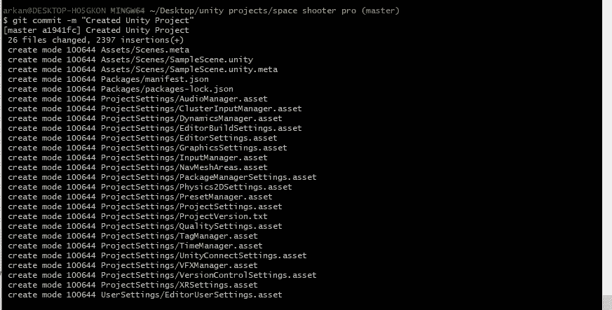**

**现在，我们可以执行步骤 3，并通过键入以下命令将我们对文件所做的所有更改推回到服务器上来结束**

**$ git 推送来源主机**

**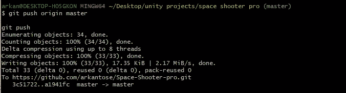**

**现在如果你刷新你的 GitHub 库，你会看到你所有的文件都已经上传了。**

**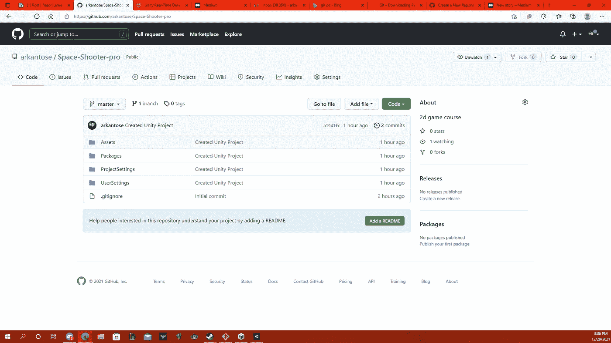**

**基本上，在这一点上，它只是一个冲洗和重复的方法！**

**再一次**

1.  **拉**
2.  **犯罪**
3.  **推**

**！！！！！！！！！！！！！！！！！！！！！！！不要忘记这一点**

**祝贺您创建了存储库**

**享受编码的乐趣；)**