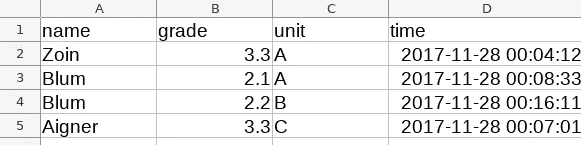

# 用 Python 为单元测试创建一个模拟数据库

> 原文：<https://blog.devgenius.io/creating-a-mock-database-for-unittesting-in-python-is-easier-than-you-think-c458e747224b?source=collection_archive---------1----------------------->

## 将您的电子表格转换成模拟数据库

无论如何，这不是一篇长文章。不过，如果您很着急，可以跳到 TLDR 部分，比较这两个代码片段。如果这一部分对你有意义，那么你就节省了几分钟！否则回来从头读一遍。

作者图片

# 介绍

让我们假设您编写了一些 Python 代码来操作存储在 SQL 表中的数据。你是一个经验丰富的程序员，所以你知道你需要单元测试。(这篇文章不是关于为什么以及如何需要编写单元测试。但是我实在忍不住要告诉你，它让你的生活变得多么简单，尤其是当涉及到重构或任何其他代码更改时。)

您也知道这些测试被称为“单元”是有原因的:您只想测试一段特定的代码。假设你对周围环境有完全的控制，你想测试它的效果如何。在这种特殊情况下，我们希望指定表中的所有数据。在“真正的”ie 上工作不是一个好主意。生产数据库，因为它的内容不受单元测试套件的控制。此外，如果您的测试还包括写入数据库表，那么您肯定不希望在测试期间修改生产数据。我甚至没有提到数据库的可用性，这应该不会影响测试。总结一下:你需要一个模拟数据库。这篇文章给你一个简单的方法来创建一个。

# 构建您的代码

首先:不要忘记“关注点分离”，这是我最喜欢的编码原则。务必将数据库访问代码与数据操作代码分开。例如，如果您在内部使用 Pandas 数据帧，那么编写单独的函数来处理该数据帧，并从/向数据库读取/写入该数据帧。在这种情况下，您自动使第一个函数独立于数据库。如果您访问数据库的代码很简单，您甚至可以不用测试就可以通过。(不要引用我的话，因为我会否认所有指控:)

然而，最有可能的是，您的数据库访问代码将比简单地在 SQL 语句和 Pandas 数据帧之间转换更加复杂。例如，您可能需要数据处理和数据库访问之间的交互。

在这种情况下，在 DataFrame 中提供数据是不够的，还需要在 SQL 数据库中提供数据，以便正确测试 DB 访问部分。

# 好了，让我们进入代码，我已经谈了很多了。

假设我们有一个作用于数据库的函数`my_db_access`:

您可以看到，指定要访问的数据库的参数是`engine.`。这是一个由`sqlalchemy.create_engine`函数从一个连接字符串创建的对象。(或者，我们也可以使用连接字符串作为输入，并在内部调用 create_engine，这与我们的目的无关。)

使用引擎对象作为输入参数的原因，而不是用户名+密码+等等。还是因为关注点的分离:DB 访问功能应该从我的数据库的细节中分离出来。

但是对于我们的目的来说，它有一个额外的好处:我们可以很容易地用模拟数据库替换真实的数据库。让我们看看如何:

## TLDR

假设在您的生产代码中，您使用如下代码调用该函数:

调用 my_db_access 函数的原始代码

我喜欢使用电子表格工具来创建模拟表的内容，这样我就可以轻松地交互操作它的内容。在 Python 中读取 Excel 文件并不是最高效的，但是只要我们只有几行，这并不重要。(我们真的希望保持低行数，这样我们就可以跟踪测试过程中发生的事情。)

现在，我们如何从这个 Excel 文件创建一个模拟数据库呢？这就是熊猫和 sqlite(T2)的用武之地:我们从 excel 中读取表格，并将其写入 SQLite 内存数据库。如果你不知道 sqlite 是什么:一个本地存储，要么在文件中，要么在内存中，你可以通过一个 SQL 接口访问它。

所以我们需要的代码如下:

单元测试代码:“真实的”数据库被一个从 Excel 文件创建的专用数据库所取代

就是这样。对您想从代码中访问的所有表都这样做。还有一个小技巧:您的代码可能需要一些空表来写入。您可以用 SQL 命令创建它，但是没有人喜欢编写 SQL 代码来创建新表。只要你不需要特殊的 SQL 特性，比如自动增量、索引、惟一性等等。我的首选方法是用适当的列类型创建表，如下所示:

用正确的列类型在 SQL 中创建一个空表的技巧

您提供的数据是不相关的，因为您无论如何都会丢弃它(使用`head(0)`方法)。只需确保每一列都有正确的类型。

感谢阅读。我希望我能帮助你更有效率。如果你喜欢我的帖子，请鼓掌，关注，分享，评论。这鼓励我生产更多。