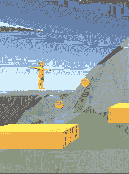

# 在 Unity 中创建基于物理的角色控制器

> 原文：<https://blog.devgenius.io/creating-a-physics-based-character-controller-in-unity-54ac9a23e2b3?source=collection_archive---------1----------------------->

我可以在角色上使用刚体，并使用刚体物理学。然而，我想完全控制所有的物理交互，所以我将使用一个 [**角色控制器**](https://docs.unity3d.com/2021.1/Documentation/Manual/class-CharacterController.html) 。

根据 Unity 手册 [**角色控制器**](https://docs.unity3d.com/2021.1/Documentation/Manual/class-CharacterController.html)

> **角色控制器**主要用于不使用**刚体**物理的第三人称或第一人称玩家控制。

以及 [**脚本 API**](https://docs.unity3d.com/2021.1/Documentation/ScriptReference/CharacterController.html)

> 角色控制器可以让你轻松地进行受碰撞约束的运动，而不必处理刚体。
> 
> 角色控制器不受力的影响，只有在调用移动函数时才会移动。然后它将执行运动，但受到碰撞的约束。

这正是我想要的。我想要一些东西，我可以用它来移动我的场景，并根据碰撞来限制它的移动。

我从我的播放器上移除了刚体，并添加了一个角色控制器

现在我需要一个脚本来控制我的播放器。

# 球员运动

因为这是一个平台游戏，我将水平移动角色，我将施加我自己的重力并允许玩家跳跃。我需要一个附在播放器上的角色控制器的引用。因为我将使用角色控制器进行移动，所以我将它作为 [**必需组件**](https://docs.unity3d.com/2021.1/Documentation/ScriptReference/RequireComponent.html) ，当我将玩家添加到游戏对象中时，它会将角色控制器添加到游戏对象中，这也将防止角色控制器从游戏对象中移除。我也不必在我的行为中添加任何错误检查，因为我保证角色控制器会在那里。

## 水平移动

我缓存水平输入。然后我把移动方向的 x 轴设为水平移动乘以移动速度。最后，我使用`[**CharacterControler.Move**](https://docs.unity3d.com/2021.1/Documentation/ScriptReference/CharacterController.Move.html)`命令角色控制器移动

我现在可以左右移动，请注意，当我撞到平台时，它会阻止我移动。

## 应用速度

接下来，我把我的运动改为方向和速度。这是为了以后我可以加入重力和跳跃。我从方向上去掉了水平移动的速度。我为速度添加了一个矢量 3。然后，我将速度 x 设置为移动方向乘以水平移动速度。然后我告诉角色控制器按照这个速度移动。

## 运用重力

对于重力，我有一个选择，我可以添加一个值来表示重力的大小，或者我可以使用 Unity 的物理系统提供的值。我可以修改这个值，方法是进入编辑->项目设置，然后选择物理，这里有一个重力值。也有一个 2D 物理，但我将使用三维物理。

我将添加一个值来决定我是否要使用重力。

在更新代码 I 缓存中，角色控制器是固定的。然后我检查它是否是接地的，这是我将添加的地方，除了能够跳跃之外，现在我什么也不做。如果我没有接地，那么我检查我是否在使用重力，如果是，我把 [**物理重力**](https://docs.unity3d.com/ScriptReference/Physics-gravity.html) 时间增量时间加到我的速度上。

现在玩家倒在平台上。

## 允许玩家跳跃

我需要知道玩家能跳多高。在更新方法中，如果玩家被禁足，我会检查是否按下了跳转按钮(编辑->项目设置->输入管理器选项卡->轴->跳转)。如果按下了跳转按钮，我将 velocity.y 设置为跳转高度。

我现在可以表演一个跳跃，只要玩家站在一个平台上。

我使用的是来自 Unity 资产商店的 [**多边形原型——Synty**的低多边形 3D 艺术。我可以使用](https://assetstore.unity.com/packages/3d/props/exterior/polygon-prototype-low-poly-3d-art-by-synty-137126) [**免费多边形入门包——低多边形 3D Art by Synty**](https://assetstore.unity.com/packages/3d/props/polygon-starter-pack-low-poly-3d-art-by-synty-156819) 实现类似的效果。由于我目前正处于原型制作阶段，使用这些资源只是让我比使用 Unity 的内置原语看起来更好一点。

为了获得新的外观，我关闭了我在场景中添加的所有对象的网格渲染，然后将资产提供的不同预设添加到我的游戏对象中。

